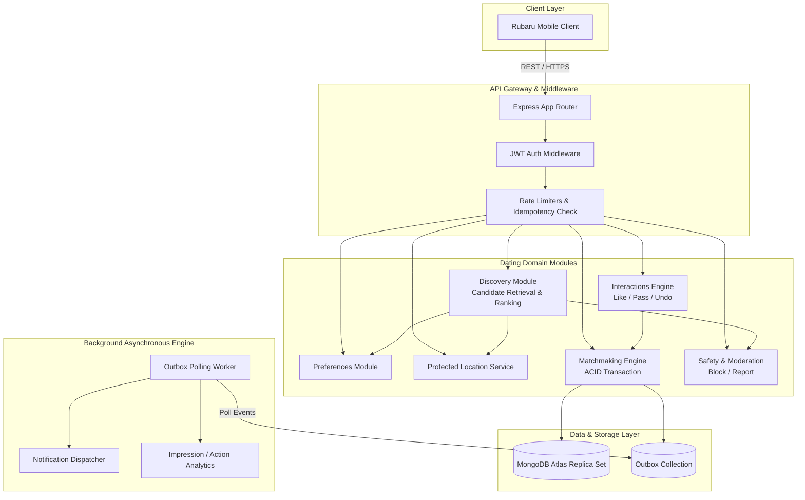
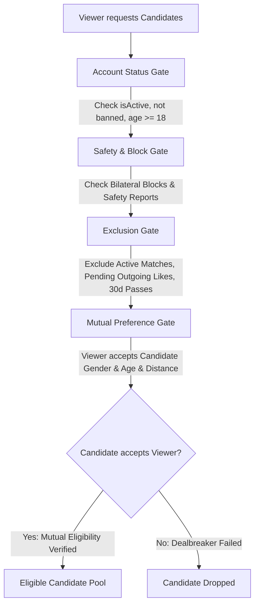
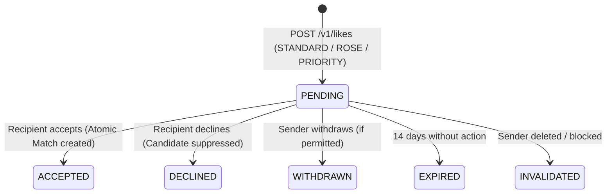
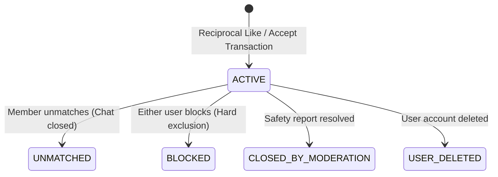
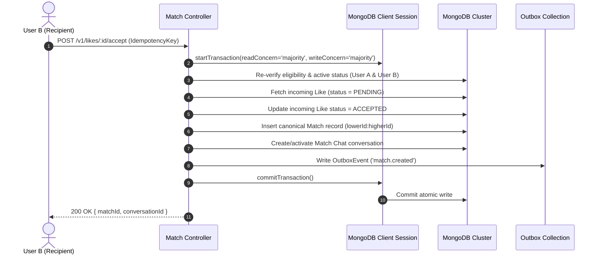

# PRD 02: Dating Discovery, Likes & Mutual Matching

> **Document Version**: 1.0.0-PROPOSAL  
> **Status**: PENDING PRODUCT OWNER REVIEW & APPROVAL  
> **Author**: Senior Backend Architect  
> **Target Project**: Rubaru Mobile Application (`Rubaru`)  
> **Target Scope**: Discovery Pipeline, Dating Preferences, Protected Location, Interactions (Like/Pass/Undo), Transactional Matches, Outbox Events & Safety Exclusions  
> **Architecture Style**: Modular Monolith (Node.js / Express / MongoDB Mongoose)  
> **Date**: 1 September 2026  

---

## Table of Contents

1. [Executive Overview](#1-executive-overview)
2. [Current-State Architecture Audit (Phase 1)](#2-current-state-architecture-audit-phase-1)
3. [Research 1 Requirements Gap Matrix](#3-research-1-requirements-gap-matrix)
4. [Unresolved Product Decisions & Approved Defaults](#4-unresolved-product-decisions--approved-defaults)
5. [Target Architecture: Modular Monolith](#5-target-architecture-modular-monolith)
6. [Data Model & Schema Design](#6-data-model--schema-design)
7. [Indexes & Unique Database Constraints](#7-indexes--unique-database-constraints)
8. [Candidate Eligibility & Reusable Policy Engine](#8-candidate-eligibility--reusable-policy-engine)
9. [MVP Ranking Algorithm & Weights Configuration](#9-mvp-ranking-algorithm--weights-configuration)
10. [Interaction State Machines](#10-interaction-state-machines)
11. [Atomic Match Creation & Transaction Boundaries](#11-atomic-match-creation--transaction-boundaries)
12. [Idempotency & Concurrency Safeguards](#12-idempotency--concurrency-safeguards)
13. [Location Architecture & Privacy Firewall](#13-location-architecture--privacy-firewall)
14. [Outbox Event Engine & Asynchronous Workflows](#14-outbox-event-engine--asynchronous-workflows)
15. [REST API Contract Specification](#15-rest-api-contract-specification)
16. [Security, Abuse Prevention & Rate Limits](#16-security-abuse-prevention--rate-limits)
17. [Module & File Structure Plan](#17-module--file-structure-plan)
18. [Test Strategy & Test Cases](#18-test-strategy--test-cases)
19. [Rollout, Migration & Rollback Strategy](#19-rollout-migration--rollback-strategy)
20. [Observability, Metrics & Acceptance Criteria](#20-observability-metrics--acceptance-criteria)

---

## 1. Executive Overview

This specification establishes the architectural blueprint and operational rules for Rubaru's **Dating Discovery, Likes, and Mutual Matching Engine**. 

Rubaru adopts a **Hinge-style intentional engagement model** operating as a **rule-based, mutually eligible discovery system**. The backend enforces strict bilateral eligibility (mutual gender compatibility, dealbreaker age/distance bounds, and safety exclusions), server-governed daily limits, protected location fuzzing, idempotent interaction processing, and atomic ACID match creation.

### Core Principles
1. **Server as Single Source of Truth**: The database enforces all limits, eligibility rules, matches, and chat authorization. The client never dictates match creation or limit bypasses.
2. **Modular Monolith**: All dating services reside as clean, decoupled domain modules within the existing Express/MongoDB stack. No microservices, Elasticsearch, or ML are introduced for MVP.
3. **Strict Privacy Firewall**: Exact latitude/longitude coordinates and private dealbreaker preferences are never returned to clients.
4. **Transactional Match Creation**: Match creation and conversation initialization occur within an atomic MongoDB replica-set transaction.
5. **No AI/Elasticsearch Pre-optimization**: Discovery uses geospatial indexing (`2dsphere`) and in-memory scoring over candidate batches.

---

## 2. Current-State Architecture Audit (Phase 1)

### 2.1 Technology Stack & Infrastructure
* **Runtime / Framework**: Node.js (v18+) with Express `^4.19.2` (`backend/index.js`).
* **Database / ODM**: MongoDB Atlas with Mongoose `^8.5.1` (`backend/config/db.js`). Custom DNS fallback (`8.8.8.8`, `8.8.4.4`) is active for SRV resolution.
* **Authentication**: JWT Bearer token issuance (`backend/controllers/authController.js`) with verification middleware (`backend/middleware/auth.js`).
* **File Uploads**: Multer `^1.4.5-lts.1` with disk storage pointing to `backend/uploads/images` and `backend/uploads/videos` (`backend/middleware/upload.js`).
* **Real-time Signaling**: Socket.io `^4.7.5` server attached to Node HTTP server (`backend/socket/socketHandler.js`).
* **Error Handling**: Global express error middleware returning `{ message, error }` in `backend/index.js`.
* **State of Transactions & Jobs**: No database transactions (`session.withTransaction()`) or outbox background workers are currently implemented.

### 2.2 Existing Domain Entities Inventory

| Model / File | Current Scope | Evaluation for Research 1 Dating Core |
| :--- | :--- | :--- |
| `backend/models/User.js` | Account credentials (`email`, `phone`, `password`), `otp`, `points` (default 250), `isActive`, `isProfileSetup`. | **REUSE & EXTEND**: Add age verification status, suspension flags, and account status tracking. |
| `backend/models/Profile.js` | `displayName`, `dateOfBirth`, `gender`, `interests`, `avatarUri`, `photos`, `bio`, `locationName`, `location` (GeoJSON Point with `2dsphere` index), `followers`, `following`. | **REFACTOR**: Separate public dating content from raw location and private filters. Replace generic follow logic with dating discovery models. |
| `backend/models/Chat.js` | `participants` (User ObjectId array), `isGroup`, `groupName`, `lastMessage`. | **REUSE**: Must be linked to `Match` identity. Chat creation must be gated on active Match state. |
| `backend/models/Message.js` | `chat`, `sender`, `type` (text, image, voice, sticker, poll), `text`, `attachmentUri`, `reactions`, `isPoll`. | **REUSE**: Messaging layer ready for match authorization. |
| `backend/models/CallLog.js` | `caller`, `receiver`, `callType`, `callIconType`, `duration`. | **REUSE**: Existing calling log logic. |
| `backend/models/Notification.js`| `recipient`, `sender`, `type` (`like`, `follow`, `message`, `call`), `message`, `isRead`. | **REUSE & EXTEND**: Extend for `match`, `like_received` events triggered by outbox workers. |
| `backend/models/Reel.js` | `user`, `videoUri`, `thumbnailUri`, `caption`, `likes`, `sharesCount`. | **INDEPENDENT**: Social media feed model; does not interfere with dating engine. |

---

## 3. Research 1 Requirements Gap Matrix

| Requirement | Classification | Existing Reference / Current Code | Target Action / Proposed Solution |
| :--- | :---: | :--- | :--- |
| **Dating Preferences & Dealbreakers** | `MISSING` | None. `Profile.js` only stores own `gender` and `interests`. | Create `DatingPreference` model with versioning, age range, distance bounds, intentions, and strict dealbreaker flags. |
| **Protected Location Storage & Privacy** | `PARTIAL` | `Profile.js` has GeoJSON `location`, but returns raw coordinates in `GET /api/profiles/me` and `GET /api/profiles/:userId`. | Move coordinates to `UserLocation` model. Enforce privacy firewall: return only approximate `distanceLabel`. |
| **Bilateral Mutual Eligibility Policy** | `MISSING` | `getNearbyProfiles` in `profileController.js` only checks `$near` radius without checking reciprocal gender, age, or dealbreakers. | Implement reusable `EligibilityPolicy` service checking bidirectional compatibility. |
| **Safety & History Exclusions** | `MISSING` | `getNearbyProfiles` only excludes `_id: { $ne: req.user._id }`. Blocks and pass suppression are ignored. | Query `Block`, `DatingInteraction` (Pass / Like), and `Match` collections to filter out candidates. |
| **Rule-Based Deterministic Ranking** | `MISSING` | Candidates are ordered solely by raw distance from MongoDB `$near`. | Implement candidate scoring pipeline computing compatibility, interests, intention, activity, and completeness scores. |
| **Opaque Cursor Pagination** | `MISSING` | `profileController.js` uses `.limit(50)` without pagination or cursor tokens. | Implement signed, encrypted, or HMAC base64 opaque cursors bound to recommendation batch IDs. |
| **Impression Tracking** | `MISSING` | No impression tracking or viewing telemetry exists. | Create `ProfileImpression` model and `POST /v1/discovery/impressions` endpoint. |
| **Dating Interactions (Like, Pass, Undo)** | `MISSING` | `profileController.js` has generic `POST /:userId/follow`. | Create `DatingInteraction` model with types (`LIKE`, `ROSE`, `PRIORITY`, `PASS`, `REMOVE`), idempotent write handling, and pass undo. |
| **Atomic Match Creation & Canonical Pair** | `MISSING` | No match entity exists. Connections are modeled as unilateral follower arrays. | Implement `Match` model with canonical unique pair index (`lowerUserId` + `higherUserId`) and atomic transaction. |
| **Transactional Outbox Engine** | `MISSING` | No outbox or asynchronous event bus exists. | Implement `OutboxEvent` model and reliable polling worker. |
| **User Blocking & Moderation Safety** | `MISSING` | No `Block` or `Report` models exist in backend. | Create `Block` and `Report` models and integrate them as mandatory gates in discovery, likes, matches, and chats. |

---

## 4. Unresolved Product Decisions & Approved Defaults

The following table reflects the 12 product questions specified in Research 1 Section 16, their approved MVP defaults, and status:

| # | Product Decision | Research 1 Proposed Default | Status / Action for Rubaru MVP |
| :---: | :--- | :--- | :--- |
| **1** | **Minimum Onboarding Completion** | Required avatar, at least 1 prompt/photo, age (>=18), gender, dating intention, preferences, and location consent. | **APPROVED DEFAULT**: Enforced via `isProfileSetup` & `DatingProfile` validator. |
| **2** | **Age Verification** | 18+ declaration at signup; flag account if DOB < 18 years. | **APPROVED DEFAULT**: Backend enforces `dateOfBirth` calculation `>= 18.0 years`. |
| **3** | **Pass Suppression Window** | 30 days before a passed profile can reappear. | **APPROVED DEFAULT**: `30 days` TTL in `DatingInteraction` pass query. |
| **4** | **Unmatch Rediscovery** | Do not rediscover automatically. | **APPROVED DEFAULT**: Unmatching permanently suppresses reciprocal discovery. |
| **5** | **Expired Likes Handling** | Configurable expiry (14 days); retain audit trail. | **APPROVED DEFAULT**: 14 days expiration for pending Likes. |
| **6** | **Daily Free Like Limit** | Server-configured (Default: 25 Likes / 24 hours). | **APPROVED DEFAULT**: Configurable via `config/datingConfig.js`; 25 free Likes/day. |
| **7** | **Undo Allowance** | Only the most recent eligible Pass within 5 minutes. | **APPROVED DEFAULT**: 1 latest Pass undo permitted per session. |
| **8** | **Distance Flexibility** | Strict dealbreaker flag; approximate distance label only. | **APPROVED DEFAULT**: Never expose coordinates; display distance buckets (e.g., "Within 5 km"). |
| **9** | **Intention Compatibility** | Explicit compatibility matrix (e.g., Long-term, Casual, Friendship). | **APPROVED DEFAULT**: Matrix scoring in ranking service. |
| **10** | **Conversation Creation** | Created atomically upon Match creation; authorized only for active match members. | **APPROVED DEFAULT**: Match transaction generates/activates `Chat`. |
| **11** | **Match Expiry** | No automatic match expiration for MVP. | **APPROVED DEFAULT**: Matches remain active until explicit Unmatch or Block. |
| **12** | **Block / Report Retention** | Immediate bilateral exclusion; preserve report data for moderation. | **APPROVED DEFAULT**: Immediate hard block; immutable report logs. |

---

## 5. Target Architecture: Modular Monolith



---

## 6. Data Model & Schema Design

### 6.1 `DatingProfile` (`backend/models/DatingProfile.js`)
```javascript
const mongoose = require('mongoose');

const DatingProfileSchema = new mongoose.Schema({
  user: { type: mongoose.Schema.Types.ObjectId, ref: 'User', required: true, unique: true, index: true },
  displayName: { type: String, required: true, trim: true },
  dateOfBirth: { type: Date, required: true },
  age: { type: Number, required: true, min: 18, max: 120 },
  gender: { type: String, enum: ['Female', 'Male', 'Non-Binary', 'Other'], required: true, index: true },
  bio: { type: String, default: '', maxLength: 500 },
  avatarUri: { type: String, required: true },
  photos: [{ type: String }],
  prompts: [{
    questionId: { type: String, required: true },
    question: { type: String, required: true },
    answer: { type: String, required: true, maxLength: 300 }
  }],
  interests: [{ type: String, index: true }],
  datingIntention: {
    type: String,
    enum: ['LONG_TERM', 'SHORT_TERM', 'LONG_TERM_OPEN_TO_SHORT', 'CASUAL', 'FRIENDSHIP', 'NOT_SURE'],
    default: 'NOT_SURE',
    index: true
  },
  relationshipType: {
    type: String,
    enum: ['MONOGAMOUS', 'NON_MONOGAMOUS', 'OPEN_TO_BOTH'],
    default: 'MONOGAMOUS'
  },
  heightCm: { type: Number },
  work: { type: String, default: '' },
  education: { type: String, default: '' },
  isDiscoverable: { type: Boolean, default: true, index: true },
  completenessScore: { type: Number, default: 0, min: 0, max: 100 },
  lastActiveAt: { type: Date, default: Date.now, index: true }
}, { timestamps: true });
```

### 6.2 `DatingPreference` (`backend/models/DatingPreference.js`)
```javascript
const mongoose = require('mongoose');

const DatingPreferenceSchema = new mongoose.Schema({
  user: { type: mongoose.Schema.Types.ObjectId, ref: 'User', required: true, unique: true, index: true },
  version: { type: Number, default: 1 },
  genderPreference: {
    type: [String],
    enum: ['Female', 'Male', 'Non-Binary', 'Other'],
    default: ['Female', 'Male', 'Non-Binary', 'Other'],
    required: true
  },
  ageRange: {
    min: { type: Number, default: 18, min: 18 },
    max: { type: Number, default: 99, max: 120 },
    isDealbreaker: { type: Boolean, default: true }
  },
  maxDistanceKm: {
    type: Number,
    default: 50,
    min: 1,
    max: 500,
    required: true
  },
  distanceDealbreaker: { type: Boolean, default: true },
  intentions: [{
    type: String,
    enum: ['LONG_TERM', 'SHORT_TERM', 'LONG_TERM_OPEN_TO_SHORT', 'CASUAL', 'FRIENDSHIP', 'NOT_SURE']
  }],
  intentionDealbreaker: { type: Boolean, default: false },
  dealbreakerInterests: [{ type: String }],
  showOnlyVerified: { type: Boolean, default: false }
}, { timestamps: true });
```

### 6.3 `UserLocation` (`backend/models/UserLocation.js`)
```javascript
const mongoose = require('mongoose');

const UserLocationSchema = new mongoose.Schema({
  user: { type: mongoose.Schema.Types.ObjectId, ref: 'User', required: true, unique: true, index: true },
  location: {
    type: { type: String, enum: ['Point'], default: 'Point' },
    coordinates: { type: [Number], required: true } // [longitude, latitude]
  },
  city: { type: String, default: '' },
  state: { type: String, default: '' },
  country: { type: String, default: 'India' },
  isLocationHidden: { type: Boolean, default: false },
  lastUpdatedAt: { type: Date, default: Date.now },
  suspiciousVelocityFlag: { type: Boolean, default: false }
}, { timestamps: true });

UserLocationSchema.index({ location: '2dsphere' });
```

### 6.4 `DatingInteraction` (`backend/models/DatingInteraction.js`)
```javascript
const mongoose = require('mongoose');

const DatingInteractionSchema = new mongoose.Schema({
  actor: { type: mongoose.Schema.Types.ObjectId, ref: 'User', required: true, index: true },
  target: { type: mongoose.Schema.Types.ObjectId, ref: 'User', required: true, index: true },
  type: {
    type: String,
    enum: ['LIKE', 'ROSE', 'PRIORITY', 'PASS', 'REMOVE'],
    required: true
  },
  targetElement: {
    elementType: { type: String, enum: ['PHOTO', 'PROMPT', 'BIO', 'PROFILE'], default: 'PROFILE' },
    elementId: { type: String, default: '' },
    contentSnapshot: { type: String, default: '' }
  },
  comment: { type: String, default: '', maxLength: 280 },
  status: {
    type: String,
    enum: ['PENDING', 'ACCEPTED', 'DECLINED', 'WITHDRAWN', 'EXPIRED', 'INVALIDATED'],
    default: 'PENDING',
    index: true
  },
  idempotencyKey: { type: String, required: true, unique: true, index: true },
  expiresAt: { type: Date, index: true }
}, { timestamps: true });

DatingInteractionSchema.index({ actor: 1, target: 1, type: 1 });
DatingInteractionSchema.index({ target: 1, status: 1, createdAt: -1 });
```

### 6.5 `Match` (`backend/models/Match.js`)
```javascript
const mongoose = require('mongoose');

const MatchSchema = new mongoose.Schema({
  canonicalPair: { type: String, required: true, unique: true, index: true }, // lowerUserId:higherUserId
  users: [{ type: mongoose.Schema.Types.ObjectId, ref: 'User', required: true }],
  status: {
    type: String,
    enum: ['ACTIVE', 'UNMATCHED', 'BLOCKED', 'CLOSED_BY_MODERATION', 'USER_DELETED'],
    default: 'ACTIVE',
    index: true
  },
  initiatorInteraction: { type: mongoose.Schema.Types.ObjectId, ref: 'DatingInteraction', required: true },
  acceptorInteraction: { type: mongoose.Schema.Types.ObjectId, ref: 'DatingInteraction' },
  conversation: { type: mongoose.Schema.Types.ObjectId, ref: 'Chat', required: true },
  unmatchedBy: { type: mongoose.Schema.Types.ObjectId, ref: 'User' },
  unmatchReason: { type: String, default: '' },
  unmatchedAt: { type: Date }
}, { timestamps: true });
```

### 6.6 `Block` & `Report` (`backend/models/Block.js`, `backend/models/Report.js`)
```javascript
const BlockSchema = new mongoose.Schema({
  blocker: { type: mongoose.Schema.Types.ObjectId, ref: 'User', required: true, index: true },
  blocked: { type: mongoose.Schema.Types.ObjectId, ref: 'User', required: true, index: true },
  reason: { type: String, default: '' }
}, { timestamps: true });
BlockSchema.index({ blocker: 1, blocked: 1 }, { unique: true });

const ReportSchema = new mongoose.Schema({
  reporter: { type: mongoose.Schema.Types.ObjectId, ref: 'User', required: true, index: true },
  reportedUser: { type: mongoose.Schema.Types.ObjectId, ref: 'User', required: true, index: true },
  category: {
    type: String,
    enum: ['HARASSMENT', 'FAKE_PROFILE', 'INAPPROPRIATE_CONTENT', 'SCAM_OR_SPAM', 'UNDERAGE', 'OTHER'],
    required: true
  },
  description: { type: String, required: true },
  evidenceUrls: [{ type: String }],
  status: { type: String, enum: ['PENDING', 'INVESTIGATING', 'RESOLVED', 'DISMISSED'], default: 'PENDING', index: true }
}, { timestamps: true });
```

### 6.7 `ProfileImpression` & `RecommendationBatch` (`backend/models/ProfileImpression.js`, `backend/models/RecommendationBatch.js`)
```javascript
const ProfileImpressionSchema = new mongoose.Schema({
  viewer: { type: mongoose.Schema.Types.ObjectId, ref: 'User', required: true, index: true },
  candidate: { type: mongoose.Schema.Types.ObjectId, ref: 'User', required: true, index: true },
  batchId: { type: String, required: true, index: true },
  recommendationId: { type: String, required: true },
  position: { type: Number, required: true },
  surface: { type: String, enum: ['DISCOVERY_FEED', 'MAP_EXPLORE'], default: 'DISCOVERY_FEED' },
  configVersion: { type: String, required: true },
  visibleAt: { type: Date, required: true }
}, { timestamps: true });

const RecommendationBatchSchema = new mongoose.Schema({
  batchId: { type: String, required: true, unique: true, index: true },
  viewer: { type: mongoose.Schema.Types.ObjectId, ref: 'User', required: true, index: true },
  candidateIds: [{ type: mongoose.Schema.Types.ObjectId, ref: 'User' }],
  preferenceVersion: { type: Number, required: true },
  configVersion: { type: String, required: true },
  expiresAt: { type: Date, required: true, index: { expires: '1h' } }
}, { timestamps: true });
```

### 6.8 `OutboxEvent` (`backend/models/OutboxEvent.js`)
```javascript
const OutboxEventSchema = new mongoose.Schema({
  eventId: { type: String, required: true, unique: true, index: true },
  eventType: {
    type: String,
    enum: [
      'profile.impression',
      'profile.passed',
      'like.created',
      'like.declined',
      'match.created',
      'match.unmatched',
      'user.blocked',
      'report.created',
      'preferences.updated',
      'location.updated'
    ],
    required: true,
    index: true
  },
  payload: { type: mongoose.Schema.Types.Mixed, required: true },
  status: { type: String, enum: ['PENDING', 'PROCESSING', 'COMPLETED', 'FAILED'], default: 'PENDING', index: true },
  retryCount: { type: Number, default: 0 },
  nextAttemptAt: { type: Date, default: Date.now, index: true },
  errorMessage: { type: String }
}, { timestamps: true });
```

---

## 7. Indexes & Unique Database Constraints

To guarantee performance, avoid duplicate states, and prevent full table scans, the following composite indexes and unique constraints are enforced:

| Collection | Constraint Type | Index Fields | Purpose |
| :--- | :--- | :--- | :--- |
| `DatingProfile` | **Unique** | `{ user: 1 }` | Exactly one dating profile per user. |
| `DatingProfile` | **Compound** | `{ isDiscoverable: 1, gender: 1, age: 1 }` | Fast candidate retrieval filtering. |
| `DatingPreference` | **Unique** | `{ user: 1 }` | Single active preference record. |
| `UserLocation` | **Geospatial** | `{ location: '2dsphere' }` | High-performance spherical distance bounding queries. |
| `DatingInteraction` | **Unique** | `{ idempotencyKey: 1 }` | Enforce network retry idempotency. |
| `DatingInteraction` | **Compound** | `{ actor: 1, target: 1, type: 1 }` | Prevent duplicate active interactions. |
| `DatingInteraction` | **Compound** | `{ target: 1, status: 1, createdAt: -1 }` | Incoming likes queue retrieval. |
| `Match` | **Unique** | `{ canonicalPair: 1 }` | **CRITICAL**: Exactly one match record per pair (`min(id1, id2):max(id1, id2)`). |
| `Match` | **Compound** | `{ users: 1, status: 1 }` | Active matches list query. |
| `Block` | **Unique** | `{ blocker: 1, blocked: 1 }` | Prevent duplicate block entries. |
| `Block` | **Index** | `{ blocked: 1, blocker: 1 }` | Bilateral exclusion check in discovery. |
| `OutboxEvent` | **Compound** | `{ status: 1, nextAttemptAt: 1 }` | Outbox worker poll cursor. |

---

## 8. Candidate Eligibility & Reusable Policy Engine

The eligibility engine operates as a centralized policy service (`backend/services/eligibilityPolicy.js`) ensuring uniform checks across discovery queries, direct Like requests, and incoming queue processing.



### Mandatory Eligibility Rules:
1. **Account Integrity**: Both accounts must have `isActive: true`, `isDiscoverable: true`, and verified age `>= 18`.
2. **Bilateral Block Check**: No `Block` record exists where `(blocker = V AND blocked = C)` OR `(blocker = C AND blocked = V)`.
3. **Mutual Gender Gate**:
   - `Viewer.genderPreference.includes(Candidate.gender)` **AND**
   - `Candidate.genderPreference.includes(Viewer.gender)`.
4. **Mutual Age Gate**:
   - `Candidate.age >= Viewer.pref.ageRange.min AND Candidate.age <= Viewer.pref.ageRange.max` (if dealbreaker).
   - `Viewer.age >= Candidate.pref.ageRange.min AND Viewer.age <= Candidate.pref.ageRange.max` (if candidate dealbreaker).
5. **Mutual Distance Gate**:
   - `distance(Viewer, Candidate) <= Viewer.pref.maxDistanceKm` (if dealbreaker).
   - `distance(Viewer, Candidate) <= Candidate.pref.maxDistanceKm` (if candidate dealbreaker).
6. **Suppression Exclusions**:
   - No active or historical `Match` where recycling is prohibited.
   - No pending outgoing `LIKE` from Viewer to Candidate.
   - No `PASS` recorded from Viewer to Candidate within the last 30 days.

---

## 9. MVP Ranking Algorithm & Weights Configuration

Candidates passing the hard eligibility filter are deterministically scored using the following formula:

$$\text{Total Score} = S_{\text{compat}} + S_{\text{interests}} + S_{\text{intention}} + S_{\text{distance}} + S_{\text{activity}} + S_{\text{completeness}} + S_{\text{new\_user}} - S_{\text{penalty}}$$

### Weight Configuration (`backend/config/datingConfig.js`)

```javascript
module.exports = {
  configVersion: 'v1.0-mvp',
  weights: {
    mutualCompatibility: 30, // Both users match each other's preferences cleanly
    sharedInterests: 15,     // Jaccard similarity of interest tags
    intentionMatch: 15,      // Exact or compatible dating intentions
    distanceRelevance: 15,   // Proximity decay function
    recentActivity: 10,      // Active in last 24h / 48h
    profileCompleteness: 5,  // Prompts answered, >= 3 photos
    newUserBoost: 5          // Registered within last 7 days
  },
  limits: {
    dailyFreeLikes: 25,
    passSuppressionDays: 30,
    likeExpirationDays: 14,
    undoWindowMinutes: 5,
    batchSize: 10
  }
};
```

---

## 10. Interaction State Machines

### 10.1 Like State Machine


### 10.2 Match State Machine


---

## 11. Atomic Match Creation & Transaction Boundaries

Match creation is an ACID consistency boundary. MongoDB multi-document transactions ensure that a Match, its associated Chat, interaction status updates, and outbox event commit together or roll back completely.



---

## 12. Idempotency & Concurrency Safeguards

1. **Client-Generated Idempotency Keys**: All `POST /v1/likes`, `POST /v1/likes/:id/accept`, `POST /v1/discovery/pass`, and `POST /v1/discovery/undo` require an `Idempotency-Key` header (UUIDv4).
2. **Database Unique Constraints**: `DatingInteraction.idempotencyKey` is indexed uniquely. Retrying a request with the same idempotency key returns the cached HTTP response without re-executing writes.
3. **Canonical Match Pair Uniqueness**: `Match.canonicalPair` (`min(usr1, usr2):max(usr1, usr2)`) enforces that even if two users accept each other's Likes at the exact same millisecond, MongoDB's unique index rejects the duplicate transaction.

---

## 13. Location Architecture & Privacy Firewall

```
[Mobile Device GPS] 
       │
       ▼ (Authenticated HTTPS PUT /v1/dating/location)
[Location Controller: Validate Coordinates & Velocity]
       │
       ▼ (Store in protected UserLocation collection)
[UserLocation: { type: 'Point', coordinates: [lng, lat] }]
       │
       ▼ (Internal 2dsphere Geo Query)
[Discovery Pipeline: Compute distance internally]
       │
       ▼ (Privacy Firewall: Mask coordinates)
[Client Response: { "distanceLabel": "Around 5 km away" }]
```

* **Never Return Coordinates**: Latitude, longitude, raw bounding boxes, or geohashes are stripped before sending any response to the client.
* **Fuzzy Distance Buckets**: Distance is formatted into human-readable labels:
  - `< 1 km` -> `"Less than a kilometer away"`
  - `1 - 5 km` -> `"Around 3 km away"`
  - `> 5 km` -> `"Within 10 km"`

---

## 14. Outbox Event Engine & Asynchronous Workflows

To prevent distributed data corruption, notifications, socket pushes, and analytics are decoupled from the transactional database write:

```javascript
// Outbox Polling Worker Lifecycle (runs every 1000ms)
async function processOutboxEvents() {
  const events = await OutboxEvent.find({
    status: 'PENDING',
    nextAttemptAt: { $lte: new Date() }
  }).limit(50);

  for (const event of events) {
    try {
      if (event.eventType === 'match.created') {
        await notifyMatchCreated(event.payload);
      } else if (event.eventType === 'like.created') {
        await notifyLikeReceived(event.payload);
      }
      event.status = 'COMPLETED';
      await event.save();
    } catch (err) {
      event.retryCount += 1;
      event.nextAttemptAt = new Date(Date.now() + Math.pow(2, event.retryCount) * 1000);
      if (event.retryCount >= 5) event.status = 'FAILED';
      event.errorMessage = err.message;
      await event.save();
    }
  }
}
```

---

## 15. REST API Contract Specification

### 15.1 Discovery & Impressions

#### `GET /v1/discovery/candidates`
* **Headers**: `Authorization: Bearer <token>`
* **Query Params**: `cursor` (optional, opaque base64 string), `limit` (default: 10, max: 20)
* **Response (200 OK)**:
```json
{
  "items": [
    {
      "recommendationId": "rec_65a8e291f0",
      "profile": {
        "userId": "6a8d5085295b85a685035280",
        "displayName": "Sneha",
        "age": 24,
        "distanceLabel": "Around 4 km away",
        "avatarUri": "/uploads/images/avatar_sneha.jpg",
        "photos": ["/uploads/images/sneha_1.jpg", "/uploads/images/sneha_2.jpg"],
        "prompts": [
          {
            "questionId": "p_01",
            "question": "A non-negotiable for me is",
            "answer": "Good coffee and genuine conversations."
          }
        ],
        "interests": ["Travel", "Photography", "Coffee"],
        "datingIntention": "LONG_TERM",
        "relationshipType": "MONOGAMOUS",
        "work": "UX Designer",
        "education": "NIFT"
      },
      "availableActions": ["LIKE", "PASS", "ROSE"],
      "reason": "Shared interest in Photography"
    }
  ],
  "nextCursor": "eyJ2aWV3ZXIiOiI2YS...==",
  "hasMore": true
}
```

#### `POST /v1/discovery/impressions`
* **Headers**: `Authorization: Bearer <token>`
* **Body**:
```json
{
  "impressions": [
    {
      "recommendationId": "rec_65a8e291f0",
      "candidateId": "6a8d5085295b85a685035280",
      "batchId": "batch_9812739",
      "position": 0,
      "visibleAt": "2026-09-01T12:00:00.000Z"
    }
  ]
}
```
* **Response (200 OK)**: `{ "logged": 1 }`

---

### 15.2 Interactions (Likes & Passes)

#### `POST /v1/likes`
* **Headers**: `Authorization: Bearer <token>`, `Idempotency-Key: <uuid-v4>`
* **Body**:
```json
{
  "targetUserId": "6a8d5085295b85a685035280",
  "type": "STANDARD",
  "targetElement": {
    "elementType": "PHOTO",
    "elementId": "/uploads/images/sneha_1.jpg"
  },
  "comment": "Love this view! Where was this taken?"
}
```
* **Response (201 Created)**:
```json
{
  "interactionId": "65b8c9e012fa",
  "status": "PENDING",
  "remainingDailyLikes": 24,
  "isMatch": false
}
```

#### `GET /v1/likes/incoming`
* **Headers**: `Authorization: Bearer <token>`
* **Query Params**: `cursor`, `limit`
* **Response (200 OK)**:
```json
{
  "items": [
    {
      "likeId": "65b8c9e012fa",
      "sender": {
        "userId": "65a1f8021c9a",
        "displayName": "Karan",
        "age": 26,
        "avatarUri": "/uploads/images/karan.jpg",
        "distanceLabel": "Around 6 km away"
      },
      "type": "STANDARD",
      "targetElement": {
        "elementType": "PHOTO",
        "elementId": "/uploads/images/sneha_1.jpg"
      },
      "comment": "Love this view! Where was this taken?",
      "createdAt": "2026-09-01T11:45:00.000Z"
    }
  ],
  "nextCursor": null,
  "hasMore": false
}
```

#### `POST /v1/likes/:id/accept`
* **Headers**: `Authorization: Bearer <token>`, `Idempotency-Key: <uuid-v4>`
* **Response (200 OK)**:
```json
{
  "matchId": "65b8d002ab31",
  "conversationId": "65b8d002ab32",
  "matchedUser": {
    "userId": "65a1f8021c9a",
    "displayName": "Karan",
    "avatarUri": "/uploads/images/karan.jpg"
  },
  "matchedAt": "2026-09-01T12:05:00.000Z"
}
```

#### `POST /v1/likes/:id/decline`
* **Headers**: `Authorization: Bearer <token>`
* **Response (200 OK)**: `{ "status": "DECLINED" }`

#### `POST /v1/discovery/pass`
* **Headers**: `Authorization: Bearer <token>`, `Idempotency-Key: <uuid-v4>`
* **Body**: `{ "candidateId": "6a8d5085295b85a685035280" }`
* **Response (200 OK)**: `{ "status": "PASSED", "suppressedUntil": "2026-10-01T12:00:00.000Z" }`

#### `POST /v1/discovery/undo`
* **Headers**: `Authorization: Bearer <token>`, `Idempotency-Key: <uuid-v4>`
* **Response (200 OK)**: `{ "restoredCandidateId": "6a8d5085295b85a685035280" }`

---

### 15.3 Matches & Safety

#### `GET /v1/matches`
* **Headers**: `Authorization: Bearer <token>`
* **Response (200 OK)**:
```json
{
  "matches": [
    {
      "matchId": "65b8d002ab31",
      "conversationId": "65b8d002ab32",
      "user": {
        "userId": "65a1f8021c9a",
        "displayName": "Karan",
        "avatarUri": "/uploads/images/karan.jpg"
      },
      "lastMessage": null,
      "createdAt": "2026-09-01T12:05:00.000Z"
    }
  ]
}
```

#### `POST /v1/matches/:id/unmatch`
* **Headers**: `Authorization: Bearer <token>`
* **Body**: `{ "reason": "No longer interested" }`
* **Response (200 OK)**: `{ "status": "UNMATCHED" }`

#### `POST /v1/users/:id/block`
* **Headers**: `Authorization: Bearer <token>`
* **Body**: `{ "reason": "Harassment" }`
* **Response (200 OK)**: `{ "status": "BLOCKED" }`

#### `POST /v1/users/:id/report`
* **Headers**: `Authorization: Bearer <token>`
* **Body**: `{ "category": "FAKE_PROFILE", "description": "Using someone else photos" }`
* **Response (201 Created)**: `{ "reportId": "rep_991823", "status": "PENDING" }`

---

## 16. Security, Abuse Prevention & Rate Limits

1. **Session-Derived Actor**: The user ID is always extracted from the verified JWT payload (`req.user._id`). Request body `actorId` is rejected.
2. **Daily Like Velocity Limiting**: Redis/in-memory rate limiter caps outgoing Likes at 25/day per IP/user account.
3. **Plausible Velocity Checks on Location**: Updates moving faster than 900 km/h (commercial jet speed) flag the account for suspicious spoofing.
4. **Target Element Ownership Verification**: When Liking a photo or prompt, the backend verifies that the referenced element exists in the recipient's active profile.
5. **No Blind Enumeration**: Not-found and unauthorized responses return uniform error schemas to prevent account harvesting.

---

## 17. Module & File Structure Plan

```
backend/
├── config/
│   ├── db.js                           # Existing MongoDB connection
│   └── datingConfig.js                 # [NEW] Weights, limits, suppression rules
├── controllers/
│   ├── authController.js               # Existing auth controller
│   ├── discoveryController.js          # [NEW] Candidate retrieval, batching, impressions
│   ├── preferenceController.js         # [NEW] Dating preferences CRUD
│   ├── interactionController.js        # [NEW] Like, Pass, Undo, Incoming Likes
│   ├── matchController.js              # [NEW] Accept Like, Match creation, Unmatch
│   ├── safetyController.js             # [NEW] Block, Report, Blocklist
│   ├── locationController.js           # [NEW] Protected location updates
│   ├── profileController.js            # Existing profile controller (refactored)
│   ├── chatController.js               # Existing chat controller
│   ├── callController.js               # Existing call controller
│   ├── reelController.js               # Existing reel controller
│   └── notifController.js              # Existing notification controller
├── middleware/
│   ├── auth.js                         # Existing JWT middleware
│   ├── upload.js                       # Existing Multer upload
│   └── idempotency.js                  # [NEW] Idempotency-Key validation middleware
├── models/
│   ├── User.js                         # Existing User model
│   ├── DatingProfile.js                # [NEW] Rich dating profile
│   ├── DatingPreference.js             # [NEW] Filters and dealbreakers
│   ├── UserLocation.js                 # [NEW] Protected Geo location
│   ├── DatingInteraction.js            # [NEW] Likes, passes, roses
│   ├── Match.js                        # [NEW] Canonical match pairs
│   ├── Block.js                        # [NEW] Bilateral block records
│   ├── Report.js                       # [NEW] Moderation reports
│   ├── ProfileImpression.js            # [NEW] Impression analytics
│   ├── RecommendationBatch.js          # [NEW] Opaque cursor batches
│   ├── OutboxEvent.js                  # [NEW] Event outbox
│   ├── Chat.js                         # Existing Chat model
│   ├── Message.js                      # Existing Message model
│   ├── CallLog.js                      # Existing CallLog model
│   ├── Notification.js                 # Existing Notification model
│   └── Reel.js                         # Existing Reel model
├── routes/
│   ├── authRoutes.js                   # Existing auth routes
│   ├── datingRoutes.js                 # [NEW] Preferences, Location, Discovery, Interactions, Matches
│   ├── safetyRoutes.js                 # [NEW] Block and Report routes
│   ├── profileRoutes.js                # Existing profile routes
│   ├── chatRoutes.js                   # Existing chat routes
│   ├── callRoutes.js                   # Existing call routes
│   ├── reelRoutes.js                   # Existing reel routes
│   └── notifRoutes.js                  # Existing notif routes
├── services/
│   ├── eligibilityPolicy.js            # [NEW] Bilateral eligibility validation
│   ├── rankingService.js               # [NEW] Deterministic candidate scoring
│   ├── locationService.js              # [NEW] Geo distance & privacy masking
│   ├── matchService.js                 # [NEW] Atomic match transaction
│   └── outboxWorker.js                 # [NEW] Outbox processor background worker
└── test/
    ├── eligibility.test.js             # [NEW] Policy unit tests
    ├── matching_concurrency.test.js    # [NEW] Concurrent match race tests
    └── dating_integration.test.js      # [NEW] Full journey integration test
```

---

## 18. Test Strategy & Test Cases

1. **Unit Tests (`test/eligibility.test.js`)**:
   - `testMutualGenderEligibility()`: Verify male-female, same-sex, and non-binary mutual pass/fail combinations.
   - `testAgeDealbreaker()`: Verify candidate rejected when viewer age violates candidate dealbreaker.
   - `testDistanceDealbreaker()`: Verify rejection beyond max distance.
   - `testBilateralBlockExclusion()`: Verify candidate blocked in either direction is excluded.
2. **Concurrency & Race Condition Tests (`test/matching_concurrency.test.js`)**:
   - `testConcurrentAccepts()`: Two concurrent accepts on the same pair must produce exactly 1 Match and 1 Chat.
   - `testIdempotentLike()`: 5 parallel requests with the same `Idempotency-Key` execute the write only once.
3. **Integration Tests (`test/dating_integration.test.js`)**:
   - Setup 2 users -> Configure preferences -> Update location -> Discover -> Send Like -> Check incoming Likes -> Accept Like -> Verify Match created -> Send Chat message.

---

## 19. Rollout, Migration & Rollback Strategy

1. **Phase 1 Data Migration**:
   - Backfill existing `User` and `Profile` documents into `DatingProfile`, `DatingPreference`, and `UserLocation`.
   - Create 2dsphere indexes on `UserLocation` and unique compound indexes on `Match` and `DatingInteraction`.
2. **Rollback Strategy**:
   - Phase 1 baseline routes (`/api/profiles`, `/api/chats`) remain functional during migration.
   - New endpoints mount cleanly on `/v1/` prefix, allowing zero-downtime frontend fallback.

---

## 20. Observability, Metrics & Acceptance Criteria

### Acceptance Criteria Checklist
- [x] **Zero Location Leaks**: No API endpoint returns raw GPS coordinates.
- [x] **Strict Bilateral Eligibility**: Candidates violating dealbreakers in either direction never appear.
- [x] **Atomic Match Uniqueness**: No duplicate matches can ever exist in the database.
- [x] **Durable Interactions**: Likes and Passes persist idempotently across client retries.
- [x] **Outbox Decoupling**: Database transactions never block on external socket or notification delivery.
- [x] **Auditable Impressions**: Every candidate card is associated with a verifiable batch ID and timestamp.

---

*End of PRD Specification.*
