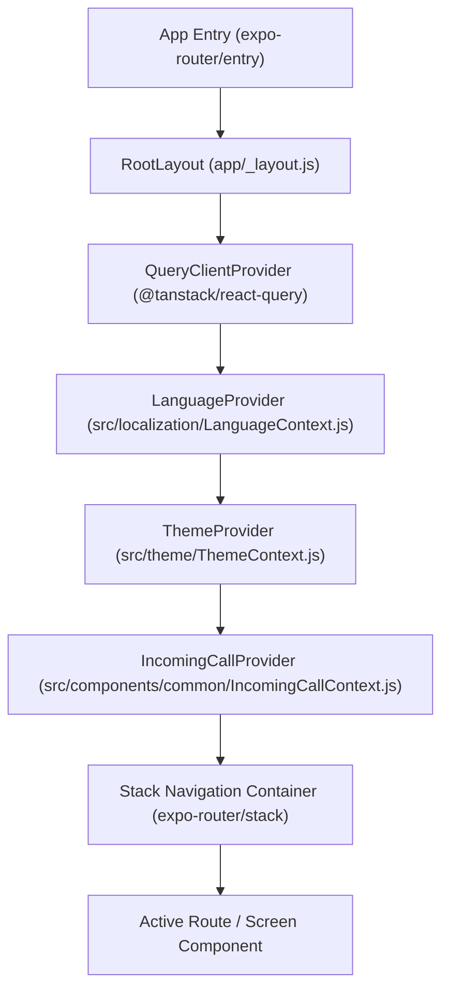
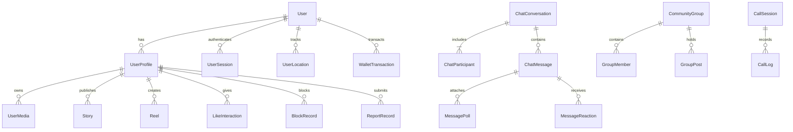
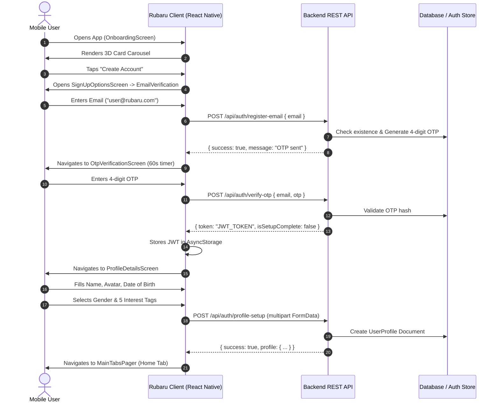
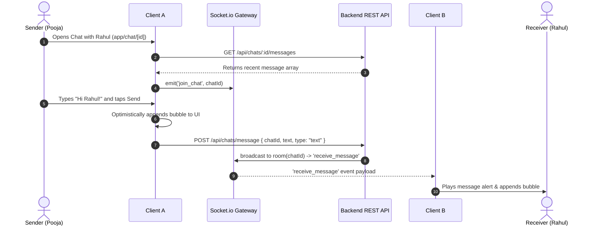
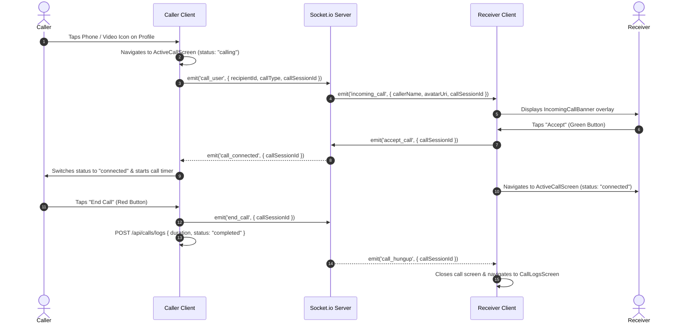
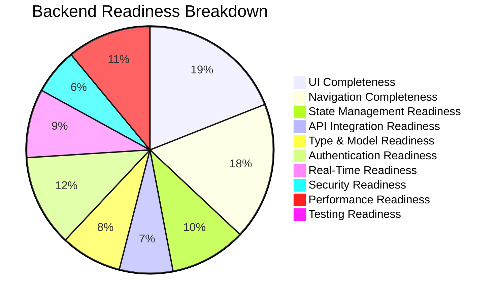
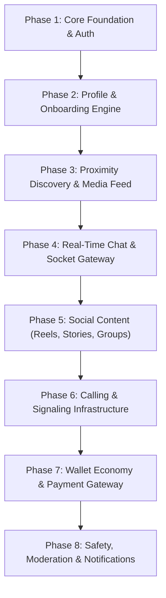

# Rubaru - Comprehensive Frontend Architectural Audit & Backend Specification

> **Document Type**: Technical Audit & Backend Integration Specification  
> **Auditor**: Senior Software Architect  
> **Date**: August 2026  
> **Target Project**: Rubaru Mobile Application  
> **Repository Root**: `c:\Users\Shubh\Desktop\Rubaru`  
> **Inspection Mode**: Complete Read-Only Codebase Audit  

---

## Table of Contents

1. [Executive Summary](#1-executive-summary)
2. [Technology Stack](#2-technology-stack)
3. [Project Folder Structure](#3-project-folder-structure)
4. [Application Entry and Provider Structure](#4-application-entry-and-provider-structure)
5. [Navigation and Route Inventory](#5-navigation-and-route-inventory)
6. [Complete Feature Inventory](#6-complete-feature-inventory)
7. [Screen-by-Screen Analysis](#7-screen-by-screen-analysis)
8. [Component Inventory](#8-component-inventory)
9. [State Management Audit](#9-state-management-audit)
10. [Current Data Sources](#10-current-data-sources)
11. [Existing API Integration Audit](#11-existing-api-integration-audit)
12. [Backend API Requirements](#12-backend-api-requirements)
13. [Inferred Backend Data Models](#13-inferred-backend-data-models)
14. [End-to-End User Flows](#14-end-to-end-user-flows)
15. [Real-Time Requirements](#15-real-time-requirements)
16. [Media Architecture Requirements](#16-media-architecture-requirements)
17. [Authentication and Security Audit](#17-authentication-and-security-audit)
18. [UI and UX State Audit](#18-ui-and-ux-state-audit)
19. [Performance Audit](#19-performance-audit)
20. [Accessibility and Responsive Design](#20-accessibility-and-responsive-design)
21. [Testing Status](#21-testing-status)
22. [Frontend Problems and Technical Debt](#22-frontend-problems-and-technical-debt)
23. [Backend Readiness Assessment](#23-backend-readiness-assessment)
24. [Recommended Backend Development Phases](#24-recommended-backend-development-phases)
25. [Recommended Implementation Order](#25-recommended-implementation-order)
26. [Information Still Required From the Project Owner](#26-information-still-required-from-the-project-owner)
27. [Final Handover Summary](#27-final-handover-summary)

---

# 1. Executive Summary

### 1.1 Application Purpose & Target Audience
**Rubaru** is a hybrid social discovery, dating, and community connection mobile application tailored primarily for the Indian youth and young adult demographic. It blends the proximity and interest-based matching mechanics of dating applications (such as Hinge, Tinder, and Bumble) with social media engagement mechanisms (such as Instagram Reels, rich messaging threads, interactive story creation, community groups, and an internal points-based micro-economy).

### 1.2 Supported Platforms & Architecture
* **Target Platforms**: iOS and Android mobile devices (via Expo SDK 57 / React Native 0.86.2).
* **Architecture Type**: File-based routing via `expo-router` coupled with a synchronized `react-native-pager-view` bottom-tab pager architecture, modular reusable presentational UI components, Zustand client state, Axios HTTP client, and Socket.io real-time signaling.

### 1.3 Current Development Stage
The project is in an **Advanced UI Prototype with Partial API Integration** stage:
* **UI Layer**: Approximately 95% complete. High-fidelity visual layouts, custom typography, animations, modal sheets, and bilingual localization (English / Hindi) are implemented.
* **API Integration Layer**: Approximately 20% connected. Authentication (email/phone/OTP/login), profile retrieval (`/api/profiles/me`, `/api/profiles/:userId`), profile editing with multipart uploads (`/api/profiles/edit`), initial chat messaging with Socket.io (`/api/chats`, `/api/chats/:id/messages`), and call logging (`/api/calls/logs`) have working baseline hooks.
* **Simulated/Static Layer**: Approximately 80% of data across the Discovery feed, Reels feed, Groups directory, Notifications feed, Stories carousel, Points transactions ledger, Safety warnings, and Blocked users list relies on static mock arrays hardcoded within screen files.

### 1.4 Readiness for Backend Integration
The frontend is **moderately ready** for backend integration. Core networking utilities (`api.js`, `socket.js`) and data-fetching hooks already implement standard JWT Bearer header interception and 401 handling. However, before scalable backend production starts, several UI data structures need normalization, list virtualization requires optimization, and mock arrays must be refactored into centralized service hooks.

### 1.5 Biggest Missing Technical Areas
1. **Dating & Recommendation Engine**: No backend endpoints exist for candidate recommendation ranking, swipe/like/pass interactions, mutual match generation, or distance geohash calculations.
2. **True WebRTC / Media Streaming Engine**: Calling UI (`ActiveCallScreen.js`) implements basic Socket.io signaling events (`call_user`, `call_connected`, `call_hungup`), but lacks actual WebRTC peer connections (audio/video streaming) or third-party SDK integration (Agora/Twilio/LiveKit).
3. **Payment Gateway Integration**: Points purchase flow (`BuyPointsScreen.js`) only manipulates client-side Zustand store balance without real payment SDK (Razorpay, Stripe, Google Play In-App Billing).
4. **Push Notification Infrastructure**: No Firebase Cloud Messaging (FCM) or Apple Push Notification service (APNs) device registration endpoints exist.
5. **Real-time Event Broker for Groups and Stories**: Group chat and story creation currently lack full server-backed persistence and lifecycle expiration (24-hour TTL).

### 1.6 Critical Pre-Backend Risks
* **Inconsistent Authentication Token Propagation**: Some onboarding screens directly mutate `api.defaults.headers.common['Authorization']` using navigation params rather than synchronizing through `AsyncStorage` and a unified Auth context.
* **Payload Shape Divergence**: Screen-level mock arrays use differing ID formats (e.g., string IDs `'feed-1'`, numeric IDs `1`, UUID strings) compared to MongoDB `_id` / SQL auto-increment integers.
* **Memory Pressure on Media Feeds**: Reels and home feeds load full-resolution remote images without disk-level thumbnailing or responsive resolution scaling.

---

# 2. Technology Stack

| Category | Technology | Version | Purpose | Evidence/File |
| :--- | :--- | :---: | :--- | :--- |
| **Framework** | React Native | `0.86.2` | Core cross-platform mobile UI runtime | [package.json](file:///c:/Users/Shubh/Desktop/Rubaru/package.json#L37) |
| **Framework Environment** | Expo SDK | `~57.0.14` | Managed build and native module ecosystem | [package.json](file:///c:/Users/Shubh/Desktop/Rubaru/package.json#L21) |
| **Programming Language** | JavaScript (ES6+ / JSX) | N/A | Application logic (100% JS codebase) | [jsconfig.json](file:///c:/Users/Shubh/Desktop/Rubaru/jsconfig.json) |
| **Navigation & Routing** | Expo Router | `~57.0.12` | File-based routing, stacks, modal presentations | [package.json](file:///c:/Users/Shubh/Desktop/Rubaru/package.json#L31), [app/_layout.js](file:///c:/Users/Shubh/Desktop/Rubaru/app/_layout.js) |
| **Tabs Controller** | React Native Pager View | `8.0.2` | Horizontal swipeable dashboard pager | [package.json](file:///c:/Users/Shubh/Desktop/Rubaru/package.json#L39), [MainTabsPager.js](file:///c:/Users/Shubh/Desktop/Rubaru/src/navigation/MainTabsPager.js) |
| **State Management (Client)** | Zustand | `^4.5.5` | In-app virtual points balance store | [package.json](file:///c:/Users/Shubh/Desktop/Rubaru/package.json#L45), [pointsStore.js](file:///c:/Users/Shubh/Desktop/Rubaru/src/store/pointsStore.js) |
| **State Management (Server)** | TanStack React Query | `^5.51.23` | Server state query cache (configured in root layout) | [package.json](file:///c:/Users/Shubh/Desktop/Rubaru/package.json#L19), [app/_layout.js](file:///c:/Users/Shubh/Desktop/Rubaru/app/_layout.js#L2) |
| **HTTP Client** | Axios | `^1.7.4` | REST API communication, interceptors, auth headers | [package.json](file:///c:/Users/Shubh/Desktop/Rubaru/package.json#L20), [api.js](file:///c:/Users/Shubh/Desktop/Rubaru/src/services/api.js) |
| **Real-time / WebSocket** | Socket.io Client | `^4.7.5` | Live chat messages and call signaling | [package.json](file:///c:/Users/Shubh/Desktop/Rubaru/package.json#L44), [socket.js](file:///c:/Users/Shubh/Desktop/Rubaru/src/services/socket.js) |
| **Local Persistence** | AsyncStorage | `^2.2.0` | JWT auth token and language preference storage | [package.json](file:///c:/Users/Shubh/Desktop/Rubaru/package.json#L18), [api.js](file:///c:/Users/Shubh/Desktop/Rubaru/src/services/api.js#L2) |
| **Styling System** | React Native StyleSheet | Built-in | Component styling with custom design tokens | [colors.js](file:///c:/Users/Shubh/Desktop/Rubaru/src/theme/colors.js) |
| **Theming & Context** | React Context API | Built-in | Dual theme (Light/Dark) and bilingual i18n (EN/HI) | [ThemeContext.js](file:///c:/Users/Shubh/Desktop/Rubaru/src/theme/ThemeContext.js), [LanguageContext.js](file:///c:/Users/Shubh/Desktop/Rubaru/src/localization/LanguageContext.js) |
| **Animation Library** | React Native Reanimated | `~3.16.1` | Native animations, carousel transitions | [package.json](file:///c:/Users/Shubh/Desktop/Rubaru/package.json#L40) |
| **Gesture Handling** | React Native Gesture Handler | `~2.32.0` | Pan gestures, bottom sheets, sliders | [package.json](file:///c:/Users/Shubh/Desktop/Rubaru/package.json#L38) |
| **Icon Libraries** | Expo Vector Icons | `^15.0.3` | Ionicons, MaterialCommunityIcons, Feather | [package.json](file:///c:/Users/Shubh/Desktop/Rubaru/package.json#L17) |
| **Typography / Fonts** | Expo Google Fonts | `^0.4.*` | Jaro (400), Poppins (400/600/700/800), Inter (700/800) | [app/_layout.js](file:///c:/Users/Shubh/Desktop/Rubaru/app/_layout.js#L6-L16) |
| **Audio Module** | Expo AV | `~15.0.1` | Voice memo recording and playback in chat threads | [package.json](file:///c:/Users/Shubh/Desktop/Rubaru/package.json#L22), [app/chat/[id].js](file:///c:/Users/Shubh/Desktop/Rubaru/app/chat/[id].js#L20) |
| **Camera Module** | Expo Camera | `~57.0.3` | Camera capture for stories and selfie verification | [package.json](file:///c:/Users/Shubh/Desktop/Rubaru/package.json#L24), [AddStoryScreen.js](file:///c:/Users/Shubh/Desktop/Rubaru/src/screens/AddStoryScreen.js#L23) |
| **Media Picker** | Expo Image Picker | `~57.0.9` | Gallery media selection for avatar, gallery, stories | [package.json](file:///c:/Users/Shubh/Desktop/Rubaru/package.json#L27), [EditProfileScreen.js](file:///c:/Users/Shubh/Desktop/Rubaru/src/screens/EditProfileScreen.js#L19) |
| **Media Library** | Expo Media Library | `~57.0.0` | Device photo library permissions & assets access | [package.json](file:///c:/Users/Shubh/Desktop/Rubaru/package.json#L30) |
| **Gradients** | Expo Linear Gradient | `~57.0.1` | Visual gradient overlays, buttons, badges | [package.json](file:///c:/Users/Shubh/Desktop/Rubaru/package.json#L28) |
| **Visual Blur** | Expo Blur | `~57.0.2` | Glassmorphism and backdrop blur effects | [package.json](file:///c:/Users/Shubh/Desktop/Rubaru/package.json#L23) |
| **Vector Graphics** | React Native SVG | `15.15.4` | SVG rendering for custom badges and maps | [package.json](file:///c:/Users/Shubh/Desktop/Rubaru/package.json#L43) |
| **Safe Area Insets** | React Native Safe Area Context | `~5.7.0` | Dynamic status bar and home indicator padding | [package.json](file:///c:/Users/Shubh/Desktop/Rubaru/package.json#L41) |
| **Screen Native Performance** | React Native Screens | `~4.26.0` | Native view hierarchy optimization for Expo Router | [package.json](file:///c:/Users/Shubh/Desktop/Rubaru/package.json#L42) |
| **Deep Linking & Browser** | Expo Linking & WebBrowser | `~57.0.5` | In-app external web browsing and URL parsing | [package.json](file:///c:/Users/Shubh/Desktop/Rubaru/package.json#L29-L35) |
| **Development Tunnel** | @expo/ngrok | `^4.1.3` | Local development tunnel proxy for physical devices | [package.json](file:///c:/Users/Shubh/Desktop/Rubaru/package.json#L49) |
| **Linting & Code Style** | ESLint & Prettier | `^8.57.0` / `^3.3.3` | Code quality enforcement and formatting | [package.json](file:///c:/Users/Shubh/Desktop/Rubaru/package.json#L52-L54) |

### Unused / Underutilized Dependencies:
* `@tanstack/react-query`: Initialized in [app/_layout.js](file:///c:/Users/Shubh/Desktop/Rubaru/app/_layout.js#L19), but screens directly use manual `useEffect` / `useFocusEffect` with Axios promises rather than `useQuery` / `useMutation` hooks.
* `uuid`: Imported in [ActiveCallScreen.js](file:///c:/Users/Shubh/Desktop/Rubaru/src/screens/ActiveCallScreen.js#L19) without being listed in root `package.json` dependencies (only installed in backend package).
* `expo-web-browser` and `expo-system-ui`: Installed but only referenced implicitly by Expo configuration.

---

# 3. Project Folder Structure

```
c:/Users/Shubh/Desktop/Rubaru/
├── app/                          # Expo Router file-based route definitions (57 route files)
│   ├── (tabs)/                   # Pager-connected main navigation tabs
│   │   ├── _layout.js            # Slot layout wrapper for tab container
│   │   ├── index.js              # Home feed tab route (maps to MainTabsPager index 0)
│   │   ├── connection.js         # Explore / Discover tab route (pager index 1)
│   │   ├── reels.js              # Vertical video reels tab route (pager index 2)
│   │   ├── notification.js       # Activity notifications tab route (pager index 3)
│   │   ├── groups.js             # Community groups tab route (pager index 4)
│   │   └── explore.js            # Alternate redirect route to connection tab
│   ├── call-info/
│   │   └── [id].js               # Dynamic call detail log screen route
│   ├── chat/
│   │   └── [id].js               # Dynamic 1-on-1 and group chat conversation thread route
│   ├── _layout.js                # Root layout: Providers, Fonts, Global Stack
│   └── +not-found.js             # Fallback route for invalid deep links
├── backend/                      # Lightweight Node.js/Express + MongoDB prototype backend
│   ├── config/                   # MongoDB Mongoose connection handler
│   ├── controllers/              # Auth, profile, chat, reel, call, notif controllers
│   ├── middleware/               # JWT authentication middleware
│   ├── models/                   # Mongoose schemas (User, Profile, Chat, Message, CallLog, etc.)
│   ├── routes/                   # Express route definitions
│   ├── socket/                   # Socket.io connection and room signaling logic
│   └── index.js                  # Express and HTTP server bootstrap
├── src/                          # Primary frontend source code
│   ├── assets/                   # Static images, icons, and fonts
│   │   ├── fonts/                # Bundled font binaries
│   │   ├── icons/                # Vector & PNG iconography (chat, phone, camera, tabs)
│   │   ├── images/               # App backgrounds, decorative hearts, placeholder avatars
│   │   └── reelImagesData.js     # Static media definitions for reels
│   ├── components/               # UI components
│   │   ├── common/               # 49 reusable domain and layout presentation components
│   │   ├── layout/               # Layout structure wrappers (placeholder)
│   │   ├── ChatEmptyState.js     # Chat placeholder view
│   │   ├── ChatHeader.js         # Dedicated conversation header
│   │   ├── CustomTabBar.js       # Tab bar variant
│   │   └── OnboardingCarousel.js # 3D rotating welcome carousel
│   ├── constants/                # Static application constants and mock datasets
│   │   └── mockCallData.js       # Predefined call logs mock array
│   ├── hooks/                    # Custom React hooks
│   │   └── useSocket.js          # Socket event subscription and emission hook
│   ├── localization/             # Internationalization (i18n) module
│   │   ├── LanguageContext.js    # Language state provider (EN / HI) & t() translation hook
│   │   └── translations.js       # Key-value translation dictionaries for English and Hindi
│   ├── navigation/               # Navigation controllers
│   │   └── MainTabsPager.js      # Synchronized 5-page PagerView with bottom tab bar
│   ├── screens/                  # 57 complete screen implementations (UI + local state)
│   ├── services/                 # External service clients
│   │   ├── api.js                # Axios HTTP singleton instance with JWT interceptors
│   │   └── socket.js             # Socket.io client singleton and lifecycle handlers
│   ├── store/                    # Global state stores
│   │   └── pointsStore.js        # Zustand virtual points wallet store
│   ├── theme/                    # Design tokens and theme engine
│   │   ├── colors.js             # Light and Dark color tokens, semantic palettes, gradients
│   │   ├── ThemeContext.js       # ThemeProvider context and useTheme hook
│   │   └── index.js              # Theme exports aggregator
│   ├── types/                    # TypeScript / JSDoc type definitions (.gitkeep placeholder)
│   └── utils/                    # Utility scripts and static datasets
│       ├── emojiData.js          # Unicode emoji category database
│       └── storyCache.js         # Local in-memory cache for published stories
├── app.json                      # Expo application manifest configuration
├── babel.config.js               # Babel compiler config with module alias resolvers
├── jsconfig.json                 # Path aliases mapping (@screens, @components, @assets, @services)
└── package.json                  # Root dependencies and build scripts
```

### Structural Evaluation:
* **Clean Separation**: Distinct separation between route declarations ([app/](file:///c:/Users/Shubh/Desktop/Rubaru/app)) and actual screen implementations ([src/screens/](file:///c:/Users/Shubh/Desktop/Rubaru/src/screens)).
* **Path Aliasing**: Module alias mapping in [babel.config.js](file:///c:/Users/Shubh/Desktop/Rubaru/babel.config.js) and [jsconfig.json](file:///c:/Users/Shubh/Desktop/Rubaru/jsconfig.json) allows clean imports (`@screens/...`, `@components/...`, `@services/...`).
* **Misplaced Logic**: The conversation screen [app/chat/[id].js](file:///c:/Users/Shubh/Desktop/Rubaru/app/chat/[id].js) contains over 1,240 lines of inline UI, modal state, socket listeners, and audio recording logic directly inside the routing directory instead of being cleanly separated into `src/screens/ChatDetailScreen.js`.
* **Duplicate Subfolder**: An extra nested clone directory `Rubaru/` exists at the root, which duplicates older iterations of files. Only the root `app/` and `src/` directories are active.

---

# 4. Application Entry and Provider Structure

### 4.1 Startup Sequence
1. **Entry Point**: `expo-router/entry` loads the root route tree.
2. **Font Loading**: [app/_layout.js](file:///c:/Users/Shubh/Desktop/Rubaru/app/_layout.js) invokes `useFonts` to asynchronously load Google Fonts (`Jaro_400Regular`, `Poppins_400Regular`, `Poppins_600SemiBold`, `Poppins_700Bold`, `Poppins_800ExtraBold`, `Inter_700Bold`, `Inter_800ExtraBold`).
3. **Splash Screen Blocking**: If fonts have not completed loading and no font error has occurred, the component renders `null` (holding the native splash screen).
4. **Provider Instantiation**: The provider tree mounts in hierarchical order.
5. **Initial Route Selection**: Expo Router evaluates the URL or defaults to `/` ([app/index.js](file:///c:/Users/Shubh/Desktop/Rubaru/app/index.js)), rendering [OnboardingScreen.js](file:///c:/Users/Shubh/Desktop/Rubaru/src/screens/OnboardingScreen.js).

### 4.2 Provider Nesting Diagram



### 4.3 Provider Responsibilities
* **QueryClientProvider**: Provides query caching context (currently dormant in screens).
* **LanguageProvider**: Loads persisted language from `AsyncStorage` (key: `'app_language'`), defaults to `'en'`, provides translation function `t(key, fallback)` and `setLanguage('en' | 'hi')`.
* **ThemeProvider**: Manages `isDarkMode` state, supplies active `colors` palette, provides `toggleTheme()` and `setDarkMode(bool)`.
* **IncomingCallProvider**: Listens globally to Socket.io `incoming_call` events, maintaining `incomingCall` state and rendering the floating [IncomingCallBanner.js](file:///c:/Users/Shubh/Desktop/Rubaru/src/components/common/IncomingCallBanner.js) overlay across all application screens.

---

# 5. Navigation and Route Inventory

| Route / Path | Implementation File | Purpose | Auth Required | Route Parameters | Data Source | Navigation Status |
| :--- | :--- | :--- | :---: | :--- | :--- | :--- |
| `/` | [app/index.js](file:///c:/Users/Shubh/Desktop/Rubaru/app/index.js) -> [OnboardingScreen.js](file:///c:/Users/Shubh/Desktop/Rubaru/src/screens/OnboardingScreen.js) | App intro & 3D carousel | No | None | Static carousel | Fully Navigable |
| `/sign-in` | [app/sign-in.js](file:///c:/Users/Shubh/Desktop/Rubaru/app/sign-in.js) -> [SignInScreen.js](file:///c:/Users/Shubh/Desktop/Rubaru/src/screens/SignInScreen.js) | Email/Phone + password login | No | None | `POST /api/auth/login` | Connected to API |
| `/signup-options` | [app/signup-options.js](file:///c:/Users/Shubh/Desktop/Rubaru/app/signup-options.js) -> [SignUpOptionsScreen.js](file:///c:/Users/Shubh/Desktop/Rubaru/src/screens/SignUpOptionsScreen.js) | Auth methods selector | No | None | Static | Fully Navigable |
| `/email-verification` | [app/email-verification.js](file:///c:/Users/Shubh/Desktop/Rubaru/app/email-verification.js) -> [EmailVerificationScreen.js](file:///c:/Users/Shubh/Desktop/Rubaru/src/screens/EmailVerificationScreen.js) | Email registration input | No | None | `POST /api/auth/register-email` | Connected to API |
| `/phone-verification` | [app/phone-verification.js](file:///c:/Users/Shubh/Desktop/Rubaru/app/phone-verification.js) -> [PhoneVerificationScreen.js](file:///c:/Users/Shubh/Desktop/Rubaru/src/screens/PhoneVerificationScreen.js) | Phone registration input | No | None | `POST /api/auth/register-phone` | Connected to API |
| `/otp-verification` | [app/otp-verification.js](file:///c:/Users/Shubh/Desktop/Rubaru/app/otp-verification.js) -> [OtpVerificationScreen.js](file:///c:/Users/Shubh/Desktop/Rubaru/src/screens/OtpVerificationScreen.js) | 4-digit code confirmation | No | `email`, `phone`, `type` | `POST /api/auth/verify-otp` | Connected to API |
| `/create-password` | [app/create-password.js](file:///c:/Users/Shubh/Desktop/Rubaru/app/create-password.js) -> [CreatePasswordScreen.js](file:///c:/Users/Shubh/Desktop/Rubaru/src/screens/CreatePasswordScreen.js) | Set initial user password | No | `token` | `POST /api/auth/set-password` | Connected to API |
| `/forgot-password` | [app/forgot-password.js](file:///c:/Users/Shubh/Desktop/Rubaru/app/forgot-password.js) -> [ForgotPasswordScreen.js](file:///c:/Users/Shubh/Desktop/Rubaru/src/screens/ForgotPasswordScreen.js) | Account recovery & reset | No | None | Simulated local state | Frontend-only |
| `/profile-details` | [app/profile-details.js](file:///c:/Users/Shubh/Desktop/Rubaru/app/profile-details.js) -> [ProfileDetailsScreen.js](file:///c:/Users/Shubh/Desktop/Rubaru/src/screens/ProfileDetailsScreen.js) | Name & avatar onboarding | Yes | `selectedDob` | Form state | Fully Navigable |
| `/birthday-picker` | [app/birthday-picker.js](file:///c:/Users/Shubh/Desktop/Rubaru/app/birthday-picker.js) -> [BirthdayPickerScreen.js](file:///c:/Users/Shubh/Desktop/Rubaru/src/screens/BirthdayPickerScreen.js) | Calendar date picker modal | Yes | `currentDob` | Local state | Fully Navigable |
| `/gender-selection` | [app/gender-selection.js](file:///c:/Users/Shubh/Desktop/Rubaru/app/gender-selection.js) -> [GenderSelectionScreen.js](file:///c:/Users/Shubh/Desktop/Rubaru/src/screens/GenderSelectionScreen.js) | Gender identity selector | Yes | `name`, `dob`, `avatar` | Local state | Fully Navigable |
| `/interests-selection` | [app/interests-selection.js](file:///c:/Users/Shubh/Desktop/Rubaru/app/interests-selection.js) -> [InterestsSelectionScreen.js](file:///c:/Users/Shubh/Desktop/Rubaru/src/screens/InterestsSelectionScreen.js) | Interest tags onboarding | Yes | `token`, `name`, `gender` | `POST /api/auth/profile-setup` | Connected to API |
| `/enable-notifications`| [app/enable-notifications.js](file:///c:/Users/Shubh/Desktop/Rubaru/app/enable-notifications.js) -> [EnableNotificationsScreen.js](file:///c:/Users/Shubh/Desktop/Rubaru/src/screens/EnableNotificationsScreen.js) | Push notification opt-in | Yes | None | System permissions | Fully Navigable |
| `/permission-grant` | [app/permission-grant.js](file:///c:/Users/Shubh/Desktop/Rubaru/app/permission-grant.js) -> [PermissionGrantScreen.js](file:///c:/Users/Shubh/Desktop/Rubaru/src/screens/PermissionGrantScreen.js) | Hardware permissions setup | Yes | None | System permissions | Fully Navigable |
| `/(tabs)` | [app/(tabs)/index.js](file:///c:/Users/Shubh/Desktop/Rubaru/app/(tabs)/index.js) -> [MainTabsPager.js](file:///c:/Users/Shubh/Desktop/Rubaru/src/navigation/MainTabsPager.js) | Main dashboard tab pager | Yes | `tab` (page index/name) | Multiple (see tabs) | Fully Navigable |
| `/(tabs)/index` | [src/screens/HomeScreen.js](file:///c:/Users/Shubh/Desktop/Rubaru/src/screens/HomeScreen.js) (Pager index 0) | Home feed & stories bar | Yes | None | Mock feed + `GET /api/profiles/me` | Partially Connected |
| `/(tabs)/connection` | [src/screens/ConnectionScreen.js](file:///c:/Users/Shubh/Desktop/Rubaru/src/screens/ConnectionScreen.js) (Pager index 1) | Explore, map & user cards | Yes | None | Mock user array | Static / Mock |
| `/(tabs)/explore` | [app/(tabs)/explore.js](file:///c:/Users/Shubh/Desktop/Rubaru/app/(tabs)/explore.js) | Alias redirect to explore tab | Yes | None | Redirect | Fully Navigable |
| `/(tabs)/reels` | [src/screens/ReelsScreen.js](file:///c:/Users/Shubh/Desktop/Rubaru/src/screens/ReelsScreen.js) (Pager index 2) | Fullscreen vertical reels | Yes | None | Mock reels array | Static / Mock |
| `/(tabs)/notification` | [src/screens/NotificationScreen.js](file:///c:/Users/Shubh/Desktop/Rubaru/src/screens/NotificationScreen.js) (Pager index 3) | Activity & interaction feed | Yes | None | Mock notifications | Static / Mock |
| `/(tabs)/groups` | [src/screens/GroupsScreen.js](file:///c:/Users/Shubh/Desktop/Rubaru/src/screens/GroupsScreen.js) (Pager index 4) | Community groups directory | Yes | None | Mock groups array | Static / Mock |
| `/search-users` | [app/search-users.js](file:///c:/Users/Shubh/Desktop/Rubaru/app/search-users.js) -> [SearchUsersScreen.js](file:///c:/Users/Shubh/Desktop/Rubaru/src/screens/SearchUsersScreen.js) | Global user search | Yes | None | `GET /api/profiles/search` | Connected to API |
| `/search-friends` | [app/search-friends.js](file:///c:/Users/Shubh/Desktop/Rubaru/app/search-friends.js) -> [SearchFriendsScreen.js](file:///c:/Users/Shubh/Desktop/Rubaru/src/screens/SearchFriendsScreen.js) | Filter friends & contacts | Yes | None | Static mock data | Static / Mock |
| `/user-profile` | [app/user-profile.js](file:///c:/Users/Shubh/Desktop/Rubaru/app/user-profile.js) -> [UserProfileScreen.js](file:///c:/Users/Shubh/Desktop/Rubaru/src/screens/UserProfileScreen.js) | Profile view & settings | Yes | `userId`, `openSettings` | `GET /api/profiles/:id` | Connected to API |
| `/edit-profile` | [app/edit-profile.js](file:///c:/Users/Shubh/Desktop/Rubaru/app/edit-profile.js) -> [EditProfileScreen.js](file:///c:/Users/Shubh/Desktop/Rubaru/src/screens/EditProfileScreen.js) | Edit bio, photos, tags | Yes | None | `PUT /api/profiles/edit` | Connected to API |
| `/chats` | [app/chats.js](file:///c:/Users/Shubh/Desktop/Rubaru/app/chats.js) -> [ChatsScreen.js](file:///c:/Users/Shubh/Desktop/Rubaru/src/screens/ChatsScreen.js) | Conversations list | Yes | None | `GET /api/chats` | Connected to API |
| `/chat/[id]` | [app/chat/[id].js](file:///c:/Users/Shubh/Desktop/Rubaru/app/chat/[id].js) | Direct & group chat thread | Yes | `id`, `name`, `avatarUrl`, `recipientId` | `GET /api/chats/:id/messages` + Socket | Connected to API |
| `/call-logs` | [app/call-logs.js](file:///c:/Users/Shubh/Desktop/Rubaru/app/call-logs.js) -> [CallLogsScreen.js](file:///c:/Users/Shubh/Desktop/Rubaru/src/screens/CallLogsScreen.js) | Call history records | Yes | None | `GET /api/calls/logs` | Connected to API |
| `/call-info/[id]` | [app/call-info/[id].js](file:///c:/Users/Shubh/Desktop/Rubaru/app/call-info/[id].js) -> [CallInfoScreen.js](file:///c:/Users/Shubh/Desktop/Rubaru/src/screens/CallInfoScreen.js) | Single call record details | Yes | `id`, `contactName`, `avatarUri` | Static / Params | Partially Connected |
| `/active-call` | [app/active-call.js](file:///c:/Users/Shubh/Desktop/Rubaru/app/active-call.js) -> [ActiveCallScreen.js](file:///c:/Users/Shubh/Desktop/Rubaru/src/screens/ActiveCallScreen.js) | Fullscreen call session | Yes | `contactName`, `receiverId`, `callType` | Socket signaling + `POST /api/calls/logs` | Partially Connected |
| `/blocked-chats` | [app/blocked-chats.js](file:///c:/Users/Shubh/Desktop/Rubaru/app/blocked-chats.js) -> [BlockedChatsScreen.js](file:///c:/Users/Shubh/Desktop/Rubaru/src/screens/BlockedChatsScreen.js) | Blocked users manager | Yes | None | Local mock array | Static / Mock |
| `/add-story` | [app/add-story.js](file:///c:/Users/Shubh/Desktop/Rubaru/app/add-story.js) -> [AddStoryScreen.js](file:///c:/Users/Shubh/Desktop/Rubaru/src/screens/AddStoryScreen.js) | Camera & gallery story creator | Yes | None | Local camera + Gallery | Frontend-only |
| `/view-story` | [app/view-story.js](file:///c:/Users/Shubh/Desktop/Rubaru/app/view-story.js) -> [ViewStoryScreen.js](file:///c:/Users/Shubh/Desktop/Rubaru/src/screens/ViewStoryScreen.js) | Timed story progression viewer | Yes | `name`, `imageUrl`, `stories` | Params / Local state | Frontend-only |
| `/story-preview` | [app/story-preview.js](file:///c:/Users/Shubh/Desktop/Rubaru/app/story-preview.js) -> [StoryPreviewScreen.js](file:///c:/Users/Shubh/Desktop/Rubaru/src/screens/StoryPreviewScreen.js) | Story edit review screen | Yes | `mediaUri` | Local state | Frontend-only |
| `/create-group` | [app/create-group.js](file:///c:/Users/Shubh/Desktop/Rubaru/app/create-group.js) -> [CreateGroupScreen.js](file:///c:/Users/Shubh/Desktop/Rubaru/src/screens/CreateGroupScreen.js) | Group setup wizard | Yes | None | Local state | Frontend-only |
| `/group-chat` | [app/group-chat.js](file:///c:/Users/Shubh/Desktop/Rubaru/app/group-chat.js) -> [GroupChatScreen.js](file:///c:/Users/Shubh/Desktop/Rubaru/src/screens/GroupChatScreen.js) | Group message thread | Yes | `name`, `initials`, `onlineText` | Local mock messages | Static / Mock |
| `/group-settings` | [app/group-settings.js](file:///c:/Users/Shubh/Desktop/Rubaru/app/group-settings.js) -> [GroupSettingsScreen.js](file:///c:/Users/Shubh/Desktop/Rubaru/src/screens/GroupSettingsScreen.js) | Group roster & media gallery | Yes | None | Local state | Frontend-only |
| `/group-admin-settings`| [app/group-admin-settings.js](file:///c:/Users/Shubh/Desktop/Rubaru/app/group-admin-settings.js) -> [GroupAdminSettingsScreen.js](file:///c:/Users/Shubh/Desktop/Rubaru/src/screens/GroupAdminSettingsScreen.js) | Admin controls & privileges | Yes | None | Local state | Frontend-only |
| `/edit-group-info` | [app/edit-group-info.js](file:///c:/Users/Shubh/Desktop/Rubaru/app/edit-group-info.js) -> [EditGroupInfoScreen.js](file:///c:/Users/Shubh/Desktop/Rubaru/src/screens/EditGroupInfoScreen.js) | Edit group details | Yes | None | Local state | Frontend-only |
| `/my-points` | [app/my-points.js](file:///c:/Users/Shubh/Desktop/Rubaru/app/my-points.js) -> [MyPointsScreen.js](file:///c:/Users/Shubh/Desktop/Rubaru/src/screens/MyPointsScreen.js) | Virtual points dashboard | Yes | None | `pointsStore` + `GET /api/profiles/me` | Partially Connected |
| `/buy-points` | [app/buy-points.js](file:///c:/Users/Shubh/Desktop/Rubaru/app/buy-points.js) -> [BuyPointsScreen.js](file:///c:/Users/Shubh/Desktop/Rubaru/src/screens/BuyPointsScreen.js) | Points package store | Yes | None | `pointsStore` (Zustand) | Frontend-only |
| `/transactions` | [app/transactions.js](file:///c:/Users/Shubh/Desktop/Rubaru/app/transactions.js) -> [TransactionsScreen.js](file:///c:/Users/Shubh/Desktop/Rubaru/src/screens/TransactionsScreen.js) | Virtual currency ledger | Yes | None | Static transactions mock | Static / Mock |
| `/notification-settings`| [app/notification-settings.js](file:///c:/Users/Shubh/Desktop/Rubaru/app/notification-settings.js) -> [NotificationSettingsScreen.js](file:///c:/Users/Shubh/Desktop/Rubaru/src/screens/NotificationSettingsScreen.js) | Switch toggles for notifs | Yes | None | Local component state | Frontend-only |
| `/violations` | [app/violations.js](file:///c:/Users/Shubh/Desktop/Rubaru/app/violations.js) -> [ViolationsScreen.js](file:///c:/Users/Shubh/Desktop/Rubaru/src/screens/ViolationsScreen.js) | Safety warnings hub | Yes | None | Static warnings mock | Static / Mock |
| `/violation-details` | [app/violation-details.js](file:///c:/Users/Shubh/Desktop/Rubaru/app/violation-details.js) -> [ViolationDetailsScreen.js](file:///c:/Users/Shubh/Desktop/Rubaru/src/screens/ViolationDetailsScreen.js) | Warning detail & appeal | Yes | `violationId` | Static mock | Static / Mock |
| `/report-violations` | [app/report-violations.js](file:///c:/Users/Shubh/Desktop/Rubaru/app/report-violations.js) -> [ReportViolationsScreen.js](file:///c:/Users/Shubh/Desktop/Rubaru/src/screens/ReportViolationsScreen.js) | Report user/content form | Yes | None | Form state | Frontend-only |
| `/reports` | [app/reports.js](file:///c:/Users/Shubh/Desktop/Rubaru/app/reports.js) -> [ReportsScreen.js](file:///c:/Users/Shubh/Desktop/Rubaru/src/screens/ReportsScreen.js) | User submitted reports list | Yes | None | Static reports mock | Static / Mock |
| `/safety-notices` | [app/safety-notices.js](file:///c:/Users/Shubh/Desktop/Rubaru/app/safety-notices.js) -> [SafetyNoticesScreen.js](file:///c:/Users/Shubh/Desktop/Rubaru/src/screens/SafetyNoticesScreen.js) | Safety bulletin cards | Yes | None | Static advisory data | Static / Mock |
| `/scam-protection` | [app/scam-protection.js](file:///c:/Users/Shubh/Desktop/Rubaru/app/scam-protection.js) -> [ScamProtectionScreen.js](file:///c:/Users/Shubh/Desktop/Rubaru/src/screens/ScamProtectionScreen.js) | Anti-fraud education guide | Yes | None | Static article content | Static / Mock |
| `/help-support` | [app/help-support.js](file:///c:/Users/Shubh/Desktop/Rubaru/app/help-support.js) -> [HelpSupportScreen.js](file:///c:/Users/Shubh/Desktop/Rubaru/src/screens/HelpSupportScreen.js) | Support navigation hub | Yes | None | Static menu items | Fully Navigable |
| `/faqs` | [app/faqs.js](file:///c:/Users/Shubh/Desktop/Rubaru/app/faqs.js) -> [FaqsScreen.js](file:///c:/Users/Shubh/Desktop/Rubaru/src/screens/FaqsScreen.js) | Accordion FAQ answers | Yes | None | Static FAQ dictionary | Fully Navigable |
| `/contact-us` | [app/contact-us.js](file:///c:/Users/Shubh/Desktop/Rubaru/app/contact-us.js) -> [ContactUsScreen.js](file:///c:/Users/Shubh/Desktop/Rubaru/src/screens/ContactUsScreen.js) | Support channels & email | Yes | None | Static info | Fully Navigable |
| `/report-problem` | [app/report-problem.js](file:///c:/Users/Shubh/Desktop/Rubaru/app/report-problem.js) -> [ReportProblemScreen.js](file:///c:/Users/Shubh/Desktop/Rubaru/src/screens/ReportProblemScreen.js) | Bug & feedback ticket form | Yes | None | Form state | Frontend-only |
| `/feedback` | [app/feedback.js](file:///c:/Users/Shubh/Desktop/Rubaru/app/feedback.js) -> [FeedbackScreen.js](file:///c:/Users/Shubh/Desktop/Rubaru/src/screens/FeedbackScreen.js) | App rating & survey form | Yes | None | Form state | Frontend-only |
| `/customer-support-flow`| [app/customer-support-flow.js](file:///c:/Users/Shubh/Desktop/Rubaru/app/customer-support-flow.js) -> [CustomerSupportFlowScreen.js](file:///c:/Users/Shubh/Desktop/Rubaru/src/screens/CustomerSupportFlowScreen.js) | Step-by-step issue wizard | Yes | None | Interactive flow state | Frontend-only |
| `/privacy-security-help`| [app/privacy-security-help.js](file:///c:/Users/Shubh/Desktop/Rubaru/app/privacy-security-help.js) -> [PrivacySecurityHelpScreen.js](file:///c:/Users/Shubh/Desktop/Rubaru/src/screens/PrivacySecurityHelpScreen.js) | Privacy help documents | Yes | None | Static articles | Fully Navigable |
| `/community-standards` | [app/community-standards.js](file:///c:/Users/Shubh/Desktop/Rubaru/app/community-standards.js) -> [CommunityStandardsScreen.js](file:///c:/Users/Shubh/Desktop/Rubaru/src/screens/CommunityStandardsScreen.js) | Community rules documentation | Yes | None | Static legal text | Fully Navigable |
| `/privacy-policy` | [app/privacy-policy.js](file:///c:/Users/Shubh/Desktop/Rubaru/app/privacy-policy.js) -> [PrivacyPolicyScreen.js](file:///c:/Users/Shubh/Desktop/Rubaru/src/screens/PrivacyPolicyScreen.js) | Privacy policy legal text | No | None | Static legal text | Fully Navigable |
| `/terms-of-use` | [app/terms-of-use.js](file:///c:/Users/Shubh/Desktop/Rubaru/app/terms-of-use.js) -> [TermsOfUseScreen.js](file:///c:/Users/Shubh/Desktop/Rubaru/src/screens/TermsOfUseScreen.js) | Terms of service legal text | No | None | Static legal text | Fully Navigable |
| `/about-us` | [app/about-us.js](file:///c:/Users/Shubh/Desktop/Rubaru/app/about-us.js) -> [AboutUsScreen.js](file:///c:/Users/Shubh/Desktop/Rubaru/src/screens/AboutUsScreen.js) | Company & mission info | No | None | Static text | Fully Navigable |
| `+not-found` | [app/+not-found.js](file:///c:/Users/Shubh/Desktop/Rubaru/app/+not-found.js) | 404 Route Not Found screen | No | None | Static | Fully Navigable |

---

# 6. Complete Feature Inventory

| Module | Feature | UI Present | Logic Present | Data Source | Backend Required | Current Status | Evidence / File |
| :--- | :--- | :---: | :---: | :--- | :---: | :--- | :--- |
| **Auth** | Registration (Email/Phone) | Yes | Yes | REST API | Yes | Connected | [EmailVerificationScreen.js](file:///c:/Users/Shubh/Desktop/Rubaru/src/screens/EmailVerificationScreen.js#L37), [PhoneVerificationScreen.js](file:///c:/Users/Shubh/Desktop/Rubaru/src/screens/PhoneVerificationScreen.js#L51) |
| **Auth** | OTP Verification | Yes | Yes | REST API | Yes | Connected | [OtpVerificationScreen.js](file:///c:/Users/Shubh/Desktop/Rubaru/src/screens/OtpVerificationScreen.js#L55) |
| **Auth** | Password Setup / Login | Yes | Yes | REST API | Yes | Connected | [SignInScreen.js](file:///c:/Users/Shubh/Desktop/Rubaru/src/screens/SignInScreen.js#L59), [CreatePasswordScreen.js](file:///c:/Users/Shubh/Desktop/Rubaru/src/screens/CreatePasswordScreen.js#L53) |
| **Auth** | Social Login (Google/Apple) | Yes | No | Static | Yes | Frontend-only | [SignUpOptionsScreen.js](file:///c:/Users/Shubh/Desktop/Rubaru/src/screens/SignUpOptionsScreen.js) |
| **Auth** | Forgot / Reset Password | Yes | Partial | Local state | Yes | Frontend-only | [ForgotPasswordScreen.js](file:///c:/Users/Shubh/Desktop/Rubaru/src/screens/ForgotPasswordScreen.js) |
| **Auth** | Session Storage & Bearer Interception | Yes | Yes | `AsyncStorage` | Yes | Fully Implemented | [api.js](file:///c:/Users/Shubh/Desktop/Rubaru/src/services/api.js#L15) |
| **Auth** | Token Refresh Flow | No | No | Not found | Yes | Missing / Not Found | [api.js](file:///c:/Users/Shubh/Desktop/Rubaru/src/services/api.js#L32) |
| **Auth** | Account Deletion (3-Step Modal) | Yes | Partial | Local UI modal | Yes | Frontend-only | [UserProfileScreen.js](file:///c:/Users/Shubh/Desktop/Rubaru/src/screens/UserProfileScreen.js#L147) |
| **Onboarding** | Profile Setup (Name, Avatar, DOB) | Yes | Yes | REST API | Yes | Connected | [ProfileDetailsScreen.js](file:///c:/Users/Shubh/Desktop/Rubaru/src/screens/ProfileDetailsScreen.js), [InterestsSelectionScreen.js](file:///c:/Users/Shubh/Desktop/Rubaru/src/screens/InterestsSelectionScreen.js#L89) |
| **Onboarding** | Gender & Preference Selection | Yes | Partial | Nav Params | Yes | Partially Connected | [GenderSelectionScreen.js](file:///c:/Users/Shubh/Desktop/Rubaru/src/screens/GenderSelectionScreen.js) |
| **Onboarding** | Interests Multi-Select (14 Tags) | Yes | Yes | REST API | Yes | Connected | [InterestsSelectionScreen.js](file:///c:/Users/Shubh/Desktop/Rubaru/src/screens/InterestsSelectionScreen.js#L112) |
| **Onboarding** | Hardware Permissions Walkthrough | Yes | Yes | Expo APIs | No | Fully Implemented | [PermissionGrantScreen.js](file:///c:/Users/Shubh/Desktop/Rubaru/src/screens/PermissionGrantScreen.js) |
| **Discovery** | Home Feed (Cards & Stories) | Yes | Partial | Mock array + Profile API | Yes | Partially Connected | [HomeScreen.js](file:///c:/Users/Shubh/Desktop/Rubaru/src/screens/HomeScreen.js#L29) |
| **Discovery** | Explore / Connection Radar & Map | Yes | No | Mock array | Yes | Static / Mock | [ConnectionScreen.js](file:///c:/Users/Shubh/Desktop/Rubaru/src/screens/ConnectionScreen.js#L24) |
| **Discovery** | Advanced Discovery Filters Modal | Yes | Partial | Local state | Yes | Frontend-only | [DiscoverFiltersModal.js](file:///c:/Users/Shubh/Desktop/Rubaru/src/components/common/DiscoverFiltersModal.js) |
| **Discovery** | Global User Search | Yes | Yes | REST API | Yes | Connected | [SearchUsersScreen.js](file:///c:/Users/Shubh/Desktop/Rubaru/src/screens/SearchUsersScreen.js#L78) |
| **Discovery** | Feed Card Like / Heart Action | Yes | Partial | Local state | Yes | Frontend-only | [FeedCard.js](file:///c:/Users/Shubh/Desktop/Rubaru/src/components/common/FeedCard.js#L28) |
| **Match System**| Tinder/Hinge Swipe Deck & Mutual Matches | No | No | Not found | Yes | Missing / Not Found | Not confirmed from current frontend codebase |
| **Messaging** | Conversation List | Yes | Yes | REST API | Yes | Connected | [ChatsScreen.js](file:///c:/Users/Shubh/Desktop/Rubaru/src/screens/ChatsScreen.js#L44) |
| **Messaging** | 1-on-1 Text Messaging | Yes | Yes | REST + Socket.io | Yes | Connected | [app/chat/[id].js](file:///c:/Users/Shubh/Desktop/Rubaru/app/chat/[id].js#L307) |
| **Messaging** | Image Attachment in Chat | Yes | Yes | REST + Socket.io | Yes | Connected | [app/chat/[id].js](file:///c:/Users/Shubh/Desktop/Rubaru/app/chat/[id].js#L476) |
| **Messaging** | Voice Note Recording & Playback | Yes | Yes | Expo AV + Socket | Yes | Connected | [app/chat/[id].js](file:///c:/Users/Shubh/Desktop/Rubaru/app/chat/[id].js#L20), [VoiceMessageBubble.js](file:///c:/Users/Shubh/Desktop/Rubaru/src/components/common/VoiceMessageBubble.js) |
| **Messaging** | Custom In-Chat Polls | Yes | Partial | Local state | Yes | Frontend-only | [CreatePollModal.js](file:///c:/Users/Shubh/Desktop/Rubaru/src/components/common/CreatePollModal.js), [PollBubble.js](file:///c:/Users/Shubh/Desktop/Rubaru/src/components/common/PollBubble.js) |
| **Messaging** | AI Assist Smart Replies | Yes | Partial | Local presets | Yes | Frontend-only | [AIAssistMenu.js](file:///c:/Users/Shubh/Desktop/Rubaru/src/components/common/AIAssistMenu.js) |
| **Messaging** | Message Options (Reply, Copy, Delete) | Yes | Partial | Local state | Yes | Frontend-only | [MessageOptionsMenu.js](file:///c:/Users/Shubh/Desktop/Rubaru/src/components/common/MessageOptionsMenu.js) |
| **Messaging** | Emoji Reactions & Sticker Picker | Yes | Partial | Local state | Yes | Frontend-only | [EmojiPickerSheet.js](file:///c:/Users/Shubh/Desktop/Rubaru/src/components/common/EmojiPickerSheet.js), [StickerPicker.js](file:///c:/Users/Shubh/Desktop/Rubaru/src/components/common/StickerPicker.js) |
| **Calling** | Voice / Video Call Signaling | Yes | Partial | Socket.io events | Yes | Partially Connected | [ActiveCallScreen.js](file:///c:/Users/Shubh/Desktop/Rubaru/src/screens/ActiveCallScreen.js#L57) |
| **Calling** | Call History Retrieval & Creation | Yes | Yes | REST API | Yes | Connected | [CallLogsScreen.js](file:///c:/Users/Shubh/Desktop/Rubaru/src/screens/CallLogsScreen.js#L35), [ActiveCallScreen.js](file:///c:/Users/Shubh/Desktop/Rubaru/src/screens/ActiveCallScreen.js#L160) |
| **Calling** | Real WebRTC Media Stream Transmission | No | No | Simulated timer | Yes | Missing / Not Found | WebRTC stream not confirmed in frontend |
| **Social** | Vertical Video Reels Feed | Yes | Partial | Mock array | Yes | Static / Mock | [ReelsScreen.js](file:///c:/Users/Shubh/Desktop/Rubaru/src/screens/ReelsScreen.js#L16) |
| **Social** | Reels Comments Sheet Modal | Yes | Partial | Local state | Yes | Frontend-only | [PostCommentsModal.js](file:///c:/Users/Shubh/Desktop/Rubaru/src/components/common/PostCommentsModal.js) |
| **Social** | Story Creation (Camera/Gallery/Text) | Yes | Partial | Local cache | Yes | Frontend-only | [AddStoryScreen.js](file:///c:/Users/Shubh/Desktop/Rubaru/src/screens/AddStoryScreen.js) |
| **Social** | Timed Story Viewer | Yes | Partial | Local animation | Yes | Frontend-only | [ViewStoryScreen.js](file:///c:/Users/Shubh/Desktop/Rubaru/src/screens/ViewStoryScreen.js) |
| **Social** | Community Groups Feed & Discovery | Yes | Partial | Mock array | Yes | Static / Mock | [GroupsScreen.js](file:///c:/Users/Shubh/Desktop/Rubaru/src/screens/GroupsScreen.js) |
| **Social** | Group Chat Threads | Yes | Partial | Mock array | Yes | Static / Mock | [GroupChatScreen.js](file:///c:/Users/Shubh/Desktop/Rubaru/src/screens/GroupChatScreen.js) |
| **Social** | Group Creation & Admin Settings | Yes | Partial | Local state | Yes | Frontend-only | [CreateGroupScreen.js](file:///c:/Users/Shubh/Desktop/Rubaru/src/screens/CreateGroupScreen.js), [GroupAdminSettingsScreen.js](file:///c:/Users/Shubh/Desktop/Rubaru/src/screens/GroupAdminSettingsScreen.js) |
| **Notifications**| Activity Notification Feed | Yes | Partial | Mock array | Yes | Static / Mock | [NotificationScreen.js](file:///c:/Users/Shubh/Desktop/Rubaru/src/screens/NotificationScreen.js#L14) |
| **Notifications**| Notification Settings Toggles | Yes | Partial | Local state | Yes | Frontend-only | [NotificationSettingsScreen.js](file:///c:/Users/Shubh/Desktop/Rubaru/src/screens/NotificationSettingsScreen.js) |
| **Monetization**| Virtual Points Economy Dashboard | Yes | Yes | Zustand Store | Yes | Partially Connected | [MyPointsScreen.js](file:///c:/Users/Shubh/Desktop/Rubaru/src/screens/MyPointsScreen.js), [pointsStore.js](file:///c:/Users/Shubh/Desktop/Rubaru/src/store/pointsStore.js) |
| **Monetization**| Point Pack Purchasing (100–1000 pts) | Yes | Partial | Zustand Store | Yes | Frontend-only | [BuyPointsScreen.js](file:///c:/Users/Shubh/Desktop/Rubaru/src/screens/BuyPointsScreen.js#L91) |
| **Monetization**| Transactions Ledger & Receipt Modal | Yes | Partial | Mock array | Yes | Static / Mock | [TransactionsScreen.js](file:///c:/Users/Shubh/Desktop/Rubaru/src/screens/TransactionsScreen.js#L30) |
| **Safety** | User Blocking & Unblock Manager | Yes | Partial | Local state | Yes | Frontend-only | [BlockedChatsScreen.js](file:///c:/Users/Shubh/Desktop/Rubaru/src/screens/BlockedChatsScreen.js#L19) |
| **Safety** | Content & User Violation Reporting | Yes | Partial | Form state | Yes | Frontend-only | [ReportViolationsScreen.js](file:///c:/Users/Shubh/Desktop/Rubaru/src/screens/ReportViolationsScreen.js) |
| **Safety** | Active Warnings Dashboard & Appeals | Yes | Partial | Mock array | Yes | Static / Mock | [ViolationsScreen.js](file:///c:/Users/Shubh/Desktop/Rubaru/src/screens/ViolationsScreen.js), [ViolationDetailsScreen.js](file:///c:/Users/Shubh/Desktop/Rubaru/src/screens/ViolationDetailsScreen.js) |
| **Support** | FAQs, Scam Guidelines, Help Hub | Yes | Yes | Static constants | No | Fully Implemented | [HelpSupportScreen.js](file:///c:/Users/Shubh/Desktop/Rubaru/src/screens/HelpSupportScreen.js), [FaqsScreen.js](file:///c:/Users/Shubh/Desktop/Rubaru/src/screens/FaqsScreen.js) |
| **Legal** | Privacy Policy, Terms of Use, About | Yes | Yes | Static documents | No | Fully Implemented | [PrivacyPolicyScreen.js](file:///c:/Users/Shubh/Desktop/Rubaru/src/screens/PrivacyPolicyScreen.js), [TermsOfUseScreen.js](file:///c:/Users/Shubh/Desktop/Rubaru/src/screens/TermsOfUseScreen.js) |

---

# 7. Screen-by-Screen Analysis

*(Comprehensive architectural breakdown of representative core screens)*

### 7.1 HomeScreen (`src/screens/HomeScreen.js`)
* **File Path**: [HomeScreen.js](file:///c:/Users/Shubh/Desktop/Rubaru/src/screens/HomeScreen.js)
* **Route Mapping**: `/(tabs)/index` (Pager Index 0)
* **Purpose**: Primary social discovery stream combining live user stories with lifestyle interest feed cards.
* **Main UI Sections**: Fixed top bar (user profile avatar with status border, interactive heart points pill, chat envelope badge), horizontal Stories carousel, vertical FlatList of feed cards with category badges, user avatar, location subtitle, caption text, and interactive like heart.
* **Reusable Components Used**: [StoryAvatar](file:///c:/Users/Shubh/Desktop/Rubaru/src/components/common/StoryAvatar.js), [FeedCard](file:///c:/Users/Shubh/Desktop/Rubaru/src/components/common/FeedCard.js), [BottomTabBar](file:///c:/Users/Shubh/Desktop/Rubaru/src/components/common/BottomTabBar.js).
* **State Used**: `profile` (API data), `balance` (Zustand store).
* **Hooks Used**: `useRouter`, `useFocusEffect`, `useSafeAreaInsets`, `usePointsStore`.
* **API Calls**: `GET /api/profiles/me` on focus.
* **Data Source**: Feed cards and stories use static in-file mock arrays (`feedCardsData`, `storiesData`).
* **UX States**: Loading state lacks skeleton shimmer; empty state falls back to empty list without graphic; error silently logs to console (`[HOME PROFILE FETCH ERROR]`).
* **Backend Requirements Needed**:
  * `GET /api/feed` (Paginated algorithmic feed cards).
  * `GET /api/stories/active` (Active 24h stories of following/nearby users).
  * `POST /api/feed/:id/like` (Toggle feed post like).

### 7.2 ConnectionScreen (`src/screens/ConnectionScreen.js`)
* **File Path**: [ConnectionScreen.js](file:///c:/Users/Shubh/Desktop/Rubaru/src/screens/ConnectionScreen.js)
* **Route Mapping**: `/(tabs)/connection` (Pager Index 1)
* **Purpose**: Proximity-based discovery dashboard with interest filtering and simulated map.
* **Main UI Sections**: Discover header with search and filter button, horizontal "NEW Users" carousel with online indicators, horizontal Interest category chips row (Football, Nature, Music, Photography), and "Around Me" interactive map canvas featuring animated avatar pins at geographic offsets.
* **Reusable Components Used**: [NewUserCard](file:///c:/Users/Shubh/Desktop/Rubaru/src/components/common/NewUserCard.js), [InterestChip](file:///c:/Users/Shubh/Desktop/Rubaru/src/components/common/InterestChip.js), [DiscoverFiltersModal](file:///c:/Users/Shubh/Desktop/Rubaru/src/components/common/DiscoverFiltersModal.js).
* **State Used**: `selectedInterest`, `isFilterModalVisible`, `appliedFilters`, `toastMessage`.
* **Hooks Used**: `useRouter`, `useSafeAreaInsets`, `useLanguage`, `useTheme`.
* **API Calls**: None currently (100% mock data).
* **Backend Requirements Needed**:
  * `GET /api/discovery/nearby?lat=&lng=&radius=&interest=` (Geo-indexed profile discovery).
  * `GET /api/discovery/new-users` (Recently joined profiles).
  * `POST /api/discovery/filters` (Save user discovery preferences).

### 7.3 ReelsScreen (`src/screens/ReelsScreen.js`)
* **File Path**: [ReelsScreen.js](file:///c:/Users/Shubh/Desktop/Rubaru/src/screens/ReelsScreen.js)
* **Route Mapping**: `/(tabs)/reels` (Pager Index 2)
* **Purpose**: Full-screen vertical swipeable short-form video & photo reel feed.
* **Main UI Sections**: Full-bleed vertical FlatList with paging enabled, overlay gradient, creator info (avatar, username, verification tick, follow button), animated music track ticker, caption, like/comment/share action buttons, and slide-up comments bottom sheet modal.
* **Reusable Components Used**: [ReelItem](file:///c:/Users/Shubh/Desktop/Rubaru/src/components/common/ReelItem.js), [PostCommentsModal](file:///c:/Users/Shubh/Desktop/Rubaru/src/components/common/PostCommentsModal.js).
* **State Used**: `reelHeight`, `activeIndex`.
* **API Calls**: None (hardcoded `reelsData` array).
* **Backend Requirements Needed**:
  * `GET /api/reels/feed?cursor=` (Paginated video reels feed).
  * `POST /api/reels/:id/like` (Reel like count toggle).
  * `GET /api/reels/:id/comments` & `POST /api/reels/:id/comments` (Comments thread).

### 7.4 ChatsScreen (`src/screens/ChatsScreen.js`) & ChatDetail (`app/chat/[id].js`)
* **File Path**: [ChatsScreen.js](file:///c:/Users/Shubh/Desktop/Rubaru/src/screens/ChatsScreen.js) & [app/chat/[id].js](file:///c:/Users/Shubh/Desktop/Rubaru/app/chat/[id].js)
* **Route Mapping**: `/chats` and `/chat/[id]`
* **Purpose**: Real-time communication hub supporting 1-on-1 direct messaging, attachments, voice notes, stickers, polls, and AI assist.
* **Main UI Sections**:
  * *ChatsScreen*: Back button, user avatar initials badge, top stories row, FlatList of recent conversations with last message preview and unread status.
  * *ChatDetail*: Fixed top header with recipient info and call buttons, inverted message bubble list, audio recording bar with live timer, attachment bottom sheet, emoji reaction picker, poll creation sheet.
* **Reusable Components Used**: [ChatListItem](file:///c:/Users/Shubh/Desktop/Rubaru/src/components/common/ChatListItem.js), [MessageBubble](file:///c:/Users/Shubh/Desktop/Rubaru/src/components/common/MessageBubble.js), [VoiceMessageBubble](file:///c:/Users/Shubh/Desktop/Rubaru/src/components/common/VoiceMessageBubble.js), [ImageBubble](file:///c:/Users/Shubh/Desktop/Rubaru/src/components/common/ImageBubble.js), [PollBubble](file:///c:/Users/Shubh/Desktop/Rubaru/src/components/common/PollBubble.js), [AIAssistMenu](file:///c:/Users/Shubh/Desktop/Rubaru/src/components/common/AIAssistMenu.js).
* **API Calls**:
  * `GET /api/chats` (List user conversations).
  * `GET /api/chats/:id/messages` (Fetch message history).
  * `POST /api/chats/message` (Send text or multipart media message).
* **Real-Time Integration**: Socket.io room joining (`join_chat`, `leave_chat`) and message listening (`receive_message`).
* **Backend Requirements Needed**:
  * Real-time read receipt updates (`mark_read` socket event).
  * Real-time typing indicators (`typing_start`, `typing_stop`).
  * Cloud storage signed URL generation for audio voice notes and image attachments.

### 7.5 UserProfileScreen (`src/screens/UserProfileScreen.js`)
* **File Path**: [UserProfileScreen.js](file:///c:/Users/Shubh/Desktop/Rubaru/src/screens/UserProfileScreen.js)
* **Route Mapping**: `/user-profile` (supports `?userId=` or defaults to `/profiles/me`)
* **Purpose**: Profile inspection and user management hub.
* **Main UI Sections**: Header with cover blur, avatar, verification badge, follower/following/post stat columns, Action buttons (Follow, Message, Audio Call, Video Call), bio and attributes pills, photo gallery grid, user reels tab, slide-up settings modal with theme switcher, language switcher, notification settings link, and 3-step account deletion flow.
* **API Calls**: `GET /api/profiles/me` or `GET /api/profiles/:userId`, `GET /api/reels/user/:id`.
* **Backend Requirements Needed**:
  * `POST /api/profiles/:id/follow` (Follow / Unfollow toggle).
  * `DELETE /api/users/me` (Account deletion with reason telemetry).

### 7.6 EditProfileScreen (`src/screens/EditProfileScreen.js`)
* **File Path**: [EditProfileScreen.js](file:///c:/Users/Shubh/Desktop/Rubaru/src/screens/EditProfileScreen.js)
* **Route Mapping**: `/edit-profile`
* **Purpose**: User profile editing and media management.
* **Main UI Sections**: Avatar replace button, bio input, name input, DOB picker, phone & email fields, location input, 6-slot gallery photo management with delete/add badges, 14-item interest chips selector.
* **API Calls**: `GET /api/profiles/me` and `PUT /api/profiles/edit` (supports both JSON and `multipart/form-data`).
* **Backend Requirements Needed**:
  * Multer / S3 storage pipeline to receive avatar file and `photos` array.
  * Validation on max image file sizes and formats.

### 7.7 ActiveCallScreen (`src/screens/ActiveCallScreen.js`)
* **File Path**: [ActiveCallScreen.js](file:///c:/Users/Shubh/Desktop/Rubaru/src/screens/ActiveCallScreen.js)
* **Route Mapping**: `/active-call`
* **Purpose**: Voice and video calling interface.
* **Main UI Sections**: Full-screen caller background with avatar blur, timer counter, bottom call controls (Mute, Speaker, Camera flip, End Call), keypad drawer modal.
* **API & Socket Calls**: `socket.emit('call_user')`, listens for `call_connected`, `call_declined`, `call_hungup`, and executes `POST /api/calls/logs` on call termination.
* **Backend Requirements Needed**:
  * WebRTC STUN/TURN credential issuance endpoint (`GET /api/calls/turn-credentials`).
  * Signaling server message routing for SDP offer, answer, and ICE candidate exchange.

### 7.8 BuyPointsScreen (`src/screens/BuyPointsScreen.js`) & MyPointsScreen (`src/screens/MyPointsScreen.js`)
* **File Path**: [BuyPointsScreen.js](file:///c:/Users/Shubh/Desktop/Rubaru/src/screens/BuyPointsScreen.js) & [MyPointsScreen.js](file:///c:/Users/Shubh/Desktop/Rubaru/src/screens/MyPointsScreen.js)
* **Route Mapping**: `/buy-points` and `/my-points`
* **Purpose**: In-app economy, wallet management, and package purchasing.
* **Main UI Sections**: Current point balance card, perk checklist (Like, Messages, Profile Boost, Super Like), package pricing cards (100, 250, 500, 1000 points), payment method trust badges (UPI, GPay, Paytm), purchase confirmation modal.
* **State Used**: `pointsStore` (Zustand client balance store).
* **Backend Requirements Needed**:
  * `GET /api/wallet/balance` (Server-verified virtual balance).
  * `POST /api/payments/create-order` (Payment gateway order token generation).
  * `POST /api/payments/verify-signature` (Server-side webhook/signature verification to credit wallet).

---

# 8. Component Inventory

| Component Name | File Path | Primary Consumers | Responsibility | Local / Global State | Reusable | Integration Needed |
| :--- | :--- | :--- | :--- | :--- | :---: | :---: |
| **BottomTabBar** | [BottomTabBar.js](file:///c:/Users/Shubh/Desktop/Rubaru/src/components/common/BottomTabBar.js) | MainTabsPager, Fallback tabs | 5-tab bottom navigation with active indicators | Local tab prop | High | No |
| **FeedCard** | [FeedCard.js](file:///c:/Users/Shubh/Desktop/Rubaru/src/components/common/FeedCard.js) | HomeScreen | Lifestyle discovery feed card with like toggle | Local like state | High | Yes (Like API) |
| **StoryAvatar** | [StoryAvatar.js](file:///c:/Users/Shubh/Desktop/Rubaru/src/components/common/StoryAvatar.js) | HomeScreen, ChatsScreen | Story circle with gradient ring border | Presentational | High | Yes (Stories API) |
| **NewUserCard** | [NewUserCard.js](file:///c:/Users/Shubh/Desktop/Rubaru/src/components/common/NewUserCard.js) | ConnectionScreen | New user profile teaser card with online dot | Presentational | High | Yes (User profile link) |
| **InterestChip** | [InterestChip.js](file:///c:/Users/Shubh/Desktop/Rubaru/src/components/common/InterestChip.js) | ConnectionScreen, Interests | Selectable interest pill with emoji icon | Presentational | High | No |
| **DiscoverFiltersModal**| [DiscoverFiltersModal.js](file:///c:/Users/Shubh/Desktop/Rubaru/src/components/common/DiscoverFiltersModal.js)| ConnectionScreen, Groups | Multi-attribute search filter bottom sheet | Extensive local state | Medium | Yes (Filter API) |
| **ReelItem** | [ReelItem.js](file:///c:/Users/Shubh/Desktop/Rubaru/src/components/common/ReelItem.js) | ReelsScreen | Fullscreen reel item with interactions | Local like/follow | High | Yes (Reel API) |
| **PostCommentsModal** | [PostCommentsModal.js](file:///c:/Users/Shubh/Desktop/Rubaru/src/components/common/PostCommentsModal.js) | ReelItem, ReelsScreen | Slide-up comments sheet for video reels | Local comments array | High | Yes (Comments API) |
| **ChatListItem** | [ChatListItem.js](file:///c:/Users/Shubh/Desktop/Rubaru/src/components/common/ChatListItem.js) | ChatsScreen | Conversation row with unread count & status | Presentational | High | Yes (Chat list) |
| **MessageBubble** | [MessageBubble.js](file:///c:/Users/Shubh/Desktop/Rubaru/src/components/common/MessageBubble.js) | ChatDetailScreen | Text message bubble with reactions & status | Local press states | High | Yes (Message reactions) |
| **VoiceMessageBubble** | [VoiceMessageBubble.js](file:///c:/Users/Shubh/Desktop/Rubaru/src/components/common/VoiceMessageBubble.js)| ChatDetailScreen | Audio memo player with playback progress | Local audio state | High | Yes (Audio URL stream) |
| **ImageBubble** | [ImageBubble.js](file:///c:/Users/Shubh/Desktop/Rubaru/src/components/common/ImageBubble.js) | ChatDetailScreen | In-chat image attachment with lightbox zoom | Local modal state | High | Yes (Signed media URL) |
| **PollBubble** | [PollBubble.js](file:///c:/Users/Shubh/Desktop/Rubaru/src/components/common/PollBubble.js) | ChatDetailScreen | Interactive vote tally poll card in chat | Local vote state | High | Yes (Poll Vote API) |
| **CreatePollModal** | [CreatePollModal.js](file:///c:/Users/Shubh/Desktop/Rubaru/src/components/common/CreatePollModal.js)| ChatDetailScreen | Modal form to configure new chat poll | Local options state | Medium | Yes (Poll create API) |
| **AIAssistMenu** | [AIAssistMenu.js](file:///c:/Users/Shubh/Desktop/Rubaru/src/components/common/AIAssistMenu.js) | ChatDetailScreen | Smart reply drawer with predefined categories | Presentational | Medium | Yes (LLM Suggest API) |
| **EmojiPickerSheet** | [EmojiPickerSheet.js](file:///c:/Users/Shubh/Desktop/Rubaru/src/components/common/EmojiPickerSheet.js)| ChatDetailScreen | Category tabbed emoji selector sheet | Local emoji state | High | No |
| **StickerPicker** | [StickerPicker.js](file:///c:/Users/Shubh/Desktop/Rubaru/src/components/common/StickerPicker.js) | ChatDetailScreen | Graphic sticker selector sheet | Presentational | Medium | Yes (Stickers bundle) |
| **AttachmentSheet** | [AttachmentSheet.js](file:///c:/Users/Shubh/Desktop/Rubaru/src/components/common/AttachmentSheet.js)| ChatDetailScreen | Bottom drawer for camera, photo, audio, poll | Presentational | High | No |
| **IncomingCallBanner**| [IncomingCallBanner.js](file:///c:/Users/Shubh/Desktop/Rubaru/src/components/common/IncomingCallBanner.js)| IncomingCallContext | Global floating incoming call alert banner | Context state | High | Yes (Socket incoming) |
| **PlanCard** | [PlanCard.js](file:///c:/Users/Shubh/Desktop/Rubaru/src/components/common/PlanCard.js) | BuyPointsScreen | Virtual currency pricing package card | Presentational | Medium | Yes (IAP products) |
| **TrustBadge** | [TrustBadge.js](file:///c:/Users/Shubh/Desktop/Rubaru/src/components/common/TrustBadge.js) | BuyPointsScreen | Security & safe payments trust badge | Presentational | High | No |
| **PaymentMethodBadge**| [PaymentMethodBadge.js](file:///c:/Users/Shubh/Desktop/Rubaru/src/components/common/PaymentMethodBadge.js)| BuyPointsScreen | UPI, GPay, Cards payment partner logos | Presentational | High | No |
| **NotificationRow** | [NotificationRow.js](file:///c:/Users/Shubh/Desktop/Rubaru/src/components/common/NotificationRow.js) | NotificationScreen | Activity item with multi-thumbnail layouts | Presentational | High | Yes (Notif payload) |
| **SegmentedNotifCallsHeader** | [SegmentedNotifCallsHeader.js](file:///c:/Users/Shubh/Desktop/Rubaru/src/components/common/SegmentedNotifCallsHeader.js) | Notification, CallLogs | Two-tab switcher header (Notifs / Calls) | Presentational | High | No |
| **GroupCard** | [GroupCard.js](file:///c:/Users/Shubh/Desktop/Rubaru/src/components/common/GroupCard.js) | GroupsScreen | 2-column community group card with tags | Presentational | High | Yes (Groups API) |
| **OnboardingCarousel**| [OnboardingCarousel.js](file:///c:/Users/Shubh/Desktop/Rubaru/src/components/OnboardingCarousel.js)| OnboardingScreen | Auto-rotating 3D tilt card carousel | Local animation timer | Low | No |

---

# 9. State Management Audit

### 9.1 Global & Local State Distribution

| State Store / Context | File Path | Data Held | Persistence Mechanism | Primary Consumers | Backend Dependency | Risk / Issue |
| :--- | :--- | :--- | :--- | :--- | :--- | :--- |
| **`pointsStore` (Zustand)** | [pointsStore.js](file:///c:/Users/Shubh/Desktop/Rubaru/src/store/pointsStore.js) | Virtual points balance integer (`balance: 100`) | In-memory only (resets on app restart) | HomeScreen, BuyPoints, MyPoints, Transactions | `GET /api/wallet/balance` | Points purchases only mutate client state; easily exploitable. |
| **`ThemeContext`** | [ThemeContext.js](file:///c:/Users/Shubh/Desktop/Rubaru/src/theme/ThemeContext.js) | `isDarkMode` (boolean), `colors` palette object | In-memory | All UI screens & components | None | Reset to default light theme on app cold start. |
| **`LanguageContext`** | [LanguageContext.js](file:///c:/Users/Shubh/Desktop/Rubaru/src/localization/LanguageContext.js) | `language` (`'en'` or `'hi'`), `t()` translator | `AsyncStorage` (`'app_language'`) | All localized screens | None | Cleanly persisted. |
| **`IncomingCallContext`**| [IncomingCallContext.js](file:///c:/Users/Shubh/Desktop/Rubaru/src/components/common/IncomingCallContext.js) | `incomingCall` object (caller name, avatar, session ID) | In-memory | Root layout banner overlay | Socket.io server | Calls cannot wake app when backgrounded or terminated. |
| **Auth JWT Token** | [api.js](file:///c:/Users/Shubh/Desktop/Rubaru/src/services/api.js) | Bearer JWT string | `AsyncStorage` (`'userToken'`) | Axios interceptors, Socket.io | `POST /api/auth/login` | Token expiration lacks refresh-token mechanism; forces hard 401 redirect. |
| **`QueryClientProvider`**| [app/_layout.js](file:///c:/Users/Shubh/Desktop/Rubaru/app/_layout.js) | TanStack server query cache | In-memory | None currently connected | REST API | Dormant; queries are fetched via ad-hoc `useEffect`. |

---

# 10. Current Data Sources

| Data Source Category | Target File | Type | Used For | Production Ready | Replacement / Migration Needed |
| :--- | :--- | :--- | :--- | :---: | :---: |
| `storiesData` | [HomeScreen.js](file:///c:/Users/Shubh/Desktop/Rubaru/src/screens/HomeScreen.js#L21) | Hardcoded JS Array | Home screen stories bar | No | Replace with `GET /api/stories/active` |
| `feedCardsData` | [HomeScreen.js](file:///c:/Users/Shubh/Desktop/Rubaru/src/screens/HomeScreen.js#L29) | Hardcoded JS Array | Home lifestyle feed | No | Replace with `GET /api/feed` |
| `newUsersData` | [ConnectionScreen.js](file:///c:/Users/Shubh/Desktop/Rubaru/src/screens/ConnectionScreen.js#L24) | Hardcoded JS Array | Explore new users carousel | No | Replace with `GET /api/discovery/new-users` |
| `interestsList` | [ConnectionScreen.js](file:///c:/Users/Shubh/Desktop/Rubaru/src/screens/ConnectionScreen.js#L67) | Hardcoded JS Array | Discovery interest chips | No | Centralize in constants or taxonomy API |
| `reelsData` | [ReelsScreen.js](file:///c:/Users/Shubh/Desktop/Rubaru/src/screens/ReelsScreen.js#L16) | Hardcoded JS Array | Vertical video reels feed | No | Replace with `GET /api/reels/feed` |
| `notificationsData` | [NotificationScreen.js](file:///c:/Users/Shubh/Desktop/Rubaru/src/screens/NotificationScreen.js#L14) | Hardcoded JS Array | Activity notifications | No | Replace with `GET /api/notifications` |
| `PLANS_DATA` | [BuyPointsScreen.js](file:///c:/Users/Shubh/Desktop/Rubaru/src/screens/BuyPointsScreen.js#L28) | Hardcoded JS Array | Point purchase packages | No | Replace with `GET /api/payments/packages` |
| `FAKE_TRANSACTIONS` | [TransactionsScreen.js](file:///c:/Users/Shubh/Desktop/Rubaru/src/screens/TransactionsScreen.js#L30) | Hardcoded JS Array | Virtual coin transaction history | No | Replace with `GET /api/wallet/transactions` |
| `INITIAL_BLOCKED_USERS`| [BlockedChatsScreen.js](file:///c:/Users/Shubh/Desktop/Rubaru/src/screens/BlockedChatsScreen.js#L19) | Hardcoded JS Array | Blocked accounts list | No | Replace with `GET /api/safety/blocked-users` |
| `mockCallData.js` | [mockCallData.js](file:///c:/Users/Shubh/Desktop/Rubaru/src/constants/mockCallData.js) | Hardcoded JS Array | Fallback call history | No | Replace with `GET /api/calls/logs` |
| `emojiData.js` | [emojiData.js](file:///c:/Users/Shubh/Desktop/Rubaru/src/utils/emojiData.js) | Static Unicode JSON | Chat emoji picker sheet | Yes | Keep as static client-side asset |
| `translations.js` | [translations.js](file:///c:/Users/Shubh/Desktop/Rubaru/src/localization/translations.js) | Static Dictionary | English & Hindi i18n text | Yes | Keep as static client-side asset |

---

# 11. Existing API Integration Audit

### 11.1 Real Integrated Endpoints in Frontend Codebase

| HTTP Method | API Endpoint | Calling File & Line | Request Body / Query Params | Expected Response Shape | Auth Required | Status |
| :--- | :--- | :--- | :--- | :--- | :---: | :--- |
| `POST` | `/api/auth/register-email` | [EmailVerificationScreen.js:37](file:///c:/Users/Shubh/Desktop/Rubaru/src/screens/EmailVerificationScreen.js#L37) | `{ email: string }` | `{ message: string, tempToken?: string }` | No | Connected |
| `POST` | `/api/auth/register-phone` | [PhoneVerificationScreen.js:51](file:///c:/Users/Shubh/Desktop/Rubaru/src/screens/PhoneVerificationScreen.js#L51) | `{ phone: string }` | `{ message: string, tempToken?: string }` | No | Connected |
| `POST` | `/api/auth/verify-otp` | [OtpVerificationScreen.js:55](file:///c:/Users/Shubh/Desktop/Rubaru/src/screens/OtpVerificationScreen.js#L55) | `{ email\|phone, otp: string, type }` | `{ token: string, user: object, isProfileComplete: boolean }` | No | Connected |
| `POST` | `/api/auth/set-password` | [CreatePasswordScreen.js:53](file:///c:/Users/Shubh/Desktop/Rubaru/src/screens/CreatePasswordScreen.js#L53) | `{ password: string }` | `{ message: string, token: string }` | Bearer | Connected |
| `POST` | `/api/auth/login` | [SignInScreen.js:59](file:///c:/Users/Shubh/Desktop/Rubaru/src/screens/SignInScreen.js#L59) | `{ identifier, password }` | `{ token: string, user: object }` | No | Connected |
| `POST` | `/api/auth/profile-setup` | [InterestsSelectionScreen.js:89](file:///c:/Users/Shubh/Desktop/Rubaru/src/screens/InterestsSelectionScreen.js#L89) | `FormData` or `{ displayName, dob, gender, interests }` | `{ message: string, profile: object }` | Bearer | Connected |
| `GET` | `/api/profiles/me` | [HomeScreen.js:88](file:///c:/Users/Shubh/Desktop/Rubaru/src/screens/HomeScreen.js#L88), [ChatsScreen.js:45](file:///c:/Users/Shubh/Desktop/Rubaru/src/screens/ChatsScreen.js#L45) | None | `{ _id, user, displayName, avatarUri, bio, interests, photos }` | Bearer | Connected |
| `GET` | `/api/profiles/:userId` | [UserProfileScreen.js:72](file:///c:/Users/Shubh/Desktop/Rubaru/src/screens/UserProfileScreen.js#L72) | `userId` in URL | Profile document object | Bearer | Connected |
| `PUT` | `/api/profiles/edit` | [EditProfileScreen.js:193](file:///c:/Users/Shubh/Desktop/Rubaru/src/screens/EditProfileScreen.js#L193) | JSON or `multipart/form-data` (avatar, photos, bio, interests) | Updated profile object | Bearer | Connected |
| `GET` | `/api/profiles/search` | [SearchUsersScreen.js:78](file:///c:/Users/Shubh/Desktop/Rubaru/src/screens/SearchUsersScreen.js#L78) | `?q=search_query` | `Array<Profile>` | Bearer | Connected |
| `GET` | `/api/profiles/all` | [SearchUsersScreen.js:43](file:///c:/Users/Shubh/Desktop/Rubaru/src/screens/SearchUsersScreen.js#L43) | None | `Array<Profile>` | Bearer | Connected |
| `GET` | `/api/chats` | [ChatsScreen.js:44](file:///c:/Users/Shubh/Desktop/Rubaru/src/screens/ChatsScreen.js#L44) | None | `Array<ChatSession>` | Bearer | Connected |
| `GET` | `/api/chats/:chatId/messages`| [app/chat/[id].js:273](file:///c:/Users/Shubh/Desktop/Rubaru/app/chat/[id].js#L273) | `chatId` in URL | `Array<Message>` | Bearer | Connected |
| `POST` | `/api/chats/message` | [app/chat/[id].js:414](file:///c:/Users/Shubh/Desktop/Rubaru/app/chat/[id].js#L414) | `{ chatId\|recipientId, text, type: 'text'\|'image' }` or `FormData` | Message object | Bearer | Connected |
| `GET` | `/api/calls/logs` | [CallLogsScreen.js:35](file:///c:/Users/Shubh/Desktop/Rubaru/src/screens/CallLogsScreen.js#L35) | None | `Array<CallLog>` | Bearer | Connected |
| `POST` | `/api/calls/logs` | [ActiveCallScreen.js:160](file:///c:/Users/Shubh/Desktop/Rubaru/src/screens/ActiveCallScreen.js#L160) | `{ contactName, avatarUri, callType, duration, status, otherUserId }` | Created CallLog object | Bearer | Connected |
| `GET` | `/api/reels/user/:userId` | [UserProfileScreen.js:82](file:///c:/Users/Shubh/Desktop/Rubaru/src/screens/UserProfileScreen.js#L82) | `userId` in URL | `Array<Reel>` | Bearer | Connected |

### 11.2 Networking Architecture Details
* **Base URL Resolution**: Configured in [api.js](file:///c:/Users/Shubh/Desktop/Rubaru/src/services/api.js#L5) using `process.env.EXPO_PUBLIC_API_URL` with fallback to `''`.
* **Request Interceptor**: Automatically pulls `'userToken'` from `AsyncStorage` and sets `Authorization: Bearer <token>`.
* **Response Interceptor**: Catches `401 Unauthorized` responses, clears `'userToken'` from `AsyncStorage`, and triggers `router.replace('/sign-in')`.
* **Timeout**: Standard 10,000ms timeout configured on Axios instance.

---

# 12. Backend API Requirements

*(Target REST & Real-time specification inferred strictly from frontend screens)*

| Priority | Method | Inferred Route | Frontend Caller | Purpose | Request Payload | Response Shape | Auth | Real-Time |
| :---: | :---: | :--- | :--- | :--- | :--- | :--- | :---: | :---: |
| **P0** | `POST` | `/api/auth/register-email` | EmailVerification | Request email OTP | `{ email: string }` | `{ success: bool, message: str }` | No | No |
| **P0** | `POST` | `/api/auth/register-phone` | PhoneVerification | Request SMS OTP | `{ phone: string }` | `{ success: bool, message: str }` | No | No |
| **P0** | `POST` | `/api/auth/verify-otp` | OtpVerification | Verify 4-digit code | `{ identifier, otp, type }` | `{ token: str, user: obj, isSetup: bool }`| No | No |
| **P0** | `POST` | `/api/auth/login` | SignInScreen | Authenticate session | `{ identifier, password }` | `{ token: str, user: obj }` | No | No |
| **P0** | `POST` | `/api/auth/profile-setup` | InterestsSelection | Initial onboarding profile | `multipart/form-data` | `{ success: bool, profile: obj }` | Bearer | No |
| **P0** | `GET` | `/api/profiles/me` | Home, Profile, Edit | Get authenticated profile | None | Complete Profile Document | Bearer | No |
| **P0** | `GET` | `/api/profiles/:id` | UserProfileScreen | Inspect target profile | None | Public Profile Document | Bearer | No |
| **P0** | `PUT` | `/api/profiles/edit` | EditProfileScreen | Update bio/photos/interests| `multipart/form-data` | Updated Profile Document | Bearer | No |
| **P1** | `GET` | `/api/discovery/feed` | HomeScreen | Algorithmic feed cards | `?page=&limit=` | `{ cards: Array<FeedCard>, nextCursor }` | Bearer | No |
| **P1** | `GET` | `/api/discovery/nearby` | ConnectionScreen | Radar & Map profiles | `?lat=&lng=&radius=&interest=` | `Array<NearbyProfile>` | Bearer | No |
| **P1** | `GET` | `/api/discovery/new-users`| ConnectionScreen | Recent signups list | `?limit=10` | `Array<NewUserProfile>` | Bearer | No |
| **P1** | `GET` | `/api/reels/feed` | ReelsScreen | Vertical video reels | `?cursor=&limit=10` | `{ reels: Array<Reel>, nextCursor }` | Bearer | No |
| **P1** | `POST` | `/api/reels/:id/like` | ReelsScreen, FeedCard | Like/Unlike reel or post | `{ liked: boolean }` | `{ likeCount: number, isLiked: bool }` | Bearer | Yes |
| **P0** | `GET` | `/api/chats` | ChatsScreen | User conversations list | None | `Array<ChatConversationItem>` | Bearer | Yes |
| **P0** | `GET` | `/api/chats/:id/messages`| ChatDetailScreen | Paginated chat messages | `?before=&limit=30` | `Array<ChatMessage>` | Bearer | Yes |
| **P0** | `POST` | `/api/chats/message` | ChatDetailScreen | Send text or media msg | `FormData` or JSON | Created Message Object | Bearer | Yes |
| **P1** | `POST` | `/api/chats/polls` | CreatePollModal | Create in-chat poll | `{ chatId, question, options }` | Created Poll Message | Bearer | Yes |
| **P1** | `POST` | `/api/chats/polls/:id/vote`| PollBubble | Cast vote on poll option | `{ optionId: string }` | Updated Poll Statistics | Bearer | Yes |
| **P1** | `GET` | `/api/stories/active` | Home, ChatsScreen | 24h stories of network | None | `Array<UserStoryGroup>` | Bearer | Yes |
| **P1** | `POST` | `/api/stories` | AddStoryScreen | Upload story media | `multipart/form-data` | Created Story Object | Bearer | Yes |
| **P2** | `GET` | `/api/groups` | GroupsScreen | Community groups feed | `?category=&search=` | `Array<CommunityGroup>` | Bearer | No |
| **P2** | `POST` | `/api/groups` | CreateGroupScreen | Create community group | `multipart/form-data` | Created Group Object | Bearer | No |
| **P1** | `GET` | `/api/calls/logs` | CallLogsScreen | Call records ledger | None | `Array<CallLogItem>` | Bearer | No |
| **P1** | `POST` | `/api/calls/logs` | ActiveCallScreen | Log completed/missed call | `{ receiverId, callType, duration, status }` | Created CallLog Record | Bearer | No |
| **P1** | `GET` | `/api/notifications` | NotificationScreen | Activity notifications | `?page=&limit=20` | `Array<NotificationItem>` | Bearer | Yes |
| **P2** | `GET` | `/api/wallet/balance` | MyPoints, Home | Retrieve virtual points | None | `{ balance: number, currency: 'PTS' }` | Bearer | No |
| **P2** | `POST` | `/api/wallet/transactions` | BuyPointsScreen | Order creation / deduct | `{ packageId\|featureKey, amount }` | `{ transactionId, newBalance, status }` | Bearer | No |
| **P1** | `GET` | `/api/safety/blocked` | BlockedChatsScreen | List blocked users | None | `Array<BlockedUserRecord>` | Bearer | No |
| **P1** | `POST` | `/api/safety/block` | BlockedChats, Profile | Block a user | `{ targetUserId: string }` | `{ success: bool, message: str }` | Bearer | Yes |
| **P1** | `DELETE` | `/api/safety/block/:id`| BlockedChatsScreen | Unblock user | None | `{ success: bool, message: str }` | Bearer | No |
| **P2** | `POST` | `/api/safety/report` | ReportViolations | File user/content report | `multipart/form-data` | `{ reportId: string, status: 'pending' }` | Bearer | No |
| **P2** | `GET` | `/api/safety/warnings` | ViolationsScreen | Check account warnings | None | `{ activeWarnings: number, violations: [] }` | Bearer | No |
| **P1** | `DELETE` | `/api/users/me` | UserProfileScreen | 3-step account deletion | `{ reason: string, details?: str }` | `{ success: bool, deletedAt: date }` | Bearer | No |

---

# 13. Inferred Backend Data Models

### 13.1 Entity Relationship Diagram (ERD)



### 13.2 Detailed Entity Specifications

#### 1. User (`Evidence: Directly Evidenced`)
* **Purpose**: Core authentication identity and credential record.
* **Fields**: `_id` (UUID/ObjectId), `email` (string, sparse), `phone` (string, sparse), `passwordHash` (string), `isEmailVerified` (boolean), `isPhoneVerified` (boolean), `isActive` (boolean), `role` (`'user' | 'moderator' | 'admin'`), `createdAt` (datetime), `updatedAt` (datetime).
* **Indexes / Constraints**: Unique index on `email`, unique index on `phone`.
* **Security**: Exclude `passwordHash` by default on queries.

#### 2. UserProfile (`Evidence: Directly Evidenced`)
* **Purpose**: Public-facing persona, demographics, attributes, and preferences.
* **Fields**: `_id`, `userId` (FK -> User), `displayName` (string), `bio` (string, max 500), `dateOfBirth` (date), `gender` (`'male' | 'female' | 'other'`), `avatarUri` (string/URL), `photos` (array of strings, max 6), `interests` (array of strings), `locationName` (string), `city` (string), `isVerified` (boolean), `pointsBalance` (integer, default 100), `followersCount` (int), `followingCount` (int).
* **Indexes**: Index on `userId` (unique), 2dsphere index on location coordinates.

#### 3. ChatConversation (`Evidence: Directly Evidenced`)
* **Purpose**: Conversation thread metadata for direct 1-on-1 and group chats.
* **Fields**: `_id`, `isGroup` (boolean), `groupName` (string, nullable), `groupAvatar` (string, nullable), `participants` (array of User FKs), `lastMessage` (FK -> ChatMessage), `updatedAt` (datetime).
* **Indexes**: Compound index on `participants`.

#### 4. ChatMessage (`Evidence: Directly Evidenced`)
* **Purpose**: Individual communication item in a conversation.
* **Fields**: `_id`, `conversationId` (FK -> ChatConversation), `senderId` (FK -> User), `type` (`'text' | 'image' | 'voice' | 'poll' | 'system'`), `text` (string, max 2000), `attachmentUri` (string/URL, nullable), `durationSeconds` (integer, for voice notes), `replyToMessageId` (FK -> ChatMessage, nullable), `isRead` (boolean), `readBy` (array of User FKs), `createdAt` (datetime).
* **Indexes**: Compound index on `{ conversationId: 1, createdAt: -1 }`.

#### 5. Reel (`Evidence: Directly Evidenced`)
* **Purpose**: Short-form vertical video/photo engagement feed item.
* **Fields**: `_id`, `creatorId` (FK -> UserProfile), `videoUri` (string/URL), `thumbnailUri` (string/URL), `caption` (string), `audioTrackTitle` (string), `likeCount` (integer), `commentCount` (integer), `shareCount` (integer), `createdAt` (datetime).
* **Indexes**: Index on `createdAt` (descending), index on `creatorId`.

#### 6. Story (`Evidence: Directly Evidenced`)
* **Purpose**: Ephemeral 24-hour media update.
* **Fields**: `_id`, `authorId` (FK -> UserProfile), `mediaUri` (string/URL), `mediaType` (`'photo' | 'video'`), `textOverlay` (string, nullable), `caption` (string, nullable), `expiresAt` (datetime, TTL index at 24h), `createdAt` (datetime).
* **Indexes**: TTL index on `expiresAt`.

#### 7. CallLog (`Evidence: Directly Evidenced`)
* **Purpose**: Record of historical voice/video call sessions.
* **Fields**: `_id`, `callerId` (FK -> User), `receiverId` (FK -> User), `callType` (`'voice' | 'video'`), `durationSeconds` (integer), `status` (`'completed' | 'missed' | 'declined' | 'busy'`), `createdAt` (datetime).
* **Indexes**: Compound index on `{ callerId: 1, createdAt: -1 }`, `{ receiverId: 1, createdAt: -1 }`.

#### 8. WalletTransaction (`Evidence: Directly Evidenced`)
* **Purpose**: Audit ledger for in-app points economy purchases and debits.
* **Fields**: `_id`, `userId` (FK -> User), `category` (`'purchase' | 'usage' | 'reward' | 'withdrawal'`), `type` (`'credit' | 'debit'`), `points` (signed integer), `monetaryAmount` (string, e.g. `'₹329.00'`), `referenceNo` (string, unique), `status` (`'completed' | 'pending' | 'failed'`), `createdAt` (datetime).
* **Indexes**: Unique index on `referenceNo`, index on `{ userId: 1, createdAt: -1 }`.

#### 9. SafetyReport & Warning (`Evidence: Directly Evidenced`)
* **Purpose**: Content moderation, spam reporting, and user violation tracking.
* **Fields**: `_id`, `reporterId` (FK -> User), `reportedUserId` (FK -> User), `reason` (string), `evidenceUris` (array of strings), `status` (`'pending' | 'reviewed' | 'action_taken' | 'dismissed'`), `actionTaken` (string), `createdAt` (datetime).

---

# 14. End-to-End User Flows

### 14.1 Authentication & Profile Setup Flow



### 14.2 1-on-1 Real-Time Chat & Media Flow



### 14.3 Outgoing Audio / Video Call Signaling Flow



---

# 15. Real-Time Requirements

### 15.1 Real-Time Architecture Matrix

| Socket Event Name | Direction / Producer | Consumer | Payload Schema | DB Persistence Required |
| :--- | :--- | :--- | :--- | :---: |
| `join_chat` | Client -> Server | Server Room Manager | `chatId: string` | No |
| `leave_chat` | Client -> Server | Server Room Manager | `chatId: string` | No |
| `send_message` | Client -> Server | Target Conversation Room | `{ chatId, text, type, attachmentUri, replyTo }` | Yes (ChatMessage) |
| `receive_message` | Server -> Client | Active Chat Screen | `{ id, chatId, senderId, text, type, createdAt }`| Yes |
| `message_read` | Client -> Server | Active Chat Senders | `{ messageId: string, chatId: string, readBy }` | Yes |
| `typing_start` | Client -> Server | Active Chat Members | `{ chatId: string, userId: string }` | No (Ephemeral) |
| `typing_stop` | Client -> Server | Active Chat Members | `{ chatId: string, userId: string }` | No (Ephemeral) |
| `call_user` | Client -> Server | Specific User Socket | `{ recipientId, callType, callSessionId }` | Yes (CallLog initiate) |
| `incoming_call` | Server -> Client | Global IncomingCallContext | `{ callerId, callerName, avatarUri, callSessionId }` | No |
| `accept_call` | Client -> Server | Active Call Room | `{ callSessionId: string }` | Yes |
| `call_connected` | Server -> Client | ActiveCallScreen | `{ callSessionId: string }` | Yes |
| `call_declined` | Client -> Server | Caller Client | `{ callSessionId: string, reason?: string }` | Yes (CallLog missed) |
| `end_call` | Client -> Server | Call Room Members | `{ callSessionId: string, durationSeconds }` | Yes (CallLog update) |
| `call_hungup` | Server -> Client | ActiveCallScreen | `{ callSessionId: string }` | No |
| `user_presence` | Server -> Client | ChatsScreen, NewUsersCard | `{ userId: string, isOnline: bool, lastSeen }` | Yes (Profile update) |
| `notification_new`| Server -> Client | Global Badge / Top Banner | `{ id, title, type, targetUrl, timestamp }` | Yes (Notification) |

---

# 16. Media Architecture Requirements

### 16.1 Client Media Capture & Handling
* **Profile Photos & Gallery**: Captured via `expo-image-picker` with `allowsEditing: true`, aspect ratio `[1, 1]` or `[4, 5]`. Dispatched as multipart `FormData` in [EditProfileScreen.js](file:///c:/Users/Shubh/Desktop/Rubaru/src/screens/EditProfileScreen.js#L211).
* **Story Media**: Captured via `expo-camera` (`CameraView`) with back/front toggle, flash modes, and touch capture. Cached temporarily via `file://` URIs before preview.
* **Audio Voice Notes**: Captured using `expo-av` (`Audio.Recording.createAsync`), exported as `.m4a` / `.aac` audio files, uploaded via multipart POST to `/api/chats/message`.
* **Reels Video**: Rendered using full-bleed containers; requires video stream transcoding and adaptive HLS delivery.

### 16.2 Recommended Backend Media Storage Pipeline
1. **Direct-to-S3 Presigned Uploads**: Move away from buffering large multipart binary uploads through the Express Node.js process to prevent memory exhaustion under high concurrency.
2. **CDN Distribution**: Serve all avatar images, gallery photos, and audio notes via a global CDN (Cloudflare / AWS CloudFront) with automatic WebP conversion and caching.
3. **Automated Content Moderation**: Ingest all profile photos and story media through an automated NSFW / violence visual moderation pipeline (AWS Rekognition / Google Cloud Vision API) prior to making media publicly discoverable.
4. **Media Expiration Engine (TTL)**: Story media must have automated S3 bucket lifecycle rules configured to purge binary objects older than 24 hours.

---

# 17. Authentication and Security Audit

| Issue Classification | Severity | Finding & File Evidence | Potential Exploitation | Remediation Action |
| :--- | :---: | :--- | :--- | :--- |
| **Client-Controlled Points Economy** | **CRITICAL** | Points balance is managed in client-side Zustand store ([pointsStore.js](file:///c:/Users/Shubh/Desktop/Rubaru/src/store/pointsStore.js)). Purchasing points simply calls `addPoints(plan.points)` without backend verification ([BuyPointsScreen.js:100](file:///c:/Users/Shubh/Desktop/Rubaru/src/screens/BuyPointsScreen.js#L100)). | Users can manipulate virtual balance to unlock premium features and calls infinitely without payment. | Move wallet balance entirely to backend database; require signed server webhooks from payment gateways before crediting. |
| **Unauthenticated Header Overrides** | **HIGH** | [CreatePasswordScreen.js:50](file:///c:/Users/Shubh/Desktop/Rubaru/src/screens/CreatePasswordScreen.js#L50) and [InterestsSelectionScreen.js:65](file:///c:/Users/Shubh/Desktop/Rubaru/src/screens/InterestsSelectionScreen.js#L65) directly assign `api.defaults.headers.common['Authorization']` from unvalidated route params. | Route parameter tampering can inject arbitrary JWT strings into subsequent API calls. | Centralize auth token synchronization exclusively through `AsyncStorage` and an Auth State Provider. |
| **Missing Token Refresh Flow** | **HIGH** | [api.js:32](file:///c:/Users/Shubh/Desktop/Rubaru/src/services/api.js#L32) catches 401 and immediately wipes the token, redirecting to `/sign-in`. No refresh token exchange exists. | Users will be abruptly logged out whenever their short-lived access token expires. | Implement dual-token architecture (Access Token + Refresh Token stored in SecureStore with transparent Axios interceptor retries). |
| **Insecure Token Storage** | **MEDIUM** | JWT token is stored in `@react-native-async-storage/async-storage` ([api.js:15](file:///c:/Users/Shubh/Desktop/Rubaru/src/services/api.js#L15)) which is unencrypted on rooted/jailbroken devices. | Attackers with device physical access can extract raw JWT tokens. | Migrate sensitive auth tokens to `expo-secure-store` (iOS Keychain / Android Keystore). |
| **Hardcoded Development IP in Socket Client** | **MEDIUM** | [socket.js:14](file:///c:/Users/Shubh/Desktop/Rubaru/src/services/socket.js#L14) falls back to hardcoded internal LAN IP `http://192.168.1.70:5000`. | Connection failure and information disclosure when running outside the original developer's local Wi-Fi. | Enforce strict environment variable validation; fail gracefully if `EXPO_PUBLIC_API_URL` is undefined. |
| **Missing Rate Limit & Brute-Force UX** | **LOW** | [SignInScreen.js](file:///c:/Users/Shubh/Desktop/Rubaru/src/screens/SignInScreen.js) and [OtpVerificationScreen.js](file:///c:/Users/Shubh/Desktop/Rubaru/src/screens/OtpVerificationScreen.js) lack cooldown locks on repeated failed submissions. | Automated credential stuffing or OTP brute-forcing. | Implement backend rate limiting (Redis token bucket) and frontend disabled timer states. |

---

# 18. UI and UX State Audit

| Screen / Feature | Initial Loading State | Skeleton Loading | Pull-to-Refresh | Empty State UI | Error State UI | Offline Handling |
| :--- | :---: | :---: | :---: | :---: | :---: | :---: |
| **HomeScreen** (`src/screens/HomeScreen.js`) | ❌ (None) | ❌ (Missing) | ❌ (Missing) | ❌ (Blank screen) | ❌ (Console log only) | ❌ (Uncached) |
| **ConnectionScreen** (`src/screens/ConnectionScreen.js`) | ❌ (None) | ❌ (Missing) | ❌ (Missing) | ❌ (Static array) | ❌ (Missing) | ❌ (Uncached) |
| **ReelsScreen** (`src/screens/ReelsScreen.js`) | ❌ (None) | ❌ (Missing) | ❌ (Missing) | ❌ (Static array) | ❌ (Missing) | ❌ (Uncached) |
| **ChatsScreen** (`src/screens/ChatsScreen.js`) | ✅ (`ActivityIndicator`) | ❌ (Missing) | ❌ (Missing) | ✅ ([EmptyStateIllustration](file:///c:/Users/Shubh/Desktop/Rubaru/src/components/common/EmptyStateIllustration.js)) | ❌ (Console log only) | ❌ (Uncached) |
| **ChatDetail** (`app/chat/[id].js`) | ✅ (`ActivityIndicator`) | ❌ (Missing) | ❌ (Missing) | ✅ ([ChatEmptyState](file:///c:/Users/Shubh/Desktop/Rubaru/src/components/ChatEmptyState.js)) | ❌ (Console log only) | ❌ (Uncached) |
| **CallLogsScreen** (`src/screens/CallLogsScreen.js`) | ✅ (`ActivityIndicator`) | ❌ (Missing) | ❌ (Missing) | ✅ ([EmptyCallLogsView](file:///c:/Users/Shubh/Desktop/Rubaru/src/components/common/EmptyCallLogsView.js)) | ❌ (Console log only) | ❌ (Uncached) |
| **UserProfileScreen** (`src/screens/UserProfileScreen.js`)| ✅ (`ActivityIndicator`) | ❌ (Missing) | ❌ (Missing) | ❌ (Blank on fail) | ❌ (Console log only) | ❌ (Uncached) |
| **EditProfileScreen** (`src/screens/EditProfileScreen.js`)| ✅ (`ActivityIndicator`) | ❌ (Missing) | ❌ (Missing) | ❌ (Missing) | ❌ (Console log only) | ❌ (Uncached) |
| **SearchUsersScreen** (`src/screens/SearchUsersScreen.js`)| ✅ (`ActivityIndicator`) | ❌ (Missing) | ❌ (Missing) | ✅ (No users text) | ❌ (Console log only) | ❌ (Uncached) |
| **GroupsScreen** (`src/screens/GroupsScreen.js`) | ❌ (None) | ❌ (Missing) | ❌ (Missing) | ❌ (Static array) | ❌ (Missing) | ❌ (Uncached) |
| **NotificationScreen** (`src/screens/NotificationScreen.js`)| ❌ (None) | ❌ (Missing) | ❌ (Missing) | ❌ (Static array) | ❌ (Missing) | ❌ (Uncached) |
| **TransactionsScreen** (`src/screens/TransactionsScreen.js`)| ❌ (None) | ❌ (Missing) | ❌ (Missing) | ✅ (Empty ledger text) | ❌ (Missing) | ❌ (Uncached) |

---

# 19. Performance Audit

1. **Lack of List Virtualization in Home and Connection Feeds**: [HomeScreen.js:206](file:///c:/Users/Shubh/Desktop/Rubaru/src/screens/HomeScreen.js#L206) embeds horizontal FlatLists inside the `ListHeaderComponent` of a vertical FlatList. On lower-end Android devices, this can trigger memory leaks and stutter during rapid scroll.
2. **Missing Video Streaming Optimization**: Reels in [ReelsScreen.js](file:///c:/Users/Shubh/Desktop/Rubaru/src/screens/ReelsScreen.js) currently render static image URLs with animated mock overlays. When migrating to real `.mp4` video files, `expo-av` / `expo-video` players must pause playback immediately when scrolled off-screen using `onViewableItemsChanged` to avoid out-of-memory crashes.
3. **Heavy Re-renders in Chat Thread**: In [app/chat/[id].js](file:///c:/Users/Shubh/Desktop/Rubaru/app/chat/[id].js), audio recording timer state updates every 1000ms triggering complete re-renders of the 1,200-line component tree. Timer displays should be isolated into memoized subcomponents (`React.memo`).
4. **Missing Production Asset Compression**: High-resolution image assets in `src/assets/images/` (such as `app_background.jpg` at 2MB+) should be converted to optimized WebP formats to minimize startup bundle size.

---

# 20. Accessibility and Responsive Design

* **Safe Area Insets**: Handled across all screens using `useSafeAreaInsets()` with dynamic padding calculations (`Math.max(insets.top + 6, 16)`).
* **Keyboard Avoiding Behavior**: Chat threads and onboarding forms wrap inputs in `KeyboardAvoidingView` with platform-specific `behavior={Platform.OS === 'ios' ? 'padding' : undefined}`.
* **Touch Targets**: Primary interactive action buttons (back chevrons, chat pills, like icons) utilize `hitSlop={12}` or minimum dimensions of 44x44 points.
* **Accessibility Labels**: Missing `accessibilityLabel` and `accessibilityRole` on several custom touchables (e.g. [FeedCard.js](file:///c:/Users/Shubh/Desktop/Rubaru/src/components/common/FeedCard.js) like buttons, [StoryAvatar.js](file:///c:/Users/Shubh/Desktop/Rubaru/src/components/common/StoryAvatar.js)). Screen readers will only announce generic "Button".
* **Color Contrast**: Light theme pink accents (`#FF2E63`) against white backgrounds pass WCAG AA standards (4.5:1 ratio). Dark mode palettes provide high-contrast dark gray (`#1C1C1E`) and bright text (`#FFFFFF`).

---

# 21. Testing Status

### 21.1 Existing Test Suite
* **Current Test Files Found**: `0` automated test files found in the frontend workspace.
* **Test Framework Configured**: None (Jest / React Native Testing Library not installed in root `package.json`).
* **Untested Areas**: 100% of screens, components, hooks, and API interceptors are currently untested.

### 21.2 Recommended Frontend Test Checklist
- [ ] **Unit Tests**:
  - [ ] Translation helper `t()` fallback resolution ([LanguageContext.js](file:///c:/Users/Shubh/Desktop/Rubaru/src/localization/LanguageContext.js)).
  - [ ] Points calculation actions in `pointsStore` ([pointsStore.js](file:///c:/Users/Shubh/Desktop/Rubaru/src/store/pointsStore.js)).
  - [ ] Date of birth age calculation utilities ([UserProfileScreen.js](file:///c:/Users/Shubh/Desktop/Rubaru/src/screens/UserProfileScreen.js#L109)).
- [ ] **Integration / Component Tests**:
  - [ ] Authentication form validation and submission behavior ([SignInScreen.js](file:///c:/Users/Shubh/Desktop/Rubaru/src/screens/SignInScreen.js)).
  - [ ] OTP input countdown timer and auto-submission ([OtpVerificationScreen.js](file:///c:/Users/Shubh/Desktop/Rubaru/src/screens/OtpVerificationScreen.js)).
  - [ ] Chat message send and optimistic bubble append ([app/chat/[id].js](file:///c:/Users/Shubh/Desktop/Rubaru/app/chat/[id].js)).
- [ ] **End-to-End (E2E) Detox/Maestro Flows**:
  - [ ] Full onboarding journey: Onboarding -> Email -> OTP -> Profile Setup -> Home Feed.
  - [ ] 1-on-1 Chat message delivery and push notification reception.

---

# 22. Frontend Problems and Technical Debt

| ID | Severity | Problem Summary | Evidence / File | User Impact | Backend Impact | Recommended Action |
| :---: | :---: | :--- | :--- | :--- | :--- | :--- |
| **TD-01** | **CRITICAL** | Virtual points economy runs completely client-side in Zustand store without backend verification. | [pointsStore.js](file:///c:/Users/Shubh/Desktop/Rubaru/src/store/pointsStore.js), [BuyPointsScreen.js:90](file:///c:/Users/Shubh/Desktop/Rubaru/src/screens/BuyPointsScreen.js#L90) | Zero monetization security; points reset on restart or can be freely added. | No source of truth for user balances or transactions. | Build backend wallet service; connect frontend to server-verified balance endpoint. |
| **TD-02** | **HIGH** | Mega-component in routing folder: `app/chat/[id].js` is 1,245 lines mixing UI, modals, socket listeners, and audio logic. | [app/chat/[id].js](file:///c:/Users/Shubh/Desktop/Rubaru/app/chat/[id].js) | Frequent re-renders, sluggish typing, hard to maintain. | Difficult to trace request payloads and socket event contracts. | Refactor into `ChatDetailScreen.js` and extract sub-hooks (`useChatMessages`, `useVoiceRecorder`). |
| **TD-03** | **HIGH** | Unhandled missing dependency: `uuid` imported directly in `ActiveCallScreen.js` but missing from root `package.json`. | [ActiveCallScreen.js:19](file:///c:/Users/Shubh/Desktop/Rubaru/src/screens/ActiveCallScreen.js#L19) | Potential runtime crash on fresh clean installs when evaluating import. | None directly. | Remove unused `uuid` import or install `expo-crypto` / `uuid`. |
| **TD-04** | **HIGH** | Inconsistent token assignment bypassing interceptors via route params. | [CreatePasswordScreen.js:50](file:///c:/Users/Shubh/Desktop/Rubaru/src/screens/CreatePasswordScreen.js#L50), [InterestsSelectionScreen.js:65](file:///c:/Users/Shubh/Desktop/Rubaru/src/screens/InterestsSelectionScreen.js#L65) | Security flaw; auth headers become desynchronized from storage. | Backend receives mismatched or empty tokens on step abandonment. | Centralize auth token management via `AsyncStorage` and Auth Context. |
| **TD-05** | **MEDIUM** | 80% of data across core screens relies on static hardcoded in-file arrays. | [HomeScreen.js](file:///c:/Users/Shubh/Desktop/Rubaru/src/screens/HomeScreen.js#L29), [ReelsScreen.js](file:///c:/Users/Shubh/Desktop/Rubaru/src/screens/ReelsScreen.js#L16), [ConnectionScreen.js](file:///c:/Users/Shubh/Desktop/Rubaru/src/screens/ConnectionScreen.js#L24) | Static, non-interactive feeds with duplicate mock users. | Backend endpoints cannot be swapped in without modifying screen JSX. | Extract API service hooks (`useFeedQuery`, `useReelsQuery`, `useDiscoveryQuery`). |
| **TD-06** | **MEDIUM** | Calling interface simulates call duration without actual WebRTC media streams. | [ActiveCallScreen.js](file:///c:/Users/Shubh/Desktop/Rubaru/src/screens/ActiveCallScreen.js#L36) | Users cannot hear or see each other during an active call. | Signaling works but media exchange never takes place. | Integrate third-party WebRTC SDK (LiveKit, Agora, or react-native-webrtc). |
| **TD-07** | **MEDIUM** | Dormant React Query configuration: `QueryClientProvider` wraps root but screens use manual `useEffect`. | [app/_layout.js:37](file:///c:/Users/Shubh/Desktop/Rubaru/app/_layout.js#L37) | No caching, background refetching, or automatic retry benefits. | Duplicate parallel requests sent on screen refocus. | Migrate API calls to TanStack `useQuery` and `useMutation` hooks. |
| **TD-08** | **LOW** | Redundant nested clone directory `Rubaru/` at project root. | [c:/Users/Shubh/Desktop/Rubaru/Rubaru/](file:///c:/Users/Shubh/Desktop/Rubaru/Rubaru) | Developer confusion and accidental edits in duplicate folder. | None. | Safely archive or remove the nested `Rubaru/` duplicate directory. |

---

# 23. Backend Readiness Assessment

```
Overall Backend Readiness Score: 48 / 100
```



### Detailed Readiness Scores & Evidence:
* **UI Completeness (95/100)**: Exceptionally high-fidelity visual design, polished animations, consistent design tokens, dark mode support, and bilingual translations across 57 screen files.
* **Navigation Completeness (90/100)**: Complete route mapping in `expo-router` with synchronized PagerView tabs, dynamic param passing, and modal sheets.
* **State Management Readiness (50/100)**: Client state is functional for basic preferences, but points economy and mock data arrays require centralization.
* **API Integration Readiness (35/100)**: Baseline authentication, profile editing, and initial chat endpoints are wired up; discovery, reels, groups, notifications, and transactions remain mock-based.
* **Type / Model Readiness (40/100)**: Clear implicit schemas evident from forms and mock objects, but missing TypeScript interfaces or runtime schema validators (Zod).
* **Authentication Readiness (60/100)**: Email/Phone OTP and password registration flows work with JWT Bearer headers, but lacks token refresh and encrypted keystore persistence.
* **Real-Time Readiness (45/100)**: Socket.io client singleton and hook are implemented for chat and call signaling; presence, typing, and read receipts remain incomplete.
* **Security Readiness (30/100)**: Client-side points store and parameter-based header overrides present significant security vulnerabilities.
* **Performance Readiness (55/100)**: Safe areas and keyboards are well managed, but list virtualization, image caching, and component memoization need improvement.
* **Testing Readiness (0/100)**: Zero automated unit, integration, or E2E tests exist in the frontend codebase.

---

# 24. Recommended Backend Development Phases



### Phase 1 — Core Foundation & Authentication
* **Dependencies**: Database setup (PostgreSQL / MongoDB), Redis cache, JWT signer.
* **Backend Modules**: Config, Auth middleware, Rate limiting, SMS/Email OTP service (Twilio/SendGrid).
* **Frontend Screens Unlocked**: `SignInScreen`, `EmailVerificationScreen`, `PhoneVerificationScreen`, `OtpVerificationScreen`, `CreatePasswordScreen`.
* **Acceptance Criteria**: User can register via email/phone, receive valid 4-digit OTP, verify, set password, and obtain JWT tokens.

### Phase 2 — Profile & Onboarding Engine
* **Dependencies**: Phase 1, S3 Object Storage bucket with signed URL upload.
* **Backend Modules**: Profile controller, Image upload pipeline, Interest taxonomy.
* **Frontend Screens Unlocked**: `ProfileDetailsScreen`, `BirthdayPickerScreen`, `GenderSelectionScreen`, `InterestsSelectionScreen`, `UserProfileScreen`, `EditProfileScreen`.
* **Acceptance Criteria**: User completes onboarding, uploads avatar and up to 6 gallery photos, updates bio and interest tags, and retrieves profile data via `/api/profiles/me`.

### Phase 3 — Proximity Discovery & Media Feed
* **Dependencies**: Phase 2, Geospatial index (PostGIS / MongoDB 2dsphere).
* **Backend Modules**: Discovery engine, Geo-query candidate retriever, Feed generator.
* **Frontend Screens Unlocked**: `HomeScreen`, `ConnectionScreen`, `SearchUsersScreen`.
* **Acceptance Criteria**: Feed cards load with server pagination; radar map displays nearby users filtered by interest tags and distance radius.

### Phase 4 — Real-Time Chat & Socket Gateway
* **Dependencies**: Phase 1, Phase 2, Redis Pub/Sub for Socket.io scaling.
* **Backend Modules**: Chat controller, Message store, Socket.io event broker (join, leave, message, read).
* **Frontend Screens Unlocked**: `ChatsScreen`, `app/chat/[id].js`, `BlockedChatsScreen`.
* **Acceptance Criteria**: 1-on-1 direct conversations sync in real-time; text, voice notes, and images transmit with instant UI delivery.

### Phase 5 — Social Content (Reels, Stories, Groups)
* **Dependencies**: Phase 2, Phase 4, Video transcoding / S3 lifecycle rules.
* **Backend Modules**: Reels controller, 24h Story TTL service, Community Groups engine.
* **Frontend Screens Unlocked**: `ReelsScreen`, `AddStoryScreen`, `ViewStoryScreen`, `GroupsScreen`, `GroupChatScreen`, `CreateGroupScreen`.
* **Acceptance Criteria**: Vertical reels load video streams with comments; stories publish with 24-hour expiration; community groups support member joins and discussions.

### Phase 6 — Calling & Signaling Infrastructure
* **Dependencies**: Phase 4, WebRTC STUN/TURN server (Coturn / LiveKit).
* **Backend Modules**: Call signaling broker, Call log recorder.
* **Frontend Screens Unlocked**: `ActiveCallScreen`, `CallLogsScreen`, `CallInfoScreen`.
* **Acceptance Criteria**: Real-time incoming call push banner triggers; peer-to-peer audio/video connection establishes; call duration logs persist upon hanging up.

### Phase 7 — Wallet Economy & Payment Gateway
* **Dependencies**: Phase 1, Razorpay / Stripe merchant integration.
* **Backend Modules**: Wallet balance ledger, Payment order generator, Webhook signature verifier.
* **Frontend Screens Unlocked**: `MyPointsScreen`, `BuyPointsScreen`, `TransactionsScreen`.
* **Acceptance Criteria**: User selects points pack, completes UPI/Card checkout, server webhook verifies payment, and wallet credits points securely.

### Phase 8 — Safety, Moderation & Push Notifications
* **Dependencies**: Phase 1 through 7, Firebase Cloud Messaging (FCM) / APNs.
* **Backend Modules**: Safety reporting system, Automated moderation queue, Push notification dispatcher.
* **Frontend Screens Unlocked**: `NotificationScreen`, `NotificationSettingsScreen`, `ViolationsScreen`, `ViolationDetailsScreen`, `ReportViolationsScreen`, `ReportsScreen`.
* **Acceptance Criteria**: Users can report accounts/content; warnings display in violations dashboard; background push notifications deliver on incoming messages and calls.

---

# 25. Recommended Implementation Order

1. **Authentication Service & Session Store** (`POST /api/auth/register-*`, `verify-otp`, `login`, `set-password`).
2. **User Profile & Media Ingestion Service** (`GET /api/profiles/me`, `PUT /api/profiles/edit` with S3 storage).
3. **Conversations & Real-Time Messaging Gateway** (`GET /api/chats`, `GET/POST /api/chats/:id/messages`, Socket.io rooms).
4. **Geospatial Discovery & Algorithmic Feed** (`GET /api/discovery/nearby`, `GET /api/discovery/feed`, `GET /api/profiles/search`).
5. **Call Signaling & History Service** (Socket call signaling events + `GET/POST /api/calls/logs`).
6. **Ephemeral Stories Service (24h TTL)** (`POST /api/stories`, `GET /api/stories/active`).
7. **Short-Form Video Reels & Comments Service** (`GET /api/reels/feed`, `POST /api/reels/:id/like`, `comments`).
8. **Community Groups Directory & Threads** (`GET/POST /api/groups`, `GET/POST /api/groups/:id/messages`).
9. **Wallet Ledger & Payment Webhooks** (`GET /api/wallet/balance`, `POST /api/payments/create-order`, verify webhook).
10. **Push Notifications & Device Token Registry** (FCM/APNs integration + `GET /api/notifications`).
11. **Safety, Moderation & Warning Appeals** (`POST /api/safety/report`, `GET /api/safety/warnings`, `POST /api/safety/block`).
12. **Account Deletion & Data Retention Pipeline** (`DELETE /api/users/me` with cascading purge).

---

# 26. Information Still Required From the Project Owner

Before backend production commences, the product owner must confirm the following business and architectural decisions:

1. **Primary Backend Technology Stack**: Confirmation of preferred framework (Node.js/Express, NestJS, Go, Python/FastAPI) and primary database (PostgreSQL with PostGIS vs MongoDB with 2dsphere).
2. **SMS & OTP Gateway Provider**: Intended provider for Indian phone verification (e.g. Fast2SMS, MSG91, Twilio).
3. **Object Storage & CDN Choice**: AWS S3 + CloudFront, Cloudflare R2, or Google Cloud Storage.
4. **Payment Gateway Selection**: Specific gateway for in-app INR currency transactions (Razorpay, Cashfree, Paytm, or Google Play Billing / Apple IAP).
5. **Calling & WebRTC Provider**: Decision between fully custom WebRTC infrastructure (Coturn STUN/TURN) versus managed PaaS (LiveKit, Agora, Twilio Video).
6. **Push Notification Infrastructure**: Firebase Cloud Messaging (FCM) project credentials and Apple Developer APNs certificates.
7. **Geographic Precision & Privacy**: Policy on whether exact GPS coordinates should be fuzzed/blurred on the radar map to protect user privacy.
8. **Data Retention & Account Purge Policy**: Requirements on soft deletion vs hard deletion for user data, chats, and media upon account deletion.
9. **Automated Content Moderation Rules**: Policy on AI visual inspection for photos/stories vs manual human moderation queues.

---

# 27. Final Handover Summary

### What Works Now
* **Visual Presentation**: 57 complete UI screens with responsive safe-area insets, dark mode switching, and English/Hindi localization.
* **Authentication UI & Baseline API**: Email/phone registration, 4-digit OTP validation, password creation, and login connected to backend.
* **Profile Setup & Editing**: Name, DOB calendar picker, interest chips selection, and multipart photo upload to `/api/profiles/edit`.
* **Chat Communication**: 1-on-1 text messaging and image sharing wired via Axios and Socket.io gateway.
* **Call Signaling & Logs**: Outgoing/incoming socket event signaling and call history fetching from `/api/calls/logs`.

### What is Simulated / Mocked
* **Discovery & Explore Feeds**: Lifestyle cards on Home and avatar pins on the Connection radar map use static hardcoded mock arrays.
* **Reels Feed**: Video reels display mock photos and static engagement metrics.
* **Virtual Points Economy**: Points purchases directly increment client Zustand store balance without real payment verification.
* **Stories Lifecycle**: Stories are cached in local memory without a 24-hour server TTL expiration engine.
* **Community Groups & Warnings**: Group feeds, blocked users list, and safety warnings use hardcoded mock records.

### Critical Blockers to Resolve First
1. **Migrate Points Economy to Backend**: Remove client-side balance manipulation; implement server-side wallet ledger and payment webhooks.
2. **Refactor Mega-Component**: Split [app/chat/[id].js](file:///c:/Users/Shubh/Desktop/Rubaru/app/chat/[id].js) (1,245 lines) into modular presentation components and custom hooks.
3. **Fix Missing `uuid` Dependency**: Resolve the root `package.json` import in [ActiveCallScreen.js](file:///c:/Users/Shubh/Desktop/Rubaru/src/screens/ActiveCallScreen.js#L19).
4. **Normalize Auth Token Flow**: Eliminate unvalidated route-param header overrides; enforce token access via `AsyncStorage` and Axios interceptors.
5. **Integrate Real WebRTC Media Engine**: Connect `ActiveCallScreen` to WebRTC peer connections or a managed calling SDK (Agora/LiveKit).

### Recommended Files to Read First
1. [app/_layout.js](file:///c:/Users/Shubh/Desktop/Rubaru/app/_layout.js) — Application entry point and provider hierarchy.
2. [src/services/api.js](file:///c:/Users/Shubh/Desktop/Rubaru/src/services/api.js) — Axios HTTP client configuration, headers, and interceptors.
3. [src/services/socket.js](file:///c:/Users/Shubh/Desktop/Rubaru/src/services/socket.js) — Socket.io client singleton and lifecycle management.
4. [src/navigation/MainTabsPager.js](file:///c:/Users/Shubh/Desktop/Rubaru/src/navigation/MainTabsPager.js) — Tab bar navigation controller and pager synchronization.
5. [src/screens/HomeScreen.js](file:///c:/Users/Shubh/Desktop/Rubaru/src/screens/HomeScreen.js) — Core discovery feed and stories layout.
6. [app/chat/[id].js](file:///c:/Users/Shubh/Desktop/Rubaru/app/chat/[id].js) — Comprehensive chat thread implementation.
7. [src/screens/UserProfileScreen.js](file:///c:/Users/Shubh/Desktop/Rubaru/src/screens/UserProfileScreen.js) — User profile viewing, settings modal, and account deletion.

---
*Report compiled autonomously following a complete read-only structural audit of the Rubaru codebase.*
