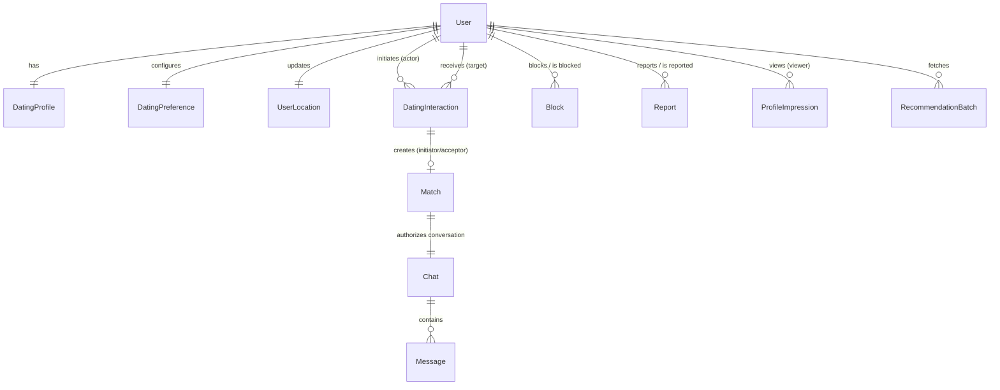
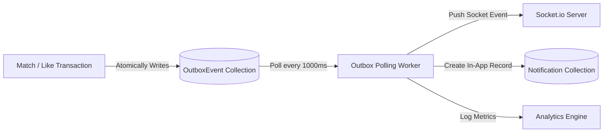

# Research 1: Dating Discovery, Likes & Mutual Matching — Implementation Blueprint

> **Document Type**: Codebase-Specific Architectural Audit & Implementation Blueprint  
> **Status**: COMPLETED AUDIT (READ-ONLY) — PENDING REVIEW BEFORE PROMPT 2  
> **Author**: Senior Backend Architect  
> **Target Project**: Rubaru Mobile Application (`Rubaru`)  
> **Target Scope**: Discovery, Preferences, Protected Location, Interactions (Like/Pass/Undo), Matches, Outbox Events, Safety Exclusions  
> **Date**: 1 September 2026  

---

## Table of Contents

1. [Executive Summary](#1-executive-summary)
2. [Existing Backend Architecture](#2-existing-backend-architecture)
3. [Relevant Existing Files](#3-relevant-existing-files)
4. [Existing Feature Inventory](#4-existing-feature-inventory)
5. [Research 1 Gap Matrix](#5-research-1-gap-matrix)
6. [Existing Model Audit](#6-existing-model-audit)
7. [Proposed Data Model](#7-proposed-data-model)
8. [Index and Unique-Constraint Plan](#8-index-and-unique-constraint-plan)
9. [API Audit](#9-api-audit)
10. [Proposed API Contract](#10-proposed-api-contract)
11. [Authentication and Authorization Audit](#11-authentication-and-authorization-audit)
12. [Transaction and Idempotency Strategy](#12-transaction-and-idempotency-strategy)
13. [Event and Outbox Strategy](#13-event-and-outbox-strategy)
14. [Frontend Consumer Mapping](#14-frontend-consumer-mapping)
15. [Proposed Module and File Structure](#15-proposed-module-and-file-structure)
16. [Implementation Sequence](#16-implementation-sequence)
17. [Testing Strategy](#17-testing-strategy)
18. [Security Risks](#18-security-risks)
19. [Migration and Backward-Compatibility Risks](#19-migration-and-backward-compatibility-risks)
20. [Unresolved Product Decisions](#20-unresolved-product-decisions)
21. [Recommended First Implementation Task](#21-recommended-first-implementation-task)
22. [Final Readiness Assessment](#22-final-readiness-assessment)

---

## 1. Executive Summary

This document presents a comprehensive, read-only architectural audit of the Rubaru Phase 1 backend against the **Research 1: Dating Discovery, Likes and Mutual Matching** specification. 

### Key Findings
1. **Existing Foundation**: The existing backend is a Node.js/Express monolith with MongoDB (via Mongoose) and Socket.io. It supports basic user authentication, simple profile CRUD, a monolithic 2dsphere location query on profiles, basic chat messaging, and basic call logs.
2. **Critical Dating Gaps**:
   - **No Mutual Dealbreaker Logic**: The current discovery endpoint (`/api/profiles/discover/nearby`) only filters by geographical distance radius without evaluating reciprocal gender preference, age dealbreakers, or distance dealbreakers.
   - **Privacy Leaks**: Exact GPS coordinates (`coordinates: [lng, lat]`) and raw birthdates are exposed directly to clients in profile payloads.
   - **No Dating Interaction Lifecycle**: Likes, Passes, Super-likes/Roses, Pass Undos, and 30-day Pass suppression do not exist in the database. A generic unilateral `followProfile` mechanism is currently used as a placeholder.
   - **No Match Entity or ACID Transaction**: Matches do not exist as distinct database records. Unilateral follower arrays are used instead of canonical pair uniqueness (`min(userA, userB):max(userA, userB)`), creating race-condition vulnerabilities.
   - **No Asynchronous Outbox**: Event dispatching and push notifications are currently synchronous or absent.
3. **Recommended Approach**: Implement Research 1 within the existing **Modular Monolith** using MongoDB multi-document transactions, geospatial indexing, and an in-database Transactional Outbox. No microservices, Elasticsearch, or ML are required for MVP.

---

## 2. Existing Backend Architecture

| Architectural Dimension | Current Implementation | Source Evidence |
| :--- | :--- | :--- |
| **Framework & Version** | Express `4.19.2` | `backend/package.json#L14`, `backend/index.js#L2` |
| **Language & Runtime** | JavaScript (Node.js CommonJS, ES6+) | `backend/package.json`, `backend/index.js` |
| **Application Entry Point** | `backend/index.js` | `backend/package.json#L5`, `backend/index.js#L1-L70` |
| **Database & ODM** | MongoDB Atlas with Mongoose `8.5.1` | `backend/package.json#L16`, `backend/config/db.js#L1` |
| **Connection Management** | `mongoose.connect(process.env.MONGO_URI)` with custom Google DNS (`8.8.8.8`, `8.8.4.4`) for Atlas SRV | `backend/config/db.js#L6-L15` |
| **Authentication Method** | Stateless JWT (`jsonwebtoken` `9.0.2`) with `30d` expiration | `backend/controllers/authController.js#L7-L11` |
| **Session / Token Handling** | Bearer Token in `Authorization` header, validated via `backend/middleware/auth.js` | `backend/middleware/auth.js#L8-L23` |
| **Authorization Model** | Role-less user context (`req.user = await User.findById(decoded.id)`) | `backend/middleware/auth.js#L14` |
| **Request Validation** | Ad-hoc manual `if (!field)` checks inside controllers; no schema validator library | `backend/controllers/authController.js#L19` |
| **Error Response Format** | Standardized JSON `{ message: string, error?: string }` via Express error middleware | `backend/index.js#L57-L63` |
| **Logging** | Native `console.log` and `console.error`; no structured logger (e.g. Winston/Pino) | `backend/index.js#L58`, `backend/config/db.js#L7` |
| **Rate Limiting** | Not implemented | `backend/index.js` (No rate-limit middleware present) |
| **API Versioning** | Unversioned prefix `/api/*` (`/api/auth`, `/api/profiles`, `/api/chats`, etc.) | `backend/index.js#L44-L49` |
| **Background Jobs / Workers**| None implemented | Not confirmed from the current codebase |
| **Event System** | None implemented (no event emitter or message broker) | Not confirmed from the current codebase |
| **Real-Time WebSockets** | Socket.io `4.7.5` attached to Express HTTP server | `backend/socket/socketHandler.js#L1-L150` |
| **Push Notifications** | Not implemented (no FCM or APNs client) | Not confirmed from the current codebase |
| **Media Storage** | Local filesystem disk storage via Multer `1.4.5-lts.1` to `backend/uploads/` | `backend/middleware/upload.js#L7-L20` |
| **Testing Framework** | Standalone Node integration test script (`backend/test_all_endpoints.js`) | `backend/package.json#L8`, `backend/test_all_endpoints.js` |
| **Environment Configuration**| `dotenv` `16.4.5` loading `PORT`, `MONGO_URI`, `JWT_SECRET` | `backend/index.js#L1`, `backend/.env` |
| **Deployment Scripts** | `npm run start` (`node index.js`), `npm run dev` (`nodemon index.js`) | `backend/package.json#L6-L9` |

---

## 3. Relevant Existing Files

### 3.1 Backend Files
* `backend/index.js`: Server bootstrap, middleware mounting, route binding, socket initialization.
* `backend/config/db.js`: MongoDB connection establishment with DNS server override.
* `backend/middleware/auth.js`: JWT Bearer authentication verification (`protect`).
* `backend/middleware/upload.js`: Multer disk storage configuration for images and videos.
* `backend/models/User.js`: Account credentials (`email`, `phone`, `password`, `otp`, `points`, `isActive`, `isProfileSetup`).
* `backend/models/Profile.js`: Social profile metadata, GeoJSON `location`, `interests`, `followers`, `following`.
* `backend/models/Chat.js`: Chat thread metadata (`participants`, `isGroup`, `lastMessage`).
* `backend/models/Message.js`: Message content (`sender`, `type`, `text`, `attachmentUri`, `reactions`, `isPoll`).
* `backend/models/Notification.js`: Notification entries (`recipient`, `sender`, `type`, `message`, `isRead`).
* `backend/models/CallLog.js`: Simulated audio/video call log records.
* `backend/controllers/authController.js`: Registration, OTP verification, login, initial profile setup.
* `backend/controllers/profileController.js`: Profile retrieval, profile update, search, nearby geo-discovery, follow toggle.
* `backend/controllers/chatController.js`: Chat listing, message history, message send, poll creation, poll voting.
* `backend/routes/authRoutes.js`: Auth route declarations.
* `backend/routes/profileRoutes.js`: Profile route declarations.
* `backend/routes/chatRoutes.js`: Chat route declarations.
* `backend/socket/socketHandler.js`: Real-time chat messaging and call signaling event handlers.

### 3.2 Frontend Files (Dating & Discovery Touchpoints)
* `src/screens/ConnectionScreen.js`: Explore tab with interactive mockup map and candidate cards.
* `src/screens/HomeScreen.js`: Main discovery feed with user cards and story row.
* `src/screens/ChatsScreen.js`: Active conversation list and empty inbox state.
* `app/chat/[id].js`: Conversation screen with chat messages, emoji reactions, voice notes, and polls.
* `src/screens/InterestsSelectionScreen.js`: Onboarding interest tag picker.
* `src/screens/GenderSelectionScreen.js`: Onboarding gender selector.
* `src/screens/BirthdayPickerScreen.js`: Onboarding date of birth calendar picker.
* `src/screens/BlockedChatsScreen.js`: Blocked users list with unblock flow.
* `src/services/api.js`: Axios client with JWT request/response interceptors.
* `src/services/socket.js`: Socket.io client instance.

---

## 4. Existing Feature Inventory

| Dating / Social Feature | File & Function/Model | Current Responsibility | Data Source | Status | Reusability | Problems / Conflicts |
| :--- | :--- | :--- | :--- | :---: | :---: | :--- |
| **User Account Identity** | `backend/models/User.js` | Stores auth credentials, OTP state, points | MongoDB | Connected | **REUSE & EXTEND** | Lacks account status flags (`SUSPENDED`, `BANNED`) and age verification status. |
| **Social Profile** | `backend/models/Profile.js` | Stores name, bio, birthdate, gender, interests, avatar, photos | MongoDB | Connected | **REFACTOR** | Mixes social following with dating discovery; exposes exact GPS coordinates. |
| **Geospatial Discovery** | `profileController.js` (`getNearbyProfiles`) | Queries profiles within 50km using `$near` | MongoDB `$near` | Connected | **REPLACE** | Only checks distance radius. No mutual eligibility, no dealbreakers, no ranking, no cursor. |
| **Social Follow / Connection** | `profileController.js` (`followProfile`) | Toggles user ID in `followers` and `following` arrays | MongoDB | Connected | **INSUFFICIENT** | Unilateral following cannot serve as a mutual Like/Match dating state machine. |
| **Real-time Chat Threads** | `chatController.js` & `socketHandler.js` | Manages 1-on-1 and group chats, messages, polls | MongoDB + Socket.io | Connected | **REUSE** | Chat creation is unauthenticated against Match status; anyone can initiate a chat. |
| **Simulated Calling** | `callController.js` (`getCallLogs`, `createCallLog`) | Logs calls and emits socket events | MongoDB + Socket.io | Connected | **REUSE** | Ready for match integration. |
| **Blocked Contacts List** | `src/screens/BlockedChatsScreen.js` | UI for viewing and unblocking contacts | Local Mock Array | `FRONTEND_ONLY` | **REPLACE** | No backend `Block` model exists; blocks are not enforced in any backend query. |
| **Safety / Violations Hub** | `src/screens/ViolationsScreen.js`, `ReportProblemScreen.js` | UI for safety guidelines and submitting reports | Local React state | `FRONTEND_ONLY` | **REPLACE** | No backend `Report` or `Violation` models exist. |

---

## 5. Research 1 Gap Matrix

| Research Requirement | Existing Evidence | File Paths | Current Status | Reusable | Missing Work | Risk |
| :--- | :--- | :--- | :---: | :---: | :--- | :---: |
| **Mutual Candidate Eligibility** | None | Not found in codebase | `MISSING` | No | Implement `eligibilityPolicy.js` checking mutual gender, age, and distance in both directions. | **HIGH** |
| **Strict & Flexible Preferences** | None | Not found in codebase | `MISSING` | No | Create `DatingPreference` model with versioning and dealbreaker flags. | **HIGH** |
| **Dealbreakers (Age, Distance, Gender)**| None | Not found in codebase | `MISSING` | No | Add dealbreaker evaluation logic in eligibility policy. | **HIGH** |
| **Protected User Location** | `location` field in `Profile.js` | `backend/models/Profile.js#L45-L55` | `CONFLICTING` | Partial | Move coordinates to `UserLocation` model; strip raw coordinates from API responses. | **CRITICAL** |
| **Geospatial Candidate Retrieval** | `getNearbyProfiles` | `backend/controllers/profileController.js#L143-L175` | `PARTIAL` | Partial | Add pre-filtering by gender, age, and exclusion lists to the geospatial query. | **HIGH** |
| **Discovery Exclusions (Blocks, Passes)**| None | Not found in codebase | `MISSING` | No | Implement exclusion subqueries for active blocks, 30d passes, and existing matches. | **HIGH** |
| **Rule-Based Deterministic Ranking** | Distance sort in `$near` | `backend/controllers/profileController.js#L155` | `MISSING` | No | Create `rankingService.js` computing multi-factor candidate scores. | **MEDIUM** |
| **Opaque Cursor Pagination** | `.limit(50)` without cursor | `backend/controllers/profileController.js#L164` | `MISSING` | No | Implement HMAC/base64 opaque cursor token generation and decoding. | **MEDIUM** |
| **Recommendation Batches** | None | Not found in codebase | `MISSING` | No | Create `RecommendationBatch` model with 1h TTL to track candidate exposure. | **LOW** |
| **Profile-Impression Tracking** | None | Not found in codebase | `MISSING` | No | Create `ProfileImpression` model and `POST /v1/discovery/impressions` endpoint. | **LOW** |
| **Likes on Photos / Prompts** | `followProfile` placeholder | `backend/controllers/profileController.js#L94-L141` | `MISSING` | No | Create `DatingInteraction` model with `targetElement` (`PHOTO`, `PROMPT`, `BIO`). | **HIGH** |
| **Optional Like Comments** | None | Not found in codebase | `MISSING` | No | Add `comment` field (max 280 chars) to `DatingInteraction`. | **LOW** |
| **Pass Action & 30d Suppression** | None | Not found in codebase | `MISSING` | No | Create `POST /v1/discovery/pass` storing `PASS` interaction with 30-day query filter. | **MEDIUM** |
| **Undo Pass** | None | Not found in codebase | `MISSING` | No | Create `POST /v1/discovery/undo` restoring only the latest pass within 5 minutes. | **MEDIUM** |
| **Roses / Super Likes** | None | Not found in codebase | `MISSING` | No | Add `ROSE` interaction type with priority queue ordering. | **LOW** |
| **Priority Likes** | None | Not found in codebase | `MISSING` | No | Add `PRIORITY` interaction type. | **LOW** |
| **Incoming Likes Queue** | None | Not found in codebase | `MISSING` | No | Implement `GET /v1/likes/incoming` with cursor pagination. | **HIGH** |
| **Like Acceptance** | None | Not found in codebase | `MISSING` | No | Implement `POST /v1/likes/:id/accept` triggering atomic Match creation. | **CRITICAL** |
| **Like Rejection / Decline** | None | Not found in codebase | `MISSING` | No | Implement `POST /v1/likes/:id/decline` updating status to `DECLINED`. | **MEDIUM** |
| **Atomic Mutual Match Creation** | None | Not found in codebase | `MISSING` | No | Implement MongoDB replica-set transaction in `matchService.js`. | **CRITICAL** |
| **Canonical Match Pair Uniqueness** | None | Not found in codebase | `MISSING` | No | Add unique index on `Match.canonicalPair` (`min(id1, id2):max(id1, id2)`). | **CRITICAL** |
| **Match-Authorized Conversation** | Unprotected `Chat.js` | `backend/models/Chat.js` | `CONFLICTING` | Partial | Link `Chat` to `Match` ID and enforce active Match authorization in chat middleware. | **CRITICAL** |
| **Unmatching** | None | Not found in codebase | `MISSING` | No | Implement `POST /v1/matches/:id/unmatch` closing Match and archiving Chat. | **HIGH** |
| **User Blocking (Bilateral)** | Frontend mock in `BlockedChatsScreen`| `src/screens/BlockedChatsScreen.js` | `MISSING` | No | Create `Block` model and enforce bilateral exclusion across discovery, likes, and chats.| **CRITICAL** |
| **User Reporting** | Frontend form in `ReportProblemScreen`| `src/screens/ReportProblemScreen.js` | `MISSING` | No | Create `Report` model and `POST /v1/users/:id/report` endpoint. | **HIGH** |
| **Daily Free Like Limit** | None | Not found in codebase | `MISSING` | No | Implement server-side check capping free likes at 25 per 24 hours. | **HIGH** |
| **Premium Entitlements** | User points balance | `backend/models/User.js#L26-L29` | `PARTIAL` | Partial | Integrate points deduction for extra Likes / Roses. | **MEDIUM** |
| **Idempotent Write Handling** | None | Not found in codebase | `MISSING` | No | Add `Idempotency-Key` header validation and unique index on `idempotencyKey`. | **HIGH** |
| **Transactional Outbox Engine** | None | Not found in codebase | `MISSING` | No | Create `OutboxEvent` model and background polling worker. | **HIGH** |
| **Dating Analytics Events** | None | Not found in codebase | `MISSING` | No | Emit outbox events for `profile.impression`, `like.created`, `match.created`. | **LOW** |
| **Privacy-Safe Discovery Responses**| Raw coordinates returned | `backend/controllers/profileController.js#L16-L32` | `CONFLICTING` | No | Mask coordinates and birthdate; return only approximate `distanceLabel` and `age`.| **CRITICAL** |

---

## 6. Existing Model Audit

### 6.1 `User` (`backend/models/User.js`)
* **Existing Fields**: `email`, `phone`, `password`, `otp` (`code`, `expiresAt`), `points` (default 250), `isActive`, `isProfileSetup`, timestamps.
* **Missing Fields**: `accountStatus` (`ACTIVE`, `SUSPENDED`, `BANNED`, `DELETED`), `isAgeVerified`, `roles`.
* **Recommendation**: **EXTEND**. Retain existing auth fields and add account lifecycle flags.
* **Migration Risk**: Low. Backward compatible.

### 6.2 `Profile` (`backend/models/Profile.js`)
* **Existing Fields**: `user` (ref User), `displayName`, `dateOfBirth`, `gender`, `interests`, `avatarUri`, `photos`, `bio`, `locationName`, `location` (GeoJSON Point with 2dsphere index), `followers`, `following`, timestamps.
* **Problems**: 
  - Mixes social media follower architecture with dating attributes.
  - Exposes raw GPS coordinates in public queries.
* **Recommendation**: **EXTEND & REFACTOR**. Split dating-specific properties into `DatingProfile`, `DatingPreference`, and `UserLocation` while maintaining `Profile` for general social/app info during transition.
* **Migration Risk**: Medium. Requires data backfill script.

### 6.3 `Chat` & `Message` (`backend/models/Chat.js`, `backend/models/Message.js`)
* **Existing Fields**: `participants`, `isGroup`, `groupName`, `lastMessage` (Chat); `chat`, `sender`, `type`, `text`, `attachmentUri`, `reactions`, `isPoll` (Message).
* **Missing Fields**: `match` (ObjectId ref Match) on `Chat`; `status` (`ACTIVE`, `ARCHIVED_UNMATCHED`, `BLOCKED`).
* **Recommendation**: **EXTEND**. Add `match` reference and `status` to `Chat`. Gate messaging access on active match status.
* **Migration Risk**: Low.

### 6.4 Missing Required Entities
The following models have no existing implementation in the backend and must be created:
1. `DatingProfile.js`: Public dating card projection, verified age, prompts, dating intentions.
2. `DatingPreference.js`: Versioned user filters, age/distance boundaries, and strict dealbreaker flags.
3. `UserLocation.js`: Protected coordinate store with 2dsphere index and velocity monitoring.
4. `DatingInteraction.js`: Immutable store for Likes, Passes, Roses, and Undos with idempotency keys.
5. `Match.js`: Canonical match pair record with status lifecycle.
6. `Block.js`: Bilateral block exclusions.
7. `Report.js`: Immutable moderation case records.
8. `ProfileImpression.js`: Recommendation visibility telemetry.
9. `RecommendationBatch.js`: Opaque cursor batch session store.
10. `OutboxEvent.js`: Database-to-event reliable publication table.

---

## 7. Proposed Data Model



---

## 8. Index and Unique-Constraint Plan

| Model | Index Definition | Index Type | Business / Technical Purpose |
| :--- | :--- | :--- | :--- |
| `DatingProfile` | `{ user: 1 }` | **Unique** | Enforces single active dating profile per user. |
| `DatingProfile` | `{ isDiscoverable: 1, gender: 1, age: 1 }` | **Compound** | High-performance candidate pre-filtering. |
| `DatingPreference` | `{ user: 1 }` | **Unique** | Single active preference set per user. |
| `UserLocation` | `{ user: 1 }` | **Unique** | One protected location record per user. |
| `UserLocation` | `{ location: '2dsphere' }` | **Geospatial** | Efficient spherical bounding queries (`$nearSphere` / `$geoWithin`). |
| `DatingInteraction` | `{ idempotencyKey: 1 }` | **Unique** | Prevents duplicate write execution on network retries. |
| `DatingInteraction` | `{ actor: 1, target: 1, type: 1 }` | **Compound** | Prevents duplicate active interactions on the same target. |
| `DatingInteraction` | `{ target: 1, status: 1, createdAt: -1 }` | **Compound** | Fast retrieval of incoming Likes queue. |
| `Match` | `{ canonicalPair: 1 }` | **Unique** | **CRITICAL**: Guarantees zero duplicate matches per pair (`lowerId:higherId`). |
| `Match` | `{ users: 1, status: 1 }` | **Compound** | Fast retrieval of user's active matches list. |
| `Block` | `{ blocker: 1, blocked: 1 }` | **Unique** | Prevents duplicate block records. |
| `Block` | `{ blocked: 1, blocker: 1 }` | **Compound** | Fast bilateral exclusion check in discovery. |
| `OutboxEvent` | `{ status: 1, nextAttemptAt: 1 }` | **Compound** | Outbox background worker polling cursor. |
| `RecommendationBatch`| `{ batchId: 1 }` | **Unique** | Fast validation of opaque pagination cursor. |
| `RecommendationBatch`| `{ expiresAt: 1 }` | **TTL (1 hour)** | Automatic cleanup of stale recommendation batches. |

---

## 9. API Audit

| Method | Existing Endpoint | Calling File | Auth | Current Request Payload | Current Response | Status | Research 1 Replacement |
| :--- | :--- | :--- | :---: | :--- | :--- | :---: | :--- |
| `GET` | `/api/profiles/discover/nearby` | `ConnectionScreen.js` | JWT | Query params (`radius`) | Array of full Profile objects (with raw coords) | `CONFLICTING` | `GET /v1/discovery/candidates` |
| `POST`| `/api/profiles/:userId/follow` | `HomeScreen.js` | JWT | None | `{ message: 'Followed/Unfollowed' }` | `CONFLICTING` | `POST /v1/likes` |
| `GET` | `/api/profiles/search` | `SearchUsersScreen.js`| JWT | Query `?q=...` | Array of Profile objects | `PARTIAL` | Retain for username search; separate from dating discovery. |
| `GET` | `/api/profiles/:userId` | `user-profile.js` | JWT | None | Full Profile object (includes birthdate & coords) | `CONFLICTING` | Sanitize; expose public projection via `GET /v1/discovery/candidates`. |
| `PUT` | `/api/profiles/edit` | `EditProfileScreen.js` | JWT | Multipart form data | Updated Profile object | `PARTIAL` | Split into `PUT /v1/dating/location` and `PATCH /v1/dating/preferences`. |
| `GET` | `/api/chats` | `ChatsScreen.js` | JWT | None | Array of Chat objects | `PARTIAL` | `GET /v1/matches` (Matches view) + `GET /api/chats` (Chat list). |
| `POST`| `/api/chats/message` | `app/chat/[id].js` | JWT | Form / JSON message | Created Message object | `PARTIAL` | Add Match authorization check before creating message. |

---

## 10. Proposed API Contract

### 10.1 Discovery & Impressions
* `GET /v1/discovery/candidates?cursor=<opaque_token>&limit=10`: Returns candidate cards with `recommendationId`, fuzzed `distanceLabel`, age, prompts, and `availableActions` (`LIKE`, `PASS`, `ROSE`).
* `POST /v1/discovery/impressions`: Logs an array of viewed candidate IDs with batch ID, position, and client timestamp.
* `POST /v1/discovery/pass`: Registers a 30-day suppression pass on `candidateId`.
* `POST /v1/discovery/undo`: Restores the single most recent pass within 5 minutes.

### 10.2 Interactions & Matches
* `POST /v1/likes`: Creates a `PENDING` Like with `targetElement` (`PHOTO`/`PROMPT`), optional `comment`, and `Idempotency-Key`.
* `GET /v1/likes/incoming?cursor=<token>&limit=10`: Returns received pending Likes with sender card and target element.
* `POST /v1/likes/:id/accept`: Transactionally creates a canonical `Match`, initializes `Chat`, and writes an outbox event.
* `POST /v1/likes/:id/decline`: Closes incoming Like and applies suppression.
* `DELETE /v1/likes/:id`: Withdraws an outgoing pending Like.
* `GET /v1/matches`: Lists active matches with matched user summary and chat link.
* `GET /v1/matches/:id`: Retrieves match details.
* `POST /v1/matches/:id/unmatch`: Sets match status to `UNMATCHED` and disables chat.

### 10.3 Preferences, Location & Safety
* `GET /v1/dating/preferences`: Returns authenticated user's current dating preferences.
* `PATCH /v1/dating/preferences`: Updates age range, distance bounds, gender preferences, and dealbreaker flags.
* `PUT /v1/dating/location`: Authenticated location coordinate update with velocity sanity validation.
* `POST /v1/users/:id/block`: Bilateral block insertion and immediate discovery/chat exclusion.
* `DELETE /v1/users/:id/block`: Unblocks user if permitted.
* `POST /v1/users/:id/report`: Creates an immutable moderation report.

---

## 11. Authentication and Authorization Audit

| Severity | Problem | Evidence | Affected Flow | Required Correction |
| :--- | :--- | :--- | :--- | :--- |
| **CRITICAL** | **Exact Coordinates & DOB Leaked in Public Profile API** | `backend/controllers/profileController.js#L23-L32` returns full profile document including `location.coordinates` and `dateOfBirth`. | Profile View, Discovery | Strip `location` coordinates and exact `dateOfBirth`; return calculated `age` and masked `distanceLabel`. |
| **CRITICAL** | **Unauthenticated Chat Creation** | `backend/controllers/chatController.js` allows creating or joining chats between any two user IDs without verifying an active Match. | Chat & Messaging | Require active `Match` record in `status: 'ACTIVE'` before creating or sending messages. |
| **HIGH** | **No Bilateral Block Enforcement** | `backend/controllers/profileController.js` and `chatController.js` have zero block checks. | Discovery, Chat, Calls | Add bilateral block checks to discovery candidate filtering, message delivery, and calling. |
| **HIGH** | **Client-Controlled Unilateral Following** | `backend/controllers/profileController.js#L94-L141` modifies follower arrays without mutual consent or limits. | Connections | Replace `followProfile` with server-governed Like/Match interaction lifecycle. |
| **MEDIUM** | **Missing Daily Rate / Velocity Limits** | `backend/controllers/authController.js` and `profileController.js` have no rate limiting on writes. | Auth, Interactions | Implement rate limiters on `POST /v1/likes` (25/day) and login attempts. |

---

## 12. Transaction and Idempotency Strategy

### 12.1 MongoDB Replica-Set Transactions
Because Rubaru connects to MongoDB Atlas (`mongodb+srv://...`), multi-document ACID transactions are natively supported.

#### Atomic Like-to-Match Flow:
```javascript
const session = await mongoose.startSession();
session.startTransaction({
  readConcern: { level: 'majority' },
  writeConcern: { w: 'majority' }
});

try {
  // 1. Validate incoming Like is still PENDING
  const like = await DatingInteraction.findOne({
    _id: likeId,
    target: currentUserId,
    status: 'PENDING'
  }).session(session);

  if (!like) throw new Error('Like not found or already processed');

  // 2. Compute canonical pair
  const [lowerId, higherId] = [like.actor.toString(), currentUserId.toString()].sort();
  const canonicalPair = `${lowerId}:${higherId}`;

  // 3. Mark Like as ACCEPTED
  like.status = 'ACCEPTED';
  await like.save({ session });

  // 4. Create or activate Chat
  let chat = await Chat.findOne({ participants: { $all: [lowerId, higherId] }, isGroup: false }).session(session);
  if (!chat) {
    const [newChat] = await Chat.create([{
      participants: [lowerId, higherId],
      isGroup: false
    }], { session });
    chat = newChat;
  }

  // 5. Insert canonical Match (Unique constraint prevents concurrent duplicates)
  const [match] = await Match.create([{
    canonicalPair,
    users: [lowerId, higherId],
    status: 'ACTIVE',
    initiatorInteraction: like._id,
    conversation: chat._id
  }], { session });

  // 6. Write Transactional Outbox Event
  await OutboxEvent.create([{
    eventId: uuidv4(),
    eventType: 'match.created',
    payload: { matchId: match._id, userA: lowerId, userB: higherId, conversationId: chat._id }
  }], { session });

  // 7. Commit
  await session.commitTransaction();
} catch (error) {
  await session.abortTransaction();
  throw error;
} finally {
  session.endSession();
}
```

### 12.2 Idempotency Key Middleware
An Express middleware will intercept `Idempotency-Key` headers on write routes (`POST /v1/likes`, `POST /v1/likes/:id/accept`, `POST /v1/discovery/pass`). If a key exists in the database, the cached response is returned immediately.

---

## 13. Event and Outbox Strategy



### Outbox Event Types:
* `profile.impression`: Recorded when candidate cards become visible on mobile.
* `profile.passed`: Triggers candidate suppression index updates.
* `like.created`: Generates incoming like notification for recipient.
* `match.created`: Emits `new_match` socket event to both users and creates in-app notification.
* `match.unmatched`: Emits `match_closed` event and disables chat socket room.
* `user.blocked`: Evicts users from mutual chat rooms and blacklists discovery.

---

## 14. Frontend Consumer Mapping

| Frontend Feature | Screen / File | Current Data Source | Expected API | Integration Change Required |
| :--- | :--- | :--- | :--- | :--- |
| **Discovery Feed** | `src/screens/HomeScreen.js` | Hardcoded `feedCardsData` | `GET /v1/discovery/candidates` | Replace mock feed state with API fetch hook. |
| **Interactive Map Explore** | `src/screens/ConnectionScreen.js` | Hardcoded mock map markers | `GET /v1/discovery/candidates` | Populate POI markers from fuzzed candidate list. |
| **Dating Filters Modal** | `DiscoverFiltersModal.js` | Local React state | `GET / PATCH /v1/dating/preferences` | Bind age/distance sliders and dealbreakers to backend. |
| **Send Like / Comment** | `src/screens/HomeScreen.js` | Local heart toggle | `POST /v1/likes` | Dispatch Like API request with target element and idempotency key. |
| **Pass Profile** | `src/screens/HomeScreen.js` | Local array filter | `POST /v1/discovery/pass` | Send Pass request to backend to register 30d suppression. |
| **Undo Pass** | `src/screens/HomeScreen.js` | None | `POST /v1/discovery/undo` | Add Undo button triggering pass restoration endpoint. |
| **Incoming Likes List** | `src/screens/NotificationScreen.js` | Hardcoded `notificationsData` | `GET /v1/likes/incoming` | Render received likes queue with Accept/Decline actions. |
| **Match Acceptance** | `src/screens/NotificationScreen.js` | None | `POST /v1/likes/:id/accept` | Trigger atomic match creation and navigate to chat. |
| **Matches Directory** | `src/screens/ChatsScreen.js` | Hardcoded `storiesData` | `GET /v1/matches` | Display active matched user avatars at top of inbox. |
| **Blocked Users** | `src/screens/BlockedChatsScreen.js`| Hardcoded `INITIAL_BLOCKED_USERS`| `GET / DELETE /v1/users/:id/block` | Connect blocked user list and unblock button to backend. |
| **Report Problem / User** | `src/screens/ReportProblemScreen.js`| Local form state | `POST /v1/users/:id/report` | Submit formal report ticket with category and evidence. |

---

## 15. Proposed Module and File Structure

```
backend/
├── config/
│   ├── db.js                           # [EXISTING] MongoDB connection
│   └── datingConfig.js                 # [NEW] Weights, limits, suppression rules
├── controllers/
│   ├── authController.js               # [EXISTING] Auth controller
│   ├── discoveryController.js          # [NEW] Candidate retrieval, batching, impressions
│   ├── preferenceController.js         # [NEW] Dating preferences CRUD
│   ├── interactionController.js        # [NEW] Like, Pass, Undo, Incoming Likes
│   ├── matchController.js              # [NEW] Accept Like, Match creation, Unmatch
│   ├── safetyController.js             # [NEW] Block, Report, Blocklist
│   ├── locationController.js           # [NEW] Protected location updates
│   ├── profileController.js            # [EXISTING] General profile controller (sanitized)
│   ├── chatController.js               # [EXISTING] Chat controller (match-gated)
│   ├── callController.js               # [EXISTING] Call controller
│   ├── reelController.js               # [EXISTING] Reel controller
│   └── notifController.js              # [EXISTING] Notification controller
├── middleware/
│   ├── auth.js                         # [EXISTING] JWT middleware
│   ├── upload.js                       # [EXISTING] Multer upload
│   └── idempotency.js                  # [NEW] Idempotency-Key validation middleware
├── models/
│   ├── User.js                         # [EXISTING] Extended with accountStatus & ageCheck
│   ├── DatingProfile.js                # [NEW] Dating card projection, prompts, intentions
│   ├── DatingPreference.js             # [NEW] Versioned filters and dealbreakers
│   ├── UserLocation.js                 # [NEW] Protected GeoJSON location
│   ├── DatingInteraction.js            # [NEW] Likes, passes, roses with idempotency
│   ├── Match.js                        # [NEW] Canonical match pairs
│   ├── Block.js                        # [NEW] Bilateral block records
│   ├── Report.js                       # [NEW] Moderation reports
│   ├── ProfileImpression.js            # [NEW] Impression analytics
│   ├── RecommendationBatch.js          # [NEW] Opaque cursor batches
│   ├── OutboxEvent.js                  # [NEW] Transactional event outbox
│   ├── Chat.js                         # [EXISTING] Linked to Match
│   ├── Message.js                      # [EXISTING] Message model
│   ├── CallLog.js                      # [EXISTING] Call log model
│   ├── Notification.js                 # [EXISTING] Notification model
│   └── Reel.js                         # [EXISTING] Reel model
├── routes/
│   ├── authRoutes.js                   # [EXISTING] Auth routes
│   ├── datingRoutes.js                 # [NEW] Preferences, Location, Discovery, Interactions, Matches
│   ├── safetyRoutes.js                 # [NEW] Block and Report routes
│   ├── profileRoutes.js                # [EXISTING] Profile routes
│   ├── chatRoutes.js                   # [EXISTING] Chat routes
│   ├── callRoutes.js                   # [EXISTING] Call routes
│   ├── reelRoutes.js                   # [EXISTING] Reel routes
│   └── notifRoutes.js                  # [EXISTING] Notification routes
├── services/
│   ├── eligibilityPolicy.js            # [NEW] Bilateral eligibility validation service
│   ├── rankingService.js               # [NEW] Deterministic candidate scoring
│   ├── locationService.js              # [NEW] Geo distance & privacy masking
│   ├── matchService.js                 # [NEW] Atomic match transaction service
│   └── outboxWorker.js                 # [NEW] Outbox processor background worker
└── test/
    ├── eligibility.test.js             # [NEW] Policy unit tests
    ├── matching_concurrency.test.js    # [NEW] Concurrent match race tests
    └── dating_integration.test.js      # [NEW] Full journey integration test
```

---

## 16. Implementation Sequence

The implementation is structured into 15 sequential steps across future prompts:

```
[1. Models & Indexes] ──> [2. Preferences] ──> [3. Protected Location] ──> [4. Eligibility Policy]
        │
        ▼
[5. Discovery & Ranking] ──> [6. Batches & Impressions] ──> [7. Pass & Undo] ──> [8. Likes & Limits]
        │
        ▼
[9. Incoming Likes] ──> [10. Atomic Match Creation] ──> [11. Match Chat Gating] ──> [12. Block & Report]
        │
        ▼
[13. Outbox & Worker] ──> [14. Frontend API Integration] ──> [15. Test Suite & Verification]
```

### Detailed Step Breakdown:
1. **Database Models & Indexes**: Add `DatingProfile`, `DatingPreference`, `UserLocation`, `DatingInteraction`, `Match`, `Block`, `Report`, `OutboxEvent`, `ProfileImpression`, `RecommendationBatch` with unique composite indexes.
2. **Dating Preferences**: Implement `GET /v1/dating/preferences` and `PATCH /v1/dating/preferences` with validation.
3. **Protected Location**: Implement `PUT /v1/dating/location` with velocity checks and coordinate privacy firewall.
4. **Eligibility Policy**: Build `eligibilityPolicy.js` enforcing mutual gender, age, distance, and bilateral block gates.
5. **Discovery Query & Rule-Based Ranking**: Implement `GET /v1/discovery/candidates` with `$nearSphere` retrieval and multi-factor scoring.
6. **Batches & Impressions**: Implement opaque cursor pagination and `POST /v1/discovery/impressions`.
7. **Pass & Undo**: Implement `POST /v1/discovery/pass` (30d suppression) and `POST /v1/discovery/undo`.
8. **Likes & Daily Limits**: Implement `POST /v1/likes` (Standard/Rose/Priority) with 25/day limit and idempotency.
9. **Incoming Likes Queue**: Implement `GET /v1/likes/incoming` with sender cards and target element preview.
10. **Atomic Match Creation**: Implement `POST /v1/likes/:id/accept` with MongoDB replica-set transaction and canonical pair uniqueness.
11. **Match-Authorized Conversations**: Link `Chat` to `Match` and enforce active match status in messaging.
12. **Unmatch, Block & Report Enforcement**: Implement unmatch, bilateral block exclusion, and safety report creation.
13. **Outbox Engine & Notification Dispatcher**: Build `outboxWorker.js` background processor.
14. **Frontend API Integration**: Connect React Native screens (`HomeScreen`, `ConnectionScreen`, `ChatsScreen`) to `/v1/` endpoints.
15. **Integration & Concurrency Testing**: Execute full test suite covering race conditions and edge cases.

---

## 17. Testing Strategy

1. **Unit Tests (`test/eligibility.test.js`)**:
   - `testMutualGenderEligibility()`: Verify male-female, same-sex, and non-binary mutual pass/fail combinations.
   - `testAgeDealbreaker()`: Verify candidate rejected when viewer age violates candidate dealbreaker.
   - `testDistanceDealbreaker()`: Verify candidate rejected when distance exceeds maximum dealbreaker bounds.
   - `testBilateralBlockExclusion()`: Verify candidate blocked in either direction is excluded.
2. **Concurrency & Race Condition Tests (`test/matching_concurrency.test.js`)**:
   - `testConcurrentAccepts()`: Two concurrent accepts on the same pair must produce exactly 1 Match and 1 Chat.
   - `testIdempotentLike()`: 5 parallel requests with the same `Idempotency-Key` execute the write only once.
3. **Integration Tests (`test/dating_integration.test.js`)**:
   - Register 2 users -> Configure preferences -> Update location -> Discover -> Send Like -> Check incoming Likes -> Accept Like -> Verify Match created -> Send Chat message -> Unmatch -> Verify chat disabled.

---

## 18. Security Risks

1. **Location Tracking / Stalking**: Exact GPS coordinates must never be sent to the client. The backend must enforce privacy masking at the serialization layer.
2. **Actor ID Forgery**: The actor identity must always be derived from `req.user._id` via the validated JWT token; request body `actorId` must never be trusted.
3. **Like Flooding / Scraping**: Enforce rate limits (25 likes/day) and opaque pagination cursors to prevent automated user scraping.
4. **Idempotency Collisions**: Enforce UUIDv4 format validation on all incoming `Idempotency-Key` headers.

---

## 19. Migration and Backward-Compatibility Risks

1. **Dual System Operation**: Legacy `/api/profiles` routes must remain operational while `/v1/` dating routes are introduced.
2. **Profile Data Backfill**: Existing users in `User` and `Profile` collections must be backfilled with default `DatingProfile`, `DatingPreference`, and `UserLocation` records.
3. **Zero Frontend Breaking Changes**: Frontend screen updates will occur module-by-module to ensure continuous stability.

---

## 20. Unresolved Product Decisions

| # | Product Decision | Technical Impact | Proposed Safe Default | Owner Approval Mandatory? |
| :---: | :--- | :--- | :--- | :---: |
| **1** | **Free Daily Like Limit** | Rate limiter in `POST /v1/likes` | 25 Likes per 24 hours | **Yes** |
| **2** | **Pass Suppression Window** | TTL filter on `DatingInteraction` pass query | 30 days | **Yes** |
| **3** | **Unmatch Rediscovery** | Discovery query exclusion filter | Never rediscover unmatches | **Yes** |
| **4** | **Pass Undo Allowance** | Undo validation window in `POST /v1/discovery/undo`| 1 most recent pass within 5 min | **Yes** |
| **5** | **Expired Likes Handling** | Expiration worker query | 14 days TTL | **Yes** |
| **6** | **Relationship Intention Matrix** | Scoring compatibility in `rankingService.js` | Defined compatibility matrix | **Yes** |

---

## 21. Recommended First Implementation Task

> **Task 1 for Prompt 2**: Create the core database models ([`DatingProfile.js`](file:///r:/Rubaru/backend/models/DatingProfile.js), [`DatingPreference.js`](file:///r:/Rubaru/backend/models/DatingPreference.js), [`UserLocation.js`](file:///r:/Rubaru/backend/models/UserLocation.js), [`DatingInteraction.js`](file:///r:/Rubaru/backend/models/DatingInteraction.js), [`Match.js`](file:///r:/Rubaru/backend/models/Match.js), [`Block.js`](file:///r:/Rubaru/backend/models/Block.js), [`Report.js`](file:///r:/Rubaru/backend/models/Report.js), [`OutboxEvent.js`](file:///r:/Rubaru/backend/models/OutboxEvent.js), [`ProfileImpression.js`](file:///r:/Rubaru/backend/models/ProfileImpression.js), [`RecommendationBatch.js`](file:///r:/Rubaru/backend/models/RecommendationBatch.js)) and register their unique compound indexes.

---

## 22. Final Readiness Assessment

* **Architecture Decision**: The existing Node.js / Express / MongoDB Atlas stack is **100% ready** to support Research 1 within a clean Modular Monolith.
* **Database Readiness**: MongoDB Atlas replica-set environment supports the required ACID multi-document transactions and 2dsphere geospatial indexing.
* **Codebase State**: Read-only audit complete. No files were modified, no schemas altered, and no environment secrets exposed.

---

*End of Implementation Blueprint.*
