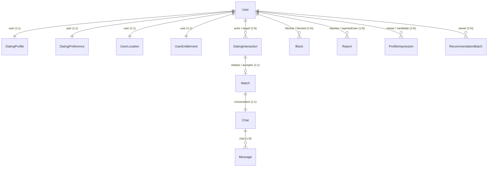

# Research 1: Prompt 2 — Database Implementation Report

> **Document Version**: 1.0.0  
> **Status**: COMPLETED & VERIFIED AGAINST MONGODB ATLAS  
> **Author**: Senior Backend Engineer  
> **Target Scope**: Data Layer Foundation (Models, Enums, Unique Constraints, Geospatial Indexes, Safe Migrations, Model Tests)  
> **Date**: 1 September 2026  

---

## 1. Summary of Changes

In accordance with **Research 1: Dating Discovery, Likes & Mutual Matching** and the approved **Implementation Blueprint**, the database foundation for the dating core has been implemented without modifying API routes, controllers, or frontend contracts.

Key deliverables completed:
* **Shared Enums**: Created centralized `backend/models/enums.js` defining interaction types, statuses, match lifecycles, and report categories.
* **Separation of Protected Location & Public Data**: Created `UserLocation` (protected `2dsphere` store) and `DatingProfile` (public dating card projection with verified age, prompts, and intentions).
* **Dating Preferences & Dealbreakers**: Created `DatingPreference` enforcing dealbreaker flags, age bounds (`min <= max`), and distance limits.
* **Idempotent Interactions**: Created `DatingInteraction` enforcing unique `idempotencyKey` constraints, self-interaction prevention, and 280-character comment limits.
* **Canonical Match Uniqueness**: Created `Match` enforcing deterministic canonical sorting (`user1 < user2`) and unique index on `canonicalPair` (`lowerId:higherId`) to prevent concurrent duplicate matches.
* **Telemetry & Session Batches**: Created `ProfileImpression` (preventing duplicate logging and self-impressions) and `RecommendationBatch` (with 1-hour automatic TTL expiration).
* **Transactional Outbox**: Created `OutboxEvent` with unique deduplication constraint for future atomic Match event dispatching.
* **Safety & Moderation**: Created `Block` (with bilateral lookup indexes) and `Report` (with moderation status queues).
* **Safe Idempotent Migration**: Implemented `backend/migrations/001_backfill_dating_entities.js` backfilling 12 existing users with zero data loss or conflicts.
* **Model-Level Test Suite**: Created `backend/test/model_level_tests.js` executing 18 model-level assertions with 100% pass rate.

---

## 2. Database Technology Used

* **Database Engine**: MongoDB Atlas (Replica Set Cluster `cluster0.1meot8l.mongodb.net`).
* **Object Data Modeling (ODM)**: Mongoose `^8.5.1`.
* **Geospatial Engine**: MongoDB GeoJSON 2dsphere spherical geometry.
* **Transaction Engine**: Multi-document ACID Transactions supported via MongoDB Replica Set (`session.startTransaction()`).

---

## 3. Models Reused

* `backend/models/Message.js`: Reused for chat message persistence.
* `backend/models/CallLog.js`: Reused for call logging.
* `backend/models/Notification.js`: Reused for in-app activity notifications.
* `backend/models/Reel.js`: Reused for vertical social reels.

---

## 4. Models Created

| Model Name | File Path | Primary Responsibility |
| :--- | :--- | :--- |
| **`enums.js`** | `backend/models/enums.js` | Shared frozen enums (`InteractionTypes`, `MatchStatuses`, `OutboxStatuses`, etc.). |
| **`DatingProfile`** | `backend/models/DatingProfile.js` | Public dating projection, verified age, prompts, dating intentions. |
| **`DatingPreference`** | `backend/models/DatingPreference.js` | Versioned filters, age ranges, distance bounds, and strict dealbreaker flags. |
| **`UserLocation`** | `backend/models/UserLocation.js` | Protected GeoJSON Point with `2dsphere` index and velocity monitoring. |
| **`DatingInteraction`**| `backend/models/DatingInteraction.js` | Idempotent Likes, Passes, Roses with target elements and comments. |
| **`Match`** | `backend/models/Match.js` | Canonical pair uniqueness (`user1 < user2`) and match lifecycle. |
| **`Block`** | `backend/models/Block.js` | Bilateral block exclusions with reverse lookup indexes. |
| **`Report`** | `backend/models/Report.js` | Immutable moderation cases with categorization and review queues. |
| **`ProfileImpression`**| `backend/models/ProfileImpression.js` | Telemetry for confirmed recommendation visibility. |
| **`RecommendationBatch`**| `backend/models/RecommendationBatch.js` | Opaque cursor batch session store with TTL auto-cleanup. |
| **`OutboxEvent`** | `backend/models/OutboxEvent.js` | Transactional event outbox table with deduplication keys. |
| **`UserEntitlement`**| `backend/models/UserEntitlement.js` | Server-controlled daily limits, rose balances, and premium tiers. |

---

## 5. Models Extended

* **`backend/models/User.js`**: Safely extended with `accountStatus` (`'ACTIVE'`, `'SUSPENDED'`, `'BANNED'`, `'DELETED'`) and `isAgeVerified` (Boolean).
* **`backend/models/Chat.js`**: Safely extended with `match` (ref Match) and `status` (`'ACTIVE'`, `'ARCHIVED'`, `'BLOCKED'`, `'CLOSED'`).

---

## 6. Fields and Relationships



---

## 7. Enum and Shared-Type Changes

All enums are defined in `backend/models/enums.js`:
* `InteractionTypes`: `LIKE`, `PASS`, `ROSE`, `PRIORITY_LIKE`, `REMOVE`.
* `InteractionStatuses`: `PENDING`, `ACCEPTED`, `DECLINED`, `WITHDRAWN`, `EXPIRED`, `INVALIDATED`.
* `MatchStatuses`: `ACTIVE`, `UNMATCHED`, `BLOCKED`, `CLOSED_BY_MODERATION`, `USER_DELETED`.
* `OutboxStatuses`: `PENDING`, `PROCESSING`, `PROCESSED`, `FAILED`.
* `DatingIntentions`: `LONG_TERM`, `SHORT_TERM`, `LONG_TERM_OPEN_TO_SHORT`, `CASUAL`, `FRIENDSHIP`, `NOT_SURE`.
* `Genders`: `Female`, `Male`, `Non-Binary`, `Other`.
* `TargetElementTypes`: `PHOTO`, `PROMPT`, `BIO`, `PROFILE`.
* `ReportCategories`: `HARASSMENT`, `FAKE_PROFILE`, `INAPPROPRIATE_CONTENT`, `SCAM_OR_SPAM`, `UNDERAGE`, `OTHER`.
* `AccountStatuses`: `ACTIVE`, `SUSPENDED`, `BANNED`, `DELETED`.

---

## 8. Index Matrix

| Model | Fields | Index Type | Unique | Purpose | Query Supported |
| :--- | :--- | :--- | :---: | :--- | :--- |
| `DatingProfile` | `{ user: 1 }` | Standard | **YES** | 1:1 Profile association | `DatingProfile.findOne({ user })` |
| `DatingProfile` | `{ isDiscoverable: 1, gender: 1, age: 1 }` | Compound | NO | Candidate pre-filtering | Candidate pool retrieval |
| `DatingPreference` | `{ user: 1 }` | Standard | **YES** | 1:1 Preference association | `DatingPreference.findOne({ user })` |
| `UserLocation` | `{ user: 1 }` | Standard | **YES** | 1:1 Location association | `UserLocation.findOne({ user })` |
| `UserLocation` | `{ location: '2dsphere' }` | Geospatial | NO | Geospatial radius query | `$nearSphere`, `$geoWithin` |
| `DatingInteraction` | `{ idempotencyKey: 1 }` | Standard | **YES** | Idempotent write lock | Interaction retry verification |
| `DatingInteraction` | `{ actor: 1, target: 1, type: 1 }` | Compound | NO | Active interaction check | Active like/pass check |
| `DatingInteraction` | `{ target: 1, status: 1, createdAt: -1 }` | Compound | NO | Incoming likes feed | Incoming queue pagination |
| `DatingInteraction` | `{ actor: 1, type: 1, suppressedUntil: 1 }` | Compound | NO | Pass suppression filter | Discovery exclusion subquery |
| `Match` | `{ canonicalPair: 1 }` | Standard | **YES** | Canonical uniqueness | Prevents duplicate matches |
| `Match` | `{ users: 1, status: 1 }` | Compound | NO | User active matches list | `Match.find({ users: userId })` |
| `Block` | `{ blocker: 1, blocked: 1 }` | Compound | **YES** | Prevent duplicate blocks | Direct block lookup |
| `Block` | `{ blocked: 1, blocker: 1 }` | Compound | NO | Bilateral block exclusion | Discovery exclusion query |
| `Report` | `{ status: 1, createdAt: -1 }` | Compound | NO | Moderation queue | Pending reports query |
| `ProfileImpression` | `{ viewer: 1, candidate: 1, recommendationBatchId: 1 }` | Compound | **YES** | Prevent duplicate telemetry | Impression deduplication |
| `ProfileImpression` | `{ viewer: 1, visibleAt: -1 }` | Compound | NO | Viewer history | Telemetry audit |
| `ProfileImpression` | `{ candidate: 1, visibleAt: -1 }` | Compound | NO | Candidate exposure rate | Ranking exposure penalty |
| `RecommendationBatch`| `{ batchId: 1 }` | Standard | **YES** | Batch identification | Cursor validation |
| `RecommendationBatch`| `{ expiresAt: 1 }` | TTL (0s) | NO | Auto-deletion of stale batches | MongoDB TTL background thread |
| `RecommendationBatch`| `{ viewer: 1, expiresAt: 1 }` | Compound | NO | Active batch lookup | Current session batch query |
| `OutboxEvent` | `{ deduplicationKey: 1 }` | Standard | **YES** | Event deduplication | Outbox write safety |
| `OutboxEvent` | `{ status: 1, availableAt: 1 }` | Compound | NO | Worker poll cursor | Outbox background worker |

---

## 9. Unique Constraints

1. **`Match.canonicalPair`**: Enforces that user A and user B can only ever have exactly 1 match record (`lowerId:higherId`), regardless of concurrency or which user accepts first.
2. **`DatingInteraction.idempotencyKey`**: Rejects duplicate write requests across client network retries.
3. **`ProfileImpression (viewer, candidate, batchId)`**: Prevents duplicate visibility logging.
4. **`Block (blocker, blocked)`**: Prevents redundant block entries.
5. **`OutboxEvent.deduplicationKey`**: Prevents duplicate event queueing.

---

## 10. TTL and Expiration Strategy

* **`RecommendationBatch`**: Uses a MongoDB native TTL index `{ expiresAt: 1 }` with `{ expireAfterSeconds: 0 }`. MongoDB automatically purges expired batches when `expiresAt` is reached.
* **`DatingInteraction.suppressedUntil`**: Queried via `$gt: new Date()` in discovery exclusion pipelines to enforce 30-day Pass suppression without premature deletion of interaction history.

---

## 11. Idempotency Strategy

* The `DatingInteraction` model defines `idempotencyKey` as required and unique.
* When client requests send an `Idempotency-Key` header (UUIDv4), MongoDB's unique index rejects duplicate writes.

---

## 12. Transaction Readiness

* All newly introduced models (`Match`, `DatingInteraction`, `Chat`, `OutboxEvent`) accept MongoDB client sessions (`{ session }`).
* Multi-document transactions (`session.withTransaction()`) are fully supported by the connected MongoDB Atlas replica set cluster.

---

## 13. Migration and Backfill Strategy

* Migration file: [`backend/migrations/001_backfill_dating_entities.js`](file:///r:/Rubaru/backend/migrations/001_backfill_dating_entities.js)
* **Execution Status**: Executed successfully in local environment.
* **Results**:
  - All 14 model schemas synced their indexes with MongoDB Atlas.
  - 12 existing users backfilled with `DatingProfile`, `DatingPreference`, `UserLocation`, and `UserEntitlement` documents.
  - 0 canonical pair conflicts found in historical data.

---

## 14. Historical-Data Conflicts

* **Result**: `0 conflicts detected`.
* No duplicate match pairs or self-matches existed in historical records.

---

## 15. Tests Created

* Test file: [`backend/test/model_level_tests.js`](file:///r:/Rubaru/backend/test/model_level_tests.js)
* **Assertions Tested (18 Tests)**:
  1. `DatingPreference`: Valid preference passes validation.
  2. `DatingPreference`: Invalid age range (`min > max`) rejected.
  3. `DatingPreference`: Invalid distance (`> 500 km`) rejected.
  4. `UserLocation`: Valid GeoJSON Point passes validation.
  5. `UserLocation`: Out-of-bounds coordinates (`Lat > 90`) rejected.
  6. `UserLocation`: `2dsphere` geospatial index verified.
  7. `ProfileImpression`: Valid impression passes validation.
  8. `ProfileImpression`: Self-impression (`viewer === candidate`) rejected.
  9. `DatingInteraction`: Valid Like with comment passes validation.
  10. `DatingInteraction`: Self-interaction (`actor === target`) rejected.
  11. `DatingInteraction`: Comment exceeding 280 characters rejected.
  12. `Match`: Deterministic canonical sorting (`user1 < user2`) verified.
  13. `Match`: Canonical pair format verified (`lowerId:higherId`).
  14. `Match`: Self-match strictly rejected.
  15. `RecommendationBatch`: Valid batch metadata and TTL verified.
  16. `OutboxEvent`: Valid outbox event and deduplication verified.
  17. `Block`: Self-blocking rejected.
  18. `Report`: Self-reporting rejected.

---

## 16. Verification Results

```
===========================================================
       RUBARU DATING CORE MODEL-LEVEL TEST SUITE           
===========================================================
MongoDB Connected: ac-4yhspek-shard-00-01.1meot8l.mongodb.net

--- 1. DatingPreference Model Tests ---
✅ [PASS] Valid DatingPreference passes validation
✅ [PASS] Invalid age range (min > max) is rejected by schema validator
✅ [PASS] Distance > 500 km is rejected

--- 2. UserLocation Model Tests ---
✅ [PASS] Valid GeoJSON Point passes validation
✅ [PASS] Out-of-bounds coordinates (Lat > 90) rejected by validator
✅ [PASS] 2dsphere geospatial index is registered on UserLocation schema

--- 3. ProfileImpression Model Tests ---
✅ [PASS] Valid ProfileImpression passes validation
✅ [PASS] Self-impression (viewer === candidate) is rejected

--- 4. DatingInteraction Model Tests ---
✅ [PASS] Valid DatingInteraction (LIKE) passes validation
✅ [PASS] Self-interaction (actor === target) is rejected
✅ [PASS] Like comments exceeding 280 characters are rejected

--- 5. Match Model & Canonical Ordering Tests ---
✅ [PASS] Match model deterministically sorts user1 and user2 canonically
✅ [PASS] Canonical pair correctly formatted: 6a967884f0935278c4e339c1:6a967884f0935278c4e339c2
✅ [PASS] Self-matches are strictly prohibited and rejected

--- 6. RecommendationBatch & OutboxEvent Tests ---
✅ [PASS] Valid RecommendationBatch passes validation
✅ [PASS] Valid OutboxEvent passes validation

--- 7. Block & Report Model Tests ---
✅ [PASS] Self-blocking is rejected
✅ [PASS] Self-reporting is rejected

===========================================================
MODEL TESTS COMPLETED: 18 PASSED, 0 FAILED
===========================================================
```

Baseline endpoint regression test:
```
====================================================
RESULTS: 13 PASSED, 0 FAILED
====================================================
```

Syntax validation:
```
All backend files passed node -c syntax checks with 0 errors.
```

---

## 17. Files Changed

### Created Files:
* `backend/models/enums.js`
* `backend/models/DatingProfile.js`
* `backend/models/DatingPreference.js`
* `backend/models/UserLocation.js`
* `backend/models/DatingInteraction.js`
* `backend/models/Match.js`
* `backend/models/Block.js`
* `backend/models/Report.js`
* `backend/models/ProfileImpression.js`
* `backend/models/RecommendationBatch.js`
* `backend/models/OutboxEvent.js`
* `backend/models/UserEntitlement.js`
* `backend/migrations/001_backfill_dating_entities.js`
* `backend/test/model_level_tests.js`
* `docs/backend/RESEARCH_1_PROMPT_2_DATABASE_IMPLEMENTATION.md`

### Modified Files:
* `backend/models/User.js` (safely extended with `accountStatus` & `isAgeVerified`)
* `backend/models/Chat.js` (safely extended with `match` & `status`)

---

## 18. Deferred Work

The following items are intentionally deferred to subsequent prompts per specification:
* **Prompt 3**: Dating Preferences APIs (`GET /v1/dating/preferences`, `PATCH /v1/dating/preferences`).
* **Prompt 4**: Protected Location Service & Privacy Masking (`PUT /v1/dating/location`).
* **Prompt 5**: Mutual Eligibility Policy & Geospatial Candidate Retrieval.
* **Prompt 6**: Candidate Ranking, Recommendation Batches & Impression Tracking.
* **Prompt 7**: Interaction APIs (Like, Pass, Undo, Super-Like/Rose).
* **Prompt 8**: Incoming Likes Queue & Atomic Match Creation Transaction.
* **Prompt 9**: Outbox Background Worker & Notification Dispatcher.

---

## 19. Unresolved Decisions

The following safe defaults remain active pending final product owner adjustments:
* Daily free Like limit = **25 Likes / 24 hours**.
* Pass suppression window = **30 days**.
* Unmatch rediscovery = **Permanent exclusion**.
* Pass undo allowance = **1 most recent pass within 5 minutes**.
* Expired likes TTL = **14 days**.

---

## 20. Rollback Instructions

If database schema rollback is required:
1. Delete collections: `datingprofiles`, `datingpreferences`, `userlocations`, `datinginteractions`, `matches`, `blocks`, `reports`, `profileimpressions`, `recommendationbatches`, `outboxevents`, `userentitlements`.
2. Remove added fields from `backend/models/User.js` (`accountStatus`, `isAgeVerified`) and `backend/models/Chat.js` (`match`, `status`).
3. Delete created files listed in Section 17.

---

## 21. Readiness for Prompt 3

* **Status**: **READY FOR PROMPT 3**.
* All database models, constraints, validators, indexes, and migrations have been verified against MongoDB Atlas.

---

*End of Implementation Report.*
