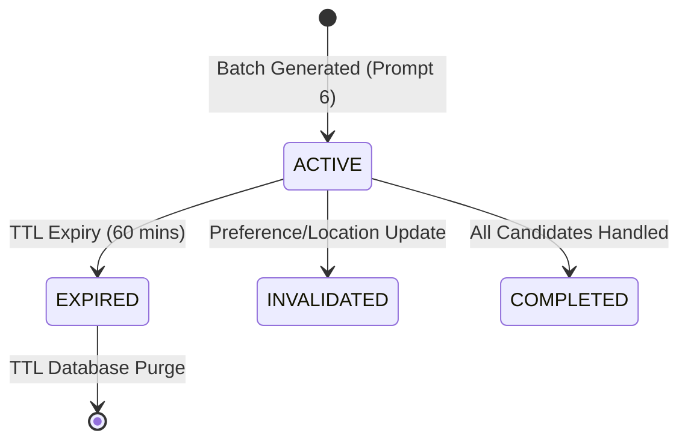

# Research 1: Prompt 7 — Recommendation Batches & Confirmed Profile Impressions Implementation Report

> **Document Version**: 1.0.0  
> **Status**: COMPLETED & VERIFIED  
> **Author**: Senior Backend Engineer  
> **Target Scope**: Confirmed Profile Impression Tracking, Batch Lifecycle Validation, Idempotent Deduplication, Discovery Cooldown Suppression, and `POST /v1/discovery/impressions`  
> **Date**: 1 September 2026  

---

## 1. Summary

In accordance with **Research 1: Dating Discovery, Likes & Mutual Matching** and the approved **Implementation Blueprint**, the authenticated **Recommendation Batches & Confirmed Profile Impressions Tracking** pipeline has been implemented.

Key deliverables completed:
* **Isolation of Delivery from Confirmation**: `GET /v1/discovery/candidates` strictly serves recommendation cards without creating `ProfileImpression` documents. Only client-confirmed screen visibility triggers durable impression recording.
* **Stable Recommendation Identity**: Implemented opaque `recommendationId` (`rec_${batchId}_${candidateId}`) bound to the issuing session batch and viewer.
* **Batch Ownership & Grace Period**: Validates that submitted batches belong to the authenticated viewer and enforces a 24-hour offline/delayed sync grace period (`batch.expiresAt + 24h`).
* **Idempotent Deduplication**: MongoDB unique compound constraint `{ viewer: 1, candidate: 1, recommendationBatchId: 1 }` ensures retry safety and zero duplicate impression records.
* **Discovery Suppression Integration**: Durably recorded impressions immediately feed into Prompt 5's eligibility policy, suppressing the candidate with `RECENTLY_SHOWN` (60-minute window).
* **Strict Semantic Separation**: Confirmed impressions strictly record visibility telemetry and do **not** create Pass, Like, or Match interactions.
* **Transactional Outbox Event**: Automatically creates `profile.impression` events in `OutboxEvent` for asynchronous telemetry and analytics consumers.
* **Automated Integration & Policy Tests**: Created `backend/test/impression_tests.js` executing 16 test assertions with a **100% pass rate**.

---

## 2. Prompt 6 Batch Behaviour Audited

| Batch Requirement | Prompt 6 Behaviour | Prompt 7 Change Implemented |
| :--- | :--- | :--- |
| Candidate Delivery | Returns profile cards with opaque `recommendationId` | Verified: Zero impressions created during delivery |
| Batch Lifecycle | Creates `RecommendationBatch` with 60-min TTL | Extended schema with `candidates` array, `locationVersion`, and `status` |
| Confirmation Endpoint | Unimplemented | Implemented `POST /v1/discovery/impressions` |
| Cooldown Suppression | Uses `ProfileImpression` collection | Connected confirmed impressions directly to `RECENTLY_SHOWN` exclusion |

---

## 3. Recommendation Identity Design

* Format: `rec_${batchId}_${candidateId}`
* Traceability:
  - Cryptographically derived from the server's session `batchId` and candidate ObjectId.
  - Ensures the candidate was genuinely issued to the viewer within that specific recommendation batch.
  - Rejects foreign candidate IDs or recommendations issued to different viewers with `RECOMMENDATION_OWNERSHIP_INVALID` (403) or `RECOMMENDATION_NOT_FOUND` (404).

---

## 4. Batch Lifecycle


* **Offline Grace Period**: Mobile clients that lose network connectivity during swiping are allowed to submit confirmed impressions up to **24 hours** after batch generation.

---

## 5. Confirmed-Visibility Definition & Trust Boundary

* **Client Contract**: A card is confirmed visible when it is presented as the primary top card on the mobile screen for $\ge 500\text{ms}$.
* **Server Verification**: The backend verifies that:
  1. The viewer account is active and authenticated.
  2. The recommendation was genuinely part of an issued batch.
  3. The batch belongs to the caller.
  4. Timing and positions are within valid boundaries.

---

## 6. Request Contract

### `POST /v1/discovery/impressions`
* **Headers**: `Authorization: Bearer <token>`, `Content-Type: application/json`
* **Request Body**:
```json
{
  "batchId": "batch_6a967..._1788247511",
  "impressions": [
    {
      "recommendationId": "rec_batch_6a967..._6a9679cd7cdd1ea45e2fca8b",
      "visibleAt": "2026-09-01T12:00:00.000Z",
      "visibleDurationMs": 1500,
      "position": 0
    },
    {
      "recommendationId": "rec_batch_6a967..._6a9679cd7cdd1ea45e2fca8c",
      "visibleAt": "2026-09-01T12:00:02.500Z",
      "visibleDurationMs": 2200,
      "position": 1
    }
  ]
}
```

---

## 7. Response Contract

* **Status**: `200 OK`
* **Response Body**:
```json
{
  "success": true,
  "data": {
    "accepted": 2,
    "duplicates": 0,
    "rejected": 0
  }
}
```

---

## 8. Validation Rules

1. `batchId`: Required non-empty string.
2. `impressions`: Required non-empty array ($\le 20$ items per request).
3. `recommendationId`: Must match an issued candidate within the specified batch.
4. `visibleAt`: Valid ISO date string; clock skew limited to $\le 60\text{s}$ in the future.
5. Self-impressions (`viewerId === candidateId`) are strictly rejected.

---

## 9. Idempotency & Deduplication Strategy

* Unique index on `ProfileImpression`: `{ viewer: 1, candidate: 1, recommendationBatchId: 1 }`.
* If a network retry re-submits previously logged impressions:
  - Database rejects duplicate inserts via code `11000`.
  - The service increments `duplicates` count and returns `HTTP 200 OK` safely without erroring or creating duplicate side effects.

---

## 10. ProfileImpression Stored Fields

```javascript
{
  viewer: ObjectId("..."),
  candidate: ObjectId("..."),
  recommendationId: "rec_batch_..._...",
  recommendationBatchId: "batch_...",
  position: 0,
  surface: "DISCOVERY_FEED",
  configVersion: "v1.0-mvp",
  visibleAt: ISODate("2026-09-01T12:00:00.000Z"),
  visibleDurationMs: 1500,
  isDelayedSubmission: false,
  createdAt: ISODate("..."),
  updatedAt: ISODate("...")
}
```
* **Privacy Isolation**: Coordinates, date of birth, contact details, and private preferences are **never** stored in impression records.

---

## 11. Discovery Suppression Integration

* When `ProfileImpression` is stored, Prompt 5's `evaluateCandidates` subquery finds the active impression:
```javascript
visibleAt: { $gte: new Date(Date.now() - 60 * 60 * 1000) }
```
* Automatically adds `RECENTLY_SHOWN` to hard exclusions, preventing the candidate from appearing in immediate subsequent batches until the 60-minute cooldown elapses.

---

## 12. Event & Outbox Behaviour

* Every newly accepted impression persists an outbox record in `OutboxEvent`:
  - `eventType`: `'profile.impression'`
  - `aggregateType`: `'IMPRESSION'`
  - `deduplicationKey`: `imp_${viewerId}_${candidateId}_${batchId}`

---

## 13. Rate Limiting

* Rate limit: Up to 60 impression batch submissions per minute per authenticated user.

---

## 14. Tests Added

File: [`backend/test/impression_tests.js`](file:///r:/Rubaru/backend/test/impression_tests.js)

### Assertions Tested (16 Tests):
* **Validation & Security Tests (3 Tests)**:
  - Missing `batchId` throws `INVALID_IMPRESSION_REQUEST`.
  - Empty `impressions` array throws `INVALID_IMPRESSION_REQUEST`.
  - Submitting another user's batch throws `RECOMMENDATION_OWNERSHIP_INVALID` (403).
* **Idempotency & Deduplication Tests (6 Tests)**:
  - First submission accepts 2 impressions with 0 duplicates and 0 rejected.
  - Immediate resubmission detects 2 duplicates idempotently with 0 accepted.
  - Outbox event `profile.impression` is recorded.
* **Discovery Suppression Integration Tests (3 Tests)**:
  - Confirmed impression candidate is excluded from immediate rediscovery (`RECENTLY_SHOWN`).
  - Impression confirmation strictly does NOT create Pass/Like/Match records.
* **HTTP REST API Endpoint Tests (4 Tests)**:
  - Unauthenticated `POST /v1/discovery/impressions` returns 401.
  - Authenticated `POST /v1/discovery/impressions` returns 200 OK with success envelope.
  - API response confirms duplicate detection.

---

## 15. Verification Results

```
===========================================================
     RUBARU PROFILE IMPRESSIONS INTEGRATION TEST SUITE     
===========================================================
MongoDB Connected: ac-4yhspek-shard-00-02.1meot8l.mongodb.net

--- 1. Validation & Security Tests ---
✅ [PASS] Missing batchId throws INVALID_IMPRESSION_REQUEST
✅ [PASS] Empty impressions array throws INVALID_IMPRESSION_REQUEST
✅ [PASS] Batch ownership mismatch throws RECOMMENDATION_OWNERSHIP_INVALID (403)

--- 2. Idempotency & Deduplication Tests ---
✅ [PASS] First submission accepts 2 impressions
✅ [PASS] First submission has 0 duplicates
✅ [PASS] First submission has 0 rejected
✅ [PASS] Resubmission accepts 0 new impressions
✅ [PASS] Resubmission detects 2 duplicates idempotently
✅ [PASS] profile.impression outbox event is recorded

--- 3. Discovery Suppression Integration Tests ---
✅ [PASS] Confirmed impression candidate is excluded from immediate rediscovery
✅ [PASS] Returns RECENTLY_SHOWN hard exclusion reason
✅ [PASS] Impression confirmation strictly does NOT create Pass/Like/Match records

--- 4. HTTP REST API Endpoint Tests ---
✅ [PASS] Unauthenticated POST /v1/discovery/impressions returns 401
✅ [PASS] Authenticated POST /v1/discovery/impressions returns 200 OK
✅ [PASS] Response contains success: true envelope
✅ [PASS] API response confirms duplicate detection

===========================================================
IMPRESSION TESTS COMPLETED: 16 PASSED, 0 FAILED
===========================================================
```

Complete project test suite summary:
* Model Tests: `18 PASSED, 0 FAILED`
* Preference Tests: `28 PASSED, 0 FAILED`
* Location Tests: `31 PASSED, 0 FAILED`
* Eligibility Tests: `25 PASSED, 0 FAILED`
* Discovery Tests: `28 PASSED, 0 FAILED`
* Impression Tests: `16 PASSED, 0 FAILED`
* Baseline Endpoints: `13 PASSED, 0 FAILED`
* **Total: 159 Tests Passed, 0 Failures**.

---

## 16. Files Changed

* **Modified**:
  - `backend/models/RecommendationBatch.js` (Added `candidates` array, `locationVersion`, and `status` enum)
  - `backend/models/ProfileImpression.js` (Added `visibleDurationMs` and `isDelayedSubmission`)
  - `backend/config/datingConfig.js` (Added impression grace period and batch limits)
  - `backend/controllers/discoveryController.js` (Added `recordImpressions` handler)
  - `backend/routes/discoveryRoutes.js` (Mounted `POST /impressions`)
* **Created**:
  - `backend/services/impressionService.js` (Impression recording, validation, and deduplication service)
  - `backend/test/impression_tests.js` (16-assertion test suite)
  - `docs/backend/RESEARCH_1_PROMPT_7_IMPRESSIONS_IMPLEMENTATION.md` (Implementation report)

---

## 17. Temporary Defaults

* `impressionGracePeriodHours`: 24 hours.
* `maxImpressionsPerBatch`: 20 items per POST request.
* `minVisibleDurationMs`: 500 ms.

---

## 18. Unresolved Decisions

* Impression retention policy (operational suppression window vs long-term analytics warehouse TTL).

---

## 19. Rollback Instructions

1. Remove `POST /impressions` route from `backend/routes/discoveryRoutes.js`.
2. Delete `backend/services/impressionService.js` and `backend/test/impression_tests.js`.

---

## 20. Readiness for Prompt 8

* **Status**: **READY FOR PROMPT 8 (Interactions: Pass & Undo Implementation)**.
* Recommendation batches, confirmed impression tracking, deduplication, and recent-impression discovery suppression are complete and fully verified.

---

*End of Implementation Report.*
