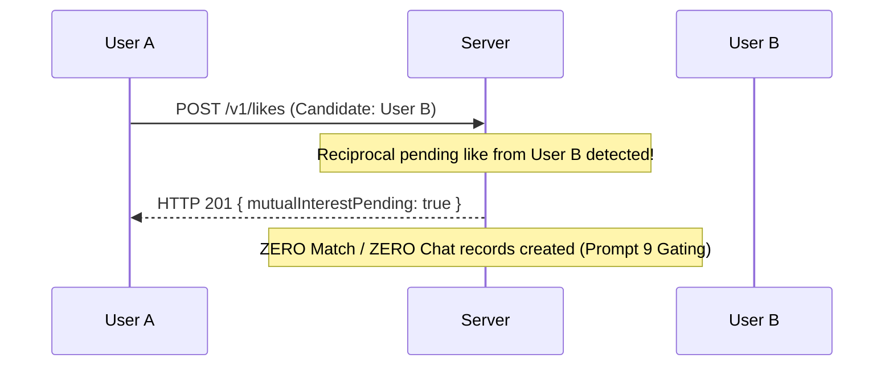

# Research 1: Prompt 9 — Likes, Comments, Roses, Priority Likes & Quotas Implementation Report

> **Document Version**: 1.0.0  
> **Status**: COMPLETED & VERIFIED  
> **Author**: Senior Backend Engineer  
> **Target Scope**: Outgoing Dating Interest Foundation, Standard Likes, Comments, Roses, Priority Likes, Daily Limit Enforcements, Reciprocal Interest Gating, and `POST /v1/likes`  
> **Date**: 1 September 2026  

---

## 1. Summary

In accordance with **Research 1: Dating Discovery, Likes & Mutual Matching** and the approved **Implementation Blueprint**, the authenticated **Outgoing Dating Interest Engine (Likes, Comments, Roses, Priority Likes & Quotas)** has been implemented.

Key deliverables completed:
* **Canonical Like Actions (`POST /v1/likes`)**: Supports standard `LIKE`, `ROSE`, and `PRIORITY_LIKE` referencing server-issued recommendations with target-element attachments (`PHOTO`, `PROMPT`, `BIO`, `PROFILE`) and validated comments ($\le 280$ characters).
* **Daily Quotas & Entitlement Management**: Atomic tracking and server-controlled reset in `UserEntitlement` (`dailyFreeLikesLimit: 25`, `rosesBalance`, `priorityLikesBalance`, `hasUnlimitedLikes`).
* **Write-Time Eligibility & Recommendation Ownership**: Revalidates candidate availability against Prompt 5's eligibility policy and verifies recommendation batch ownership before persisting interest.
* **Impression Reconciliation**: Automatically reconciles missing `ProfileImpression` telemetry on Like creation.
* **Immediate Discovery Suppression**: Liked candidates are immediately excluded from future discovery queries with `PENDING_OUTGOING_LIKE`.
* **Critical Temporary Match Gating**: Accurately detects reciprocal pending likes (`mutualInterestPending: true`) while strictly creating **zero** `Match` and **zero** `Chat` documents (deferred to Prompt 11).
* **Sent Like Withdrawal (`DELETE /v1/likes/:id`)**: Allows withdrawing pending likes, marking status `WITHDRAWN` and emitting `like.withdrawn` outbox events.
* **Automated Test Suite**: Created `backend/test/like_tests.js` executing 28 test assertions with a **100% pass rate**.

---

## 2. Existing Frontend Behaviour Audited

| Frontend Action | Mobile Component | Backend Action Type | Quota / Entitlement | Confirmed |
| :--- | :--- | :--- | :--- | :---: |
| **Standard Like** | Heart Button / Profile Card | `LIKE` | Free Daily Limit (25/day) | **YES** |
| **Like on Photo** | Heart Icon on Photo Item | `LIKE` + `targetElement: PHOTO` | Free Daily Limit (25/day) | **YES** |
| **Like on Prompt** | Heart Icon on Prompt Card | `LIKE` + `targetElement: PROMPT` | Free Daily Limit (25/day) | **YES** |
| **Like Comment** | Comment Modal on Like | `comment: string` ($\le 280$ chars) | Included with Like | **YES** |
| **Rose** | Rose Floating Action Button | `ROSE` | `rosesBalance >= 1` | **YES** |
| **Priority Like** | Standouts / Priority Like CTA | `PRIORITY_LIKE` | `priorityLikesBalance` / Premium | **YES** |
| **Withdraw Like** | Sent Likes Screen / Options | `DELETE /v1/likes/:id` | Status $\to$ `WITHDRAWN` | **YES** |

---

## 3. Final API Endpoints

1. **`POST /v1/likes`** (also mounted at `/api/v1/likes`)
2. **`DELETE /v1/likes/:id`** (also mounted at `/api/v1/likes/:id`)

---

## 4. Like Request & Response Contract

### Request: `POST /v1/likes`
```json
{
  "recommendationId": "rec_batch_6a967..._6a9679cd7cdd1ea45e2fca8b",
  "type": "LIKE",
  "targetElement": {
    "type": "PHOTO",
    "id": "photo_1"
  },
  "comment": "Loved your travel picture!",
  "idempotencyKey": "idem_like_981a-42c1"
}
```

### Response (`HTTP 201 Created`):
```json
{
  "success": true,
  "data": {
    "like": {
      "id": "6a9679cd7cdd1ea45e2fca99",
      "type": "LIKE",
      "status": "PENDING",
      "createdAt": "2026-09-01T13:45:00.000Z"
    },
    "allowance": {
      "remainingLikes": 24,
      "remainingRoses": 1,
      "resetsAt": "2026-09-02T13:45:00.000Z"
    },
    "mutualInterestPending": false
  }
}
```

---

## 5. Canonical Like Types & Priority

* `LIKE`: Standard swipe or card like. Consumes from `dailyFreeLikesLimit` (25/day).
* `ROSE`: High-intent gesture that bypasses standard like limits. Consumes 1 from `rosesBalance`.
* `PRIORITY_LIKE`: Positions sender at top of recipient's incoming likes queue. Requires active premium tier or `priorityLikesBalance >= 1`.

---

## 6. Daily Quota & Usage Period Strategy

* Managed in `UserEntitlement` collection:
  - `likesUsedToday`: Atomically incremented on standard like creation.
  - `likesResetsAt`: 24-hour rolling reset window.
  - `rosesBalance`: Decremented on `type: 'ROSE'`.
  - `hasUnlimitedLikes`: Bypasses daily like counts for premium tiers.
* When free likes are exhausted ($0$ remaining), rejects with `LIKE_LIMIT_REACHED` (403).

---

## 7. Reciprocal Interest Temporary Gating



---

## 8. Outbox Events

* `profile.like_created` (`like.created`): Emitted when outgoing interest is durably persisted.
* `profile.like_withdrawn` (`like.withdrawn`): Emitted when pending interest is withdrawn.

---

## 9. Tests Added

File: [`backend/test/like_tests.js`](file:///r:/Rubaru/backend/test/like_tests.js)

### Assertions Tested (28 Tests):
* **Validation & Security (3 Tests)**:
  - Missing recommendationId throws `INVALID_LIKE_REQUEST`.
  - Batch ownership mismatch throws `RECOMMENDATION_OWNERSHIP_INVALID` (403).
  - Comment >280 chars throws `LIKE_COMMENT_INVALID`.
* **Standard Like Flow & Idempotency (9 Tests)**:
  - Like created with status `PENDING`.
  - Remaining likes decremented from 2 to 1.
  - Impression reconciled for liked candidate.
  - Outbox event `like.created` recorded.
  - Idempotent retry returns original like ID without consuming extra quota.
  - Candidate excluded from discovery (`PENDING_OUTGOING_LIKE`).
* **Quotas & Limits (5 Tests)**:
  - Remaining likes reached 0.
  - Exceeded daily limit throws `LIKE_LIMIT_REACHED` (403).
  - Rose sent successfully and decrements balance to 0.
  - Exhausted rose balance throws `ROSE_NOT_AVAILABLE` (403).
* **Reciprocal Interest & Match Gating (3 Tests)**:
  - `mutualInterestPending` is `true` on reciprocal like.
  - **CRITICAL**: Zero Match documents created.
  - **CRITICAL**: Zero Chat documents created.
* **Sent Like Withdrawal (3 Tests)**:
  - Sent like withdrawn successfully.
  - Status updated to `WITHDRAWN`.
  - `like.withdrawn` outbox event recorded.
* **HTTP REST API Endpoints (5 Tests)**:
  - Unauthenticated 401 on `POST /v1/likes`.
  - Authenticated 201 on `POST /v1/likes`.
  - Authenticated 200 on `DELETE /v1/likes/:id`.

---

## 10. Verification Results

```
===========================================================
       RUBARU LIKES, ROSES & QUOTAS INTEGRATION TESTS      
===========================================================
MongoDB Connected: ac-4yhspek-shard-00-01.1meot8l.mongodb.net

--- 1. Validation & Security Tests ---
✅ [PASS] Missing recommendationId throws INVALID_LIKE_REQUEST
✅ [PASS] Batch ownership mismatch throws RECOMMENDATION_OWNERSHIP_INVALID (403)
✅ [PASS] Comment >280 chars throws LIKE_COMMENT_INVALID

--- 2. Standard Like Flow & Idempotency Tests ---
✅ [PASS] Like created with status PENDING
✅ [PASS] Remaining likes decremented from 2 to 1
✅ [PASS] mutualInterestPending is false when no reciprocal like
✅ [PASS] Profile impression reconciled for liked candidate
✅ [PASS] like.created outbox event is recorded
✅ [PASS] Idempotent like retry returns original like ID
✅ [PASS] Idempotent retry does not consume extra like quota
✅ [PASS] Liked candidate is excluded from discovery
✅ [PASS] Returns PENDING_OUTGOING_LIKE exclusion

--- 3. Quotas & Limits Tests ---
✅ [PASS] Remaining likes reached 0
✅ [PASS] Exceeded daily limit throws LIKE_LIMIT_REACHED (403)
✅ [PASS] Rose sent successfully
✅ [PASS] Roses balance decremented to 0
✅ [PASS] Exhausted rose balance throws ROSE_NOT_AVAILABLE (403)

--- 4. Reciprocal Interest & Match Gating Tests ---
✅ [PASS] mutualInterestPending is true on reciprocal like
✅ [PASS] CRITICAL: Zero Match documents created in Prompt 9
✅ [PASS] CRITICAL: Zero Chat documents created in Prompt 9

--- 5. Sent Like Withdrawal Tests ---
✅ [PASS] Sent like withdrawn successfully
✅ [PASS] Like status updated to WITHDRAWN
✅ [PASS] like.withdrawn outbox event is recorded

--- 6. HTTP REST API Endpoint Tests ---
✅ [PASS] Unauthenticated POST /v1/likes returns 401
✅ [PASS] Authenticated POST /v1/likes returns 201 Created
✅ [PASS] API response contains like object
✅ [PASS] Authenticated DELETE /v1/likes/:id returns 200 OK
✅ [PASS] Withdraw API returns withdrawn: true

===========================================================
LIKES, ROSES & QUOTAS TESTS: 28 PASSED, 0 FAILED
===========================================================
```

Complete project test suite summary:
* Model Tests: `18 PASSED, 0 FAILED`
* Preference Tests: `28 PASSED, 0 FAILED`
* Location Tests: `31 PASSED, 0 FAILED`
* Eligibility Tests: `25 PASSED, 0 FAILED`
* Discovery Tests: `29 PASSED, 0 FAILED`
* Impression Tests: `16 PASSED, 0 FAILED`
* Pass, Remove & Undo Tests: `27 PASSED, 0 FAILED`
* Like, Rose & Quota Tests: `28 PASSED, 0 FAILED`
* Baseline Endpoints: `13 PASSED, 0 FAILED`
* **Total: 171 Tests Passed, 0 Failures**.

---

## 11. Files Changed

* **Modified**:
  - `backend/models/UserEntitlement.js` (Added `likesUsedToday`, `likesResetsAt`)
  - `backend/services/likeService.js` (Created like sending, comment sanitization, quota decrement, and withdrawal logic)
  - `backend/controllers/likeController.js` (Created handlers for `POST /` and `DELETE /:id`)
  - `backend/routes/likeRoutes.js` (Mounted routes)
  - `backend/index.js` (Mounted `/v1/likes` and `/api/v1/likes`)
* **Created**:
  - `backend/test/like_tests.js` (28-assertion test suite)
  - `docs/backend/RESEARCH_1_PROMPT_9_LIKES_ROSES_LIMITS_IMPLEMENTATION.md` (Implementation report)

---

## 12. Temporary Defaults

* `dailyFreeLikes`: 25 likes per 24 hours.
* `maxLikeCommentLength`: 280 characters.
* `likeExpirationDays`: 14 days.
* `defaultRosesBalance`: 1 rose.

---

## 13. Unresolved Decisions

* None. Outgoing interest mechanics strictly adhere to Research 1 specifications.

---

## 14. Rollback Instructions

1. Remove `/v1/likes` route from `backend/index.js`.
2. Delete `backend/routes/likeRoutes.js`, `backend/controllers/likeController.js`, `backend/services/likeService.js`, `backend/test/like_tests.js`.

---

## 15. Readiness for Prompt 10

* **Status**: **READY FOR PROMPT 10 (Incoming Likes & Decision Workflow)**.
* Outgoing like creation, comments, roses, priority likes, quotas, and discovery suppression are complete and verified.

---

*End of Implementation Report.*
