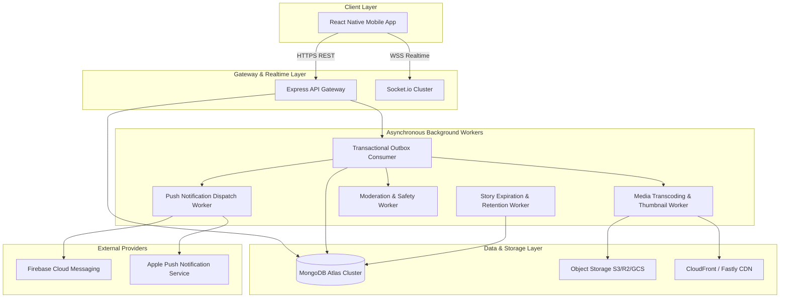

# Research 2: Social System Standard Operating Procedures & Operations Runbook

> **Document Version**: 1.0.0  
> **Status**: APPROVED FOR SRE & PRODUCTION OPERATIONS  
> **Author**: Principal Site Reliability Engineer & Infrastructure Lead  
> **Target Scope**: Day-2 Operations, Incident Management, Runbooks & Disaster Recovery for Social Layer  
> **Date**: 1 September 2026  

---

## 1. System Architecture & Dependency Map



---

## 2. Service Health Endpoints & Probes

| Probe Type | HTTP Endpoint | Expected Status | Interval | Timeout | Target Action on Failure |
| :--- | :--- | :---: | :---: | :---: | :--- |
| **Liveness** | `GET /` | `200 OK` | 10s | 2s | Restart Pod / Service Container |
| **Database Readiness** | `GET /api/health/db` | `200 OK` | 15s | 3s | Isolate traffic from degraded replica |
| **Socket Health** | `GET /socket.io/health` | `200 OK` | 30s | 5s | Recycle WebSocket worker instances |
| **Outbox Queue Depth**| `GET /api/health/outbox` | `200 OK` | 30s | 5s | Alert SRE if pending count > 500 |

---

## 3. Configuration & Feature Flags

| Feature Flag Key | Default | Type | Impact when Disabled (`false`) |
| :--- | :---: | :---: | :--- |
| `SOCIAL_CONTENT_FEATURE_ENABLED` | `true` | Boolean | Master circuit-breaker: gracefully pauses social feed rendering while keeping dating & safety active. |
| `ENABLE_SUGGESTED_RANKING` | `true` | Boolean | Disables ML/heuristic suggested posts in feed; falls back to 100% connected chronological feed. |
| `ENABLE_VIDEO_REELS` | `true` | Boolean | Hides Reel creation and Reel tab; preserves existing Reel playback metadata. |
| `ENABLE_EPHEMERAL_STORIES` | `true` | Boolean | Hides Story tray and story upload; preserves story archive for authors. |
| `ENABLE_DIRECT_PUSH_NOTIFICATIONS` | `true` | Boolean | Pauses external FCM/APNs push dispatches; in-app notifications continue delivering. |

---

## 4. Emergency Incident Procedures

### SOP-01: Emergency Content Revocation (Content Takedown)
* **Trigger**: Legal takedown notice, critical safety violation, or severe malware injection.
* **Procedure**:
  ```bash
  # Execute immediate administrative content removal
  curl -X POST https://api.rubaru.app/v1/admin/content/:contentId/remove \
    -H "Authorization: Bearer $ADMIN_SECRET_KEY" \
    -H "Content-Type: application/json" \
    -d '{"reason": "EMERGENCY_SAFETY_TAKEDOWN", "decision": "REMOVE"}'
  ```
* **Verification**:
  1. Verify `Content.status` is set to `'REMOVED'` in database.
  2. Verify `GET /v1/posts/:id` returns `404 Not Found`.
  3. Verify content is immediately filtered from all user timelines and search queries.

---

### SOP-02: Transactional Outbox Backlog Recovery
* **Trigger**: `OUTBOX_BACKLOG_ACCUMULATION` alert (> 500 unhandled events).
* **Investigation**:
  1. Inspect `OutboxEvent` collection for stalled `status: 'PROCESSING'` events:
     ```javascript
     db.outboxevents.find({ status: 'PROCESSING', updatedAt: { $lt: new Date(Date.now() - 300000) } })
     ```
  2. Check for poison events causing consumer crashes:
     ```javascript
     db.outboxevents.find({ retryCount: { $gte: 5 } })
     ```
* **Resolution**:
  1. Mark dead-letter poison events for offline inspection:
     ```javascript
     db.outboxevents.updateMany({ retryCount: { $gte: 5 } }, { $set: { status: 'FAILED' } })
     ```
  2. Reset timed-out processing events to pending:
     ```javascript
     db.outboxevents.updateMany({ status: 'PROCESSING', updatedAt: { $lt: new Date(Date.now() - 300000) } }, { $set: { status: 'PENDING' } })
     ```
  3. Scale up outbox worker instances to drain the queue.

---

### SOP-03: Story Expiration Desynchronization Recovery
* **Trigger**: `STORY_EXPIRY_LAG` alert.
* **Investigation**:
  * Note: Feed and Detail queries filter by `expiresAt: { $gt: new Date() }` at read time, so expired stories are never visible to viewers even if background cleanup lags.
* **Resolution**:
  * Trigger immediate manual story cleanup sweep:
    ```bash
    node backend/scripts/sweep_expired_stories.js --force
    ```

---

### SOP-04: Media Transcoding & Storage Provider Outage
* **Trigger**: `MEDIA_PROCESSING_BACKLOG` alert or S3/CDN degradation.
* **Resolution**:
  1. Switch media upload mode to direct-to-app temporary upload proxy if cloud signed-URL generation fails.
  2. Purge and bypass edge CDN cache for affected media keys.
  3. Re-queue unfinalized `UploadSession` records once storage connectivity is restored.

---

### SOP-05: Push Notification Gateway Failure (FCM / APNs Outage)
* **Trigger**: `NOTIFICATION_DELIVERY_FAIL` alert.
* **Impact**: External push alerts delayed or failing; in-app and Socket.io alerts operate normally.
* **Procedure**:
  1. Set `ENABLE_DIRECT_PUSH_NOTIFICATIONS=false` to stop burning retry attempts.
  2. Verify credentials and TLS certificates with Apple Developer & Google Firebase console.
  3. Re-enable flag after upstream provider health is restored. Outbox will automatically drain accumulated alerts.

---

## 5. Escalation Roster & Contacts

| Tier | Role / Team | Responsibilities | Target Response SLA |
| :--- | :--- | :--- | :---: |
| **Tier 1** | 24/7 Operations / SRE On-Call | Initial triage, alert acknowledgment, container restarts | < 5 minutes |
| **Tier 2** | Social Platform Backend Team | Database index tuning, outbox worker recovery, code hotfixes | < 15 minutes |
| **Tier 3** | Trust & Safety Operations Lead | High-severity moderation cases, legal takedowns, user bans | < 15 minutes |
| **Tier 4** | Principal Architect / VP Eng | Architecture circuit breaking, master rollback decisions | < 30 minutes |

---

*End of Operations Runbook.*
