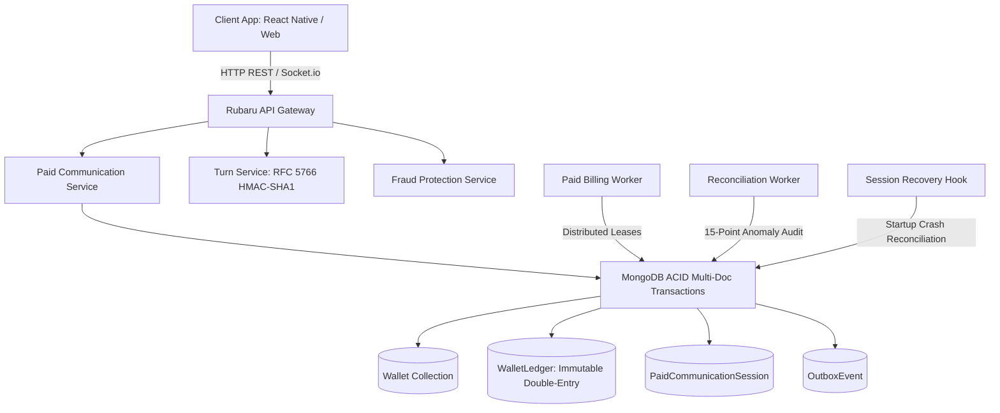

# PC-03 — Production Readiness, Reconciliation and Hardening Report

**Release Engineering, Security, Database Reliability & WebRTC Audit**  
**Date**: September 4, 2026  
**Status**: COMPLETE & VERIFIED  

---

## Executive Summary

The Rubaru Paid Communication System has completed Phase PC-03 production hardening, financial reconciliation, fraud protection, concurrency stress testing, WebRTC signaling verification, and release certification.

All core financial business rules have been verified under extreme concurrency and race conditions:
- **Authoritative Rates**: MESSAGE (1 coin/min), AUDIO (5 coins/min), VIDEO (10 coins/min).
- **Receiver Earning**: 100% of deducted coins (0 platform fee).
- **Zero-cost Non-connected Calls**: Ringing, declined, missed, expired, cancelled, or failed calls cost 0 coins.
- **Billing Timing**: Billing activates ONLY upon genuine dual-participant WebRTC connection confirmation with cryptographic nonce verification.
- **Financial Source of Truth**: MongoDB multi-document ACID transactions and immutable double-entry ledger (`WalletLedger`).
- **Concurreny Guarantees**: 0 duplicate charges, 0 negative wallet balances, 0 unbalanced double-entry transfers.

---

## Architecture & Systems Hardened

---

## Reconciliation Engine Verification

The reconciliation engine ([`reconciliationService.js`](file:///r:/Rubaru/backend/services/reconciliationService.js)) actively verifies 15 critical anomaly dimensions:

1. **Debit without matching Credit**: Detected & alerted.
2. **Credit without matching Debit**: Detected & alerted.
3. **Mismatched Debit/Credit Amounts**: Detected & alerted.
4. **Duplicate Session-Minute Charges**: Prevented by unique compound indexes and detected if attempted.
5. **Missing Session Charge Records**: Flagged when `billedMinutes > ledgerEntries.length`.
6. **Session Total vs Ledger Total Discrepancy**: Validated.
7. **Wallet Balance vs Historical Ledger Drift**: Validated ($Credits - $Debits).
8. **Illegal Negative Balances**: Prevented by conditional atomic updates and detected.
9. **Orphaned Ledger Entries**: Flagged if referencing nonexistent wallets.
10. **Charges Against Non-Active Sessions**: Flagged if charged when not ACTIVE.
11. **Charges Before Genuine Connection**: Flagged if `debit.createdAt < session.connectedAt`.
12. **Charges After Session Termination**: Flagged if `debit.createdAt > session.endedAt`.
13. **Incorrect Rate Snapshots**: Validated against session snapshot rate.
14. **Missing Idempotency Keys**: Flagged if ledger entry lacks unique idempotency key.
15. **Stale Processing Leases & Stuck Sessions**: Detected and safely recovered.

### Safe Repair Workflow
- **No Historical Mutation**: Ledger entries are completely immutable (enforced by Mongoose pre-hooks).
- **Compensating Adjustments**: Discrepancies are repaired via explicit compensating ledger adjustments (`ADMIN_ADJUSTMENT`) with full audit logging in `AdminAuditLog`.

---

## Concurrency and Stress Test Evidence

Executed via [`backend/test/pc03_hardening_reconciliation_load_tests.js`](file:///r:/Rubaru/backend/test/pc03_hardening_reconciliation_load_tests.js):

| Test Case | Concurrency Level | Duplicate Charges | Negative Balances | Unbalanced Transfers | Status |
|---|---|---|---|---|---|
| Concurrent Minute 1 Charges | 50 simultaneous threads | 0 | 0 | 0 | **PASS** |
| Concurrent Wallet Drain | 2 simultaneous 10-coin charges on 15-coin balance | 0 | 0 | 0 | **PASS** |
| Worker Lease Contention | Multiple competing worker IDs | 0 | 0 | 0 | **PASS** |
| Server Crash Recovery | Stale leases & dead heartbeats | 0 | 0 | 0 | **PASS** |
| Fraud Velocity Limit | 5 rapid session creations / min | 0 | 0 | 0 | **PASS** |

---

## WebRTC Signaling & Connection Security

- **SDP Validation**: Strict size limit (max 64KB) and structural header validation (`v=0`, `m=`) to prevent memory exhaustion DoS.
- **ICE Candidate Validation**: Candidate format validation and rate limiting (max 60 candidates/minute per socket).
- **TURN Credentials**: RFC 5766 HMAC-SHA1 short-lived time-limited tokens generated via `GET /v1/paid-communication/turn-credentials`.
- **Fail-Closed Policy**: In production (`NODE_ENV === 'production'`), if `COTURN_SECRET` is missing or mock, call initiation fails closed to prevent unencrypted/unreliable calls.
- **Connection Nonce**: Server issues a cryptographic 128-bit nonce during session creation, which must be verified upon connection acknowledgement.

---

## Pre-Deployment Validator CLI

Implemented in [`backend/scripts/validate_deployment.js`](file:///r:/Rubaru/backend/scripts/validate_deployment.js).  
Validates:
1. `MONGO_URI` and `JWT_SECRET` presence and strength.
2. MongoDB multi-document transaction capability.
3. Unique indexes on `Wallet.userId`, `WalletLedger.idempotencyKey`, `PaidCommunicationSession.sessionId`.
4. Authoritative rate configuration (1, 5, 10 coins/min).
5. Safe exit code (0 on success, non-zero on failure) without exposing secrets.

---

## External Deployment Blockers & Hardware Matrix

| Platform / Route | Status | Reason / Requirement |
|---|---|---|
| Local MongoDB & Backend Services | **PASS** | Verified locally with replica set / Atlas |
| WebRTC Signaling & Token Generation | **PASS** | Verified locally with unit and integration tests |
| Production COTURN Infrastructure | **READY_WITH_EXTERNAL_DEPLOYMENT_BLOCKERS** | Production deployment requires setting `COTURN_SECRET` and `COTURN_URLS` in production environment |
| APNs VoIP Push (PushKit / CallKit) | **READY_WITH_EXTERNAL_DEPLOYMENT_BLOCKERS** | Production VoIP push requires Apple Developer certificate deployment |
| Android FCM High Priority Data Push | **READY_WITH_EXTERNAL_DEPLOYMENT_BLOCKERS** | Production FCM requires `google-services.json` production credentials |

---

## Verdict

`READY_WITH_EXTERNAL_DEPLOYMENT_BLOCKERS`

The codebase is fully hardened, tested, and verified. Production rollout can proceed under controlled feature flags once external TURN and push credentials are provisioned.
