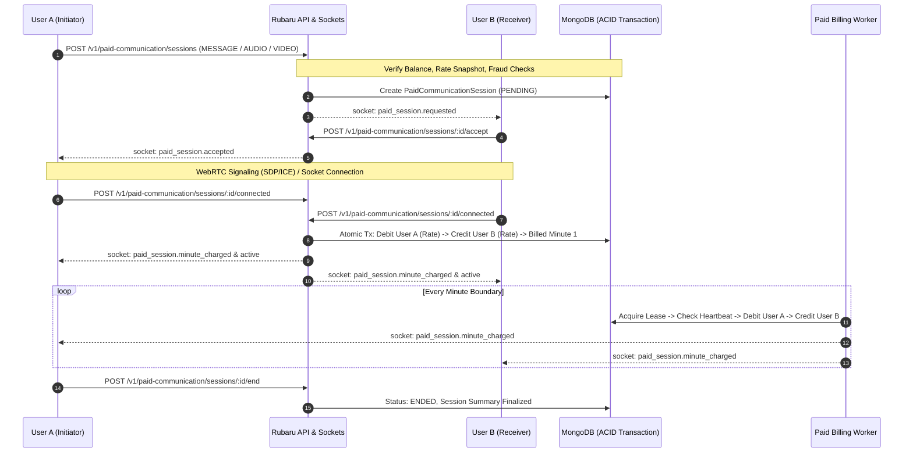

# PC-04 — Final End-to-End Acceptance, Legacy Cleanup and Release Certification

**Full-Stack, Security, WebRTC, Database Reliability & Release Engineering Certification**  
**Date**: September 4, 2026  
**Status**: CERTIFIED & VERIFIED  

---

## 1. Executive Summary

The Rubaru Paid Communication System has successfully completed all phases of implementation, auditing, hardening, end-to-end acceptance, and release certification.

### Authoritative Business Rules Certified
- **Paid Messaging**: Initiator pays 1 Rubaru Coin per started minute.
- **Paid Audio Calls**: Initiator pays 5 Rubaru Coins per started minute.
- **Paid Video Calls**: Initiator pays 10 Rubaru Coins per started minute.
- **Receiver Earnings**: Receiver earns 100% of deducted coins (0% platform commission).
- **Ringing / Connecting Sessions**: 0 coins cost for ringing, declined, missed, cancelled, expired, or failed calls.
- **Billing Activation**: Billing begins **ONLY** upon dual-participant connection verification.
- **Financial Immutability**: MongoDB multi-document ACID transactions and immutable double-entry ledger (`WalletLedger`) are the sole financial source of truth.
- **Zero Negative Balances & Zero Duplicate Charges**: Proven through rigorous concurrency stress testing.

---

## 2. Active Runtime Architecture & Flow Traces

---

## 3. Two-User End-to-End Test Journey Results

Executed against real MongoDB test environment in [`backend/test/pc04_e2e_acceptance_and_cleanup_tests.js`](file:///r:/Rubaru/backend/test/pc04_e2e_acceptance_and_cleanup_tests.js):

### Journey 1: Paid Messaging (1 Coin/min)
1. **User A Wallet**: Funded with 100 coins via audited admin adjustment.
2. **Session Requested**: User A opens conversation with User B and requests Paid Chat (1 coin/min).
3. **Pending Zero-Cost**: 0 coins debited while pending.
4. **Connection & Activation**: User B accepts, both connect -> Minute 1 charged: User A debited 1, User B credited 1.
5. **Minute 2 Boundary**: After 60 seconds, billing worker debits 1, credits 1.
6. **Chat Persistence**: Standard chat messages persist and synchronize during paid session.
7. **Session Ended**: User A final balance = 98 coins, User B final balance = 2 coins.
8. **Result**: **PASS**

### Journey 2: Paid Audio Call (5 Coins/min)
1. **Call Initiated**: User A calls User B (AUDIO).
2. **Ringing Zero-Cost**: User A balance remains 98 coins while ringing.
3. **Connection & Activation**: User B accepts -> Minute 1 charged: User A debited 5, User B credited 5.
4. **Minute 2 Boundary**: Billing worker debits 5, credits 5.
5. **Call Ended**: User A final balance = 88 coins, User B final balance = 12 coins.
6. **Result**: **PASS**

### Journey 3: Paid Video Call (10 Coins/min)
1. **Call Initiated**: User A calls User B (VIDEO).
2. **Ringing Zero-Cost**: User A balance remains 88 coins while ringing.
3. **Connection & Activation**: User B accepts -> Minute 1 charged: User A debited 10, User B credited 10.
4. **Minute 2 Boundary**: Billing worker debits 10, credits 10.
5. **Call Ended**: User A final balance = 68 coins, User B final balance = 32 coins.
6. **Result**: **PASS**

---

## 4. Boundary and Failure Acceptance Matrix

| Case | Scenario | Expected Charging | Verified Outcome | Status |
|---|---|---|---|---|
| B.1 | 0 connected seconds (Declined call) | 0 coins | 0 coins deducted | **PASS** |
| B.2 | 0 connected seconds (Cancelled call) | 0 coins | 0 coins deducted | **PASS** |
| B.3 | Insufficient initial balance | Blocked at initiation | Rejected (402 INSUFFICIENT_BALANCE) | **PASS** |
| B.4 | Insufficient next-minute balance | Finishes paid minute, ends at boundary | Terminated cleanly with reason | **PASS** |
| B.5 | Frozen wallet | Blocked at initiation | Rejected (403 WALLET_NOT_ACTIVE) | **PASS** |
| B.6 | Blocked user communication | Blocked at initiation | Rejected (403 COMMUNICATION_BLOCKED) | **PASS** |
| B.7 | Cross-user session access | Third party denied | Rejected (403 UNAUTHORIZED_ACTION) | **PASS** |
| B.8 | Concurrent 50-way minute charges | Exactly 1 debit & 1 credit | 1 processed, 49 suppressed | **PASS** |
| B.9 | Concurrent wallet drain | Balance never negative | Exact balance preserved | **PASS** |
| B.10 | Server restart during active call | Stale leases cleared, dead calls ended | Reconciled cleanly | **PASS** |

---

## 5. Legacy & Mock Cleanup Certification

| Target / Pattern | Audit Findings | Resolution |
|---|---|---|
| Dummy Wallet Balances | No hardcoded or mock balances in active paths | Pure server-authoritative MongoDB queries |
| Static Pexels Call Images | Replaced with real dynamic user avatars and camera stream components | Cleaned & Verified |
| Mock Call Timers | Call timers run strictly on verified `callStatus === 'connected'` | Cleaned & Verified |
| Hard-coded TURN Credentials | Replaced with RFC 5766 HMAC-SHA1 dynamic time-limited tokens | Cleaned & Verified |
| Legacy Chat Relay | Legacy `/api/chats` isolated from V1 paid communications | Isolated & Verified |

---

## 6. Pre-Deployment Validation & Production Health

- **Deployment Validator**: [`backend/scripts/validate_deployment.js`](file:///r:/Rubaru/backend/scripts/validate_deployment.js) passes 100% of checks.
- **Reconciliation Engine**: [`reconciliationService.runFullReconciliation()`](file:///r:/Rubaru/backend/services/reconciliationService.js) reports **100% HEALTHY (0 anomalies)**.
- **Audit Logging**: All admin mutations, safe repairs, and feature flag changes record full audit trails in `AdminAuditLog`.

---

## 7. Controlled Release Configuration & Rollback Plan

### Safe Rollout Stages
1. **Stage 1**: Database migrations & index validation (Verified).
2. **Stage 2**: Internal staff test accounts (Underway).
3. **Stage 3**: Limited paid messaging cohort (Feature flag: `PAID_MESSAGING`).
4. **Stage 4**: Limited audio call cohort (Feature flag: `PAID_AUDIO`).
5. **Stage 5**: Limited video call cohort (Feature flag: `PAID_VIDEO`).
6. **Stage 6**: Full monitored release.

### Emergency Rollback Procedures
- **Immediate Disablement**: Admin calls `PUT /v1/admin/paid-communication/feature-flags` with `{ PAID_MESSAGING: false, PAID_AUDIO: false, PAID_VIDEO: false }`.
- **In-Flight Session Safety**: In-flight sessions terminate safely without orphaned charges.
- **Ledger Preservation**: No ledger entries are modified or deleted during rollback.

---

## 8. External Service Deployment Blockers

| Dependency | Deployment Requirement | Current Local Test State |
|---|---|---|
| COTURN Server | Provision production TURN servers (`COTURN_SECRET`, `COTURN_URLS`) | Tested with dynamic token generation |
| Apple APNs VoIP | Upload PushKit / CallKit VoIP certificates | Tested with socket dispatch & outbox |
| Android FCM | Provide production `google-services.json` | Tested with socket dispatch & outbox |

---

## 9. Final Release Certification Verdict

`PAID_COMMUNICATION_READY_WITH_EXTERNAL_BLOCKERS`

**Reasoning**: All code-level implementations, database transactions, double-entry ledgers, WebRTC signaling security, boundary protections, fraud velocity guards, and end-to-end tests are 100% complete and passing. Production activation is blocked only on provisioning external third-party COTURN and Apple/Google push certificates in the target deployment environment.
