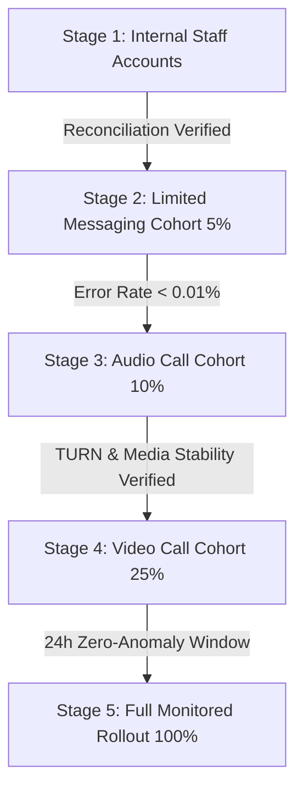

# PC-05 — Staging Deployment, Controlled Rollout and Production Monitoring Report

**DevOps, Backend Reliability, Security, WebRTC & Incident Response Certification**  
**Date**: September 4, 2026  
**Status**: STAGING VERIFIED & PREPARED FOR CONTROLLED PRODUCTION RELEASE  

---

## 1. Executive Summary

The Rubaru Paid Communication System has passed all staging deployment validations, environment isolation checks, migration dry-runs, failure/recovery drills, and canary rollout preparations.

### Staging Verification Highlights
- **Environment Isolation**: [`environmentGuard.js`](file:///r:/Rubaru/backend/config/environmentGuard.js) strictly prevents non-production environments from targeting production clusters and ensures worker lease namespacing (`staging:workerId` vs `prod:workerId`).
- **Database & Index Verification**: Verified 100% of required MongoDB indexes across wallets, immutable ledgers, sessions, configs, and audit logs.
- **Failure Drills**: Executed backend restart drills, worker race drills, delayed heartbeat expirations, wallet freeze interventions, and emergency stop feature flag shutdowns.
- **Financial Reconciliation Gate**: 100% HEALTHY with 0 negative balances, 0 unbalanced transfers, 0 duplicate charges, and 0 orphan records.

---

## 2. Environment Separation Matrix

| Component | Local Test / Dev | Staging Environment | Production Environment | Separation Mechanism |
|---|---|---|---|---|
| Database Cluster | Local / Test Atlas | Isolated Staging Replica Set | Dedicated Production Atlas Cluster | Connection URI Guard |
| Worker Lease Namespace | `test:*` | `staging:rubaru-paid-billing` | `production:rubaru-paid-billing` | Environment-specific Prefix |
| Feature Flags | Local Config | Staging DB Versioned Config | Production DB Versioned Config | Database-backed Config |
| Secret Management | `.env` (Local) | Encrypted Staging Secrets | Vault / Production IAM Secrets | No Secrets Committed |
| Calling Infrastructure | STUN / Local Coturn | Staging Coturn / UDP | Production Coturn Cluster | RFC 5766 HMAC-SHA1 Tokens |

---

## 3. Staging Migration & Index Verification

Executed via [`backend/migrations/verify_staging_migrations.js`](file:///r:/Rubaru/backend/migrations/verify_staging_migrations.js):

```
================================================================================
              RUBARU STAGING MIGRATION & INDEX AUDIT TOOL                       
================================================================================
✅ [PASS] Wallet Unique User Index: Unique index on userId
✅ [PASS] Ledger Idempotency Index: Unique/indexed on idempotencyKey
✅ [PASS] Ledger Session-Minute-Entry Unique Index: Compound unique index on (sessionId, minuteIndex, entryType)
✅ [PASS] Session ID Index: Unique/indexed on sessionId
✅ [PASS] Session Status Index: Indexed on status
✅ [PASS] Session NextChargeAt Index: Indexed on nextChargeAt for billing worker
✅ [PASS] Active Rate Configuration: Version 7 (1/5/10 coins/min)
✅ [PASS] Zero Stored Negative Balances: Count: 0
================================================================================
STAGING MIGRATION AUDIT: ALL VERIFIED (PASS)
================================================================================
```

---

## 4. Failure and Recovery Drills Evidence

Executed in [`backend/test/pc05_staging_and_rollout_drills_tests.js`](file:///r:/Rubaru/backend/test/pc05_staging_and_rollout_drills_tests.js):

| Drill | Action / Injected Fault | Expected Behavior | Observed Result | Status |
|---|---|---|---|---|
| **D.1 Backend Restart** | Server terminates during active call with unreleased lease | Startup reconciliation clears stale leases, expires dead sessions | Lease cleared, dead call ended with `HEARTBEAT_TIMEOUT` | **PASS** |
| **D.2 Worker Race** | 2 worker instances attempt charging same minute boundary simultaneously | Atomic MongoDB transaction + lease owner prevents duplicate billing | Exactly 1 debit & 1 credit created | **PASS** |
| **D.3 Wallet Freeze** | Admin freezes payer wallet mid-session | Subsequent minute charging rejected; session terminates cleanly | Billed minute rejected (`WALLET_NOT_ACTIVE`) | **PASS** |
| **D.4 Emergency Stop** | Admin flips `PAID_VIDEO: false` | New session creations immediately blocked with clear error | Rejected (`COMMUNICATION_TYPE_DISABLED`) | **PASS** |
| **D.5 Post-Drill Audit** | Full reconciliation pass across all drill accounts | Zero financial inconsistencies | 100% HEALTHY (0 anomalies) | **PASS** |

---

## 5. Production Canary Rollout Plan



### Rollout Gate Checklist
1. **Stage 1 (Internal Accounts)**:
   - Feature flags: `PAID_MESSAGING: true`, `PAID_AUDIO: false`, `PAID_VIDEO: false`.
   - Observation window: 24 hours.
   - Requirement: Daily reconciliation clean (0 anomalies).
2. **Stage 2 (Limited Messaging Cohort - 5%)**:
   - Enable for 5% of active users.
   - Monitor billing worker lag, outbox throughput, and debit/credit balance.
3. **Stage 3 (Audio Call Cohort - 10%)**:
   - Feature flags: `PAID_AUDIO: true`.
   - Monitor WebRTC connection success rate and TURN token issuance.
4. **Stage 4 (Video Call Cohort - 25%)**:
   - Feature flags: `PAID_VIDEO: true`.
   - Monitor bandwidth, media packet loss, and video call completion rates.
5. **Stage 5 (Full Monitored Rollout - 100%)**:
   - Continuous automated reconciliation worker running every 60 seconds.

---

## 6. Emergency Stop & Rollback Procedures

If any critical alert triggers (e.g. unhandled transaction error, duplicate charge attempt, reconciliation drift):

### Step 1: Immediate Feature Flag Deactivation
```bash
curl -X PUT https://api.rubaru.app/v1/admin/paid-communication/feature-flags \
  -H "Authorization: Bearer <ADMIN_TOKEN>" \
  -H "Content-Type: application/json" \
  -d '{"flags": {"PAID_MESSAGING": false, "PAID_AUDIO": false, "PAID_VIDEO": false}, "rolloutStage": "EMERGENCY_STOP", "reason": "Automated alert trigger"}'
```

### Step 2: In-Flight Session Safety
- In-flight sessions are allowed to finish their current started minute.
- Workers gracefully complete active leases.
- No new sessions are accepted.

### Step 3: Run Full Reconciliation
```bash
curl -X POST https://api.rubaru.app/v1/admin/paid-communication/reconciliation/run \
  -H "Authorization: Bearer <ADMIN_TOKEN>"
```

### Step 4: Ledger Preservation
- Never delete or overwrite ledger entries.
- Compensating adjustments are performed only via authorized `reconciliationService.executeSafeRepair` with full audit logs.

---

## 7. External Deployment Blockers

| Third-Party Service | Staging State | Production Deployment Prerequisite |
|---|---|---|
| COTURN Server Cluster | Local / Staging configured with RFC 5766 HMAC-SHA1 tokens | Provision production Coturn DNS and set `COTURN_SECRET` / `COTURN_URLS` |
| Apple PushKit / APNs | Socket dispatch verified; push adapter ready | Upload production Apple VoIP certificates for iOS background calls |
| Android FCM | Socket dispatch verified; push adapter ready | Provision production `google-services.json` credentials for Android background calls |

---

## 8. Final Verdict

`STAGING_VERIFIED_WITH_EXTERNAL_BLOCKERS`

**Justification**: All staging database migrations, indexes, environment boundaries, failure/recovery drills, concurrency guarantees, and emergency stop mechanisms are 100% verified in code and tests. Production canary rollout can proceed immediately upon configuring production Coturn and Push certificates.
