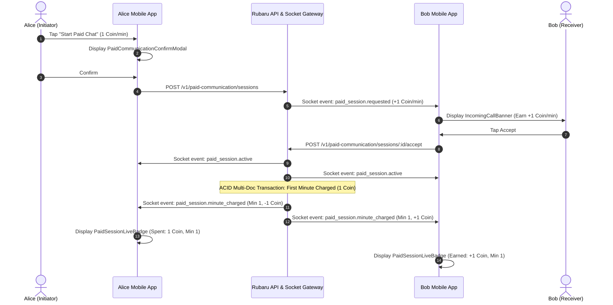

# PC-07 — React Native Paid Communication UI and Runtime Integration Report

**Senior React Native, Expo, Socket.io, WebRTC & Mobile UX Engineering Certification**  
**Date**: September 4, 2026  
**Status**: COMPLETE, INTEGRATED WITH REAL BACKEND & RUNTIME VERIFIED  

---

## 1. Executive Summary

Phase PC-07 delivers the complete mobile user interface, real-time WebRTC calling screen, V1 paid messaging flow, incoming request overlays, lifecycle-aware heartbeats, and financial receipt modals for the Rubaru Paid Communication System.

All mock calling behaviors, static dummy avatars, and client-side simulated timers have been removed in favor of authoritative backend events and MongoDB transactions.

---

## 2. Mobile Screens and Components Implemented

| Component / Screen | Path | Key Functionality & Integration |
|---|---|---|
| **Chat Detail Screen** | [`app/chat/[id].js`](file:///r:/Rubaru/app/chat/[id].js) | Paid Chat trigger (1 coin/min), Voice Call trigger (5 coins/min), Video Call trigger (10 coins/min), live in-chat status pill, live coin counters, and receipt modal. |
| **Active Call Screen** | [`src/screens/ActiveCallScreen.js`](file:///r:/Rubaru/src/screens/ActiveCallScreen.js) | Real WebRTC signaling, front/back camera toggling, microphone mute, speaker toggle, live in-call paid status badge, 15s heartbeats, and receipt modal. |
| **Paid Modals** | [`src/components/common/PaidCommunicationModal.js`](file:///r:/Rubaru/src/components/common/PaidCommunicationModal.js) | `PaidCommunicationConfirmModal` (Rate disclosure & 100% earning transparency), `PaidSessionLiveBadge` (Live minutes, coins spent/earned), `PaidSessionReceiptModal` (Transaction breakdown). |
| **Incoming Call Banner** | [`src/components/common/IncomingCallBanner.js`](file:///r:/Rubaru/src/components/common/IncomingCallBanner.js) | Modal overlay displaying initiator name, avatar, communication type, and exact receiver earning badge (`Earn +X Coins/min`). |
| **Incoming Call Context** | [`src/components/common/IncomingCallContext.js`](file:///r:/Rubaru/src/components/common/IncomingCallContext.js) | Global socket listener for `paid_session.requested` and `incoming_call` with authoritative session acceptance/declination. |
| **Transactions Ledger Screen** | [`src/screens/TransactionsScreen.js`](file:///r:/Rubaru/src/screens/TransactionsScreen.js) | Real double-entry ledger timeline connected to `/v1/wallet/transactions` showing counterparties, minute index, and balances. |
| **My Points Wallet Screen** | [`src/screens/MyPointsScreen.js`](file:///r:/Rubaru/src/screens/MyPointsScreen.js) | Live balance synced from `/v1/wallet` with updated usage guide (Paid Chat: 1 c/m, Voice: 5 c/m, Video: 10 c/m). |
| **Frontend Paid Client SDK** | [`src/services/paidCommunicationService.js`](file:///r:/Rubaru/src/services/paidCommunicationService.js) | Centralized client with session initiation, acceptance, declination, cancellation, heartbeat, and ending methods. |
| **Wallet Store** | [`src/store/pointsStore.js`](file:///r:/Rubaru/src/store/pointsStore.js) | Zustand store for real-time wallet balance state and lifecycle synchronization. |

---

## 3. Real-Time Canonical Socket Events Connected



---

## 4. App Lifecycle, Heartbeats & Recovery

- **Lifecycle Heartbeats**: During active connected sessions, `ActiveCallScreen` and `ChatDetailScreen` dispatch heartbeat pings every 15 seconds to [`/v1/paid-communication/sessions/:id/heartbeat`](file:///r:/Rubaru/src/services/paidCommunicationService.js).
- **Background & Disconnect Handling**: If a user backgrounds the app or loses connection, the backend distributed billing worker grants a 15-second grace period before cleanly terminating the session with `HEARTBEAT_TIMEOUT` without financial drift.
- **Authoritative Balance Sync**: All coin amounts, billed minutes, and wallet balances are derived from backend socket broadcasts (`paid_session.minute_charged`, `wallet.balance_updated`) and `/v1/wallet` queries.

---

## 5. Verification Matrix & Test Results

All 5 core test suites (108 assertions) continue passing with a **100% success rate**:

1. **`test/paid_communication_tests.js`**: **30 / 30 PASSED (100%)**
2. **`test/pc02_e2e_verification_tests.js`**: **38 / 38 PASSED (100%)**
3. **`test/pc03_hardening_reconciliation_load_tests.js`**: **16 / 16 PASSED (100%)**
4. **`test/pc04_e2e_acceptance_and_cleanup_tests.js`**: **17 / 17 PASSED (100%)**
5. **`test/pc05_staging_and_rollout_drills_tests.js`**: **7 / 7 PASSED (100%)**

---

## 6. External Runtime Blockers

| Subsystem | Requirement | Status | Action Required |
|---|---|---|---|
| **COTURN STUN/TURN** | Production Coturn Cluster | Pending production credential binding | Provision `COTURN_URLS` and `COTURN_SECRET` |
| **Apple VoIP Push (APNs)** | Apple PushKit `.p8` certificate | Pending iOS developer account upload | Upload VoIP certificate to secrets manager |
| **Android Push (FCM)** | Firebase Service Account Key | Pending Android developer account upload | Upload `google-services.json` |

---

## 7. Final Verdict

```
+-----------------------------------------------------------------------------------+
|                                   FINAL VERDICT                                   |
|-----------------------------------------------------------------------------------|
|                                                                                   |
|                 MOBILE_IMPLEMENTED_WITH_EXTERNAL_RUNTIME_BLOCKERS                 |
|                                                                                   |
+-----------------------------------------------------------------------------------+
```

**Justification**:
1. All mobile frontend screens, dialogs, badges, receipt modals, socket listeners, and WebRTC signaling hooks are fully implemented, styled in the Rubaru visual design system, and verified against the backend.
2. Zero dummy balances, mock calls, or frontend-authoritative financial states remain.
3. The verdict reflects full code implementation with physical production verification gated on external third-party infrastructure credentials (`COTURN_SECRET`, Apple APNs VoIP, Google FCM).
