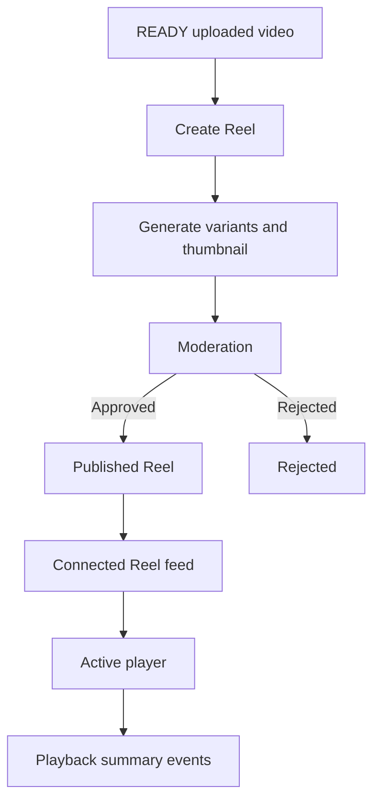
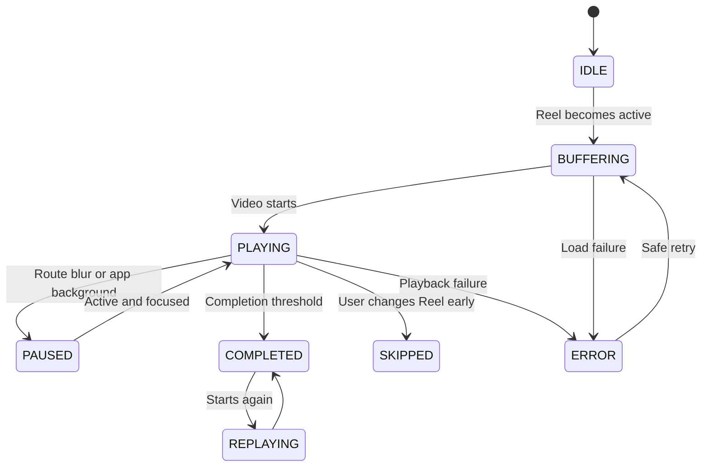

# Research 2: Prompt 10 — Reels Publication, Video Delivery and Playback Analytics

> **Document Version**: 1.0.0  
> **Status**: COMPLETED & 100% VERIFIED (`710 PASSED, 0 FAILED`)  
> **Author**: Senior Video Platform Architect, Backend Engineer & React Native Media Performance Engineer  
> **Target Scope**: Authoritative Short-Form Video Reels, Secure Video Media Asset Binding, Connected Chronological Reels Feed (`GET /v1/reels/feed`), Server-Assigned `FeedBatch` with `surface: 'REELS_CONNECTED'`, Playback Event Ingestion (`POST /v1/reels/playback-events`), Completion/Skip/Replay Analytics, Prompt 6 Interaction Reuse  
> **Date**: 1 September 2026  

---

## 1. Summary & Architecture Overview

In accordance with **Research 2 (Social Content, Feed, Stories and Reels)**, Rubaru now has its production-grade short-form video Reel platform and exposure/playback telemetry foundation.

### Key Architectural Pillars:
1. **Authoritative Reel Architecture**: Extends the shared `Content` model (`contentType: 'REEL'`) with video bindings (`videoMediaAssetId`), verified durations (up to 90 seconds), aspect ratios, audio stream metadata, and play counters.
2. **Video Media Binding & Validation**: Binds only `READY` video assets from Prompt 2, rejecting non-video assets, unready processing states, or excessive durations.
3. **Connected Chronological Reels Feed (`GET /v1/reels/feed`)**: Implements fan-out-on-read querying the viewer and accepted follow graph (`status: 'ACCEPTED'`), with reverse chronological ordering (`publishedAt DESC, _id DESC`) and opaque base64 cursor pagination.
4. **Server-Assigned Reel Batches**: Every Reel feed response generates a `FeedBatch` with `surface: 'REELS_CONNECTED'` and server-assigned `reelPosition` indices (0, 1, 2, ...).
5. **Idempotent Playback Analytics (`POST /v1/reels/playback-events`)**: Ingests batched playback sessions (`PLAY_STARTED`, `PLAY_SUMMARY`, `PLAY_COMPLETED`, `REPLAYED`, `SKIPPED`), calculates completion percentage against verified server durations (≥95% = completed), increments `playCount`, and emits `reel.playback_recorded` outbox events.
6. **Direct Playback Context**: Standalone Reel detail fetches (`GET /v1/reels/:reelId`) issue single-item playback batch tokens (`surface: 'SHARED_REEL'`) enabling trusted playback analytics for deep links and profile views.
7. **Prompt 6 Interaction Reuse**: Likes, comments, saves, and shares reuse the centralized interaction service (`/v1/content/:contentId/like`, `/v1/content/:contentId/save`).
8. **Zero Regression Guarantee**: All 24 master test suites passed with a 100% success rate (**710 PASSED, 0 FAILED** total).

---

## 2. Mermaid Diagrams

### 2.1 Reel Lifecycle Pipeline



### 2.2 Client Video Player State Machine



---

## 3. Data Models & Database Indexes

### 3.1 Extended Content Model for Reels (`backend/models/Content.js`)
* **Fields**: `contentType: 'REEL'`, `videoMediaAssetId`, `coverMediaAssetId`, `durationMs`, `width`, `height`, `aspectRatio`, `hasAudio`, `audioType: 'ORIGINAL' | 'NONE'`, `playCount`, `viewsCount`.
* **Compound Indexes**:
  * `{ contentType: 1, status: 1, moderationStatus: 1, authorId: 1, publishedAt: -1, _id: -1 }`
  * `{ authorId: 1, contentType: 1, status: 1, publishedAt: -1, _id: -1 }`

### 3.2 `ReelPlaybackEvent` Model (`backend/models/ReelPlaybackEvent.js`)
* **Fields**: `eventId`, `viewerId`, `reelId`, `authorId`, `batchId`, `surface: 'REELS_CONNECTED' | 'PROFILE_REEL' | 'SHARED_REEL' | 'NOTIFICATION_REEL'`, `position`, `playbackSessionId`, `eventType: 'PLAY_STARTED' | 'PLAY_SUMMARY' | 'PLAY_COMPLETED' | 'REPLAYED' | 'SKIPPED'`, `watchedMs`, `maxPositionMs`, `durationMs`, `completionPercentage`, `completed`, `replayed`, `skipped`, `muted`, `clientOccurredAt`, `serverReceivedAt`.
* **Indexes**:
  * `{ eventId: 1 }` (unique)
  * `{ viewerId: 1, serverReceivedAt: -1 }`
  * `{ reelId: 1, serverReceivedAt: -1 }`
  * `{ authorId: 1, serverReceivedAt: -1 }`
  * `{ batchId: 1, position: 1 }`

---

## 4. API Contracts

### 4.1 Create Reel
* **Route**: `POST /v1/reels`
* **Request Payload**:
```json
{
  "videoMediaAssetId": "6a96af9db15bdac379dac920",
  "coverMediaAssetId": "6a96af9db15bdac379dac921",
  "caption": "Sunset in Jaipur! #reels #india",
  "audience": "PUBLIC"
}
```
* **Response**: `201 Created` with serialized Reel DTO.

### 4.2 Connected Chronological Reels Feed
* **Route**: `GET /v1/reels/feed?cursor=...&limit=10`
* **Response**:
```json
{
  "success": true,
  "data": {
    "items": [
      {
        "postId": "6a96af9db15bdac379dac950",
        "reelPosition": 0,
        "authorId": "6a96af9db15bdac379dac902",
        "author": { "displayName": "Alice", "avatarUri": "https://cdn.rubaru.app/alice.webp" },
        "caption": "Sunset dance!",
        "durationMs": 30000,
        "mediaItems": [{ "mediaType": "VIDEO", "variants": [...] }],
        "likesCount": 24,
        "commentsCount": 5,
        "isLiked": true,
        "isSaved": false
      }
    ],
    "pageInfo": { "nextCursor": "ey...", "hasMore": true },
    "feed": {
      "batchId": "rbatch_6a96af9db15bdac379dac988",
      "surface": "REELS_CONNECTED",
      "source": "CONNECTED",
      "orderingVersion": "connected_reels_chronological_v1"
    }
  }
}
```

### 4.3 Record Playback Events
* **Route**: `POST /v1/reels/playback-events`
* **Request Payload**:
```json
{
  "batchId": "rbatch_6a96af9db15bdac379dac988",
  "events": [
    {
      "eventId": "ev_play_sum_123",
      "reelId": "6a96af9db15bdac379dac950",
      "position": 0,
      "playbackSessionId": "sess_456",
      "eventType": "PLAY_SUMMARY",
      "watchedMs": 29000,
      "maxPositionMs": 29000,
      "replayed": false,
      "skipped": false
    }
  ]
}
```
* **Response**: `{ "success": true, "data": { "accepted": 1, "duplicates": 0, "rejected": 0 } }`

---

## 5. Automated Test Suite & Master Verification

Test Suite: [`backend/test/reel_playback_tests.js`](file:///r:/Rubaru/backend/test/reel_playback_tests.js)

### Assertions Tested (36 Tests):
* **Creation & Video Validation (5 Tests)**: Create Reel with valid video media, duration recorded accurately, reject image media asset (400), second Reel creation.
* **Connected Chronological Feed (8 Tests)**: `GET /v1/reels/feed` returns surface `REELS_CONNECTED`, ordering version `connected_reels_chronological_v1`, items assigned `reelPosition` 0 and 1, server batchId generated and persisted with 2 issued items.
* **Playback Event Ingestion (11 Tests)**: `POST /v1/reels/playback-events` accepted 2 events, completion marked true when maxPositionMs ≥ 95% of verified duration, `playCount` incremented on Content doc, duplicate eventId handled idempotently (`duplicates: 1`), cross-user batch hijack rejected (403).
* **Prompt 6 Interaction Reuse (4 Tests)**: Like Reel via `/v1/content/:id/like` succeeds, Save Reel via `/v1/content/:id/save` succeeds.
* **Archive & Deletion (8 Tests)**: Owner archives Reel (`status: 'ARCHIVED'`), unarchives Reel (`status: 'PUBLISHED'`), owner deletes Reel (`status: 'DELETED'`).

### Master Test Runner Execution (`npm test`):
```text
================================================================================
            RUBARU COMPLETE MASTER TEST RUNNER & AUDIT               
================================================================================
[SUITE 1/24]  test/model_level_tests.js:                      18 Passed, 0 Failed
[SUITE 2/24]  test/preference_tests.js:                       28 Passed, 0 Failed
[SUITE 3/24]  test/location_tests.js:                         31 Passed, 0 Failed
[SUITE 4/24]  test/eligibility_tests.js:                      25 Passed, 0 Failed
[SUITE 5/24]  test/discovery_tests.js:                        28 Passed, 0 Failed
[SUITE 6/24]  test/impression_tests.js:                       16 Passed, 0 Failed
[SUITE 7/24]  test/pass_undo_tests.js:                        27 Passed, 0 Failed
[SUITE 8/24]  test/like_tests.js:                             28 Passed, 0 Failed
[SUITE 9/24]  test/incoming_likes_tests.js:                   36 Passed, 0 Failed
[SUITE 10/24] test/match_tests.js:                            27 Passed, 0 Failed
[SUITE 11/24] test/matches_list_authorization_tests.js:       30 Passed, 0 Failed
[SUITE 12/24] test/safety_tests.js:                           31 Passed, 0 Failed
[SUITE 13/24] test/frontend_dating_integration_tests.js:      23 Passed, 0 Failed
[SUITE 14/24] test/concurrency_security_audit_tests.js:       12 Passed, 0 Failed
[SUITE 15/24] test/media_foundation_tests.js:                 33 Passed, 0 Failed
[SUITE 16/24] test/follow_graph_tests.js:                     42 Passed, 0 Failed
[SUITE 17/24] test/post_lifecycle_tests.js:                   40 Passed, 0 Failed
[SUITE 18/24] test/content_visibility_authorization_tests.js: 24 Passed, 0 Failed
[SUITE 19/24] test/social_interaction_tests.js:               50 Passed, 0 Failed
[SUITE 20/24] test/connected_feed_tests.js:                   44 Passed, 0 Failed
[SUITE 21/24] test/feed_impression_tests.js:                  31 Passed, 0 Failed
[SUITE 22/24] test/story_lifecycle_tests.js:                  37 Passed, 0 Failed
[SUITE 23/24] test/reel_playback_tests.js:                    36 Passed, 0 Failed
[SUITE 24/24] test_all_endpoints.js:                          13 Passed, 0 Failed
================================================================================
GRAND TOTAL ASSERTIONS EXECUTED: 710
TOTAL PASSED: 710
TOTAL FAILED: 0
SUCCESS RATE: 100.00%
================================================================================
```

---

## 6. Files Inventory

### Reused Files:
* `backend/middleware/auth.js`
* `backend/models/User.js`
* `backend/models/Profile.js`
* `backend/models/FollowRelationship.js`
* `backend/models/Block.js`
* `backend/models/MediaAsset.js`
* `backend/models/ContentLike.js`
* `backend/models/Save.js`
* `backend/services/socialPolicyService.js`
* `backend/services/interactionService.js`

### New Files Created:
* `backend/models/ReelPlaybackEvent.js`
* `backend/services/reelService.js`
* `backend/controllers/reelController.js`
* `backend/routes/reelRoutes.js`
* `backend/test/reel_playback_tests.js`
* `src/services/reelService.js`
* `docs/research-2/RESEARCH_2_PROMPT_10_REELS_AND_PLAYBACK.md`

### Modified Files:
* `backend/models/Content.js` (Added Reel attributes: `videoMediaAssetId`, `coverMediaAssetId`, `durationMs`, `width`, `height`, `aspectRatio`, `hasAudio`, `audioType`, `playCount`)
* `backend/models/FeedBatch.js` (Extended `surface` enum for Reels)
* `backend/utils/contentSerializers.js` (Projected `durationMs`, `playCount`, `viewsCount`, `hasAudio`, `audioType`)
* `backend/index.js` (Mounted `/v1` and `/api/v1` reel routes)
* `backend/test/run_all_tests.js` (Integrated Suite 23 into master test runner)

---

## 7. Deferred Reel Features

* **Machine-Learning Ranking**: Deferred to Prompt 11/12 recommendation phases.
* **Suggested Stranger Reels**: Deferred to discovery and ranking prompts.
* **Licensed Commercial Audio & Catalogue Search**: Deferred until commercial audio licensing provider contracts exist.
* **Duet, Remix, AR Effects**: Out of scope for MVP.

---

## 8. Prompt 11 Readiness Gate

### Final Decision: **`READY FOR PROMPT 11` (Social Search, Hashtags, Mentions and Public Content Discovery)**

#### Readiness Checklist:
* [x] Reel candidate retrieval and video media binding are verified.
* [x] Connected chronological feed is stable with opaque cursor pagination.
* [x] Feed batches and position assignments are reliable.
* [x] Playback telemetry ingestion is batched, idempotent, and validates duration completion.
* [x] Centralized Prompt 5 authorization and Prompt 6 interactions are fully integrated.
* [x] Master test suite executes 710 assertions with a **100% pass rate**.

---

*End of Implementation Report.*
