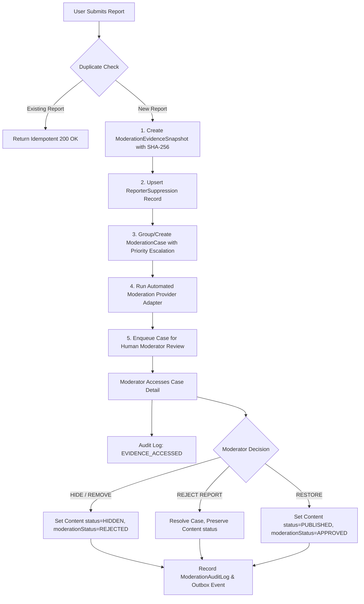
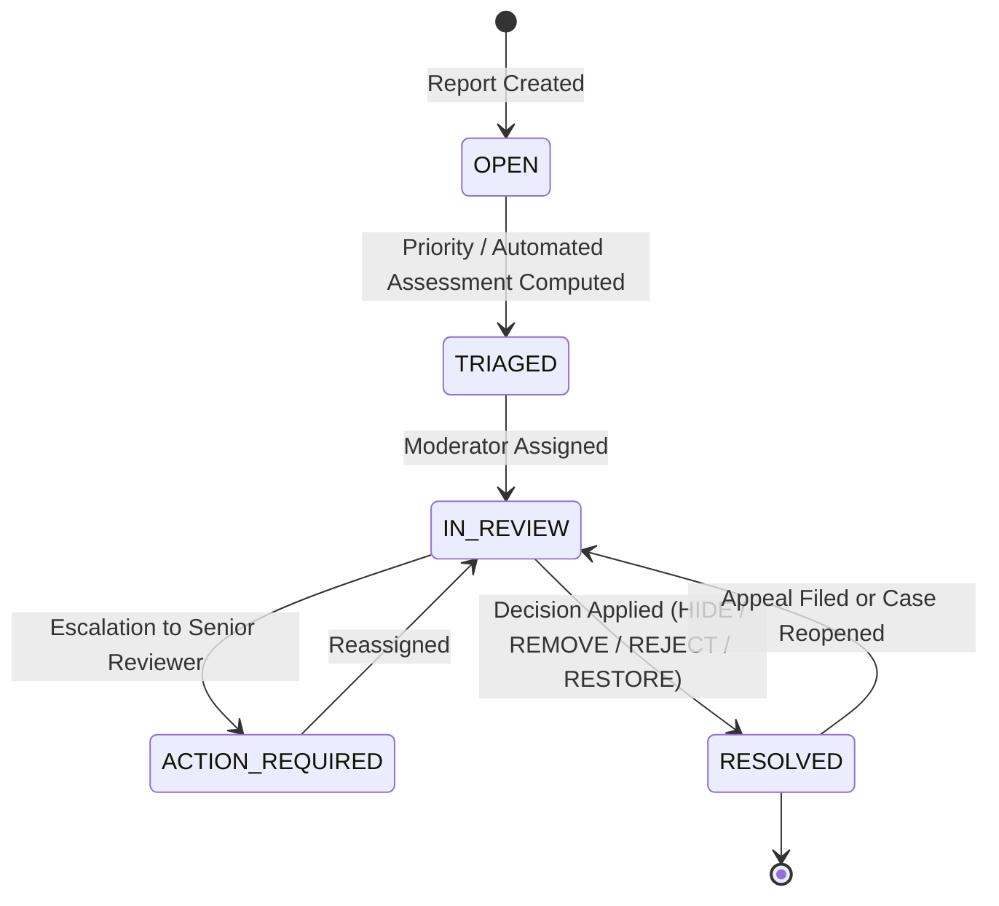

# Research 2 — Prompt 12 of 15: Social Content Reporting, Moderation and Safety Enforcement

## 1. Executive Summary & Architecture Overview

Rubaru's Trust and Safety architecture provides unified, high-integrity content reporting and human moderation enforcement across all social content surfaces:
- **Posts & Carousels**
- **Short-form Reels**
- **Ephemeral Stories**
- **Social Comments**
- **User Profiles**

Dating apps demand an uncompromising approach to safety. Safety decisions strictly **override** engagement scores, discovery algorithms, and recommendation feeds. 

```
                                    +----------------------------------------+
                                    |        Client Report Submission        |
                                    | (POST /v1/content/:id/report, /users)  |
                                    +-------------------+--------------------+
                                                        |
                                 +----------------------+----------------------+
                                 |                                             |
                                 v                                             v
               +----------------------------------+          +-----------------------------------+
               |  ModerationEvidenceSnapshot.js   |          |     ReporterSuppression.js        |
               |  - SHA-256 Checksum              |          |  - Instant invisibility for       |
               |  - Content & Media Asset Backup  |          |    reporter on single & batch     |
               |  - Immune to future author edits |          |    feed evaluations               |
               +-----------------+----------------+          +-----------------------------------+
                                 |
                                 v
               +----------------------------------+
               |        ModerationCase.js         |
               |  - Grouped by Subject & Owner    |
               |  - Priority: CRITICAL -> LOW     |
               |  - Auto-assessment Provider      |
               |  - Assignment Locking            |
               +-----------------+----------------+
                                 |
                                 v
               +----------------------------------+
               |     Moderator Actions & Audits   |
               |  - Actions: HIDE/REMOVE/RESTORE  |
               |  - Immutable ModerationAuditLog  |
               |  - Outbox Notification Delivery  |
               +----------------------------------+
```

---

## 2. Unified Reporting Taxonomy & Data Models

### 2.1 Enums (`backend/models/enums.js`)
```javascript
const ReportSubjectTypes = Object.freeze({
  USER: 'USER',
  POST: 'POST',
  REEL: 'REEL',
  STORY: 'STORY',
  COMMENT: 'COMMENT',
  MESSAGE: 'MESSAGE',
  GROUP: 'GROUP',
});

const ReportCategories = Object.freeze({
  UNDERAGE_SAFETY: 'UNDERAGE_SAFETY',
  NUDITY_OR_SEXUAL: 'NUDITY_OR_SEXUAL',
  HATE_SPEECH: 'HATE_SPEECH',
  HARASSMENT_OR_BULLYING: 'HARASSMENT_OR_BULLYING',
  VIOLENCE_OR_THREATS: 'VIOLENCE_OR_THREATS',
  SCAM_OR_FRAUD: 'SCAM_OR_FRAUD',
  IMPERSONATION: 'IMPERSONATION',
  SUICIDE_OR_SELF_HARM: 'SUICIDE_OR_SELF_HARM',
  SPAM: 'SPAM',
  OTHER: 'OTHER',
});

const ModerationPriorities = Object.freeze({
  CRITICAL: 'CRITICAL', // Immediate escalation (Underage, Violence, Suicide)
  HIGH: 'HIGH',         // High priority (Nudity, Hate speech, Harassment)
  MEDIUM: 'MEDIUM',     // Standard priority (Scam, Impersonation)
  LOW: 'LOW',           // Low priority (Spam, Other)
});
```

### 2.2 Models
- **`Report.js`**: Unified document storing reporter ID, subject type, subject ID, subject owner ID, category, description, snapshot reference, and case linkage. Protected by compound unique index `{ reporter: 1, subjectType: 1, subjectId: 1, category: 1 }` preventing report spam.
- **`ModerationEvidenceSnapshot.js`**: Stores raw text, caption, media asset references, and calculated SHA-256 checksums at the exact moment of report creation.
- **`ReporterSuppression.js`**: Provides instant O(1) suppression for the reporting user across all feed and profile reads.
- **`ModerationCase.js`**: Aggregate queue document grouping reports on the same subject. Tracks workflow state, assigned moderator, priority tier, automated assessments, and decision history.
- **`ModerationAuditLog.js`**: Immutable audit trails logging every moderator interaction (case assignment, evidence access, and final moderation determinations).

---

## 3. Workflow Diagrams

### 3.1 Content Reporting & Moderation Decision Flow


### 3.2 ModerationCase State Transition Diagram


---

## 4. Immediate Reporter Suppression & Policy Enforcement

When a user reports a Post, Story, Reel, Comment, or User, suppression takes effect **instantly** without waiting for human review:
1. `ReporterSuppression` table stores `{ reporterId, subjectType, subjectId }`.
2. `socialPolicyService.evaluateSocialContentAccess(viewerId, contentId)` queries suppression; if suppressed, it immediately rejects the read with `404 Not Found` and reason `SUPPRESSED`.
3. `socialPolicyService.batchEvaluateContentAccess(viewerId, contentDocs)` filters out suppressed items from connected feeds, Story trays, and Reel feeds in O(1) time complexity.
4. If `blockUser: true` / `alsoBlock: true` is requested, an atomic social block is applied simultaneously via `safetyService.blockUser()`.

---

## 5. Security & Privacy Guarantees

1. **Reporter Anonymity**: Author notifications, audit logs displayed to users, and moderation notifications NEVER expose reporter identity or timestamps.
2. **Evidence Integrity**: Authors attempting to edit captions or delete content cannot alter or purge `ModerationEvidenceSnapshot` documents.
3. **Audit Trail Completeness**: Every moderator action records `moderatorId`, `action`, `reason`, `ipAddress`, and `userAgent` in `ModerationAuditLog`.
4. **No Unchecked Permanent Bans**: Automated ML classifiers assign priority queues and auto-flag cases, but human moderators make the final determination.

---

## 6. Verification & Test Coverage Summary

A dedicated test suite `backend/test/social_safety_moderation_tests.js` was executed and integrated into the master test runner (`backend/test/run_all_tests.js`).

### Master Test Suite Breakdown:
- **Total Test Suites Executed**: 25 / 25
- **Total Assertions Executed**: **752**
- **Total Assertions Passed**: **752**
- **Total Assertions Failed**: **0**
- **Master Pass Rate**: **100.00%**
