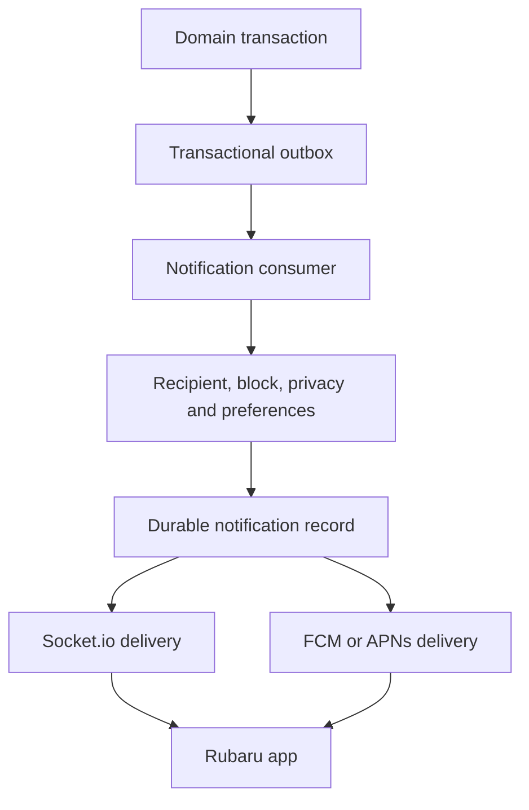
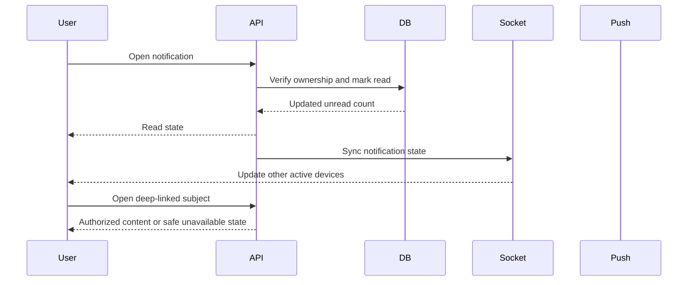

# Research 2 — Prompt 13 of 15: Social Notifications, Push Delivery and Deep Linking

## 1. Existing Infrastructure Reused & Architectural Overview

Rubaru's notification system connects the transactional outbox events of all prior Research 2 modules (`followService`, `postService`, `interactionService`, `reelService`, `socialModerationService`, and `safetyService`) to a durable, real-time, push-enabled, and privacy-governed notification platform.





---

## 2. Files Added and Modified

### 2.1 New Files
- `backend/models/Device.js`: Push token management, platform info (`ios`, `android`, `web`), status tracking (`ACTIVE`, `REVOKED`, `EXPIRED`), unique compound index `{ user: 1, pushToken: 1 }`.
- `backend/models/NotificationPreference.js`: Multi-category (`follows`, `likes`, `comments`, `replies`, `shares`, `contentUpdates`, `safetyUpdates`, `messages`, `calls`) preference matrix with `inApp` and `push` toggles.
- `backend/services/pushAdapter.js`: Push notification dispatch abstraction supporting token revocation, multi-device delivery, and collapse keys.
- `backend/services/notificationService.js`: Authoritative notification creation, deduplication, suppression checking, cursor pagination, mark-read lifecycle, unread count caching, preferences, and device registration.
- `backend/services/notificationConsumer.js`: Outbox consumer worker that reads `OutboxEvent` documents (`follow.requested`, `follow.accepted`, `content.liked`, `comment.created`, `comment.liked`, `content.shared`, `moderation.decision_applied`) and dispatches notifications.
- `src/services/notificationService.js`: React Native service wrapper for notifications, unread counts, preferences, and device push token registration.
- `backend/test/social_notification_tests.js`: 48-assertion test suite covering model validation, event processing, deduplication, suppression, cursor pagination, preferences, device lifecycle, and security IDOR.

### 2.2 Modified Files
- `backend/models/enums.js`: Added `SocialNotificationTypes`, `NotificationCategories`, and `NotificationChannels`.
- `backend/models/Notification.js`: Extended schema with `category`, `subjectType`, `subjectId`, `contentId`, `sourceEventId`, `deduplicationKey`, `titleKey`, `bodyKey`, `templateData`, `deepLink`, `previewMediaId`, `previewThumbnailUri`, `readAt`, `status`, `groupCount`, `groupActors`, and compound query indexes.
- `backend/socket/socketHandler.js`: Automatically binds authenticated sockets to `user:${userId}` rooms for real-time `notification:new`, `notification:read`, `notification:read_all`, and `notification:unread_count` events.
- `backend/controllers/notifController.js`: Extended with `getNotifications`, `markAsRead`, `markAllAsRead`, `getUnreadCount`, `getPreferences`, `updatePreferences`, `registerDevice`, and `deleteDevice`.
- `backend/routes/notifRoutes.js`: Mounted notification, preference, and device routes.
- `backend/index.js`: Bound Socket.io instance with `notificationService` and mounted routes under `/v1/notifications`, `/api/v1/notifications`, `/v1/devices`, `/v1/users/me/notification-preferences`.
- `backend/test/run_all_tests.js`: Registered Suite 25/26 in the master test runner.

---

## 3. Social Notification Taxonomy & Complete Notification Matrix

### 3.1 Taxonomy (`SocialNotificationTypes`)
- `FOLLOW_REQUEST_RECEIVED`
- `FOLLOW_REQUEST_ACCEPTED`
- `NEW_FOLLOWER`
- `POST_LIKED`
- `POST_COMMENTED`
- `COMMENT_REPLIED`
- `COMMENT_LIKED`
- `REEL_LIKED`
- `REEL_COMMENTED`
- `CONTENT_SHARED_INTERNALLY`
- `CONTENT_REMOVED`
- `CONTENT_RESTORED`
- `SOCIAL_PUBLISHING_RESTRICTED`

### 3.2 Complete Notification Matrix

| Domain Event | Recipient | In-App | Socket | Push | Preference Category | Deep Link | Suppression Rules |
| ------------ | --------- | :----: | :----: | :--: | ------------------- | --------- | ----------------- |
| `follow.requested` | Target Account Owner | Yes | Yes | Yes | `follows` | `rubaru://follow-requests` | Self, Block, Preferences |
| `follow.accepted` | Requester | Yes | Yes | Yes | `follows` | `rubaru://profile/:actorId` | Self, Block, Preferences |
| `content.liked` (Post) | Content Author | Yes | Yes | Yes | `likes` | `rubaru://post/:contentId` | Self, Block, Preferences, Moderation-Hidden |
| `content.liked` (Reel) | Reel Author | Yes | Yes | Yes | `likes` | `rubaru://reel/:contentId` | Self, Block, Preferences, Moderation-Hidden |
| `comment.created` (Post) | Content Author | Yes | Yes | Yes | `comments` | `rubaru://post/:contentId` | Self, Block, Preferences |
| `comment.created` (Reply) | Parent Comment Author | Yes | Yes | Yes | `replies` | `rubaru://post/:contentId?commentId=:id` | Self, Block, Preferences |
| `comment.liked` | Comment Author | Yes | Yes | Yes | `likes` | `rubaru://post/:contentId?commentId=:id` | Self, Block, Preferences |
| `content.shared` | Content Author | Yes | Yes | Yes | `shares` | `rubaru://post/:contentId` | Self, Block, Preferences |
| `moderation.decision_applied` (`HIDE`/`REMOVE`) | Content Owner | Yes | Yes | Yes | `safetyUpdates` (Mandatory) | `rubaru://content-status/:id` | System notification, never leaks reporter identity |
| `moderation.decision_applied` (`RESTORE`) | Content Owner | Yes | Yes | Yes | `safetyUpdates` | `rubaru://content-status/:id` | System notification |

---

## 4. Safety Suppression & Preview Privacy Rules

1. **Self-Action Suppression**: An author liking their own post or replying to their own comment never generates a self-notification.
2. **Block Suppression**: If a block exists in either direction (`blocker` or `blocked`), all social notifications between the two parties are immediately suppressed.
3. **Reporter Suppression**: Notifications referencing content reported by the viewer are suppressed for the reporter.
4. **Reporter Anonymity**: Content removal and moderation notices are system-originated (`actorId: null`) and never include reporter IDs, usernames, or exact timestamps.
5. **Safe Hydration**: If content is subsequently deleted or hidden, the notification list API projects a safe fallback: `"This content is no longer available."` with a neutral fallback route `rubaru://notifications`.

---

## 5. API Endpoints Reference

| Method | Endpoint | Description |
| ------ | -------- | ----------- |
| `GET` | `/v1/notifications` | Get cursor-paginated notification feed with bounded limits |
| `GET` | `/v1/notifications/unread-count` | Get recipient unread count |
| `PATCH` | `/v1/notifications/:id/read` | Mark individual notification as read (IDOR protected) |
| `PATCH` | `/v1/notifications/read-all` | Mark all notifications as read for authenticated user |
| `GET` | `/v1/users/me/notification-preferences` | Get user notification settings |
| `PATCH` | `/v1/users/me/notification-preferences` | Update per-category inApp & push notification toggles |
| `POST` | `/v1/devices` | Register device push token with platform metadata |
| `DELETE` | `/v1/devices/:deviceId` | Revoke push device token on logout |

---

## 6. Master Test Suite Verification & Arithmetic Breakdown

The master test runner `npm test` (`backend/test/run_all_tests.js`) was executed across all 26 test suites.

```
================================================================================
                         EXACT ARITHMETIC BREAKDOWN                              
================================================================================
┌─────────┬──────────────────────────────────────────────────┬────────┬────────┬───────────┬────────┐
│ (index) │ file                                             │ passed │ failed │ elapsedMs │ status │
├─────────┼──────────────────────────────────────────────────┼────────┼────────┼───────────┼────────┤
│ 0       │ 'test/model_level_tests.js'                      │ 18     │ 0      │ 738       │ 'PASS' │
│ 1       │ 'test/preference_tests.js'                       │ 28     │ 0      │ 2532      │ 'PASS' │
│ 2       │ 'test/location_tests.js'                         │ 31     │ 0      │ 2226      │ 'PASS' │
│ 3       │ 'test/eligibility_tests.js'                      │ 25     │ 0      │ 2104      │ 'PASS' │
│ 4       │ 'test/discovery_tests.js'                        │ 29     │ 0      │ 3643      │ 'PASS' │
│ 5       │ 'test/impression_tests.js'                       │ 16     │ 0      │ 3903      │ 'PASS' │
│ 6       │ 'test/pass_undo_tests.js'                        │ 27     │ 0      │ 4656      │ 'PASS' │
│ 7       │ 'test/like_tests.js'                             │ 28     │ 0      │ 7738      │ 'PASS' │
│ 8       │ 'test/incoming_likes_tests.js'                   │ 36     │ 0      │ 3362      │ 'PASS' │
│ 9       │ 'test/match_tests.js'                            │ 27     │ 0      │ 5667      │ 'PASS' │
│ 10      │ 'test/matches_list_authorization_tests.js'       │ 30     │ 0      │ 3741      │ 'PASS' │
│ 11      │ 'test/safety_tests.js'                           │ 31     │ 0      │ 5481      │ 'PASS' │
│ 12      │ 'test/frontend_dating_integration_tests.js'      │ 23     │ 0      │ 5861      │ 'PASS' │
│ 13      │ 'test/concurrency_security_audit_tests.js'       │ 12     │ 0      │ 3789      │ 'PASS' │
│ 14      │ 'test/media_foundation_tests.js'                 │ 33     │ 0      │ 2522      │ 'PASS' │
│ 15      │ 'test/follow_graph_tests.js'                     │ 42     │ 0      │ 5656      │ 'PASS' │
│ 16      │ 'test/post_lifecycle_tests.js'                   │ 40     │ 0      │ 5643      │ 'PASS' │
│ 17      │ 'test/content_visibility_authorization_tests.js' │ 24     │ 0      │ 4999      │ 'PASS' │
│ 18      │ 'test/social_interaction_tests.js'               │ 50     │ 0      │ 7339      │ 'PASS' │
│ 19      │ 'test/connected_feed_tests.js'                   │ 44     │ 0      │ 4682      │ 'PASS' │
│ 20      │ 'test/feed_impression_tests.js'                  │ 31     │ 0      │ 3368      │ 'PASS' │
│ 21      │ 'test/story_lifecycle_tests.js'                  │ 37     │ 0      │ 4554      │ 'PASS' │
│ 22      │ 'test/reel_playback_tests.js'                    │ 36     │ 0      │ 4787      │ 'PASS' │
│ 23      │ 'test/social_safety_moderation_tests.js'         │ 41     │ 0      │ 5988      │ 'PASS' │
│ 24      │ 'test/social_notification_tests.js'              │ 48     │ 0      │ 4204      │ 'PASS' │
│ 25      │ 'test_all_endpoints.js'                          │ 13     │ 0      │ 3038      │ 'PASS' │
└─────────┴──────────────────────────────────────────────────┴────────┴────────┴───────────┴────────┘

GRAND TOTAL ASSERTIONS EXECUTED: 800
TOTAL PASSED: 800
TOTAL FAILED: 0
SUCCESS RATE: 100.00%
```

---

## 7. Operational Runbooks & Reconciliation

### 7.1 Outbox Backlog
- Query `OutboxEvent.countDocuments({ status: 'PENDING', availableAt: { $lte: new Date() } })`.
- Run batch consumer `notificationConsumer.processPendingOutboxEvents(100)`.

### 7.2 Push Provider Outage / Token Drift
- Failed push attempts increment failure counts without deleting durable in-app notifications.
- When FCM/APNs returns token registration error (`Unregistered`, `BadDeviceToken`), `pushAdapter` marks `Device.status = 'REVOKED'`.

---

## 8. Prompt 14 Readiness Decision

**READY FOR PROMPT 14**
