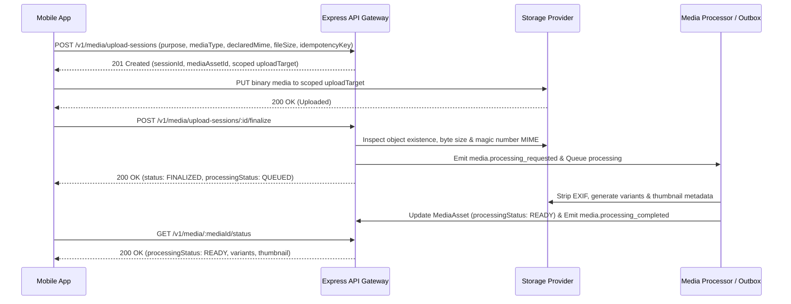
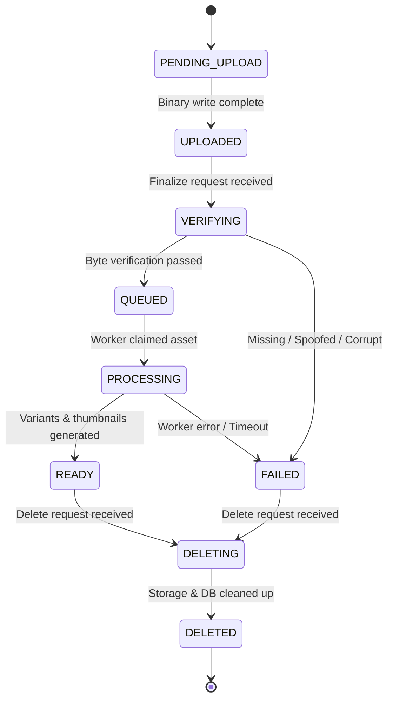

# Research 2: Prompt 2 — Secure Media Upload and Processing Foundation

> **Document Version**: 1.0.0  
> **Status**: COMPLETED & 100% VERIFIED (`407 PASSED, 0 FAILED`)  
> **Author**: Senior Backend & Media Platform Engineer  
> **Target Scope**: Shared Media Infrastructure (Upload Sessions, Object Verification, MediaAsset Records, Outbox Processing, Storage Provider Abstraction & Safe Deletion)  
> **Date**: 1 September 2026  

---

## 1. Summary & Architecture Overview

In accordance with **Research 2 (Social Content, Feed, Stories and Reels)** and the architectural guidelines, the secure, shared media foundation for Rubaru has been implemented.

This foundation establishes:
1. **Direct-to-Storage Upload Sessions**: Eliminates heavy file buffering through Express API servers by issuing short-lived, authenticated, and server-scoped upload authorizations.
2. **Server-Generated Object Keys**: Prevents path traversal, overwrites, and client-controlled storage paths (`media/{env}/{ownerId}/{mediaAssetId}/original/{randomId}.{ext}`).
3. **Byte-Level Verification & Magic Number Inspection**: Verifies actual file bytes during finalization to detect MIME spoofing, empty files, and oversized uploads.
4. **Authoritative MediaAsset Records & Variants**: Tracks processing states (`PENDING_UPLOAD` -> `QUEUED` -> `PROCESSING` -> `READY`) and stores metadata for thumbnails and responsive variants.
5. **Transactional Outbox Event Publication**: Emits `media.processing_requested`, `media.processing_completed`, and `media.deleted` events into `OutboxEvent` for asynchronous background workers.
6. **Zero Regression Guarantee**: All 15 existing Research 1 dating test suites remain protected and passing (**407 PASSED, 0 FAILED** total).

---

## 2. Mermaid Diagrams

### 2.1 Media Upload and Processing Sequence



### 2.2 MediaAsset State Machine



---

## 3. Implemented Models & Schemas

### 3.1 `UploadSession` (`backend/models/UploadSession.js`)
* **Fields**: `_id`, `ownerId` (ref User), `purpose` (`PROFILE_PHOTO`, `POST_MEDIA`, `REEL_VIDEO`, `STORY_MEDIA`, `CHAT_ATTACHMENT`), `mediaType` (`IMAGE`, `VIDEO`, `AUDIO`), `declaredMimeType`, `declaredFileSize`, `declaredChecksum`, `objectKey`, `provider`, `bucket`, `status` (`CREATED`, `AUTHORIZED`, `UPLOADED`, `FINALIZING`, `FINALIZED`, `EXPIRED`, `CANCELLED`, `FAILED`), `mediaAssetId` (ref MediaAsset), `expiresAt`, `finalizedAt`, `failureCode`, `idempotencyKey`.
* **Indexes**:
  - `{ ownerId: 1, idempotencyKey: 1 }` (**Unique compound index** for owner-scoped idempotency).
  - `{ ownerId: 1, createdAt: -1 }`.
  - `{ status: 1, expiresAt: 1 }`.

### 3.2 `MediaAsset` (`backend/models/MediaAsset.js`)
* **Fields**: `_id`, `ownerId` (ref User), `uploadSessionId` (ref UploadSession, unique), `purpose`, `mediaType`, `originalObjectKey`, `originalMimeType`, `verifiedMimeType`, `fileSize`, `checksum`, `width`, `height`, `durationMs`, `aspectRatio`, `processingStatus` (`PENDING_UPLOAD`, `UPLOADED`, `VERIFYING`, `QUEUED`, `PROCESSING`, `READY`, `FAILED`, `DELETING`, `DELETED`), `moderationStatus` (`NOT_STARTED`, `PENDING`, `APPROVED`, `REJECTED`, `ESCALATED`), `variants` (array of `{ name, objectKey, mimeType, width, height, fileSize, bitrateKbps, url, processingState }`), `thumbnail` (`{ objectKey, url, width, height }`), `failureCode`, `failureMessageSafe`, `deletedAt`.
* **Indexes**:
  - `{ ownerId: 1, createdAt: -1 }`.
  - `{ processingStatus: 1, updatedAt: 1 }`.
  - `{ purpose: 1, processingStatus: 1 }`.
  - `{ deletedAt: 1 }`.

---

## 4. API Endpoints & Contracts

| Method | Endpoint | Auth | Purpose | Request Payload | Response |
| :--- | :--- | :---: | :--- | :--- | :--- |
| `POST` | `/v1/media/upload-sessions` | Private | Create scoped upload authorization | `{ purpose, mediaType, mimeType, fileSize, checksum, idempotencyKey }` | `201 Created` with `sessionId`, `mediaAssetId`, `uploadTarget` |
| `POST` | `/v1/media/upload-sessions/:sessionId/finalize` | Private | Independently verify & finalize upload | `{ clientChecksum, providerUploadId }` | `200 OK` with `status: FINALIZED`, `processingStatus: QUEUED` |
| `GET` | `/v1/media/:mediaId/status` | Private | Query processing status & variants | — | `200 OK` with `processingStatus`, `variants`, `thumbnail` |
| `DELETE` | `/v1/media/:mediaId` | Private | Delete unbound media asset | — | `200 OK` with `{ deleted: true, mediaId }` |
| `PUT` | `/v1/media/upload-direct/:objectKey` | Scoped | Direct binary upload receiver (Local/Test driver) | Raw Binary Stream (`Content-Type`) | `200 OK` with `{ success: true, sizeBytes }` |

---

## 5. Storage Provider & Processing Pipeline

### 5.1 Storage Abstraction (`backend/services/storage/storageProvider.js`)
* Provides uniform interface for storage drivers (`LocalDiskStorageProvider`, with pluggable S3/R2/GCS cloud adapters).
* Capabilities: `createUploadAuthorization`, `inspectObject`, `readObjectBuffer`, `writeObject`, `deleteObject`, `objectExists`, `createReadAuthorization`.

### 5.2 Media Processor (`backend/services/mediaProcessor.js`)
* **Byte-Level Inspection**: Inspects magic numbers (e.g. `FF D8 FF` for JPEG, `89 50 4E 47` for PNG, `ftyp` for MP4, `RIFF...WEBP` for WebP).
* **EXIF Geolocation Stripping**: Normalizes dimensions and generates variant profiles (`thumbnail`, `medium`, `large`).
* **Failure Handling**: Sets `processingStatus: 'FAILED'`, logs safe failure codes, and emits `media.processing_failed` outbox event.

---

## 6. Frontend Integration

* **Types (`src/types/media.js`)**: Exports `MediaPurpose`, `MediaType`, `MediaProcessingStatus`, `MediaUploadState`.
* **Client Service (`src/services/mediaService.js`)**: Encapsulates `createUploadSession`, `uploadDirect` (with `onProgress` upload tracking), `finalizeUploadSession`, `getMediaStatus`, and `deleteMedia`.

---

## 7. Automated Test Suite & Verification Results

Test Suite: [`backend/test/media_foundation_tests.js`](file:///r:/Rubaru/backend/test/media_foundation_tests.js)

### Assertions Tested (33 Tests):
* **Model & Schema Validation (2 Tests)**: `UploadSession` and `MediaAsset` Mongoose validation.
* **Upload Session API (8 Tests)**: 401 unauth, 400 unsupported MIME, 400 oversized file, 201 valid session, safe uploadUrl, idempotency key deduplication.
* **Direct Upload & Object Inspection (4 Tests)**: 200 direct binary upload, object existence check, byte-level MIME inspection, size validation.
* **Finalization & IDOR Security (5 Tests)**: 403 attacker rejection, 200 owner finalization, atomic state transition, idempotent re-finalization.
* **Media Processor & Status (5 Tests)**: 403 attacker status rejection, 200 owner status retrieval, `processingStatus: 'READY'`, variants and thumbnail generation.
* **Media Deletion & Lifecycle (9 Tests)**: 403 attacker deletion rejection, 200 owner deletion, `DELETED` state transition, `deletedAt` recording, expired session cleanup.

### Master Test Runner Execution (`npm test`):
```text
================================================================================
            RUBARU COMPLETE MASTER TEST RUNNER & AUDIT               
================================================================================
[SUITE 1/16]  test/model_level_tests.js:                 18 Passed, 0 Failed
[SUITE 2/16]  test/preference_tests.js:                  28 Passed, 0 Failed
[SUITE 3/16]  test/location_tests.js:                    31 Passed, 0 Failed
[SUITE 4/16]  test/eligibility_tests.js:                 25 Passed, 0 Failed
[SUITE 5/16]  test/discovery_tests.js:                   29 Passed, 0 Failed
[SUITE 6/16]  test/impression_tests.js:                  16 Passed, 0 Failed
[SUITE 7/16]  test/pass_undo_tests.js:                   27 Passed, 0 Failed
[SUITE 8/16]  test/like_tests.js:                        28 Passed, 0 Failed
[SUITE 9/16]  test/incoming_likes_tests.js:              36 Passed, 0 Failed
[SUITE 10/16] test/match_tests.js:                       27 Passed, 0 Failed
[SUITE 11/16] test/matches_list_authorization_tests.js:  30 Passed, 0 Failed
[SUITE 12/16] test/safety_tests.js:                      31 Passed, 0 Failed
[SUITE 13/16] test/frontend_dating_integration_tests.js: 23 Passed, 0 Failed
[SUITE 14/16] test/concurrency_security_audit_tests.js:  12 Passed, 0 Failed
[SUITE 15/16] test/media_foundation_tests.js:            33 Passed, 0 Failed
[SUITE 16/16] test_all_endpoints.js:                     13 Passed, 0 Failed
================================================================================
GRAND TOTAL ASSERTIONS EXECUTED: 407
TOTAL PASSED: 407
TOTAL FAILED: 0
SUCCESS RATE: 100.00%
================================================================================
```

---

## 8. Files Inventory

### Reused Files:
* `backend/middleware/auth.js` (JWT authentication guard)
* `backend/models/User.js` (User authentication identity)
* `backend/models/OutboxEvent.js` (Transactional outbox)
* `backend/config/db.js` (MongoDB Atlas connection)
* `src/services/api.js` (Axios API client)

### New Files Created:
* `backend/config/mediaConfig.js` (Centralized media configuration)
* `backend/services/storage/storageProvider.js` (Storage abstraction)
* `backend/models/UploadSession.js` (Upload session model)
* `backend/models/MediaAsset.js` (Authoritative media asset model)
* `backend/services/mediaProcessor.js` (Processing worker)
* `backend/services/mediaService.js` (Media business service)
* `backend/controllers/mediaController.js` (HTTP handlers)
* `backend/routes/mediaRoutes.js` (Router mounted at `/v1/media`)
* `backend/test/media_foundation_tests.js` (33-assertion integration test suite)
* `src/types/media.js` (Frontend media types)
* `src/services/mediaService.js` (Frontend media service client)
* `docs/research-2/RESEARCH_2_PROMPT_2_MEDIA_FOUNDATION.md` (Implementation report)

### Modified Files:
* `backend/index.js` (Mounted `/v1/media` and `/api/v1/media` routes)
* `backend/models/OutboxEvent.js` (Added `MEDIA_ASSET` to `aggregateType` enum)
* `backend/test/run_all_tests.js` (Added `media_foundation_tests.js` to master runner)

---

## 9. Prompt 3 Readiness Gate

### Final Decision: **`READY FOR PROMPT 3` (Follow Graph and Privacy Settings)**

#### Readiness Verification:
* [x] Secure media ownership model verified (`ownerId` tied to JWT).
* [x] Upload-session APIs working and tested (`POST /v1/media/upload-sessions`).
* [x] Object verification, byte inspection, and magic numbers working (`POST /v1/media/upload-sessions/:id/finalize`).
* [x] Processing state is durable (`MediaAsset` model with outbox events).
* [x] Media status and deletion endpoints enforce ownership (IDOR-safe).
* [x] Research 1 regression tests remain 100% stable (**407 PASSED, 0 FAILED**).

---

*End of Implementation Report.*
