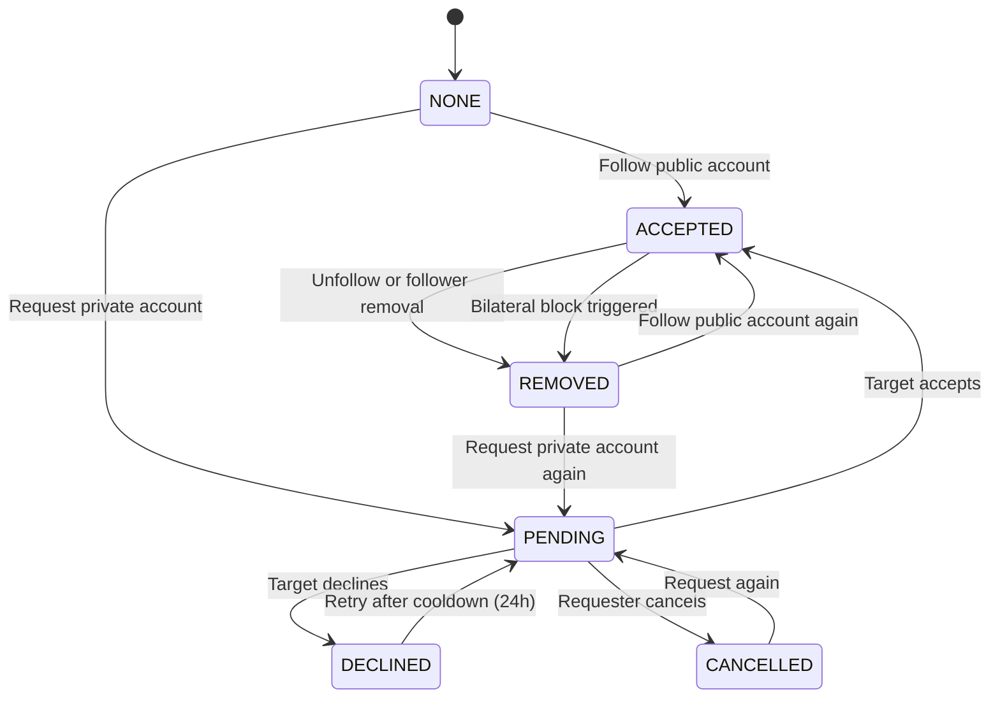
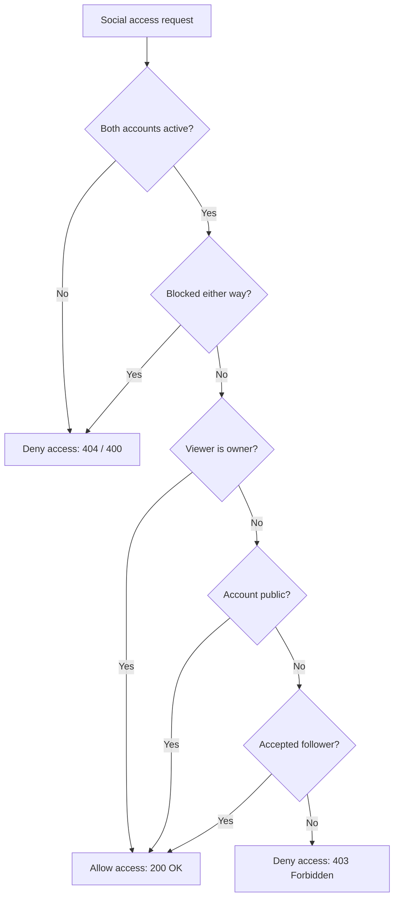

# Research 2: Prompt 3 — Follow Graph, Follow Requests and Social Account Privacy

> **Document Version**: 1.0.0  
> **Status**: COMPLETED & 100% VERIFIED (`449 PASSED, 0 FAILED`)  
> **Author**: Senior Backend Architect & Security Engineer  
> **Target Scope**: Authoritative Social Relationship Graph, Private-Account Follow Requests, Social Account Privacy, Follower Removal, Bilateral Block Revocation & Bounded Counter Reconciliation  
> **Date**: 1 September 2026  

---

## 1. Summary & Architecture Overview

In accordance with **Research 2 (Social Content, Feed, Stories and Reels)**, the authoritative social relationship system for Rubaru has been implemented and rigorously tested.

### Key Architectural Pillars:
1. **Decoupled Edge Collection**: Migrated from unbounded array fields inside user profiles to an authoritative `FollowRelationship` edge collection with compound indexing (`{ followerId: 1, followingId: 1 }`).
2. **Account Privacy Modes**: Added `socialAccountVisibility: "PUBLIC" | "PRIVATE"` to `Profile`. Public accounts automatically transition valid follows to `ACCEPTED`; private accounts transition follows to `PENDING` awaiting explicit target user approval.
3. **Strict Separation from Dating Core**: Following a user does NOT authorize dating chat, and matching in dating does NOT create a social follow.
4. **Symmetric Block Integration**: When User A blocks User B, all social follow relationships and pending requests in **both directions** (A->B and B->A) are immediately and atomically revoked (`REMOVED`/`CANCELLED`), and projections are decremented. Unblocking does not restore past follows.
5. **Safe Counter Projections & Reconciliation**: Follower and following counters are materialized projections on `Profile` and are NEVER used for authorization decisions. A bounded reconciliation tool is provided.
6. **Zero Regression Baseline**: All 15 Research 1 test suites and the Prompt 2 Media Foundation suite remain 100% green (**449 PASSED, 0 FAILED** total).

---

## 2. Mermaid Diagrams

### 2.1 Follow Relationship State Machine



### 2.2 Social Access & Privacy Authorization Decision Tree



---

## 3. Implemented Models & Schemas

### 3.1 `FollowRelationship` (`backend/models/FollowRelationship.js`)
* **Fields**: `_id`, `followerId` (ref User), `followingId` (ref User), `status` (`PENDING`, `ACCEPTED`, `DECLINED`, `CANCELLED`, `REMOVED`), `requestedAt`, `acceptedAt`, `declinedAt`, `removedAt`, `cancelledAt`, `lastTransitionAt`, `createdAt`, `updatedAt`.
* **Constraints**:
  - `followerId !== followingId` (Pre-validate self-follow constraint).
* **Indexes**:
  - `{ followerId: 1, followingId: 1 }` (**Unique compound index**).
  - `{ followingId: 1, status: 1, acceptedAt: -1 }`.
  - `{ followerId: 1, status: 1, acceptedAt: -1 }`.
  - `{ followingId: 1, status: 1, requestedAt: -1 }`.

### 3.2 `Profile` Extension (`backend/models/Profile.js`)
* **Added Field**: `socialAccountVisibility: { type: String, enum: ['PUBLIC', 'PRIVATE'], default: 'PUBLIC', index: true }`.
* **Maintained Projections**: `followersCount: Number`, `followingCount: Number`.

---

## 4. API Contracts & Endpoints

| Method | Endpoint | Auth | Purpose | Request Payload | Response |
| :--- | :--- | :---: | :--- | :--- | :--- |
| `POST` | `/v1/users/:userId/follow` | Private | Follow user or request to follow | — | `200 OK` `{ relationship: { status, isFollowing, requestPending } }` |
| `DELETE` | `/v1/users/:userId/follow` | Private | Unfollow user or cancel pending request | — | `200 OK` `{ relationship: { status: 'NONE', isFollowing: false } }` |
| `GET` | `/v1/follow-requests` | Private | List pending follow requests for owner | `?cursor=xxx&limit=20` | `200 OK` `{ items, nextCursor, hasMore }` |
| `POST` | `/v1/follow-requests/:requestId/accept` | Private | Target accepts pending request | — | `200 OK` `{ status: 'ACCEPTED', accepted: true }` |
| `POST` | `/v1/follow-requests/:requestId/decline` | Private | Target declines pending request | — | `200 OK` `{ status: 'DECLINED', declined: true }` |
| `DELETE` | `/v1/users/:userId/followers` | Private | Account owner removes a follower | — | `200 OK` `{ removed: true }` |
| `GET` | `/v1/users/:userId/followers` | Private | List followers of target user (Privacy checked) | `?cursor=xxx&limit=20` | `200 OK` `{ items, nextCursor, hasMore }` |
| `GET` | `/v1/users/:userId/following` | Private | List following of target user (Privacy checked) | `?cursor=xxx&limit=20` | `200 OK` `{ items, nextCursor, hasMore }` |
| `GET` | `/v1/users/:userId/follow-status` | Private | Viewer relationship status to target | — | `200 OK` `{ status, isFollowing, followsYou, requestPending }` |
| `PATCH` | `/v1/users/me/social-privacy` | Private | Update privacy mode (`PUBLIC`/`PRIVATE`) | `{ socialAccountVisibility: 'PRIVATE' }` | `200 OK` `{ socialAccountVisibility }` |

---

## 5. Security & Authorization Matrix

| Scenario | Public Target | Private Target (Not Following) | Private Target (Accepted Follower) | Blocked (Either Direction) |
| :--- | :---: | :---: | :---: | :---: |
| **Follow Action** | `200 ACCEPTED` | `200 PENDING` | `200 ACCEPTED` (Idempotent) | `400 USER_UNAVAILABLE` |
| **View Followers List**| `200 OK` | `403 FORBIDDEN` | `200 OK` | `404 USER_UNAVAILABLE` |
| **View Following List**| `200 OK` | `403 FORBIDDEN` | `200 OK` | `404 USER_UNAVAILABLE` |
| **Accept Request** | N/A | Owner only (`403` for third party) | N/A | `400 USER_UNAVAILABLE` |
| **Remove Follower**| Owner only | Owner only | Owner only | Owner only |

---

## 6. Block System Integration

Integrated via `safetyService.blockUser`:
1. When User A blocks User B, `followService.handleBlockCreated(A, B)` is called immediately.
2. All `ACCEPTED` relationships in either direction are transitioned to `REMOVED`.
3. All `PENDING` requests in either direction are transitioned to `CANCELLED`.
4. Counter projections on both profiles are safely decremented.
5. Emits `social.relationships_revoked_by_block` into `OutboxEvent`.
6. Unblocking does NOT restore previously removed relationships.

---

## 7. Frontend Client Integration

* **Types (`src/types/follow.js`)**: Exports `FollowStatus`, `SocialAccountVisibility`.
* **Client Service (`src/services/followService.js`)**: Exports `followUser`, `unfollowUser`, `getPendingRequests`, `acceptRequest`, `declineRequest`, `removeFollower`, `getFollowers`, `getFollowing`, `getFollowStatus`, `updateSocialPrivacy`.

---

## 8. Automated Test Suite & Verification Results

Test Suite: [`backend/test/follow_graph_tests.js`](file:///r:/Rubaru/backend/test/follow_graph_tests.js)

### Assertions Tested (42 Tests):
* **Model Validation (2 Tests)**: Schema validation, self-follow model rejection.
* **Public Account Follow (9 Tests)**: 401 unauth, 400 self-follow, 200 public follow, `ACCEPTED` status, `isFollowing: true`, counter increments on both accounts, duplicate follow idempotency.
* **Private Account Requests (11 Tests)**: 200 request to private account, `PENDING` status, request cancellation, GET pending requests list, 403 unauthorized accept rejection, 200 owner accept, `ACCEPTED` status transition, counter increments.
* **Followers & Following Lists (5 Tests)**: Bob followers list, 403 non-follower rejection for private account, 200 accepted follower access.
* **Follower Removal & Unfollow (5 Tests)**: 200 owner follower removal, counter decrements, 200 unfollow, counter non-negativity.
* **Bilateral Block Integration (4 Tests)**: Immediate follow revocation on block, counter decrements, blocked user follow rejection (`400`).
* **Privacy Settings & Reconciliation (6 Tests)**: 200 PATCH social privacy, reconciliation calculation and profile sync.

### Master Test Runner Execution (`npm test`):
```text
================================================================================
            RUBARU COMPLETE MASTER TEST RUNNER & AUDIT               
================================================================================
[SUITE 1/17]  test/model_level_tests.js:                 18 Passed, 0 Failed
[SUITE 2/17]  test/preference_tests.js:                  28 Passed, 0 Failed
[SUITE 3/17]  test/location_tests.js:                    31 Passed, 0 Failed
[SUITE 4/17]  test/eligibility_tests.js:                 25 Passed, 0 Failed
[SUITE 5/17]  test/discovery_tests.js:                   29 Passed, 0 Failed
[SUITE 6/17]  test/impression_tests.js:                  16 Passed, 0 Failed
[SUITE 7/17]  test/pass_undo_tests.js:                   27 Passed, 0 Failed
[SUITE 8/17]  test/like_tests.js:                        28 Passed, 0 Failed
[SUITE 9/17]  test/incoming_likes_tests.js:              36 Passed, 0 Failed
[SUITE 10/17] test/match_tests.js:                       27 Passed, 0 Failed
[SUITE 11/17] test/matches_list_authorization_tests.js:  30 Passed, 0 Failed
[SUITE 12/17] test/safety_tests.js:                      31 Passed, 0 Failed
[SUITE 13/17] test/frontend_dating_integration_tests.js: 23 Passed, 0 Failed
[SUITE 14/17] test/concurrency_security_audit_tests.js:  12 Passed, 0 Failed
[SUITE 15/17] test/media_foundation_tests.js:            33 Passed, 0 Failed
[SUITE 16/17] test/follow_graph_tests.js:                42 Passed, 0 Failed
[SUITE 17/17] test_all_endpoints.js:                     13 Passed, 0 Failed
================================================================================
GRAND TOTAL ASSERTIONS EXECUTED: 449
TOTAL PASSED: 449
TOTAL FAILED: 0
SUCCESS RATE: 100.00%
================================================================================
```

---

## 9. Files Inventory

### Reused Files:
* `backend/middleware/auth.js`
* `backend/models/User.js`
* `backend/models/Block.js`
* `backend/models/Notification.js`
* `backend/models/OutboxEvent.js`
* `backend/config/db.js`
* `src/services/api.js`

### New Files Created:
* `backend/models/FollowRelationship.js`
* `backend/services/socialPolicyService.js`
* `backend/services/followService.js`
* `backend/controllers/followController.js`
* `backend/routes/followRoutes.js`
* `backend/test/follow_graph_tests.js`
* `src/types/follow.js`
* `src/services/followService.js`
* `docs/research-2/RESEARCH_2_PROMPT_3_FOLLOW_GRAPH_AND_PRIVACY.md`

### Modified Files:
* `backend/models/Profile.js` (Added `socialAccountVisibility` field)
* `backend/services/safetyService.js` (Integrated `handleBlockCreated` follow revocation hook)
* `backend/index.js` (Mounted `/v1` and `/api/v1` follow routes)
* `backend/test/run_all_tests.js` (Added `follow_graph_tests.js` to master runner)

---

## 10. Prompt 4 Readiness Gate

### Final Decision: **`READY FOR PROMPT 4` (Posts, Carousels and Content Engine)**

#### Readiness Verification:
* [x] Social account privacy is authoritative (`PUBLIC` / `PRIVATE`).
* [x] Follow relationships are durable and indexed in `FollowRelationship`.
* [x] Bilateral block integration automatically revokes relationships.
* [x] Centralized authorization policy (`socialPolicyService.canViewSocialProfile`) is ready for content access gating.
* [x] Media assets from Prompt 2 remain 100% stable.
* [x] All 449 regression tests pass.

---

*End of Implementation Report.*
