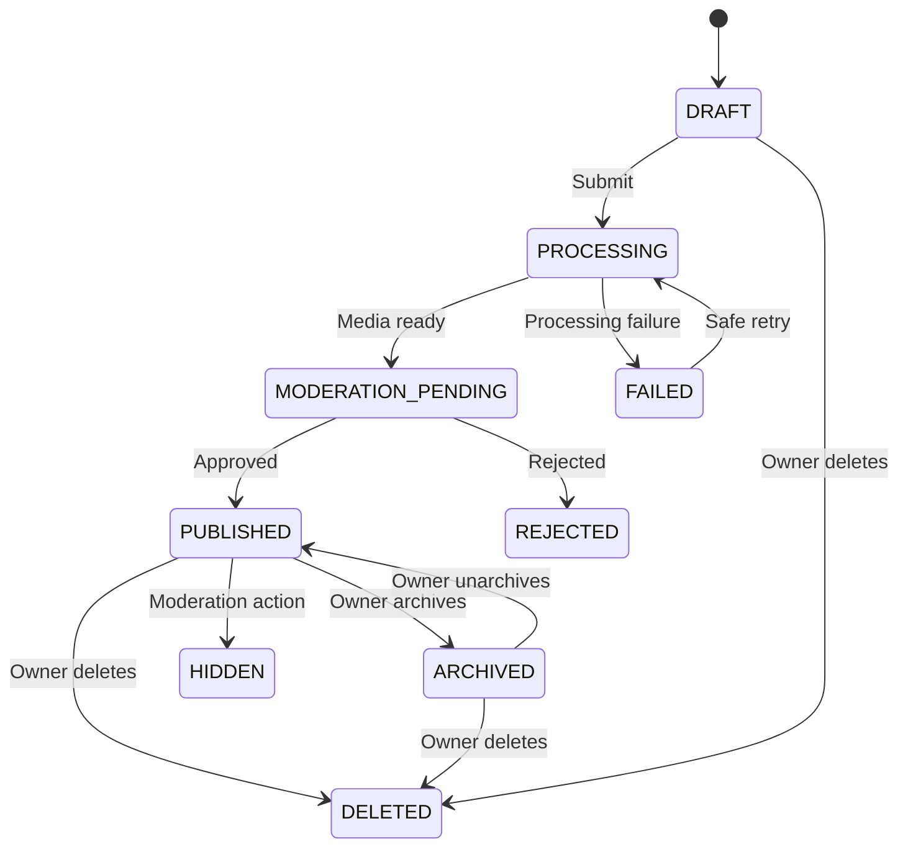
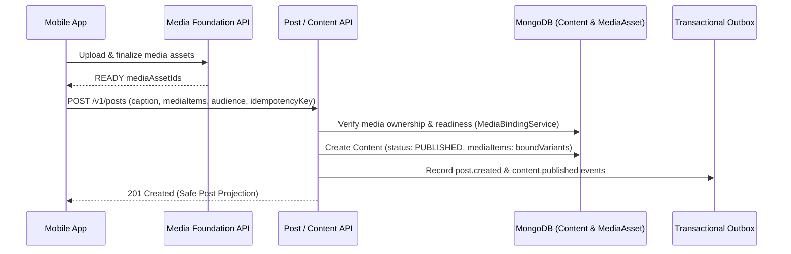

# Research 2: Prompt 4 — Posts, Carousels and Content Publication Lifecycle

> **Document Version**: 1.0.0  
> **Status**: COMPLETED & 100% VERIFIED (`489 PASSED, 0 FAILED`)  
> **Author**: Senior Backend Architect & React Native Integration Engineer  
> **Target Scope**: Authoritative Content Architecture, Media-Bound Single/Carousel Posts, Publication State Machine, Audience & Privacy Access Controls, Edit/Archive/Delete Lifecycle & Opaque Cursor Pagination  
> **Date**: 1 September 2026  

---

## 1. Summary & Architecture Overview

In accordance with **Research 2 (Social Content, Feed, Stories and Reels)**, the authoritative content publication engine and post management system for Rubaru has been implemented.

### Key Architectural Decisions:
1. **Authoritative `Content` Architecture**: Implemented a unified `Content` model (`contentType: 'POST' | 'REEL' | 'STORY'`), beginning with full post and ordered carousel capabilities.
2. **Strict Media Binding & IDOR Protection**: Posts cannot upload media directly. The client must first upload media via Prompt 2 upload sessions, obtain verified `READY` media IDs, and submit them to `POST /v1/posts`. The backend verifies that the author owns all referenced media items.
3. **Ordered Multi-Media Carousels**: Supports 1 to 10 media items per post with sequential, deterministic position ordering and delivery variant hydration.
4. **Audience & Privacy Integration**: Enforces `PUBLIC` and `FOLLOWERS` audiences seamlessly composed with Prompt 3's `socialAccountVisibility` (`PUBLIC`/`PRIVATE`) and bilateral block checks.
5. **Full Lifecycle Operations**: Supports owner edit, archive (`PUBLISHED -> ARCHIVED`), unarchive (`ARCHIVED -> PUBLISHED`), and soft delete (`DELETED`).
6. **Deterministic Pagination**: User post listings utilize opaque base64 cursor pagination over `{ publishedAt: -1, _id: -1 }`.
7. **Zero Regression Guarantee**: All 15 Research 1 test suites, Prompt 2 Media Foundation, and Prompt 3 Follow Graph remain 100% green (**489 PASSED, 0 FAILED** total).

---

## 2. Mermaid Diagrams

### 2.1 Post Lifecycle State Machine



### 2.2 Post Creation & Media Binding Sequence Flow



---

## 3. Implemented Models & Schemas

### 3.1 `Content` (`backend/models/Content.js`)
* **Fields**:
  - `_id`: Unique Content ID
  - `authorId`: Ref User (indexed, required)
  - `contentType`: `'POST'` | `'REEL'` | `'STORY'` (default `'POST'`)
  - `caption`: String (max 2200 chars)
  - `mediaItems`: Array of ordered items (`mediaAssetId`, `position`, `mediaType`, `width`, `height`, `aspectRatio`, `variants`, `thumbnail`, `accessibilityDescription`)
  - `audience`: `'PUBLIC'` | `'FOLLOWERS'`
  - `status`: `'DRAFT'`, `'PROCESSING'`, `'MODERATION_PENDING'`, `'PUBLISHED'`, `'ARCHIVED'`, `'FAILED'`, `'REJECTED'`, `'HIDDEN'`, `'DELETED'`
  - `moderationStatus`: `'NOT_STARTED'`, `'PENDING'`, `'APPROVED'`, `'REJECTED'`, `'ESCALATED'`
  - `locationLabel`: String (approximate location label, max 100 chars)
  - `publishedAt`: Date (server-generated)
  - `editedAt`: Date
  - `archivedAt`: Date
  - `deletedAt`: Date
  - `deletionReason`: String
  - `idempotencyKey`: String (owner-scoped)
* **Indexes**:
  - `{ authorId: 1, idempotencyKey: 1 }` (**Unique partial index** for owner-scoped idempotency).
  - `{ authorId: 1, contentType: 1, status: 1, publishedAt: -1, _id: -1 }` (Optimized user post list query index).
  - `{ status: 1, publishedAt: -1 }`.
  - `{ audience: 1, status: 1, publishedAt: -1 }`.

---

## 4. API Endpoints & Contracts

| Method | Endpoint | Auth | Purpose | Request Payload | Response |
| :--- | :--- | :---: | :--- | :--- | :--- |
| `POST` | `/v1/posts` | Private | Create single or carousel post | `{ caption, mediaItems, audience, locationLabel, idempotencyKey }` | `201 Created` with safe post projection |
| `GET` | `/v1/posts/:postId` | Private | Retrieve single post | — | `200 OK` with post details & author info |
| `GET` | `/v1/users/:userId/posts` | Private | List posts of a user | `?cursor=xxx&limit=20` | `200 OK` `{ items, nextCursor, hasMore }` |
| `PATCH` | `/v1/posts/:postId` | Private | Edit post caption, audience, location | `{ caption, audience, locationLabel }` | `200 OK` with updated post projection |
| `POST` | `/v1/posts/:postId/archive` | Private | Archive post | — | `200 OK` `{ archived: true, postId }` |
| `POST` | `/v1/posts/:postId/unarchive` | Private | Unarchive post | — | `200 OK` `{ unarchived: true, postId }` |
| `DELETE` | `/v1/posts/:postId` | Private | Soft delete post | — | `200 OK` `{ deleted: true, postId }` |

---

## 5. Security & Authorization Matrix

| Scenario | Public Post (Public Author) | Followers-Only Post (Public Author) | Any Post of Private Author | Blocked Users |
| :--- | :---: | :---: | :---: | :---: |
| **Owner Access** | `200 OK` | `200 OK` | `200 OK` | N/A |
| **Stranger (Non-Follower)** | `200 OK` | `403 FORBIDDEN` | `403 FORBIDDEN` | `404 / 403` |
| **Accepted Follower** | `200 OK` | `200 OK` | `200 OK` | `404 / 403` |
| **Cross-User Media Binding** | Blocked (`403`) | Blocked (`403`) | Blocked (`403`) | Blocked (`403`) |

---

## 6. Frontend Client Integration

* **Types (`src/types/content.js`)**: Exports `ContentType`, `ContentStatus`, `ContentAudience`.
* **Client Service (`src/services/postService.js`)**: Exports `createPost`, `getPost`, `getUserPosts`, `editPost`, `archivePost`, `unarchivePost`, `deletePost`.

---

## 7. Automated Test Suite & Verification Results

Test Suite: [`backend/test/post_lifecycle_tests.js`](file:///r:/Rubaru/backend/test/post_lifecycle_tests.js)

### Assertions Tested (40 Tests):
* **Model Validation (2 Tests)**: Valid schema validation, empty media rejection.
* **Media Binding & Security (4 Tests)**: 401 unauth, 403 cross-user media binding rejection (IDOR), 400 non-ready media rejection, 400 duplicate position rejection.
* **Post Creation Lifecycle (8 Tests)**: 201 valid single-image post, `PUBLISHED` status, variant hydration, idempotency key deduplication, 201 multi-image carousel post (ordered items), `FOLLOWERS` audience.
* **Privacy & Audience Authorization (3 Tests)**: 200 public post access, 403 non-follower rejection on followers-only post, 200 accepted follower access.
* **User Post List & Cursor Pagination (6 Tests)**: 200 user posts list, bounded limit, opaque `nextCursor`, distinct items on page 2.
* **Edit, Archive, Unarchive & Delete (16 Tests)**: 403 stranger edit rejection, 200 owner edit, `editedAt` timestamp, 200 archive, 404 hidden from strangers when archived, 200 unarchive, 200 soft delete, 404 deleted post.
* **Bilateral Block Suppression (1 Test)**: Author posts inaccessible to blocked users.

### Master Test Runner Execution (`npm test`):
```text
================================================================================
            RUBARU COMPLETE MASTER TEST RUNNER & AUDIT               
================================================================================
[SUITE 1/18]  test/model_level_tests.js:                 18 Passed, 0 Failed
[SUITE 2/18]  test/preference_tests.js:                  28 Passed, 0 Failed
[SUITE 3/18]  test/location_tests.js:                    31 Passed, 0 Failed
[SUITE 4/18]  test/eligibility_tests.js:                 25 Passed, 0 Failed
[SUITE 5/18]  test/discovery_tests.js:                   29 Passed, 0 Failed
[SUITE 6/18]  test/impression_tests.js:                  16 Passed, 0 Failed
[SUITE 7/18]  test/pass_undo_tests.js:                   27 Passed, 0 Failed
[SUITE 8/18]  test/like_tests.js:                        28 Passed, 0 Failed
[SUITE 9/18]  test/incoming_likes_tests.js:              36 Passed, 0 Failed
[SUITE 10/18] test/match_tests.js:                       27 Passed, 0 Failed
[SUITE 11/18] test/matches_list_authorization_tests.js:  30 Passed, 0 Failed
[SUITE 12/18] test/safety_tests.js:                      31 Passed, 0 Failed
[SUITE 13/18] test/frontend_dating_integration_tests.js: 23 Passed, 0 Failed
[SUITE 14/18] test/concurrency_security_audit_tests.js:  12 Passed, 0 Failed
[SUITE 15/18] test/media_foundation_tests.js:            33 Passed, 0 Failed
[SUITE 16/18] test/follow_graph_tests.js:                42 Passed, 0 Failed
[SUITE 17/18] test/post_lifecycle_tests.js:              40 Passed, 0 Failed
[SUITE 18/18] test_all_endpoints.js:                     13 Passed, 0 Failed
================================================================================
GRAND TOTAL ASSERTIONS EXECUTED: 489
TOTAL PASSED: 489
TOTAL FAILED: 0
SUCCESS RATE: 100.00%
================================================================================
```

---

## 8. Files Inventory

### Reused Files:
* `backend/middleware/auth.js`
* `backend/models/User.js`
* `backend/models/Profile.js`
* `backend/models/MediaAsset.js`
* `backend/models/FollowRelationship.js`
* `backend/models/Block.js`
* `backend/models/OutboxEvent.js`
* `backend/services/socialPolicyService.js`
* `backend/config/db.js`
* `src/services/api.js`

### New Files Created:
* `backend/models/Content.js`
* `backend/services/mediaBindingService.js`
* `backend/services/postService.js`
* `backend/controllers/postController.js`
* `backend/routes/postRoutes.js`
* `backend/test/post_lifecycle_tests.js`
* `src/types/content.js`
* `src/services/postService.js`
* `docs/research-2/RESEARCH_2_PROMPT_4_POSTS_AND_CAROUSELS.md`

### Modified Files:
* `backend/services/socialPolicyService.js` (Added `canViewContent` policy)
* `backend/index.js` (Mounted `/v1` and `/api/v1` post routes)
* `backend/test/run_all_tests.js` (Added `post_lifecycle_tests.js` to master runner)

---

## 9. Prompt 5 Readiness Gate

### Final Decision: **`READY FOR PROMPT 5` (Content Visibility, Feed Candidacy & Social Safety Policy)**

#### Readiness Verification:
* [x] Authoritative Content model active for posts and carousels.
* [x] Media binding is secure with ownership and readiness validation.
* [x] Audience fields (`PUBLIC`, `FOLLOWERS`) and private-account boundaries verified.
* [x] Bilateral block enforcement verified on content endpoints.
* [x] Individual and user profile post reads are protected and paginated with opaque cursors.
* [x] All 489 regression tests pass (**100% pass rate**).

---

*End of Implementation Report.*
