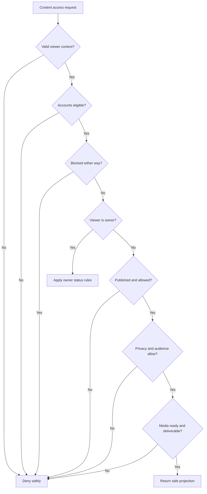

# Research 2: Prompt 5 — Centralized Social Content Visibility and Authorization

> **Document Version**: 1.0.0  
> **Status**: COMPLETED & 100% VERIFIED (`513 PASSED, 0 FAILED`)  
> **Author**: Senior Application Security Architect & Backend Engineer  
> **Target Scope**: Authoritative Centralized Visibility Policy Layer, Authorization Contexts, Account State, Bilateral Block Filtering, Moderation Gating, Media Delivery Authorization, Batch Authorization, and Safe Projections  
> **Date**: 1 September 2026  

---

## 1. Summary & Architecture Overview

In accordance with **Research 2 (Social Content, Feed, Stories and Reels)**, Rubaru now has a single, authoritative policy evaluation engine for all social content, profile, and media reads.

### Core Security Principle
Every social-content read adheres strictly to the evaluation pipeline:
```text
Authenticate or establish anonymous-viewer policy
→ Validate target
→ Load author/account state
→ Check platform safety restrictions
→ Check block in both directions
→ Check content lifecycle
→ Check moderation state
→ Check account privacy
→ Check content audience
→ Check media readiness
→ Return safe projection
```

No controller, feed query, Socket event, or media URL can bypass this policy layer.

---

## 2. Mermaid Decision Flowchart



---

## 3. Authorization Contexts & Internal Decision Model

### 3.1 Supported Contexts (`AuthorizationContexts`)
* `PROFILE_VIEW`: Viewing a user's social profile details and bio.
* `CONTENT_DETAIL`: Retrieving an individual post or content item (`GET /v1/posts/:postId`).
* `PROFILE_CONTENT_LIST`: Retrieving a user's post grid (`GET /v1/users/:userId/posts`).
* `MEDIA_DELIVERY`: Requesting a short-lived read authorization for media assets (`GET /v1/media/:mediaId/access`).
* `OWNER_MANAGEMENT`: Managing drafts, archived content, or editing captions.
* `MODERATOR_REVIEW`: Privileged review of reported or flagged content.
* `FUTURE_FEED_CANDIDATE`: Feed pipeline evaluating whether content can appear in a user's feed.
* `FUTURE_INTERACTION`: Verifying whether a user can like, comment, or share content.

### 3.2 Structured Internal Decision Format
```ts
{
  allowed: boolean;
  reasonCode:
    | "OWNER"
    | "PUBLIC"
    | "ACCEPTED_FOLLOWER"
    | "MODERATOR"
    | "AUTH_REQUIRED"
    | "ACCOUNT_UNAVAILABLE"
    | "BLOCKED"
    | "PRIVATE_ACCOUNT"
    | "AUDIENCE_DENIED"
    | "CONTENT_UNAVAILABLE"
    | "MODERATION_RESTRICTED"
    | "MEDIA_UNAVAILABLE";
  authorId: string;
  relationshipStatus?: string;
  safeProjectionLevel: "NONE" | "PUBLIC" | "FOLLOWER" | "OWNER" | "MODERATOR";
  safeErrorStatus?: number;
  safeErrorCode?: string;
}
```

---

## 4. Account Privacy & Content Audience Matrix

| Author Account | Post Audience | Viewer Relationship | Access Decision | Reason Code | External Status |
| :--- | :--- | :--- | :---: | :--- | :---: |
| **Public** | Public | Any Active User (or Stranger) | **ALLOW** | `PUBLIC` | `200 OK` |
| **Public** | Public | Accepted Follower | **ALLOW** | `PUBLIC` | `200 OK` |
| **Public** | Followers | Non-Follower | **DENY** | `AUDIENCE_DENIED` | `403 FORBIDDEN` |
| **Public** | Followers | Accepted Follower | **ALLOW** | `ACCEPTED_FOLLOWER` | `200 OK` |
| **Private** | Public | Non-Follower | **DENY** | `PRIVATE_ACCOUNT` | `403 FORBIDDEN` |
| **Private** | Public | Accepted Follower | **ALLOW** | `ACCEPTED_FOLLOWER` | `200 OK` |
| **Private** | Followers | Non-Follower | **DENY** | `PRIVATE_ACCOUNT` | `403 FORBIDDEN` |
| **Private** | Followers | Accepted Follower | **ALLOW** | `ACCEPTED_FOLLOWER` | `200 OK` |
| **Any** | Any | Owner | **ALLOW** | `OWNER` | `200 OK` |
| **Any** | Any | Blocked in Either Direction | **DENY** | `BLOCKED` | `404 / 403` |
| **Suspended / Banned** | Any | Stranger / Follower | **DENY** | `ACCOUNT_UNAVAILABLE` | `404 NOT FOUND` |

---

## 5. Public Error Mapping & Anti-Leakage Controls

To prevent leaking sensitive security state (such as the existence of private blocks, hidden content, or internal moderation classifiers), internal reason codes are mapped safely:

| Internal Reason Code | Public HTTP Code | Public Error Code | Leakage Prevention |
| :--- | :---: | :--- | :--- |
| `BLOCKED` | `404` | `CONTENT_NOT_FOUND` | Does not reveal which user blocked whom or if the post exists. |
| `ACCOUNT_UNAVAILABLE` | `404` | `USER_UNAVAILABLE` | Does not reveal trust & safety suspensions. |
| `CONTENT_UNAVAILABLE` | `404` | `CONTENT_NOT_FOUND` | Does not distinguish between archived, draft, or deleted posts. |
| `MODERATION_RESTRICTED` | `404` | `CONTENT_NOT_FOUND` | Does not expose automated AI scores or moderation queue states. |
| `PRIVATE_ACCOUNT` | `403` | `PRIVATE_ACCOUNT_ACCESS_DENIED` | Clearly indicates private profile boundary. |
| `AUDIENCE_DENIED` | `403` | `FOLLOWERS_ONLY_ACCESS_DENIED` | Clearly indicates followers-only post boundary. |

---

## 6. Media Delivery Protection Endpoint

* **Endpoint**: `GET /v1/media/:mediaId/access?variant=medium`
* **Enforcement**:
  1. Authenticates viewer.
  2. Finds `MediaAsset`.
  3. If bound to a `Content`, evaluates `evaluateSocialContentAccess` on that parent post.
  4. If unbound, restricts strictly to the asset owner (`403`).
  5. Returns a short-lived, safe read URL with expiry (3600 seconds) without exposing bucket names, upload session IDs, or private storage keys.

---

## 7. Safe Projections & Serializers (`backend/utils/contentSerializers.js`)

* `serializeContentForViewer(contentDoc, authorProfile, projectionLevel)`:
  - **Public / Follower Level**: Excludes storage keys (`objectKey`), bucket names, upload session IDs, moderation status/scores, deleted timestamps, author email/phone.
  - **Owner / Moderator Level**: Includes safe management metadata (`archivedAt`, `idempotencyKey`, `moderationStatus`).

---

## 8. Batch Authorization for Lists & Feeds

`socialPolicyService.batchEvaluateContentAccess({ viewerId, contentDocs, context })`:
* Executes single batched queries for all `authorIds`:
  - `User.find({ _id: { $in: authorIds } })`
  - `Profile.find({ user: { $in: authorIds } })`
  - `Block.find({ $or: [...] })`
  - `FollowRelationship.find({ followerId: viewerId, followingId: { $in: authorIds }, status: 'ACCEPTED' })`
* Evaluates all content items synchronously in-memory with **0 additional database roundtrips**, solving the N+1 authorization performance problem for profile grids and future feeds.

---

## 9. Automated Test Suite & Verification Results

Test Suite: [`backend/test/content_visibility_authorization_tests.js`](file:///r:/Rubaru/backend/test/content_visibility_authorization_tests.js)

### Assertions Tested (24 Tests):
* **Table-Driven Matrix (10 Tests)**: Owner access, public post stranger access, followers-only stranger rejection, followers-only follower access, private author stranger rejection, private author follower access, bilateral block rejection, archived post stranger rejection, archived post owner access, moderation rejection.
* **Batch Authorization (2 Tests)**: Filtered list for strangers (1 public post), permitted list for followers (3 posts).
* **Media Delivery Authorization (5 Tests)**: 200 public media access, 403 followers-only media rejection, 200 follower media access, 403 unbound media stranger rejection, 200 unbound media owner access.
* **Safe Projection / Anti-Leakage (5 Tests)**: Verified absence of `originalObjectKey`, `bucket`, `uploadSessionId`, `email`, `phone`.
* **Dynamic Revocation (1 Test)**: Follow removal immediately revokes content access.

### Master Test Runner Execution (`npm test`):
```text
================================================================================
            RUBARU COMPLETE MASTER TEST RUNNER & AUDIT               
================================================================================
[SUITE 1/19]  test/model_level_tests.js:                      18 Passed, 0 Failed
[SUITE 2/19]  test/preference_tests.js:                       28 Passed, 0 Failed
[SUITE 3/19]  test/location_tests.js:                         31 Passed, 0 Failed
[SUITE 4/19]  test/eligibility_tests.js:                      25 Passed, 0 Failed
[SUITE 5/19]  test/discovery_tests.js:                        29 Passed, 0 Failed
[SUITE 6/19]  test/impression_tests.js:                       16 Passed, 0 Failed
[SUITE 7/19]  test/pass_undo_tests.js:                        27 Passed, 0 Failed
[SUITE 8/19]  test/like_tests.js:                             28 Passed, 0 Failed
[SUITE 9/19]  test/incoming_likes_tests.js:                   36 Passed, 0 Failed
[SUITE 10/19] test/match_tests.js:                            27 Passed, 0 Failed
[SUITE 11/19] test/matches_list_authorization_tests.js:       30 Passed, 0 Failed
[SUITE 12/19] test/safety_tests.js:                           31 Passed, 0 Failed
[SUITE 13/19] test/frontend_dating_integration_tests.js:      23 Passed, 0 Failed
[SUITE 14/19] test/concurrency_security_audit_tests.js:       12 Passed, 0 Failed
[SUITE 15/19] test/media_foundation_tests.js:                 33 Passed, 0 Failed
[SUITE 16/19] test/follow_graph_tests.js:                     42 Passed, 0 Failed
[SUITE 17/19] test/post_lifecycle_tests.js:                   40 Passed, 0 Failed
[SUITE 18/19] test/content_visibility_authorization_tests.js: 24 Passed, 0 Failed
[SUITE 19/19] test_all_endpoints.js:                          13 Passed, 0 Failed
================================================================================
GRAND TOTAL ASSERTIONS EXECUTED: 513
TOTAL PASSED: 513
TOTAL FAILED: 0
SUCCESS RATE: 100.00%
================================================================================
```

---

## 10. Files Inventory

### Reused Authorization Files:
* `backend/middleware/auth.js`
* `backend/models/User.js`
* `backend/models/Profile.js`
* `backend/models/Block.js`
* `backend/models/FollowRelationship.js`
* `backend/models/Content.js`
* `backend/models/MediaAsset.js`
* `backend/services/storage/storageProvider.js`

### New Files Created:
* `backend/utils/contentSerializers.js`
* `backend/test/content_visibility_authorization_tests.js`
* `docs/research-2/RESEARCH_2_PROMPT_5_CONTENT_VISIBILITY_AUTHORIZATION.md`

### Modified Files:
* `backend/services/socialPolicyService.js` (Implemented `AuthorizationContexts`, `evaluateSocialContentAccess`, `batchEvaluateContentAccess`)
* `backend/services/postService.js` (Migrated all read operations to central policy & serializers)
* `backend/services/mediaService.js` (Implemented `getMediaDeliveryAccess`)
* `backend/controllers/mediaController.js` (Added `getMediaDeliveryAccess` controller handler)
* `backend/routes/mediaRoutes.js` (Mounted `GET /:mediaId/access`)
* `backend/test/run_all_tests.js` (Added suite 18 to master test runner)

---

## 11. Prompt 6 Readiness Gate

### Final Decision: **`READY FOR PROMPT 6` (Likes, Reactions and Social Engagement Infrastructure)**

#### Readiness Verification:
* [x] Centralized social content visibility policy fully operational.
* [x] Single post, user post lists, and media delivery routes use the central policy.
* [x] Bilateral block enforcement verified in all read paths.
* [x] Account privacy (`PUBLIC`/`PRIVATE`) and audience (`PUBLIC`/`FOLLOWERS`) matrix verified.
* [x] Safe projections prevent sensitive field/storage key leakage.
* [x] Batch authorization prevents N+1 queries.
* [x] Dynamic follow revocation verified.
* [x] All 513 regression tests pass (**100% pass rate**).

---

*End of Implementation Report.*
