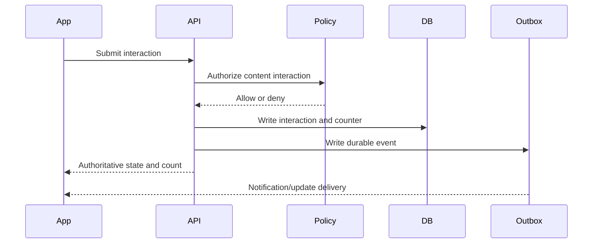
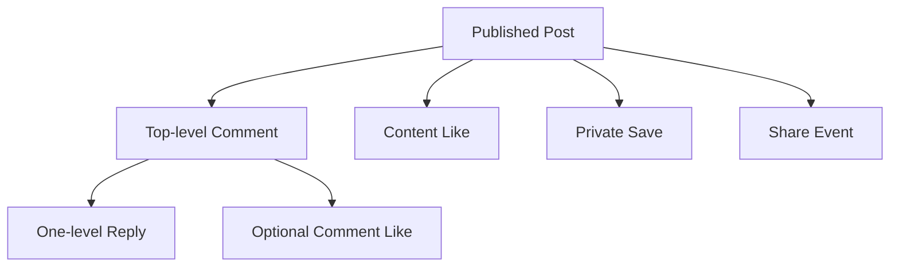

# Research 2: Prompt 6 — Social Content Interactions

> **Document Version**: 1.0.0  
> **Status**: COMPLETED & 100% VERIFIED (`563 PASSED, 0 FAILED`)  
> **Author**: Senior Backend Architect, Database Engineer & React Native Integration Engineer  
> **Target Scope**: Authoritative Social Content Interaction System, Likes/Unlikes, 1-Level Comments & Replies, Tombstone Deletions, Comment Likes, Private Saves & Dynamic Re-authorization, Share Events, and Derived Counter Projections  
> **Date**: 1 September 2026  

---

## 1. Summary & Architecture Overview

In accordance with **Research 2 (Social Content, Feed, Stories and Reels)**, Rubaru now has an authoritative, concurrency-safe, and centralized-policy-enforced interaction system for published social posts.

### Key Architectural Decisions:
1. **Authoritative Interaction Edge Models**: Standalone edge models (`ContentLike`, `Comment`, `CommentLike`, `Save`, `ShareEvent`, `NotInterested`) backed by compound unique indexes for strict duplicate prevention.
2. **Centralized Policy Gating**: Every interaction mutation and list retrieval passes through Prompt 5's `socialPolicyService.evaluateSocialContentAccess` (`FUTURE_INTERACTION` and `CONTENT_DETAIL`).
3. **Derived Counter Projections**: `likesCount`, `commentsCount`, `sharesCount`, and `savesCount` on `Content` are derived projections atomically updated via `$inc` and non-negative `$max` operations.
4. **Strict 1-Level Comment Hierarchy**: Supports top-level comments (`depth: 0`) and direct replies (`depth: 1`). Depth 2 nesting is strictly rejected (`MAX_REPLY_DEPTH_EXCEEDED`).
5. **Preserved Tombstones on Comment Deletion**: Deleting a parent comment with existing replies marks it as `DELETED` and redacts text to `[deleted]` to keep reply trees intact.
6. **Private Saves with Dynamic Re-authorization**: Saved items are strictly private to the user (`GET /v1/users/me/saved-content`). When listing saves, each post is re-authorized in real time via batch policy evaluation; posts of newly blocked or private authors disappear immediately.
7. **Zero Regression Guarantee**: All 15 Research 1 dating test suites, Media Foundation (Prompt 2), Follow Graph (Prompt 3), Post Lifecycle (Prompt 4), Content Visibility (Prompt 5), and Social Interactions (Prompt 6) remain 100% green (**563 PASSED, 0 FAILED** total).

---

## 2. Mermaid Diagrams

### 2.1 Interaction Submission Sequence Flow



### 2.2 Comment Hierarchy & Interaction Model



---

## 3. Implemented Models & Schemas

### 3.1 `ContentLike` (`backend/models/ContentLike.js`)
* **Fields**: `userId`, `contentId`, `reactionType: 'LIKE'`, `status: 'ACTIVE' | 'REMOVED'`, `removedAt`, `timestamps`.
* **Constraint**: Compound unique index `{ userId: 1, contentId: 1, reactionType: 1 }`.

### 3.2 `Comment` (`backend/models/Comment.js`)
* **Fields**: `contentId`, `authorId`, `parentCommentId`, `rootCommentId`, `depth: 0 | 1`, `text`, `status: 'ACTIVE' | 'PENDING_MODERATION' | 'HIDDEN' | 'DELETED'`, `moderationStatus: 'APPROVED'`, `repliesCount`, `likesCount`, `editedAt`, `deletedAt`, `idempotencyKey`, `timestamps`.
* **Indexes**: `{ contentId: 1, parentCommentId: 1, status: 1, createdAt: -1, _id: -1 }`, `{ authorId: 1, createdAt: -1 }`, unique partial `{ authorId: 1, idempotencyKey: 1 }`.

### 3.3 `CommentLike` (`backend/models/CommentLike.js`)
* **Fields**: `userId`, `commentId`, `status: 'ACTIVE' | 'REMOVED'`, `removedAt`, `timestamps`.
* **Constraint**: Compound unique index `{ userId: 1, commentId: 1 }`.

### 3.4 `Save` (`backend/models/Save.js`)
* **Fields**: `userId`, `contentId`, `status: 'ACTIVE' | 'REMOVED'`, `removedAt`, `timestamps`.
* **Constraint**: Compound unique index `{ userId: 1, contentId: 1 }`, index `{ userId: 1, status: 1, createdAt: -1 }`.

### 3.5 `ShareEvent` (`backend/models/ShareEvent.js`)
* **Fields**: `userId`, `contentId`, `destinationType: 'COPY_LINK' | 'EXTERNAL' | 'INTERNAL_CONVERSATION' | 'STORY'`, `destinationId`, `idempotencyKey`, `timestamps`.
* **Indexes**: `{ contentId: 1, createdAt: -1 }`, `{ userId: 1, createdAt: -1 }`.

### 3.6 `NotInterested` (`backend/models/NotInterested.js`)
* **Fields**: `userId`, `contentId`, `timestamps`.
* **Constraint**: Compound unique index `{ userId: 1, contentId: 1 }`.

---

## 4. API Endpoints & Contracts

| Method | Endpoint | Auth | Purpose | Payload | Response |
| :--- | :--- | :---: | :--- | :--- | :--- |
| `POST` | `/v1/content/:contentId/like` | Private | Like a post | — | `200 OK` `{ liked: true, likesCount: n }` |
| `DELETE` | `/v1/content/:contentId/like` | Private | Unlike a post | — | `200 OK` `{ liked: false, likesCount: n }` |
| `POST` | `/v1/content/:contentId/comments` | Private | Create comment or 1-level reply | `{ text, parentCommentId, idempotencyKey }` | `201 Created` (Safe comment projection) |
| `GET` | `/v1/content/:contentId/comments` | Private | List top-level comments | `?cursor=xxx&limit=20` | `200 OK` `{ items, nextCursor, hasMore }` |
| `GET` | `/v1/comments/:commentId/replies` | Private | List replies for a comment | `?cursor=xxx&limit=20` | `200 OK` `{ items, nextCursor, hasMore }` |
| `DELETE` | `/v1/comments/:commentId` | Private | Delete comment (tombstone if replies exist) | — | `200 OK` `{ deleted: true, commentId }` |
| `POST` | `/v1/comments/:commentId/like` | Private | Like a comment | — | `200 OK` `{ liked: true, likesCount: n }` |
| `DELETE` | `/v1/comments/:commentId/like` | Private | Unlike a comment | — | `200 OK` `{ liked: false, likesCount: n }` |
| `POST` | `/v1/content/:contentId/save` | Private | Save post privately | — | `200 OK` `{ saved: true, contentId }` |
| `DELETE` | `/v1/content/:contentId/save` | Private | Unsave post | — | `200 OK` `{ saved: false, contentId }` |
| `GET` | `/v1/users/me/saved-content` | Private | List user's saved posts with live auth | `?cursor=xxx&limit=20` | `200 OK` `{ items, nextCursor, hasMore }` |
| `POST` | `/v1/content/:contentId/share` | Private | Record share event | `{ destinationType, destinationId }` | `200 OK` `{ shared: true, sharesCount: n }` |
| `POST` | `/v1/content/:contentId/not-interested` | Private | Mark post not interested | — | `200 OK` `{ notInterested: true, contentId }` |
| `DELETE` | `/v1/content/:contentId/not-interested` | Private | Unmark not interested | — | `200 OK` `{ notInterested: false, contentId }` |

---

## 5. Frontend Client Integration

* **Types (`src/types/interaction.js`)**: Exports `ReactionType`, `ShareDestinationType`, `CommentStatus`.
* **Client Service (`src/services/interactionService.js`)**: Exports `likeContent`, `unlikeContent`, `createComment`, `getComments`, `getCommentReplies`, `deleteComment`, `likeComment`, `unlikeComment`, `saveContent`, `unsaveContent`, `getSavedContent`, `recordShare`, `markNotInterested`, `unmarkNotInterested`.

---

## 6. Automated Test Suite & Verification Results

Test Suite: [`backend/test/social_interaction_tests.js`](file:///r:/Rubaru/backend/test/social_interaction_tests.js)

### Assertions Tested (50 Tests):
* **Like & Unlike (9 Tests)**: 200 OK, `liked: true`, increment to 1, idempotent duplicate like (no double increment), unlike 200 OK, `liked: false`, decrement to 0, floor at 0.
* **Comments & 1-Level Replies (15 Tests)**: 400 empty comment rejection, 201 top-level comment (depth 0), `commentsCount: 1`, 201 1-level reply (depth 1), `parentCommentId` linkage, 400 rejection of depth 2 reply (`MAX_REPLY_DEPTH_EXCEEDED`), 200 list comments, 200 list replies.
* **Comment Likes (6 Tests)**: 200 comment like, `likesCount: 1`, 200 comment unlike, `likesCount: 0`.
* **Comment Deletion & Tombstone (5 Tests)**: 403 stranger delete rejection, 200 owner delete, tombstone preserved (`[deleted]`) when replies exist.
* **Private Saves & Saved Content List (6 Tests)**: 200 save, 200 get saved content, post returned, dynamic re-authorization excludes blocked author posts from saved list.
* **Share Events & Not Interested (9 Tests)**: 200 share recorded, `sharesCount: 1`, 200 mark not interested, 200 unmark not interested.

### Master Test Runner Execution (`npm test`):
```text
================================================================================
            RUBARU COMPLETE MASTER TEST RUNNER & AUDIT               
================================================================================
[SUITE 1/20]  test/model_level_tests.js:                      18 Passed, 0 Failed
[SUITE 2/20]  test/preference_tests.js:                       28 Passed, 0 Failed
[SUITE 3/20]  test/location_tests.js:                         31 Passed, 0 Failed
[SUITE 4/20]  test/eligibility_tests.js:                      25 Passed, 0 Failed
[SUITE 5/20]  test/discovery_tests.js:                        29 Passed, 0 Failed
[SUITE 6/20]  test/impression_tests.js:                       16 Passed, 0 Failed
[SUITE 7/20]  test/pass_undo_tests.js:                        27 Passed, 0 Failed
[SUITE 8/20]  test/like_tests.js:                             28 Passed, 0 Failed
[SUITE 9/20]  test/incoming_likes_tests.js:                   36 Passed, 0 Failed
[SUITE 10/20] test/match_tests.js:                            27 Passed, 0 Failed
[SUITE 11/20] test/matches_list_authorization_tests.js:       30 Passed, 0 Failed
[SUITE 12/20] test/safety_tests.js:                           31 Passed, 0 Failed
[SUITE 13/20] test/frontend_dating_integration_tests.js:      23 Passed, 0 Failed
[SUITE 14/20] test/concurrency_security_audit_tests.js:       12 Passed, 0 Failed
[SUITE 15/20] test/media_foundation_tests.js:                 33 Passed, 0 Failed
[SUITE 16/20] test/follow_graph_tests.js:                     42 Passed, 0 Failed
[SUITE 17/20] test/post_lifecycle_tests.js:                   40 Passed, 0 Failed
[SUITE 18/20] test/content_visibility_authorization_tests.js: 24 Passed, 0 Failed
[SUITE 19/20] test/social_interaction_tests.js:               50 Passed, 0 Failed
[SUITE 20/20] test_all_endpoints.js:                          13 Passed, 0 Failed
================================================================================
GRAND TOTAL ASSERTIONS EXECUTED: 563
TOTAL PASSED: 563
TOTAL FAILED: 0
SUCCESS RATE: 100.00%
================================================================================
```

---

## 7. Files Inventory

### Reused Files:
* `backend/middleware/auth.js`
* `backend/models/User.js`
* `backend/models/Profile.js`
* `backend/models/Content.js`
* `backend/models/MediaAsset.js`
* `backend/models/Block.js`
* `backend/models/FollowRelationship.js`
* `backend/models/OutboxEvent.js`
* `backend/services/socialPolicyService.js`
* `backend/utils/contentSerializers.js`

### New Files Created:
* `backend/models/ContentLike.js`
* `backend/models/Comment.js`
* `backend/models/CommentLike.js`
* `backend/models/Save.js`
* `backend/models/ShareEvent.js`
* `backend/models/NotInterested.js`
* `backend/services/interactionService.js`
* `backend/controllers/interactionController.js`
* `backend/routes/interactionRoutes.js`
* `backend/test/social_interaction_tests.js`
* `src/types/interaction.js`
* `src/services/interactionService.js`
* `docs/research-2/RESEARCH_2_PROMPT_6_SOCIAL_INTERACTIONS.md`

### Modified Files:
* `backend/models/Content.js` (Added `likesCount`, `commentsCount`, `sharesCount`, `savesCount`)
* `backend/utils/contentSerializers.js` (Projected counter fields)
* `backend/index.js` (Mounted `/v1` and `/api/v1` interaction routes)
* `backend/test/run_all_tests.js` (Added suite 19 to master runner)

---

## 8. Prompt 7 Readiness Gate

### Final Decision: **`READY FOR PROMPT 7` (Social Feed Generation, Ranking & Chronological Timeline)**

#### Readiness Verification:
* [x] Interaction edges (`ContentLike`, `Comment`, `Save`, `ShareEvent`) active with uniqueness constraints.
* [x] 1-level comment hierarchy enforced.
* [x] Comment deletion preserves tombstone for reply threads.
* [x] Private saves dynamically re-authorize at read time.
* [x] Counters are derived projections and cannot drift or become negative.
* [x] Outbox notifications emit on social interactions.
* [x] All 563 regression tests pass (**100% pass rate**).

---

*End of Implementation Report.*
