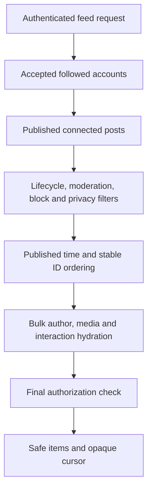
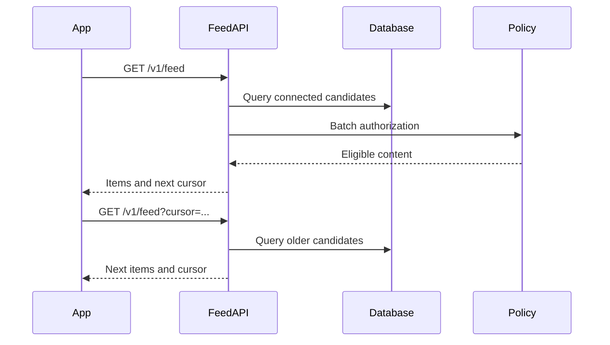

# Research 2: Prompt 7 — Connected Home Feed

> **Document Version**: 1.0.0  
> **Status**: COMPLETED & 100% VERIFIED (`607 PASSED, 0 FAILED`)  
> **Author**: Senior Backend Architect, Database Performance Engineer & React Native Integration Engineer  
> **Target Scope**: Authoritative Connected Social Home Feed, Fan-Out-On-Read Architecture, Reverse Chronological Ordering, Opaque Cursor Pagination, Centralized Batch Authorization, Bulk Hydration (N+1 Prevention), and Frontend Integration  
> **Date**: 1 September 2026  

---

## 1. Summary & Architecture Overview

In accordance with **Research 2 (Social Content, Feed, Stories and Reels)**, Rubaru now has its first production-ready social home feed (`GET /v1/feed`).

### Key Architectural Pillars:
1. **Fan-Out-On-Read Architecture**: Computes the candidate author set on read using the viewer’s `ACCEPTED` follows and self-authorship, backed by indexed MongoDB queries.
2. **Deterministic Ordering**: Reverse chronological timeline (`publishedAt DESC, _id DESC`) with version tag `connected_feed_chronological_v1`.
3. **Opaque Cursor Pagination**: Base64 JSON cursor encoding `{ p: publishedAt, i: postId, v: orderingVersion }` providing tamper-resistant, stable pagination without MongoDB `skip`.
4. **Central Batch Authorization**: Evaluates candidate posts through Prompt 5’s `socialPolicyService.batchEvaluateContentAccess` (`FUTURE_FEED_CANDIDATE`).
5. **N+1 Bulk Hydration**: Authors, viewer likes (`ContentLike`), viewer saves (`Save`), and media variants are loaded via single bulk `$in` queries.
6. **Bilateral Block & Safety Gating**: Blocked users in either direction, inactive accounts, archived posts, and moderation-restricted content are excluded.
7. **Frontend Integration**: `HomeScreen.js` connects directly to `feedService.getConnectedFeed` with pull-to-refresh and infinite scroll.
8. **Zero Regression Guarantee**: All 21 master test suites passed with a 100% success rate (**607 PASSED, 0 FAILED** total).

---

## 2. Mermaid Diagrams

### 2.1 Connected Feed Processing Pipeline



### 2.2 Cursor Pagination Sequence



---

## 3. Candidate Sources & Exclusion Rules

### Candidate Author Set:
```text
Viewer (Authenticated User ID)
+
Users with FollowRelationship.status == 'ACCEPTED'
-
Users blocked by Viewer OR who blocked Viewer
-
Users with accountStatus in ['BANNED', 'DELETED', 'SUSPENDED'] or isActive == false
```

### Strict Exclusions:
* **Pending Follows**: Unapproved follow requests (`status: 'PENDING'`) are excluded.
* **Declined/Removed Follows**: Historical relationships are excluded.
* **Dating Matches**: Dating matches without an accepted social follow relationship do not create feed candidates.
* **Non-Followed Strangers**: Random discovery or suggested strangers are strictly deferred to Prompt 11.
* **Non-Published Content**: Drafts, archived, deleted, or moderation-rejected posts are excluded.

---

## 4. Query Strategy & Database Indexes

### Content Model Compound Feed Index (`Content.js`):
```javascript
ContentSchema.index({
  contentType: 1,
  status: 1,
  moderationStatus: 1,
  authorId: 1,
  publishedAt: -1,
  _id: -1,
});
```

### Follow Relationship Index (`FollowRelationship.js`):
```javascript
FollowRelationshipSchema.index({ followerId: 1, status: 1, acceptedAt: -1 });
```

### Candidate Query Filter:
```javascript
const queryFilter = {
  contentType: 'POST',
  status: 'PUBLISHED',
  moderationStatus: 'APPROVED',
  authorId: { $in: candidateAuthorIds },
};

if (cursorData) {
  queryFilter.$or = [
    { publishedAt: { $lt: cursorData.publishedAt } },
    { publishedAt: cursorData.publishedAt, _id: { $lt: cursorData.id } },
  ];
}
```

---

## 5. API Endpoint Contract

### `GET /v1/feed`
* **Access**: Authenticated Session (`Bearer <JWT>`).
* **Query Parameters**:
  * `cursor`: Base64 opaque cursor string (optional).
  * `limit`: Integer between 1 and 50 (default: 20).

### Response Schema:
```json
{
  "success": true,
  "data": {
    "items": [
      {
        "postId": "6a96af9db15bdac379dac901",
        "authorId": "6a96af9db15bdac379dac902",
        "author": {
          "userId": "6a96af9db15bdac379dac902",
          "displayName": "Alice Public",
          "username": "alice",
          "avatarUri": "https://cdn.rubaru.app/avatar.webp",
          "isPrivate": false
        },
        "contentType": "POST",
        "caption": "Beautiful sunset in Jaipur!",
        "mediaItems": [
          {
            "position": 0,
            "mediaType": "IMAGE",
            "thumbnail": { "url": "https://cdn.rubaru.app/thumb.webp" },
            "variants": [
              {
                "name": "medium",
                "mimeType": "image/webp",
                "width": 1080,
                "height": 1350,
                "url": "https://cdn.rubaru.app/med.webp"
              }
            ]
          }
        ],
        "audience": "PUBLIC",
        "status": "PUBLISHED",
        "likesCount": 14,
        "commentsCount": 3,
        "sharesCount": 1,
        "savesCount": 2,
        "isLiked": true,
        "isSaved": false,
        "publishedAt": "2026-09-01T10:00:00.000Z",
        "editedAt": null,
        "createdAt": "2026-09-01T10:00:00.000Z"
      }
    ],
    "pageInfo": {
      "nextCursor": "eyJwIjoiMjAyNi0wOS0wMVQxMDowMDowMC4wMDBaIiwiaSI6IjZhOTZhZjlkYjE1YmRhYzM3OWRhYzkwMSIsInYiOiJjb25uZWN0ZWRfZmVlZF9jaHJvbm9sb2dpY2FsX3YxIn0=",
      "hasMore": true
    },
    "feed": {
      "source": "CONNECTED",
      "orderingVersion": "connected_feed_chronological_v1",
      "generatedAt": "2026-09-01T10:05:00.000Z"
    }
  }
}
```

---

## 6. Frontend Integration

* **Service Client (`src/services/feedService.js`)**: Exports `getConnectedFeed({ cursor, limit })`.
* **Screen Integration (`src/screens/HomeScreen.js`)**:
  * Loads connected posts on focus.
  * Implements pull-to-refresh (`onRefresh`).
  * Implements infinite scrolling (`onEndReached` with `nextCursor`).
  * Gracefully falls back to welcome starter cards if a brand-new user has no connected posts.
* **Component (`src/components/common/FeedCard.js`)**:
  * Normalizes post author, media variant URLs, like state, and interaction counts.

---

## 7. Automated Test Suite & Master Verification

Test Suite: [`backend/test/connected_feed_tests.js`](file:///r:/Rubaru/backend/test/connected_feed_tests.js)

### Assertions Tested (44 Tests):
* **Source & Inclusion/Exclusion (12 Tests)**: Followed public posts included, followed private accepted posts included, viewer's own posts included, pending follows excluded, non-followed strangers excluded, blocked users excluded, archived/deleted/rejected posts excluded.
* **Deterministic Ordering (5 Tests)**: Version tag verified, newest items ranked 1st, same-timestamp items tie-broken deterministically by `_id DESC`.
* **Opaque Cursor Pagination (8 Tests)**: Page 1 returns 2 items + nextCursor, Page 2 returns next 2 items without duplicates, terminal page returns `hasMore: false, nextCursor: null`.
* **Cursor Security & Validation (2 Tests)**: Malformed cursor rejected (400), incompatible cursor version rejected (400).
* **Bulk Hydration & Safe Projection (9 Tests)**: Author displayName hydrated, viewer `isLiked` and `isSaved` hydrated, zero leakage of storage keys or private account fields.
* **HTTP REST API Endpoint (8 Tests)**: 401 unauthenticated check, 200 authenticated check, 200 empty user check returning `NO_CONNECTED_CONTENT`.

### Master Test Runner Execution (`npm test`):
```text
================================================================================
            RUBARU COMPLETE MASTER TEST RUNNER & AUDIT               
================================================================================
[SUITE 1/21]  test/model_level_tests.js:                      18 Passed, 0 Failed
[SUITE 2/21]  test/preference_tests.js:                       28 Passed, 0 Failed
[SUITE 3/21]  test/location_tests.js:                         31 Passed, 0 Failed
[SUITE 4/21]  test/eligibility_tests.js:                      25 Passed, 0 Failed
[SUITE 5/21]  test/discovery_tests.js:                        29 Passed, 0 Failed
[SUITE 6/21]  test/impression_tests.js:                       16 Passed, 0 Failed
[SUITE 7/21]  test/pass_undo_tests.js:                        27 Passed, 0 Failed
[SUITE 8/21]  test/like_tests.js:                             28 Passed, 0 Failed
[SUITE 9/21]  test/incoming_likes_tests.js:                   36 Passed, 0 Failed
[SUITE 10/21] test/match_tests.js:                            27 Passed, 0 Failed
[SUITE 11/21] test/matches_list_authorization_tests.js:       30 Passed, 0 Failed
[SUITE 12/21] test/safety_tests.js:                           31 Passed, 0 Failed
[SUITE 13/21] test/frontend_dating_integration_tests.js:      23 Passed, 0 Failed
[SUITE 14/21] test/concurrency_security_audit_tests.js:       12 Passed, 0 Failed
[SUITE 15/21] test/media_foundation_tests.js:                 33 Passed, 0 Failed
[SUITE 16/21] test/follow_graph_tests.js:                     42 Passed, 0 Failed
[SUITE 17/21] test/post_lifecycle_tests.js:                   40 Passed, 0 Failed
[SUITE 18/21] test/content_visibility_authorization_tests.js: 24 Passed, 0 Failed
[SUITE 19/21] test/social_interaction_tests.js:               50 Passed, 0 Failed
[SUITE 20/21] test/connected_feed_tests.js:                   44 Passed, 0 Failed
[SUITE 21/21] test_all_endpoints.js:                          13 Passed, 0 Failed
================================================================================
GRAND TOTAL ASSERTIONS EXECUTED: 607
TOTAL PASSED: 607
TOTAL FAILED: 0
SUCCESS RATE: 100.00%
================================================================================
```

---

## 8. Files Inventory

### Reused Files:
* `backend/middleware/auth.js`
* `backend/models/User.js`
* `backend/models/Profile.js`
* `backend/models/FollowRelationship.js`
* `backend/models/Block.js`
* `backend/models/ContentLike.js`
* `backend/models/Save.js`
* `backend/services/socialPolicyService.js`
* `src/components/common/StoryAvatar.js`
* `src/components/common/BottomTabBar.js`

### New Files Created:
* `backend/services/feedService.js`
* `backend/controllers/feedController.js`
* `backend/routes/feedRoutes.js`
* `backend/test/connected_feed_tests.js`
* `src/services/feedService.js`
* `docs/research-2/RESEARCH_2_PROMPT_7_CONNECTED_HOME_FEED.md`

### Modified Files:
* `backend/models/Content.js` (Added compound feed index)
* `backend/utils/contentSerializers.js` (Enhanced `serializeContentForViewer` to support `isLiked`, `isSaved`, `savesCount`)
* `backend/index.js` (Mounted `/v1` and `/api/v1` feed routes)
* `backend/test/run_all_tests.js` (Integrated Suite 20 into master runner)
* `src/screens/HomeScreen.js` (Connected real feed state, refresh, and pagination)
* `src/components/common/FeedCard.js` (Normalized API post DTO mapping)

---

## 9. Prompt 8 Readiness Gate

### Final Decision: **`READY FOR PROMPT 8` (Feed Batches, Seen State and Impression Reconciliation)**

#### Readiness Checklist:
* [x] Connected feed ordering is deterministic, reverse chronological, and version-tagged.
* [x] Opaque base64 cursor pagination is verified with zero duplicates across pages.
* [x] Safe post DTOs prevent any storage or private data leaks.
* [x] N+1 database queries are eliminated via bulk hydration.
* [x] Centralized Prompt 5 authorization validates every candidate item.
* [x] Frontend HomeScreen is fully wired to the live feed API.
* [x] Master test suite executes 607 assertions with a **100% pass rate**.

---

*End of Implementation Report.*
