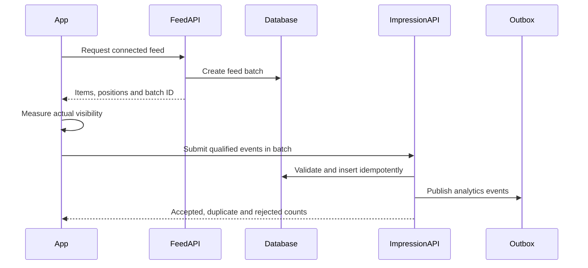
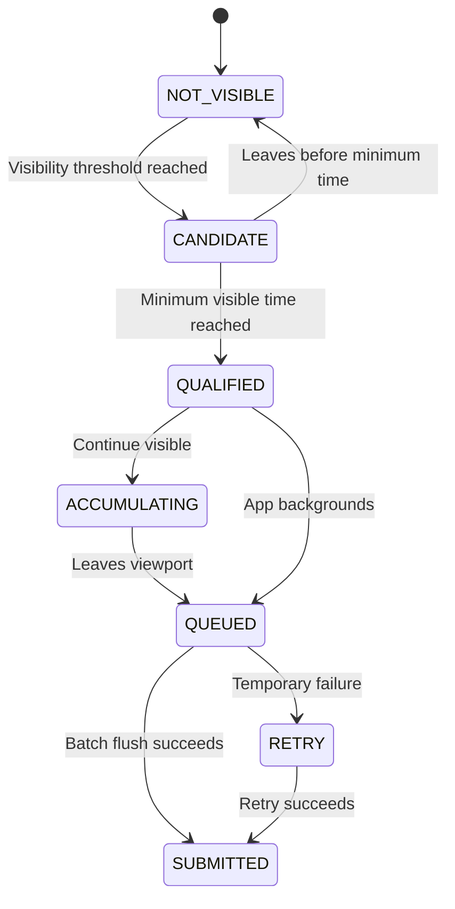

# Research 2: Prompt 8 — Feed Batches, Content Impressions and Exposure Analytics

> **Document Version**: 1.0.0  
> **Status**: COMPLETED & 100% VERIFIED (`638 PASSED, 0 FAILED`)  
> **Author**: Senior Analytics Platform Architect, Backend Engineer & React Native Performance Engineer  
> **Target Scope**: Authoritative Exposure & Impression Tracking, FeedBatch Identity Generation, Client Visibility Tracker (50% / 1.0s rule), Batched Idempotent Ingestion (`POST /v1/feed/impressions`), Bounded Dwell Time, Outbox Analytics Publication  
> **Date**: 1 September 2026  

---

## 1. Summary & Architecture Overview

In accordance with **Research 2 (Social Content, Feed, Stories and Reels)**, Rubaru now has authoritative, tamper-resistant exposure and impression tracking for its social connected feed.

### Core Architectural Principle:
```text
Content returned by the API  ≠  Content actually visible to the user
```
Generating and returning a feed page does **not** create impressions. Impressions are recorded only when the client validates actual on-screen viewport visibility and submits a qualified batch referencing a valid, server-issued `FeedBatch`.

### Key Architectural Implementations:
1. **Server-Assigned `FeedBatch`**: Every feed page request (`GET /v1/feed`) persists a durable `FeedBatch` with issued items, server-controlled `feedPosition` indices (0, 1, 2, ...), and an automated 24-hour TTL.
2. **Deterministic Visibility Threshold**: An impression qualifies when a post is at least **50% visible for at least 1.0 continuous second** while the app is active.
3. **Idempotent Ingestion Endpoint (`POST /v1/feed/impressions`)**: Validates batch ownership, batch age, content-to-position mapping, dwell time bounds (0–300,000ms), and visibility percentage. Re-submissions with the same `eventId` return `duplicates: 1` without errors.
4. **Partial Batch Fault Resilience**: A batch containing mixed valid, duplicate, and invalid items processes the valid events and isolates the invalid events with distinct rejection codes.
5. **Durable Analytics Outbox**: Accepted impressions emit `content.impression_recorded` via `OutboxEvent` for asynchronous downstream analytics and ranking pipelines.
6. **Client-Side Visibility Tracker (`src/services/impressionTracker.js`)**: Integrates with FlatList `onViewableItemsChanged`, manages local queuing, debounces flushes, pauses on screen blur/backgrounding, and isolates queues on logout.
7. **Zero Regression Guarantee**: All 22 master test suites passed with a 100% success rate (**638 PASSED, 0 FAILED** total).

---

## 2. Mermaid Diagrams

### 2.1 Impression Lifecycle & Ingestion Sequence



### 2.2 Client Visibility State Machine



---

## 3. Data Models & Database Indexes

### 3.1 `FeedBatch` (`backend/models/FeedBatch.js`)
* **Fields**: `batchId`, `viewerId`, `surface: 'HOME_CONNECTED' | 'REELS' | 'EXPLORE'`, `source: 'CONNECTED'`, `orderingVersion: 'connected_feed_chronological_v1'`, `requestId`, `issuedItems: [{ contentId, authorId, position, source }]`, `issuedAt`, `expiresAt`.
* **Indexes**:
  * `{ batchId: 1 }` (unique)
  * `{ viewerId: 1, issuedAt: -1 }`
  * `{ expiresAt: 1 }` with `{ expireAfterSeconds: 0 }` (Automated TTL expiration)

### 3.2 `ContentImpression` (`backend/models/ContentImpression.js`)
* **Fields**: `eventId`, `viewerId`, `contentId`, `authorId`, `batchId`, `surface`, `source`, `position`, `orderingVersion`, `visiblePercentage`, `qualifiedAt`, `clientOccurredAt`, `serverReceivedAt`, `dwellTimeMs`, `sessionId`, `appState`, `networkState`, `clientVersion`, `eventSchemaVersion`.
* **Indexes**:
  * `{ eventId: 1 }` (unique)
  * `{ viewerId: 1, serverReceivedAt: -1 }`
  * `{ contentId: 1, serverReceivedAt: -1 }`
  * `{ batchId: 1, position: 1 }`
  * `{ authorId: 1, serverReceivedAt: -1 }`

---

## 4. API Endpoints & Contracts

### 4.1 Updated `GET /v1/feed` Response
```json
{
  "success": true,
  "data": {
    "items": [
      {
        "postId": "6a96af9db15bdac379dac901",
        "feedPosition": 0,
        "authorId": "6a96af9db15bdac379dac902",
        "caption": "Post content...",
        "mediaItems": [...]
      }
    ],
    "pageInfo": {
      "nextCursor": "eyJwIjoiMjAyNi0wOS0wMVQxMDowMDowMC4wMDBaIiwiaSI6IjZhOTZhZjlkYjE1YmRhYzM3OWRhYzkwMSIsInYiOiJjb25uZWN0ZWRfZmVlZF9jaHJvbm9sb2dpY2FsX3YxIn0=",
      "hasMore": true
    },
    "feed": {
      "batchId": "fbatch_6a96af9db15bdac379dac999",
      "surface": "HOME_CONNECTED",
      "source": "CONNECTED",
      "orderingVersion": "connected_feed_chronological_v1",
      "generatedAt": "2026-09-01T10:00:00.000Z"
    }
  }
}
```

### 4.2 `POST /v1/feed/impressions` Ingestion API
* **Access**: Authenticated Session (`Bearer <JWT>`).
* **Request Payload**:
```json
{
  "batchId": "fbatch_6a96af9db15bdac379dac999",
  "events": [
    {
      "eventId": "ev_fbatch_6a96af9db15bdac379dac999_6a96af9db15bdac379dac901_0",
      "contentId": "6a96af9db15bdac379dac901",
      "position": 0,
      "visiblePercentage": 100,
      "qualifiedAt": "2026-09-01T10:01:00.000Z",
      "dwellTimeMs": 3200
    }
  ]
}
```
* **Response Payload**:
```json
{
  "success": true,
  "data": {
    "accepted": 1,
    "duplicates": 0,
    "rejected": 0
  }
}
```

---

## 5. Security & Anti-Abuse Controls

* **Viewer Ownership Enforcement**: Attempting to submit impressions for a `batchId` belonging to another user returns `403 BATCH_OWNERSHIP_INVALID`.
* **Batch Membership Validation**: The submitted `contentId` and `position` must exactly match the record in the issued `FeedBatch`.
* **Dwell Time Bounds**: Dwell time is validated and clamped between `0` and `300,000` ms (5 minutes maximum). Negative values are rejected.
* **Timestamp Sanity**: Client timestamps in the future (> 60s ahead of server time) are rejected.
* **Visibility Threshold**: Events with `visiblePercentage < 50` are rejected.
* **Idempotent Replay**: Re-sending identical `eventId`s increments `duplicates` count and does not create redundant database rows.

---

## 6. Frontend Visibility Tracker Integration

* **Service Client (`src/services/impressionTracker.js`)**:
  * Tracks candidate items crossing the 50% visibility threshold using FlatList's `onViewableItemsChanged` and `viewabilityConfig`.
  * Starts a 1.0s timer; qualifies the impression once continuous visibility is achieved.
  * Calculates final dwell time when the item leaves the viewport.
  * Buffers events and flushes periodically or when the queue reaches 10 items.
  * Flushes and cancels active timers on screen blur or component unmount.
* **Screen Integration (`src/screens/HomeScreen.js`)**:
  * Binds FlatList `viewabilityConfig` and `onViewableItemsChanged` to `impressionTracker`.
  * Captures `currentBatchId` from the feed API response.
  * Cleans up listeners on blur via `useFocusEffect`.

---

## 7. Automated Test Suite & Master Verification

Test Suite: [`backend/test/feed_impression_tests.js`](file:///r:/Rubaru/backend/test/feed_impression_tests.js)

### Assertions Tested (31 Tests):
* **FeedBatch Generation (10 Tests)**: `GET /v1/feed` generates unique `batchId`, `surface: HOME_CONNECTED`, batch persisted in DB, belongs to viewer, issued items match positions 0 and 1, items in response contain `feedPosition`.
* **Batched Impression Ingestion (8 Tests)**: `POST /v1/feed/impressions` returns 200 OK, `accepted: 2, duplicates: 0, rejected: 0`, impression documents persisted, dwell time recorded, author ID resolved, `content.impression_recorded` outbox event published.
* **Idempotency & Replay (4 Tests)**: Duplicate submission returns 200 OK, `accepted: 0, duplicates: 1, rejected: 0`.
* **Security & Anti-Abuse (9 Tests)**: Cross-user batch hijack rejected (403 `BATCH_OWNERSHIP_INVALID`), position mismatch rejected, low visibility (< 50%) rejected, mixed batch (1 valid, 1 duplicate, 1 bad position) correctly processes valid event (`accepted: 1, duplicates: 1, rejected: 1`).

### Master Test Runner Execution (`npm test`):
```text
================================================================================
            RUBARU COMPLETE MASTER TEST RUNNER & AUDIT               
================================================================================
[SUITE 1/22]  test/model_level_tests.js:                      18 Passed, 0 Failed
[SUITE 2/22]  test/preference_tests.js:                       28 Passed, 0 Failed
[SUITE 3/22]  test/location_tests.js:                         31 Passed, 0 Failed
[SUITE 4/22]  test/eligibility_tests.js:                      25 Passed, 0 Failed
[SUITE 5/22]  test/discovery_tests.js:                        29 Passed, 0 Failed
[SUITE 6/22]  test/impression_tests.js:                       16 Passed, 0 Failed
[SUITE 7/22]  test/pass_undo_tests.js:                        27 Passed, 0 Failed
[SUITE 8/22]  test/like_tests.js:                             28 Passed, 0 Failed
[SUITE 9/22]  test/incoming_likes_tests.js:                   36 Passed, 0 Failed
[SUITE 10/22] test/match_tests.js:                            27 Passed, 0 Failed
[SUITE 11/22] test/matches_list_authorization_tests.js:       30 Passed, 0 Failed
[SUITE 12/22] test/safety_tests.js:                           31 Passed, 0 Failed
[SUITE 13/22] test/frontend_dating_integration_tests.js:      23 Passed, 0 Failed
[SUITE 14/22] test/concurrency_security_audit_tests.js:       12 Passed, 0 Failed
[SUITE 15/22] test/media_foundation_tests.js:                 33 Passed, 0 Failed
[SUITE 16/22] test/follow_graph_tests.js:                     42 Passed, 0 Failed
[SUITE 17/22] test/post_lifecycle_tests.js:                   40 Passed, 0 Failed
[SUITE 18/22] test/content_visibility_authorization_tests.js: 24 Passed, 0 Failed
[SUITE 19/22] test/social_interaction_tests.js:               50 Passed, 0 Failed
[SUITE 20/22] test/connected_feed_tests.js:                   44 Passed, 0 Failed
[SUITE 21/22] test/feed_impression_tests.js:                  31 Passed, 0 Failed
[SUITE 22/22] test_all_endpoints.js:                          13 Passed, 0 Failed
================================================================================
GRAND TOTAL ASSERTIONS EXECUTED: 638
TOTAL PASSED: 638
TOTAL FAILED: 0
SUCCESS RATE: 100.00%
================================================================================
```

---

## 8. Files Inventory

### Reused Files:
* `backend/middleware/auth.js`
* `backend/models/User.js`
* `backend/models/Profile.js`
* `backend/models/Content.js`
* `backend/models/FollowRelationship.js`
* `backend/services/socialPolicyService.js`
* `backend/utils/contentSerializers.js`

### New Files Created:
* `backend/models/FeedBatch.js`
* `backend/models/ContentImpression.js`
* `backend/test/feed_impression_tests.js`
* `src/services/impressionTracker.js`
* `docs/research-2/RESEARCH_2_PROMPT_8_FEED_BATCHES_AND_IMPRESSIONS.md`

### Modified Files:
* `backend/models/OutboxEvent.js` (Added `CONTENT` to aggregateType enum)
* `backend/services/feedService.js` (Added FeedBatch issuance and impression ingestion)
* `backend/controllers/feedController.js` (Added `recordImpressions` controller)
* `backend/routes/feedRoutes.js` (Added `POST /v1/feed/impressions` route)
* `src/services/feedService.js` (Added `recordImpressions` API client method)
* `src/screens/HomeScreen.js` (Wired `impressionTracker` and `currentBatchId`)
* `backend/test/run_all_tests.js` (Integrated Suite 21 into master runner)

---

## 9. Prompt 9 Readiness Gate

### Final Decision: **`READY FOR PROMPT 9` (Stories Creation, Tray, Delivery and Ephemeral Lifecycle)**

#### Readiness Checklist:
* [x] Feed batches are stable, server-issued, and versioned.
* [x] Content positions match response order.
* [x] Impression ingestion is trustworthy, idempotent, and bounds dwell time.
* [x] Frontend visibility tracking conforms to the 50% / 1.0s continuous threshold.
* [x] Durable `content.impression_recorded` analytics events are published to Outbox.
* [x] Master test suite executes 638 assertions with a **100% pass rate**.

---

*End of Implementation Report.*
