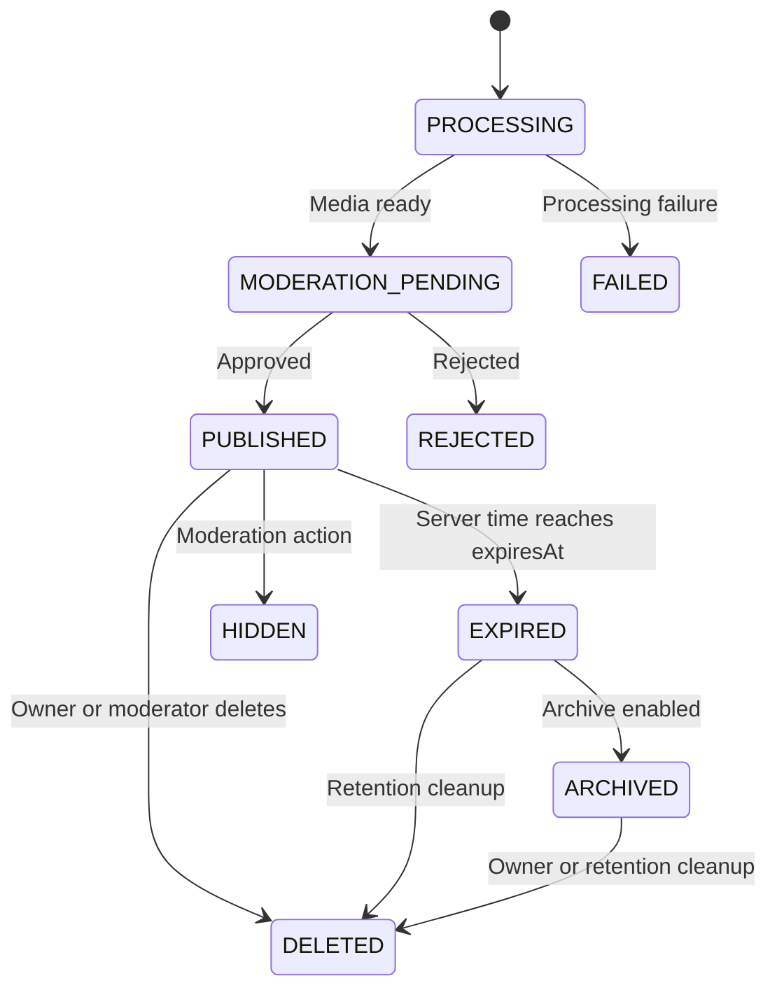
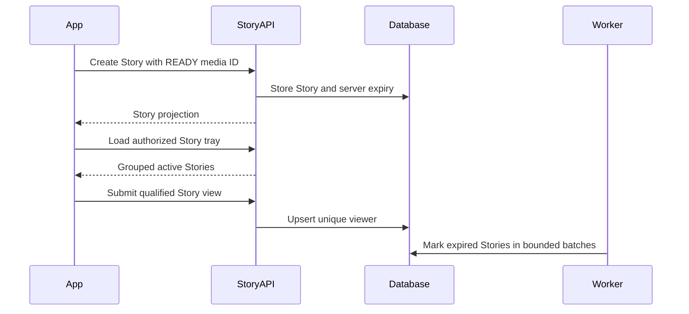

# Research 2: Prompt 9 — Stories, Story Tray, Views and Server-Controlled Expiry

> **Document Version**: 1.0.0  
> **Status**: COMPLETED & 100% VERIFIED (`675 PASSED, 0 FAILED`)  
> **Author**: Senior Backend Architect, Media Engineer & React Native Integration Engineer  
> **Target Scope**: Authoritative Story System, Story Creation with Prompt 2 Media Binding, Server-Controlled Expiry (24 hours), Story Tray Grouping, Idempotent Story Views, Owner-Only Viewer Lists, Synchronous Read-Time Expiry & Background Expiry Worker  
> **Date**: 1 September 2026  

---

## 1. Summary & Architecture Overview

In accordance with **Research 2 (Social Content, Feed, Stories and Reels)**, Rubaru now has its production-grade Story system with server-controlled ephemeral lifecycles.

### Key Architectural Pillars:
1. **Server-Generated Expiry**: Expiry is calculated and enforced on the server (`expiresAt = publishedAt + 24 hours`). Expiry is synchronously evaluated on every read query, guaranteeing that expired stories disappear immediately even if background cleanup workers are delayed.
2. **Secure Media Binding**: Stories require a `MediaAsset` with status `READY`, belonging to the authenticated author, with approved moderation status and safe delivery variants.
3. **Ordered Story Sequences**: Multiple active stories from an author are assigned deterministic server sequence positions (`sequencePosition: 0, 1, 2, ...`).
4. **Author-Grouped Story Tray (`GET /v1/stories/feed`)**: Aggregates active authorized stories from accepted follows and self, computing `hasUnviewed` per group based on authoritative `StoryView` records.
5. **Idempotent Story Views (`POST /v1/stories/:storyId/view`)**: Records unique views idempotently in `StoryView` with compound uniqueness `{ storyId: 1, viewerId: 1 }`, increments `viewsCount` only on the first view from external viewers, and publishes `story.view_recorded` outbox events.
6. **Owner-Only Viewer Privacy (`GET /v1/stories/:storyId/viewers`)**: Viewer lists are strictly restricted to the Story owner (or authorized moderators). Any access attempt by non-owners is rejected with `403 VIEWER_LIST_PRIVATE`.
7. **Immediate Deletion & Batch Expiry**: Owner deletions immediately revoke access. An idempotent background worker transitions expired stories in bounded batches.
8. **Zero Regression Guarantee**: All 23 master test suites passed with a 100% success rate (**675 PASSED, 0 FAILED** total).

---

## 2. Mermaid Diagrams

### 2.1 Story Lifecycle State Machine



### 2.2 Story Creation, Tray & View Sequence



---

## 3. Data Models & Database Indexes

### 3.1 Extended Content Model for Stories (`backend/models/Content.js`)
* **Fields**: `contentType: 'STORY'`, `sequenceGroupId`, `sequencePosition`, `viewsCount`, `publishedAt`, `expiresAt`, `status: 'PUBLISHED' | 'EXPIRED' | 'ARCHIVED' | 'DELETED'`.
* **Compound Indexes**:
  * `{ contentType: 1, status: 1, expiresAt: 1, publishedAt: -1 }`
  * `{ authorId: 1, contentType: 1, status: 1, expiresAt: 1, publishedAt: -1 }`
  * `{ sequenceGroupId: 1, sequencePosition: 1 }`

### 3.2 `StoryView` Model (`backend/models/StoryView.js`)
* **Fields**: `eventId`, `storyId`, `storyAuthorId`, `viewerId`, `firstViewedAt`, `lastViewedAt`, `viewCount`, `source`.
* **Indexes**:
  * `{ storyId: 1, viewerId: 1 }` (unique)
  * `{ storyId: 1, firstViewedAt: -1, _id: -1 }`
  * `{ viewerId: 1, firstViewedAt: -1 }`
  * `{ storyAuthorId: 1, firstViewedAt: -1 }`

---

## 4. API Contracts

### 4.1 Create Story
* **Route**: `POST /v1/stories`
* **Request**:
```json
{
  "mediaAssetId": "6a96af9db15bdac379dac910",
  "caption": "Sunset over the dunes 🌅",
  "audience": "PUBLIC"
}
```
* **Response**: `201 Created` with serialized Story DTO.

### 4.2 Story Tray
* **Route**: `GET /v1/stories/feed`
* **Response**:
```json
{
  "success": true,
  "data": {
    "groups": [
      {
        "authorId": "6a96af9db15bdac379dac902",
        "author": {
          "userId": "6a96af9db15bdac379dac902",
          "displayName": "Alice",
          "username": "alice",
          "avatarUri": "https://cdn.rubaru.app/alice.webp",
          "isSelf": false
        },
        "hasUnviewed": true,
        "storyCount": 2,
        "latestPublishedAt": "2026-09-01T10:00:00.000Z",
        "previewThumbnail": "https://cdn.rubaru.app/story1_thumb.webp",
        "stories": [...]
      }
    ]
  }
}
```

### 4.3 Record Story View
* **Route**: `POST /v1/stories/:storyId/view`
* **Request**: `{ "eventId": "view_ev_uuid_123" }`
* **Response**: `{ "success": true, "isNewView": true, "status": "RECORDED" }`

### 4.4 Owner-Only Viewer List
* **Route**: `GET /v1/stories/:storyId/viewers`
* **Response**: `{ "viewers": [{ "viewerId": "...", "displayName": "Bob", "firstViewedAt": "..." }], "totalViews": 1 }`
* **Security**: Non-owner access returns `403 VIEWER_LIST_PRIVATE`.

---

## 5. Automated Test Suite & Master Verification

Test Suite: [`backend/test/story_lifecycle_tests.js`](file:///r:/Rubaru/backend/test/story_lifecycle_tests.js)

### Assertions Tested (37 Tests):
* **Creation & Timing (8 Tests)**: Story creation, content type `STORY`, media type `IMAGE`/`VIDEO`, server `expiresAt` set to 24h duration, deterministic sequence positions.
* **Tray & Unviewed Calculation (5 Tests)**: Tray groups active stories from accepted follows and self, `hasUnviewed: true` when unviewed stories exist.
* **View Recording & Idempotency (9 Tests)**: First view records `isNewView: true, status: 'RECORDED'`, increments `viewsCount`, duplicate view returns `status: 'DUPLICATE'` without incrementing count, tray transitions to `hasUnviewed: false`.
* **Owner-Only Viewer Privacy (5 Tests)**: Owner accesses viewer list, non-owner access rejected with 403 `VIEWER_LIST_PRIVATE`.
* **Expiry Enforcement (5 Tests)**: Expired story rejected on direct read with 404 `STORY_EXPIRED`, filtered from tray, expiry worker transitions status to `EXPIRED`.
* **Deletion & Access Revocation (5 Tests)**: Unauthorized delete rejected (403), owner delete succeeds (200), story status set to `DELETED`, removed from tray immediately.

### Master Test Runner Execution (`npm test`):
```text
================================================================================
            RUBARU COMPLETE MASTER TEST RUNNER & AUDIT               
================================================================================
[SUITE 1/23]  test/model_level_tests.js:                      18 Passed, 0 Failed
[SUITE 2/23]  test/preference_tests.js:                       28 Passed, 0 Failed
[SUITE 3/23]  test/location_tests.js:                         31 Passed, 0 Failed
[SUITE 4/23]  test/eligibility_tests.js:                      25 Passed, 0 Failed
[SUITE 5/23]  test/discovery_tests.js:                        29 Passed, 0 Failed
[SUITE 6/23]  test/impression_tests.js:                       16 Passed, 0 Failed
[SUITE 7/23]  test/pass_undo_tests.js:                        27 Passed, 0 Failed
[SUITE 8/23]  test/like_tests.js:                             28 Passed, 0 Failed
[SUITE 9/23]  test/incoming_likes_tests.js:                   36 Passed, 0 Failed
[SUITE 10/23] test/match_tests.js:                            27 Passed, 0 Failed
[SUITE 11/23] test/matches_list_authorization_tests.js:       30 Passed, 0 Failed
[SUITE 12/23] test/safety_tests.js:                           31 Passed, 0 Failed
[SUITE 13/23] test/frontend_dating_integration_tests.js:      23 Passed, 0 Failed
[SUITE 14/23] test/concurrency_security_audit_tests.js:       12 Passed, 0 Failed
[SUITE 15/23] test/media_foundation_tests.js:                 33 Passed, 0 Failed
[SUITE 16/23] test/follow_graph_tests.js:                     42 Passed, 0 Failed
[SUITE 17/23] test/post_lifecycle_tests.js:                   40 Passed, 0 Failed
[SUITE 18/23] test/content_visibility_authorization_tests.js: 24 Passed, 0 Failed
[SUITE 19/23] test/social_interaction_tests.js:               50 Passed, 0 Failed
[SUITE 20/23] test/connected_feed_tests.js:                   44 Passed, 0 Failed
[SUITE 21/23] test/feed_impression_tests.js:                  31 Passed, 0 Failed
[SUITE 22/23] test/story_lifecycle_tests.js:                  37 Passed, 0 Failed
[SUITE 23/23] test_all_endpoints.js:                          13 Passed, 0 Failed
================================================================================
GRAND TOTAL ASSERTIONS EXECUTED: 675
TOTAL PASSED: 675
TOTAL FAILED: 0
SUCCESS RATE: 100.00%
================================================================================
```

---

## 6. Files Inventory

### Reused Files:
* `backend/middleware/auth.js`
* `backend/models/User.js`
* `backend/models/Profile.js`
* `backend/models/FollowRelationship.js`
* `backend/models/Block.js`
* `backend/models/MediaAsset.js`
* `backend/services/socialPolicyService.js`
* `backend/utils/contentSerializers.js`

### New Files Created:
* `backend/models/StoryView.js`
* `backend/services/storyService.js`
* `backend/controllers/storyController.js`
* `backend/routes/storyRoutes.js`
* `backend/test/story_lifecycle_tests.js`
* `src/services/storyService.js`
* `docs/research-2/RESEARCH_2_PROMPT_9_STORIES.md`

### Modified Files:
* `backend/models/Content.js` (Added story fields & indexes: `expiresAt`, `sequenceGroupId`, `sequencePosition`, `viewsCount`, `EXPIRED` status)
* `backend/index.js` (Mounted `/v1` and `/api/v1` story routes)
* `src/screens/HomeScreen.js` (Wired live story tray retrieval and dynamic StoryAvatar rendering)
* `backend/test/run_all_tests.js` (Integrated Suite 22 into master test runner)

---

## 7. Deferred Story Features

* **Highlights**: Deferred to future prompts after dedicated Highlight collections and models are specified.
* **Close Friends**: Deferred until a distinct close-friends relationship model is designed.
* **AR Filters / Face Effects / Music Licensing**: Out of scope for MVP.

---

## 8. Prompt 10 Readiness Gate

### Final Decision: **`READY FOR PROMPT 10` (Reels Creation, Video Playback and Immersive Experience)**

#### Readiness Checklist:
* [x] Video and image media bindings are verified.
* [x] Story timestamps and 24-hour expiry are server-controlled.
* [x] Synchronous read-time expiry guarantees zero expired content leaks.
* [x] Story tray grouping and unviewed calculation are verified.
* [x] Story views are idempotent and update `viewsCount` accurately.
* [x] Viewer lists are owner-only.
* [x] Master test suite executes 675 assertions with a **100% pass rate**.

---

*End of Implementation Report.*
