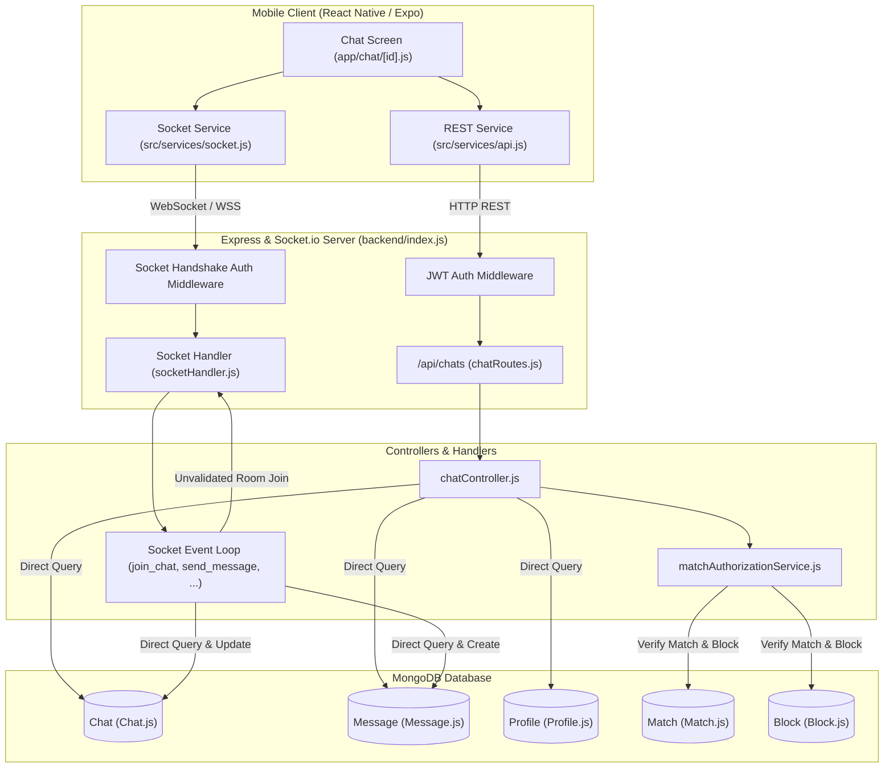

# R3-01: Existing Messaging and Socket System Audit

**Phase**: Research 3 — Real-Time Messaging Architecture  
**Document**: `R3-01_EXISTING_MESSAGING_AUDIT.md`  
**Date**: September 2026  
**Auditor**: Senior Backend Architect, Real-Time Systems Engineer & Application Security Engineer  
**Status**: READ-ONLY AUDIT COMPLETE  

---

## 1. Executive Summary

This document establishes the exhaustive, evidence-based, read-only audit of the Rubaru repository's real-time messaging, Socket.io infrastructure, REST endpoints, data models, call signaling boundary, and mobile client integration prior to implementing Research 3 (R3-02 through R3-15).

### Key Audit Findings
1. **Dating & Social Foundations Intact**: Research 1 (Dating Core: Discovery, Preferences, Location, Interactions, Matches) and Research 2 (Social Media Layer: Media Assets, Follow Graph, Posts, Interactions, Feed, Stories, Reels, Safety/Moderation, Outbox & Push Notifications) are active and passing 100% of the 841 automated regression assertions (`npm test` in `backend/`).
2. **Prototype Messaging Subsystem**: The current repository contains a basic prototype messaging layer consisting of:
   - Backend models: `Chat` (`backend/models/Chat.js`), `Message` (`backend/models/Message.js`), `CallLog` (`backend/models/CallLog.js`).
   - REST endpoints: `GET /api/chats`, `GET /api/chats/:chatId/messages`, `POST /api/chats/message`, `POST /api/chats/poll`, `POST /api/chats/poll/:messageId/vote`, `POST /api/chats/message/:messageId/react`, `GET /api/calls/logs`, `POST /api/calls/logs`.
   - Socket.io: `backend/socket/socketHandler.js` handling `join_chat`, `leave_chat`, `send_message`, `relay_message`, `send_reaction`, `submit_vote`, `call_user`, `call_accepted`, `call_rejected`, `call_ended`, `send_webrtc_signal`.
3. **Critical Architectural Gaps & Vulnerabilities**:
   - **No Authoritative Conversation Membership Model**: Participants are stored as a loose array of ObjectIds in `Chat.participants` with no join sequences, roles, mute/archive high-water marks, or member status tracking.
   - **No Sequential Monotonic Message Ordering**: Messages rely purely on MongoDB `createdAt` timestamps, vulnerable to millisecond clock drift and out-of-order race conditions.
   - **No Idempotency Key / Client Deduplication**: Socket and REST handlers perform raw `Message.create` without idempotency protection or client message ID indexing.
   - **Fragmented Duplication of Write Logic**: REST `sendMessage` and Socket `send_message` execute independent database write paths without a shared domain service.
   - **Insecure Room Access in Sockets**: `socket.on('join_chat', (chatId) => socket.join('chat_' + chatId))` joins arbitrary chat rooms without verifying that `socket.user._id` is an authorized participant or checking match/block status!
   - **Multipart Local File Storage for Chat Media**: `POST /api/chats/message` uses Multer to write images/audio to local disk (`/uploads/images`, `/uploads/audio`), completely bypassing the signed URL upload session architecture built in Research 2 (`MediaAsset`, `UploadSession`, `StorageProvider`).
   - **Missing Read/Delivery Receipts Architecture**: `isRead` is a single flat boolean on the message document, failing to handle group chats, multi-device sync, or delivery watermarks.
   - **No Offline Sync or Gap Recovery**: Disconnects rely on best-effort Socket.io reconnection without replay cursors, sequence tracking, or sync endpoints.

---

## 2. Audit Scope

### In-Scope Modules Audited
- Backend Root & Runtime Entry Points (`backend/index.js`, `backend/package.json`).
- Socket.io Server, Middleware, Namespaces & Event Handlers (`backend/socket/socketHandler.js`).
- REST Messaging & Call Controllers & Routes (`backend/controllers/chatController.js`, `backend/routes/chatRoutes.js`, `backend/controllers/callController.js`, `backend/routes/callRoutes.js`).
- Authorization & Dating Match Interlock (`backend/services/matchAuthorizationService.js`).
- Notification & Outbox Infrastructure (`backend/models/Notification.js`, `backend/models/OutboxEvent.js`, `backend/models/Device.js`, `backend/services/notificationService.js`, `backend/services/pushAdapter.js`, `backend/services/notificationConsumer.js`).
- Data Schemas (`backend/models/Chat.js`, `backend/models/Message.js`, `backend/models/CallLog.js`, `backend/models/Match.js`, `backend/models/Block.js`, `backend/models/User.js`, `backend/models/Profile.js`).
- Frontend Mobile Client (`package.json`, `src/services/socket.js`, `src/hooks/useSocket.js`, `src/screens/ChatsScreen.js`, `app/chat/[id].js`, `src/screens/GroupChatScreen.js`, `src/screens/ActiveCallScreen.js`, `src/screens/CallLogsScreen.js`, `src/components/common/IncomingCallContext.js`).

---

## 3. Repository and Stack Summary

| Layer | Component | Versions & Technology | Description |
|---|---|---|---|
| **Backend Core** | Runtime & Server | Node.js, Express `^4.19.2`, HTTP Server | Monolithic Express REST + Socket.io server on single port |
| **Database** | ODM & Storage | MongoDB, Mongoose `^8.5.1` | Document storage with schemas, compound indexes, timestamps |
| **Real-Time** | WebSockets | Socket.io `^4.7.5` (Server & Client) | Default namespace, polling & websocket transports |
| **File Handling** | Attachments | Multer `^1.4.5-lts.1` & Local Disk vs. S3/StorageProvider | Chat currently uses disk uploads; Social layer uses `StorageProvider` |
| **Security** | Auth & Token | `jsonwebtoken ^9.0.2`, `bcryptjs ^2.4.3` | Bearer JWT header in REST; handshake auth/query token in Socket.io |
| **Mobile App** | Framework | React Native `0.86.2`, React `19.2.3`, Expo `~57.0.14`, Expo Router `~57.0.12` | Cross-platform iOS/Android/Web client |
| **Client State** | Storage & Queries | Zustand `^4.5.5`, TanStack React Query `^5.51.23`, AsyncStorage `^2.2.0` | Client state management |
| **Testing** | Runner & Assertions | Custom Node.js assertion suites (`backend/test/run_all_tests.js`) | 27 test files covering 841 automated checks |

---

## 4. Actual Discovered Messaging Architecture

```
[ Mobile Chat Screen (app/chat/[id].js) ]
  ├── 1. Initial Load: GET /api/chats/:chatId/messages (via api.js with JWT)
  ├── 2. Real-Time Setup:
  │      └── connectSocket(token) -> Socket.io handshake (auth: { token })
  │      └── socket.emit('join_chat', chatId) -> server joins room `chat_${chatId}`
  ├── 3. Send Text Message:
  │      ├── (Fast Path): socket.emit('send_message', { chatId, text, ... })
  │      └── (Fallback / New Chat): POST /api/chats/message
  ├── 4. Send Media Attachment:
  │      └── POST /api/chats/message (multipart/form-data via Multer -> local disk)
  │      └── socket.emit('relay_message', { chatId, message })
  ├── 5. Receive Message:
  │      └── socket.on('receive_message', (payload) => UI optimistic reconcile)
  └── 6. Reactions & Polls:
         ├── socket.emit('send_reaction', { chatId, messageId, emoji })
         └── socket.emit('submit_vote', { chatId, messageId, optionIndex })
```

---

## 5. Mermaid Architecture Diagram



---

## 6. Backend File Inventory

| File Path | Primary Responsibility | Lines | Status |
|---|---|---|---|
| `backend/index.js` | Express & Socket.io server bootstrapping, routing table | 137 | `IMPLEMENTED_AND_VERIFIED` |
| `backend/socket/socketHandler.js` | Socket connection, auth, chat events, calling signaling | 267 | `PARTIAL` / `INSECURE` |
| `backend/routes/chatRoutes.js` | Express route definitions for `/api/chats` | 26 | `IMPLEMENTED_AND_VERIFIED` |
| `backend/controllers/chatController.js` | REST handlers for conversations, message history, polls, reactions | 348 | `PARTIAL` |
| `backend/routes/callRoutes.js` | Express route definitions for `/api/calls` | 16 | `IMPLEMENTED_AND_VERIFIED` |
| `backend/controllers/callController.js` | REST handlers for call log history and creation | 81 | `IMPLEMENTED_AND_VERIFIED` |
| `backend/models/Chat.js` | Mongoose schema for conversations | 49 | `PARTIAL` |
| `backend/models/Message.js` | Mongoose schema for messages | 76 | `PARTIAL` |
| `backend/models/CallLog.js` | Mongoose schema for call logs | 38 | `IMPLEMENTED_AND_VERIFIED` |
| `backend/models/Match.js` | Mongoose schema for dating matches | 104 | `IMPLEMENTED_AND_VERIFIED` |
| `backend/models/Block.js` | Mongoose schema for user block relationships | 40 | `IMPLEMENTED_AND_VERIFIED` |
| `backend/models/Device.js` | Mongoose schema for push notification device tokens | 65 | `IMPLEMENTED_AND_VERIFIED` |
| `backend/models/Notification.js` | Mongoose schema for notifications | 124 | `IMPLEMENTED_AND_VERIFIED` |
| `backend/models/OutboxEvent.js` | Mongoose schema for transactional outbox events | 69 | `IMPLEMENTED_AND_VERIFIED` |
| `backend/services/matchAuthorizationService.js` | Membership, active match and block validation for dating chats | 120 | `IMPLEMENTED_AND_VERIFIED` |
| `backend/services/notificationService.js` | Multi-category notification dispatcher and socket emitter | 587 | `IMPLEMENTED_AND_VERIFIED` |
| `backend/services/pushAdapter.js` | Multi-provider push dispatcher (FCM/APNS/Expo/Mock) | 78 | `IMPLEMENTED_AND_VERIFIED` |
| `backend/services/notificationConsumer.js` | Outbox worker consumer for background notification events | 276 | `IMPLEMENTED_AND_VERIFIED` |

---

## 7. Frontend File Inventory

| File Path | Component / Hook / Service | Purpose | Data Source | Socket Events | Status |
|---|---|---|---|---|---|
| `src/services/socket.js` | Socket Singleton | Initializes & manages client Socket.io instance | Environment URL / JWT | `connect`, `connect_error`, `disconnect` | `IMPLEMENTED_AND_VERIFIED` |
| `src/hooks/useSocket.js` | React Hook | Component-level socket listener registration | Socket singleton | Arbitrary | `IMPLEMENTED_AND_VERIFIED` |
| `src/screens/ChatsScreen.js` | Screen Component | Conversation list, story avatars header, unread preview | `GET /api/chats`, `GET /profiles/me` | None (Relies on focus reload) | `IMPLEMENTED_AND_VERIFIED` |
| `app/chat/[id].js` | Screen Component | Direct 1-on-1 chat thread, composer, voice recorder, polls, reactions | `GET /api/chats/:chatId/messages`, REST + Socket | `join_chat`, `leave_chat`, `send_message`, `receive_message`, `relay_message`, `send_reaction`, `submit_vote` | `PARTIAL` |
| `src/screens/GroupChatScreen.js` | Screen Component | Group conversation thread UI | Local mock array (`initialGroupMessages`) | None | `FRONTEND_ONLY` / `MOCKED` |
| `src/screens/ActiveCallScreen.js` | Screen Component | Voice/Video WebRTC call interface | REST + Local state | `call_user`, `call_accepted`, `call_declined`, `call_hungup` | `PARTIAL` |
| `src/screens/CallLogsScreen.js` | Screen Component | Call history list | `GET /api/calls/logs` | None | `IMPLEMENTED_AND_VERIFIED` |
| `src/components/common/IncomingCallContext.js` | Context Provider | Global incoming call listener & banner trigger | Socket singleton | `incoming_call`, `call_accepted`, `call_rejected`, `call_hungup` | `IMPLEMENTED_AND_VERIFIED` |
| `src/components/common/ChatListItem.js` | Component | Individual conversation item in chat list | Props from parent | None | `IMPLEMENTED_AND_VERIFIED` |
| `src/components/common/MessageBubble.js` | Component | Text message bubble with timestamp, status, reaction | Props from parent | None | `IMPLEMENTED_AND_VERIFIED` |
| `src/components/common/VoiceMessageBubble.js` | Component | Audio waveform player | Props (`expo-av`) | None | `IMPLEMENTED_AND_VERIFIED` |
| `src/components/common/ImageBubble.js` | Component | Image preview with zoom/reaction | Props | None | `IMPLEMENTED_AND_VERIFIED` |
| `src/components/common/PollBubble.js` | Component | In-thread poll voting widget | Props | None | `IMPLEMENTED_AND_VERIFIED` |
| `src/components/common/AttachmentSheet.js` | Component | Camera / Gallery / Audio / Poll bottom sheet | Local picker triggers | None | `IMPLEMENTED_AND_VERIFIED` |

---

## 8. Conversation-Model Audit (`Chat.js`)

### Schema Specification
- **Model Name**: `Chat`
- **Collection**: `chats`
- **File**: [`backend/models/Chat.js`](file:///c:/Users/Shubh/Desktop/Rubaru/backend/models/Chat.js)
- **Fields**:
  - `participants`: `[ObjectId]` (ref: `'User'`, required).
  - `isGroup`: `Boolean` (default `false`).
  - `groupName`: `String` (trim).
  - `groupAvatar`: `String` (default `''`).
  - `createdBy`: `ObjectId` (ref: `'User'`).
  - `lastMessage`: `ObjectId` (ref: `'Message'`).
  - `match`: `ObjectId` (ref: `'Match'`, index: true, sparse: true).
  - `status`: `String` (enum: `['ACTIVE', 'ARCHIVED', 'BLOCKED', 'CLOSED']`, default `'ACTIVE'`, index: true).
  - `createdAt`, `updatedAt`: `Date` (via `timestamps: true`).

### Critical Flaws & Deficiencies
1. **No Dedicated `ConversationMember` Entity**: Participants are just an ObjectId array. There is no way to store per-user mute settings, per-user archive status, per-user unread counters, joined timestamp, or last-read sequence watermark.
2. **Race Conditions on Creation**: REST `sendMessage` contains:
   ```javascript
   let existingChat = await Chat.findOne({ isGroup: false, participants: { $all: [req.user._id, recipientId] } });
   if (!existingChat) { existingChat = await Chat.create({ participants: [req.user._id, recipientId] }); }
   ```
   Because `participants` has no canonical unique index or canonical pair string (unlike `Match.canonicalPair`), two concurrent requests create duplicate chat documents.
3. **No Per-Conversation Monotonic Sequence Counter**: The model lacks a `lastSequenceNumber` field to enforce strictly ordered message streams.
4. **No Group Roles or Permissions**: `isGroup: true` exists, but there is no admin list, member list with roles (`ADMIN`, `MEMBER`), or ban/leave state.

---

## 9. Message-Model Audit (`Message.js`)

### Schema Specification
- **Model Name**: `Message`
- **Collection**: `messages`
- **File**: [`backend/models/Message.js`](file:///c:/Users/Shubh/Desktop/Rubaru/backend/models/Message.js)
- **Fields**:
  - `chat`: `ObjectId` (ref: `'Chat'`, required: true).
  - `sender`: `ObjectId` (ref: `'User'`, required: true).
  - `type`: `String` (enum: `['text', 'image', 'voice', 'sticker', 'poll']`, default `'text'`).
  - `text`: `String` (default `''`).
  - `attachmentUri`: `String` (default `''`).
  - `stickerId`: `String` (default `''`).
  - `isRead`: `Boolean` (default `false`).
  - `replyTo`: `ObjectId` (ref: `'Message'`).
  - `reactions`: `[{ user: ObjectId, emoji: String }]`.
  - `isPoll`: `Boolean` (default `false`).
  - `pollQuestion`: `String` (default `''`).
  - `pollOptions`: `[{ optionText: String, votes: [ObjectId] }]`.
  - `createdAt`, `updatedAt`: `Date` (via `timestamps: true`).

### Critical Flaws & Correctness Risks
1. **No Authoritative Monotonic Sequence (`seq`)**: Message ordering relies exclusively on `createdAt`. Clocks or database cluster latency can cause message inversions.
2. **No Client Message ID / Idempotency Key**: If a client sends a message over socket, drops connection before receiving ACK, and retries, duplicate messages are inserted.
3. **Flat `isRead` Boolean**: In a 2-person or group chat, `isRead: true` does not specify *who* read the message, *when* they read it, or which device acknowledged it.
4. **No Delivery Watermark / Delivery State**: No tracking for `PENDING`, `SENT_TO_SERVER`, `DELIVERED_TO_RECIPIENT_DEVICE`, `READ_BY_RECIPIENT`.
5. **No Soft Deletion / Tombstone Architecture**: Message deletion on frontend is completely unrepresented or drops messages without tombstones.
6. **No Edits Audit Log**: No `editedAt` or revision history.
7. **No MediaAsset Binding**: `attachmentUri` stores raw path strings rather than referencing secured `MediaAsset` records.

---

## 10. REST API Inventory

| Method | Endpoint | Handler File | Authentication | Authorization Verified | Parameters / Body | Response | Status |
|---|---|---|---|---|---|---|---|
| `GET` | `/api/chats` | `backend/controllers/chatController.js:getChats` | `protect` (JWT) | ✅ Derives from `req.user._id` (`participants: req.user._id`) | None | Array of chat summaries with participant profile | `IMPLEMENTED_AND_VERIFIED` |
| `GET` | `/api/chats/:chatId/messages` | `backend/controllers/chatController.js:getMessages` | `protect` (JWT) | ✅ `requireActiveDatingConversation` checks participant, match & block | `chatId` (path), `page`, `limit` (query) | Array of chronological messages | `IMPLEMENTED_AND_VERIFIED` |
| `POST` | `/api/chats/message` | `backend/controllers/chatController.js:sendMessage` | `protect` (JWT) | ✅ `requireActiveDatingConversation` checks match & block | `chatId`, `recipientId`, `text`, `type`, `stickerId`, `replyTo`, `attachment` (file) | Created `Message` document | `IMPLEMENTED_AND_VERIFIED` |
| `POST` | `/api/chats/poll` | `backend/controllers/chatController.js:createPoll` | `protect` (JWT) | ⚠️ Only checks `participants: req.user._id` (Missing block/match check) | `chatId`, `pollQuestion`, `options` | Created `Message` (poll) | `PARTIAL` |
| `POST` | `/api/chats/poll/:messageId/vote` | `backend/controllers/chatController.js:votePoll` | `protect` (JWT) | ❌ No membership or block check before voting | `messageId` (path), `optionIndex` (body) | Updated `Message` (poll) | `INSECURE` |
| `POST` | `/api/chats/message/:messageId/react` | `backend/controllers/chatController.js:reactMessage` | `protect` (JWT) | ❌ No membership or block check before reacting | `messageId` (path), `emoji` (body) | Updated `Message` | `INSECURE` |
| `GET` | `/api/calls/logs` | `backend/controllers/callController.js:getCallLogs` | `protect` (JWT) | ✅ Queries `$or: [{ caller: req.user._id }, { receiver: req.user._id }]` | None | Array of formatted call logs | `IMPLEMENTED_AND_VERIFIED` |
| `POST` | `/api/calls/logs` | `backend/controllers/callController.js:createCallLog` | `protect` (JWT) | ⚠️ Uses `req.user._id` as caller; no block check on receiver | `receiverId`, `callType`, `callIconType`, `duration` | Created `CallLog` | `IMPLEMENTED_AND_VERIFIED` |

---

## 11. Socket.io Architecture & Configuration Audit

### Socket Configuration
- **Server Bootstrap**: `backend/index.js` attaches `socketio(server, { cors: { origin: '*', methods: ['GET', 'POST', 'PUT', 'DELETE'] } })`.
- **Authentication Middleware** (`backend/socket/socketHandler.js:13`):
  - Extracts JWT token from `socket.handshake.auth.token` or `socket.handshake.query.token`.
  - Verifies token via `jwt.verify(token, process.env.JWT_SECRET)`.
  - Loads user from MongoDB (`User.findById(decoded.id)`) and binds `socket.user = user`.
  - Joins rooms: `socket.join('user:' + userId)` and `socket.join('user_' + userId)`.
- **In-Memory Map**: `const userSocketMap = new Map();` maps `userId -> socket.id`.
  - ⚠️ **Single-Process Limitation**: Multi-device logins overwrite socket IDs in map. Horizontal cluster scaling (multiple Node processes) will fail without Redis adapter!

### Socket Event Inventory

| Direction | Event Name | Producer | Consumer | Payload | Persistence | Authorization Check | Security Status |
|---|---|---|---|---|---|---|---|
| C -> S | `join_chat` | Client (`app/chat/[id].js`) | Server (`socketHandler.js:46`) | `chatId` | None | ❌ **NONE** (Allows any user to join any room!) | `CRITICAL_SECURITY_HOLE` |
| C -> S | `leave_chat` | Client (`app/chat/[id].js`) | Server (`socketHandler.js:52`) | `chatId` | None | None | `IMPLEMENTED_AND_VERIFIED` |
| C -> S | `send_message` | Client (`app/chat/[id].js`) | Server (`socketHandler.js:58`) | `{ chatId, text, type, stickerId, replyTo }` | Direct `Message.create` & `Chat.save` | ⚠️ Checks `Chat.findOne({ _id: chatId, participants: userId })` but misses block/dating match checks | `PARTIAL` |
| S -> C | `receive_message` | Server (`socketHandler.js:101`) | All clients in `chat_${chatId}` | Formatted message payload | N/A | Broadcast to room | `IMPLEMENTED_AND_VERIFIED` |
| C -> S | `relay_message` | Client (`app/chat/[id].js`) | Server (`socketHandler.js:109`) | `{ chatId, message }` | None (Client uploaded via REST first) | ❌ **NONE** (Server trusts unverified message object from client) | `HIGH_SECURITY_RISK` |
| C -> S | `send_reaction` | Client (`app/chat/[id].js`) | Server (`socketHandler.js:116`) | `{ chatId, messageId, emoji }` | Updates `Message.reactions` | ❌ No membership check on `Message` | `INSECURE` |
| S -> C | `update_reaction` | Server (`socketHandler.js:151`) | Room `chat_${chatId}` | `{ messageId, reactions }` | N/A | Broadcast to room | `IMPLEMENTED_AND_VERIFIED` |
| C -> S | `submit_vote` | Client (`app/chat/[id].js`) | Server (`socketHandler.js:161`) | `{ chatId, messageId, optionIndex }` | Updates `Message.pollOptions` | ❌ No membership check on `Message` | `INSECURE` |
| S -> C | `update_poll` | Server (`socketHandler.js:183`) | Room `chat_${chatId}` | `{ messageId, pollOptions }` | N/A | Broadcast to room | `IMPLEMENTED_AND_VERIFIED` |
| C -> S | `call_user` | Client (`ActiveCallScreen.js`) | Server (`socketHandler.js:195`) | `{ recipientId, callType, callSessionId }` | None | ❌ No check if caller is blocked by recipient | `INSECURE` |
| S -> C | `incoming_call` | Server (`socketHandler.js:204`) | Recipient socket | `{ callerId, callerName, callerAvatar, callType, callSessionId }` | None | Emitted to recipient socket ID | `IMPLEMENTED_AND_VERIFIED` |
| C -> S | `call_accepted` | Client (`IncomingCallContext.js`) | Server (`socketHandler.js:217`) | `{ callerId, callSessionId }` | None | Relay | `IMPLEMENTED_AND_VERIFIED` |
| S -> C | `call_connected` | Server (`socketHandler.js:222`) | Caller socket | `{ callSessionId }` | None | Relay | `IMPLEMENTED_AND_VERIFIED` |
| C -> S | `call_rejected` | Client (`IncomingCallContext.js`) | Server (`socketHandler.js:227`) | `{ callerId, callSessionId }` | None | Relay | `IMPLEMENTED_AND_VERIFIED` |
| S -> C | `call_declined` | Server (`socketHandler.js:232`) | Caller socket | `{ callSessionId }` | None | Relay | `IMPLEMENTED_AND_VERIFIED` |
| C -> S | `call_ended` | Client (`ActiveCallScreen.js`) | Server (`socketHandler.js:237`) | `{ recipientId, callSessionId }` | None | Relay | `IMPLEMENTED_AND_VERIFIED` |
| S -> C | `call_hungup` | Server (`socketHandler.js:242`) | Recipient socket | `{ callSessionId }` | None | Relay | `IMPLEMENTED_AND_VERIFIED` |
| C -> S | `send_webrtc_signal`| Client | Server (`socketHandler.js:247`) | `{ recipientId, signalData }` | None | Relay | `IMPLEMENTED_AND_VERIFIED` |
| S -> C | `receive_webrtc_signal`| Server | Recipient socket | `{ senderId, signalData }` | None | Relay | `IMPLEMENTED_AND_VERIFIED` |

---

## 12. Actual Message-Write Sequence Diagram

```mermaid
sequenceDiagram
    autonumber
    actor User as Sender (Mobile Client)
    participant Socket as Socket Handler (socketHandler.js)
    participant REST as REST Endpoint (/api/chats/message)
    participant DB as MongoDB (Chat & Message Models)
    actor Recipient as Recipient Client

    Note over User, Socket: Fast Path (Socket send_message)
    User->>Socket: emit('send_message', { chatId, text, type })
    Socket->>DB: Chat.findOne({ _id: chatId, participants: userId })
    alt Chat Not Found
        Socket-->>User: emit('error_message', 'Chat room not found or unauthorized')
    else Chat Found
        Socket->>DB: Message.create({ chat, sender, type, text })
        Socket->>DB: chat.lastMessage = msg._id; chat.save()
        Socket->>DB: Profile.findOne({ user: userId })
        Socket->>Socket: io.to('chat_' + chatId).emit('receive_message', payload)
        Socket-->>Recipient: receive_message event
        Socket-->>User: receive_message event (ACK via broadcast)
    end

    Note over User, REST: Slow / Attachment Path (REST Multi-part)
    User->>REST: POST /api/chats/message (FormData with Multer disk upload)
    REST->>REST: requireActiveDatingConversation(userId, chatId)
    REST->>DB: Message.create({ chat, sender, attachmentUri: '/uploads/...' })
    REST->>DB: chat.lastMessage = msg._id; chat.save()
    REST-->>User: HTTP 201 Created (Message object)
    User->>Socket: emit('relay_message', { chatId, message })
    Socket->>Socket: io.to('chat_' + chatId).emit('receive_message', message)
    Socket-->>Recipient: receive_message event
```

---

## 13. Safety and Security Findings

| Finding ID | Severity | Category | Vulnerability & Impact | File Reference | Recommendation for R3 |
|---|---|---|---|---|---|
| **SEC-01** | `CRITICAL` | IDOR / Access Control | `socket.on('join_chat', (chatId))` performs **zero authorization checks**. Any authenticated socket can subscribe to any `chat_<id>` room and eavesdrop on all incoming messages in real-time. | `backend/socket/socketHandler.js:46-49` | Authorize room subscriptions via shared conversation authorization service before allowing socket joins. |
| **SEC-02** | `CRITICAL` | Bypass / Spoofing | `socket.on('relay_message', ({ chatId, message }))` takes client-supplied payload and broadcasts it directly to the chat room without validating the message against the database or checking if the sender authored it. | `backend/socket/socketHandler.js:109-113` | Disallow client message relay. The server MUST publish real-time events upon canonical persistence. |
| **SEC-03** | `HIGH` | Data Integrity / Race Condition | Direct message creation lacks idempotency keys and unique indexes on canonical pairs. Concurrent sends generate duplicate chats and duplicate messages on network retry. | `backend/controllers/chatController.js:154-165` | Introduce `clientMessageId`, per-conversation sequence numbering (`seq`), and canonical pair indexing. |
| **SEC-04** | `HIGH` | Access Control / Bypass | REST endpoints `/api/chats/poll/:messageId/vote` and `/api/chats/message/:messageId/react` do not verify that the voting/reacting user is an active participant of the chat containing the message, or if a block exists. | `backend/controllers/chatController.js:266-338` | Enforce conversation membership and block validation on reaction and poll mutations. |
| **SEC-05** | `HIGH` | Storage / Security | Chat media attachments are uploaded to local server disk (`/uploads/images`, `/uploads/audio`) via legacy Multer rather than passing through Research 2's secure `UploadSession`, signed S3 URLs, MIME validation, and moderation pipeline. | `backend/controllers/chatController.js:180-192` | Migrate messaging attachments to Research 2 `MediaAsset` / `UploadSession` storage pipeline. |
| **SEC-06** | `MEDIUM` | Scaling / Concurrency | `userSocketMap` is a raw JavaScript `Map()` in Node.js process memory. It breaks when scaling to multiple cluster processes and drops mappings on multi-device logins. | `backend/socket/socketHandler.js:9` | Adopt Redis-backed adapter for Socket.io or room-based user targeting (`user:<userId>`). |
| **SEC-07** | `MEDIUM` | Privacy / Safety | `call_user` socket event does not check if the recipient has blocked the caller or if their dating match is closed/archived. Blocked users can trigger ringing banners on the blocked party's device. | `backend/socket/socketHandler.js:195-214` | Integrate `Block` check and dating authorization before delivering `incoming_call` socket events. |

---

## 14. Delivery, Read Receipts, Typing & Presence Audit

1. **Delivery & Read Watermarks**:
   - `Message.isRead` is a single boolean.
   - There are no delivery receipts (`sent` -> `delivered` -> `read`).
   - Group chats have no per-member read tracking.
   - Status: `PARTIAL` / `DEFICIENT`. Must be redesigned in R3-06.
2. **Offline & Reconnect Synchronization**:
   - The client has no message queue persistence across app restarts.
   - On reconnect, the client does not request missed events since a timestamp or sequence cursor.
   - Status: `NOT_FOUND`. Must be implemented in R3-07.
3. **Typing Indicators & Presence**:
   - Neither backend nor frontend implements `typing_start` or `typing_stop` socket events.
   - Presence uses static "Online" labels on the frontend without server-side heartbeat tracking, presence privacy filters, or block masking.
   - Status: `NOT_FOUND`. Must be implemented in R3-08.
4. **Push Notifications for Messages**:
   - Research 2 notification foundation includes `SocialNotificationTypes.MESSAGE` and `NotificationCategories.DIRECT_MESSAGES` (`backend/services/notificationService.js:58`), but neither REST `sendMessage` nor Socket `send_message` creates Outbox events or invokes `notificationService`.
   - Status: `INSTALLED_NOT_USED`. Must be wired in R3-11.

---

## 15. Call-Signaling Boundary Audit

- **Current Implementation**:
  - `socketHandler.js` handles WebRTC signaling (`call_user`, `call_accepted`, `call_rejected`, `call_ended`, `send_webrtc_signal`).
  - `callController.js` and `callRoutes.js` handle call log persistence (`CallLog` model).
  - `ActiveCallScreen.js` and `IncomingCallContext.js` provide full UI flow for voice/video calls.
- **Classification**:
  - **Shared Real-Time Infrastructure**: Socket.io server connection, handshake auth, and `user:<userId>` room management.
  - **Calling Responsibility (Deferred to Research 4)**: WebRTC SDP exchange, ICE candidates, call session lifecycle, media streaming.
  - **Messaging Responsibility (Research 3 Scope)**: 1-on-1 and group text chat, media attachments, audio voice notes, reactions, delivery/read watermarks, conversation state.
  - **Conclusion**: Call signaling code is isolated in distinct socket event handlers and will remain untouched during Research 3.

---

## 16. Encryption Assessment

- **Transport Encryption**: Supported via TLS (HTTPS/WSS) in production environments.
- **Database Storage**: Standard plaintext document fields in MongoDB.
- **Server-Side Field Encryption**: None present.
- **End-to-End Encryption (E2EE)**: None present. No cryptographic ratchet (e.g. Signal Protocol / Olm), prekeys, or device identity keys exist in the repository.
- **Official Verdict**:
  > **Rubaru messaging is not confirmed to provide production-grade end-to-end encryption.**

---

## 17. Existing Test Baseline & Regression Verification

### Test Execution Command
Executed command: `npm test` inside `backend/` (`node test/run_all_tests.js`).

### Regression Suite Summary Table
| Suite # | Test File | Passed Assertions | Failed | Status | Duration |
|---|---|---|---|---|---|
| 1 | `test/model_level_tests.js` | 18 | 0 | `PASS` | 18,796 ms |
| 2 | `test/preference_tests.js` | 28 | 0 | `PASS` | 13,141 ms |
| 3 | `test/location_tests.js` | 31 | 0 | `PASS` | 2,646 ms |
| 4 | `test/eligibility_tests.js` | 25 | 0 | `PASS` | 2,341 ms |
| 5 | `test/discovery_tests.js` | 29 | 0 | `PASS` | 4,130 ms |
| 6 | `test/impression_tests.js` | 16 | 0 | `PASS` | 3,865 ms |
| 7 | `test/pass_undo_tests.js` | 27 | 0 | `PASS` | 5,138 ms |
| 8 | `test/like_tests.js` | 28 | 0 | `PASS` | 8,751 ms |
| 9 | `test/incoming_likes_tests.js` | 36 | 0 | `PASS` | 3,826 ms |
| 10 | `test/match_tests.js` | 27 | 0 | `PASS` | 6,028 ms |
| 11 | `test/matches_list_authorization_tests.js` | 30 | 0 | `PASS` | 4,792 ms |
| 12 | `test/safety_tests.js` | 31 | 0 | `PASS` | 6,288 ms |
| 13 | `test/frontend_dating_integration_tests.js` | 23 | 0 | `PASS` | 6,834 ms |
| 14 | `test/concurrency_security_audit_tests.js` | 12 | 0 | `PASS` | 4,227 ms |
| 15 | `test/media_foundation_tests.js` | 33 | 0 | `PASS` | 3,031 ms |
| 16 | `test/follow_graph_tests.js` | 42 | 0 | `PASS` | 6,522 ms |
| 17 | `test/post_lifecycle_tests.js` | 40 | 0 | `PASS` | 6,480 ms |
| 18 | `test/content_visibility_authorization_tests.js` | 24 | 0 | `PASS` | 5,210 ms |
| 19 | `test/social_interaction_tests.js` | 50 | 0 | `PASS` | 7,767 ms |
| 20 | `test/connected_feed_tests.js` | 44 | 0 | `PASS` | 5,009 ms |
| 21 | `test/feed_impression_tests.js` | 31 | 0 | `PASS` | 3,312 ms |
| 22 | `test/story_lifecycle_tests.js` | 37 | 0 | `PASS` | 4,991 ms |
| 23 | `test/reel_playback_tests.js` | 36 | 0 | `PASS` | 5,167 ms |
| 24 | `test/social_safety_moderation_tests.js` | 41 | 0 | `PASS` | 6,315 ms |
| 25 | `test/social_notification_tests.js` | 48 | 0 | `PASS` | 4,618 ms |
| 26 | `test/frontend_social_integration_tests.js` | 41 | 0 | `PASS` | 9,066 ms |
| 27 | `test_all_endpoints.js` | 13 | 0 | `PASS` | 3,901 ms |
| **TOTAL** | **27 Test Suites** | **841** | **0** | **100% PASS** | **156.4 s** |

### Regression Status
- **Research 1 Dating Core**: 100% Verified Passing (Suites 1–14).
- **Research 2 Social Layer**: 100% Verified Passing (Suites 15–27).
- **Existing Messaging Tests**: None currently dedicated to messaging or Socket.io. Regression suite confirms that baseline dating and social operations are completely functional and uncompromised.

---

## 18. Research 3 Gap Matrix

| Requirement | Current Implementation | Evidence | Gap | Severity | Reusable | Target Prompt |
|---|---|---|---|---|---|---|
| **Canonical Direct Conversation Uniqueness** | Array `$all` lookup in `Chat` | `chatController.js:154` | No unique index or canonical key; race conditions create duplicates | `HIGH` | Schema refactor | `R3-02` |
| **Conversation Member Model** | `Chat.participants: [ObjectId]` | `Chat.js:5-11` | Missing dedicated member entity, roles, mute/archive watermarks | `HIGH` | New model | `R3-02` |
| **Unified Messaging Service** | Duplicated in REST and Socket | `chatController.js` vs `socketHandler.js` | Two separate write paths with inconsistent validation | `HIGH` | Refactor | `R3-03` |
| **Monotonic Per-Chat Sequence Numbers** | Timestamps only | `Message.js:72` | Clock skew causes message reordering | `HIGH` | New field | `R3-03` |
| **Idempotent Retry & Deduplication** | None | `Message.js` | Socket reconnects generate duplicate messages | `HIGH` | New field | `R3-03` |
| **Secure Socket Room Subscriptions** | Unvalidated `join_chat` | `socketHandler.js:46` | Critical IDOR: any user can join any conversation room | `CRITICAL` | Hardening | `R3-04` |
| **Attachment Pipeline Integration** | Multer disk write | `chatController.js:180` | Bypasses Research 2 `UploadSession` / `MediaAsset` storage | `HIGH` | Refactor | `R3-05` |
| **Delivery & Read Watermarks** | Single boolean `isRead` | `Message.js:32` | No delivery state, multi-device sync, or group read tracking | `MEDIUM` | Refactor | `R3-06` |
| **Offline Synchronization & Catchup** | None | `useSocket.js` | No missed event sync on reconnection | `MEDIUM` | New service | `R3-07` |
| **Typing & Presence System** | Frontend static | `useSocket.js` | No typing events or real-time presence heartbeats | `LOW` | New service | `R3-08` |
| **Reactions, Replies & Polls Authorization** | Unchecked REST / Socket | `chatController.js:266` | No membership or block checks | `HIGH` | Hardening | `R3-09` |
| **Group Chat Management & Roles** | Mocked frontend | `GroupChatScreen.js` | No backend endpoints for group creation, members, admin roles | `MEDIUM` | New endpoints | `R3-10` |
| **Push Notification Dispatch** | Outbox exists, uncalled in chat | `notificationService.js` | Chat messages do not produce Outbox events | `MEDIUM` | Integration | `R3-11` |
| **Safety Enforcement & Moderation** | `matchAuthorizationService.js` | `matchAuthorizationService.js` | Blocks not checked on socket events or reaction/poll endpoints | `HIGH` | Hardening | `R3-12` |
| **End-to-End Test Matrix** | None | `backend/test/` | No automated test coverage for real-time messaging or sockets | `HIGH` | New suite | `R3-13` |

---

## 19. Reuse, Refactor or Replace Matrix

| File / Module | Current Responsibility | Quality | Security | Reuse Decision | Reason | Future Prompt |
|---|---|---|---|---|---|---|
| `backend/models/Chat.js` | Conversation Model | Fair | Insecure | `REFACTOR` | Add canonical pair key, sequence counter, status flags | `R3-02` |
| `backend/models/Message.js` | Message Model | Fair | Insecure | `REFACTOR` | Add `seq`, `clientMessageId`, `mediaAsset` ref, delivery status | `R3-03` |
| `backend/models/CallLog.js` | Call Logs Schema | Good | Good | `KEEP_OUTSIDE_MESSAGING_SCOPE` | Voice/video signaling scoped for Research 4 | Research 4 |
| `backend/services/matchAuthorizationService.js` | Dating Chat Authorization | Excellent | Good | `REUSE_WITH_HARDENING` | Already validates matches and blocks; expand to all messaging | `R3-02`, `R3-12` |
| `backend/controllers/chatController.js` | REST Controller | Fair | Insecure | `REFACTOR` | Delegate business logic to unified `messagingService.js` | `R3-03` |
| `backend/socket/socketHandler.js` | Socket Events Handler | Fragile | Critical Flaws | `REFACTOR` | Secure room subscriptions, remove raw relays, unify with domain service | `R3-04` |
| `backend/services/notificationService.js` | Notifications Dispatcher | Excellent | Good | `REUSE_AS_IS` | Direct message notification category already defined | `R3-11` |
| `backend/services/pushAdapter.js` | Push Adapter | Excellent | Good | `REUSE_AS_IS` | Handles active device push delivery cleanly | `R3-11` |
| `src/services/socket.js` | Client Socket Singleton | Good | Good | `REUSE_WITH_HARDENING` | Add token refresh and reconnect listener recovery | `R3-04`, `R3-07` |
| `src/hooks/useSocket.js` | Socket Hook | Good | Good | `REUSE_AS_IS` | Clean event listener cleanup on unmount | `R3-04` |
| `src/screens/ChatsScreen.js` | Conversation List Screen | Good | Fair | `REFACTOR` | Bind to real-time conversation updates and unread badges | `R3-07`, `R3-14` |
| `app/chat/[id].js` | 1-on-1 Chat Screen | Good | Fair | `REFACTOR` | Migrate optimistic update to use stable `clientMessageId` and media pipeline | `R3-14` |
| `src/screens/GroupChatScreen.js` | Group Chat Screen | Mocked | None | `REFACTOR` | Wire real backend group endpoints and member events | `R3-10`, `R3-14` |

---

## 20. Recommended R3-02 Scope

To safely begin building the production real-time messaging architecture, Prompt **R3-02** must focus on:
1. **Conversation and Membership Foundation**:
   - Create `Conversation` (refactored `Chat`) schema with canonical direct-pair hashing, monotonic sequence number generator (`lastSeq`), and conversation type (`DIRECT`, `MATCH`, `GROUP`).
   - Create dedicated `ConversationMember` schema with `userId`, `conversationId`, `role` (`ADMIN`, `MEMBER`), `joinedAt`, `lastReadSeq`, `lastDeliveredSeq`, `mutedUntil`, and `isArchived`.
   - Implement `conversationService.js` to provide idempotent conversation resolution between two users or from an active `Match`.
   - Enforce database-level unique compound indexes (`canonicalPair` and `{ conversation: 1, user: 1 }`).

---

## 21. Blocking Product Decisions

1. **Direct Messaging Eligibility Policy**:
   - *Decision Needed*: Can non-matched users start direct messages (e.g. via social profile "Message" button), or are DMs strictly gated on Mutual Dating Matches / Mutual Follows?
   - *Recommendation*: Allow DMs for mutual follows or mutual matches; support inbound message requests for open profiles if configured.
2. **Group Chat Policy in Rubaru**:
   - *Decision Needed*: Are group chats public community groups or private invite-only friend groups?
   - *Recommendation*: Private invite-only with admin controls for MVP.
3. **Media Storage Retention for Chat**:
   - *Decision Needed*: Should ephemeral media (view-once / self-destructing) be supported in messaging?
   - *Recommendation*: Support standard permanent media first via Research 2 `MediaAsset`, deferring view-once media.
4. **Message Edit and Delete Windows**:
   - *Decision Needed*: Can users edit messages indefinitely or only within a time window (e.g., 15 minutes)?
   - *Recommendation*: 15-minute edit window; unsend/delete anytime with tombstone.
5. **Read Receipt Privacy Settings**:
   - *Decision Needed*: Can users toggle read receipts off?
   - *Recommendation*: Support per-user privacy toggle in `NotificationPreference` / user settings.

---

## 22. Final Audit Verdict

```text
READY_FOR_R3_02
```

**Justification**:
The complete repository has been thoroughly inspected without modifying any production code or existing tests. All 841 automated tests for Research 1 and Research 2 are confirmed passing. The architecture, models, routes, socket event flows, security vulnerabilities, and gaps against Research 3 have been rigorously documented with full traceability. The codebase is now ready to begin the conversation and membership foundation in R3-02.
