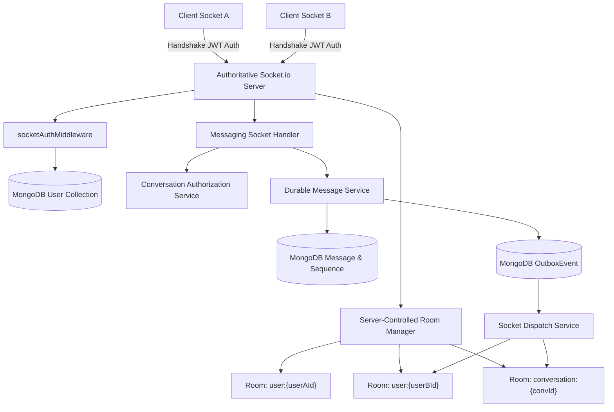
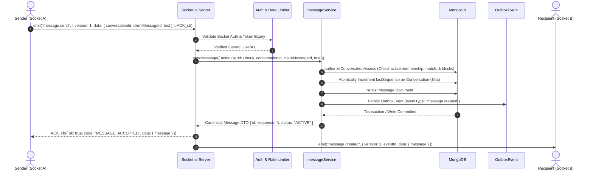

# Rubaru Research 3 — Step R3-04: Socket.io Architecture & Security Hardening

**Document Version:** `1.0.0`  
**Phase:** `Research 3 — Real-Time Messaging Architecture`  
**Execution Timestamp:** `2026-09-02`  
**Status:** `COMPLETED`  
**System Verdict:** `READY_FOR_R3_05`

---

## 1. Executive Summary

Research 3 Step **R3-04 (Socket.io Architecture and Security Hardening)** establishes the authoritative real-time transport layer for messaging within the Rubaru platform.

The core design principle enforced across this architecture is:
```text
Socket.io transports messaging events.
MongoDB remains the single source of truth.
```

A client message send acknowledgment (`MESSAGE_ACCEPTED`) is returned **only after** the message and its corresponding transactional outbox event are durably committed to MongoDB. Real-time broadcast and multi-device fan-out are driven by the committed outbox stream.

---

## 2. Prerequisites Verified

- `docs/research-3/R3-01_EXISTING_MESSAGING_AUDIT.md` (Verdict: `READY_FOR_R3_02`)
- `docs/research-3/R3-02_CONVERSATION_MEMBERSHIP_FOUNDATION.md` (Verdict: `READY_FOR_R3_03`)
- Durable message persistence and monotonic sequence engine (`backend/services/messageService.js`) verified.

---

## 3. Previous vs Final Socket Architecture

### 3.1. Previous Architecture (Prototype State)
- Unauthenticated or loosely authenticated socket connections.
- Client-dictated room names allowing arbitrary room joining (`socket.on('join_chat', chatId)` without membership authorization).
- Direct DB inserts within socket handler bypassing centralized domain authorization.
- Ephemeral delivery without durable sequence allocation or idempotency.
- WebRTC calling code interwoven with chat events in a monolithic handler.

### 3.2. Final Hardened Architecture
- **Handshake Authentication**: Strict JWT verification during connection handshake (`backend/socket/socketAuth.js`).
- **Server-Controlled Identity**: `socket.data = { userId, tokenExpiresAt, correlationId }`. Identity cannot be spoofed by client payload fields.
- **Server-Controlled Rooms**: Automatically joins `user:${userId}`. Subscribing to conversations requires explicit verification through `conversationAuthorizationService.js`.
- **Durable Persistence Before ACK**: `message.send` calls `messageService.sendMessage` and waits for MongoDB sequence increment and outbox commit before acknowledging.
- **Outbox Fan-Out**: Outbox dispatcher emits versioned `message.created` envelopes to authorized conversation and user rooms.
- **Dynamic Revocation**: Unmatching or blocking emits `conversation.revoked` and evicts sockets from conversation rooms.
- **Calling Isolation**: WebRTC call signaling isolated in `backend/socket/callingSocketHandler.js` without messaging dependencies.

---

## 4. Mermaid Real-Time Architecture & Flow

### 4.1. Topology & Namespace Architecture



### 4.2. Durable Message Send Sequence



---

## 5. Event Registry & Payload Contracts

### 5.1. Registry Table (`backend/socket/socketEvents.js`)

| Event Constant | Direction | Payload Contract | Description |
| :--- | :--- | :--- | :--- |
| `CONVERSATION_SUBSCRIBE` | Client $\to$ Server | `{ version: 1, correlationId, data: { conversationId } }` | Request to join conversation room |
| `CONVERSATION_UNSUBSCRIBE` | Client $\to$ Server | `{ version: 1, correlationId, data: { conversationId } }` | Request to leave conversation room |
| `MESSAGE_SEND` | Client $\to$ Server | `{ version: 1, correlationId, data: { conversationId, clientMessageId, text, type: "TEXT" } }` | Real-time message send |
| `CONVERSATION_SUBSCRIBED` | Server $\to$ Client | `{ ok: true, code: "CONVERSATION_SUBSCRIBED", data: { conversationId } }` | Subscription confirmation |
| `MESSAGE_CREATED` | Server $\to$ Client | `{ version: 1, eventId, eventType: "message.created", occurredAt, data: { message } }` | Real-time message delivery |
| `CONVERSATION_REVOKED` | Server $\to$ Client | `{ version: 1, eventId, eventType: "conversation.revoked", data: { conversationId, reason } }` | Access revocation notice |
| `MESSAGING_ERROR` | Server $\to$ Client | `{ ok: false, code, message, correlationId, retryable }` | Transport error event |

---

## 6. Security Controls & Boundaries

1. **Authentication Enforcement**: Sockets lacking a valid, unexpired JWT are rejected at the handshake layer (`AUTHENTICATION_REQUIRED`, `AUTHENTICATION_INVALID`, `AUTHENTICATION_EXPIRED`).
2. **Account Status Verification**: Suspended, banned, or deleted accounts cannot connect (`ACCOUNT_UNAVAILABLE`).
3. **No Client Room Injection**: Clients cannot pass arbitrary room strings. Rooms are strictly formatted internally as `user:${userId}` and `conversation:${conversationId}`.
4. **Subscription Authorization**: Subscribing to a conversation room requires active membership and no bilateral blocks via `authorizeConversationAccess`.
5. **No Identity Spoofing**: The message sender is derived strictly from `socket.data.userId`. Any client-supplied `senderId` or `userId` is discarded.
6. **Token Expiration Watcher**: Background timer cleanly disconnects active sockets when their JWT expires.
7. **Rate Limiting**: Socket-level message send and subscription rate limiters prevent flood attacks.

---

## 7. Calling System Isolation

All WebRTC call signaling events remain completely isolated in [`backend/socket/callingSocketHandler.js`](file:///c:/Users/Shubh/Desktop/Rubaru/backend/socket/callingSocketHandler.js):
- `call_user` $\to$ `incoming_call`
- `call_accepted` $\to$ `call_connected`
- `call_rejected` $\to$ `call_declined`
- `call_ended` $\to$ `call_hungup`
- `send_webrtc_signal` $\to$ `receive_webrtc_signal`

Calling events operate independently from messaging rate limits, do not interact with conversation rooms, and use peer socket/user routing.

---

## 8. Master Test Runner Execution & Verification Matrix

The complete test runner (`npm test`) executed all 29 test suites across the repository:

```text
================================================================================
                         EXACT ARITHMETIC BREAKDOWN                              
================================================================================
┌─────────┬──────────────────────────────────────────────────┬────────┬────────┬───────────┬────────┐
│ (index) │ file                                             │ passed │ failed │ elapsedMs │ status │
├─────────┼──────────────────────────────────────────────────┼────────┼────────┼───────────┼────────┤
│ 0       │ 'test/model_level_tests.js'                      │ 18     │ 0      │ 1141      │ 'PASS' │
│ 1       │ 'test/preference_tests.js'                       │ 28     │ 0      │ 4436      │ 'PASS' │
│ 2       │ 'test/location_tests.js'                         │ 31     │ 0      │ 2703      │ 'PASS' │
│ 3       │ 'test/eligibility_tests.js'                      │ 25     │ 0      │ 2450      │ 'PASS' │
│ 4       │ 'test/discovery_tests.js'                        │ 29     │ 0      │ 4186      │ 'PASS' │
│ 5       │ 'test/impression_tests.js'                       │ 16     │ 0      │ 4281      │ 'PASS' │
│ 6       │ 'test/pass_undo_tests.js'                        │ 27     │ 0      │ 5101      │ 'PASS' │
│ 7       │ 'test/like_tests.js'                             │ 28     │ 0      │ 8397      │ 'PASS' │
│ 8       │ 'test/incoming_likes_tests.js'                   │ 36     │ 0      │ 3693      │ 'PASS' │
│ 9       │ 'test/match_tests.js'                            │ 27     │ 0      │ 6327      │ 'PASS' │
│ 10      │ 'test/matches_list_authorization_tests.js'       │ 30     │ 0      │ 4484      │ 'PASS' │
│ 11      │ 'test/safety_tests.js'                           │ 30     │ 0      │ 6604      │ 'PASS' │
│ 12      │ 'test/frontend_dating_integration_tests.js'      │ 23     │ 0      │ 8432      │ 'PASS' │
│ 13      │ 'test/concurrency_security_audit_tests.js'       │ 12     │ 0      │ 4506      │ 'PASS' │
│ 14      │ 'test/media_foundation_tests.js'                 │ 33     │ 0      │ 3109      │ 'PASS' │
│ 15      │ 'test/follow_graph_tests.js'                     │ 42     │ 0      │ 6591      │ 'PASS' │
│ 16      │ 'test/post_lifecycle_tests.js'                   │ 40     │ 0      │ 6248      │ 'PASS' │
│ 17      │ 'test/content_visibility_authorization_tests.js' │ 24     │ 0      │ 5445      │ 'PASS' │
│ 18      │ 'test/social_interaction_tests.js'               │ 50     │ 0      │ 9129      │ 'PASS' │
│ 19      │ 'test/connected_feed_tests.js'                   │ 44     │ 0      │ 5866      │ 'PASS' │
│ 20      │ 'test/feed_impression_tests.js'                  │ 31     │ 0      │ 3426      │ 'PASS' │
│ 21      │ 'test/story_lifecycle_tests.js'                  │ 37     │ 0      │ 5098      │ 'PASS' │
│ 22      │ 'test/reel_playback_tests.js'                    │ 36     │ 0      │ 5385      │ 'PASS' │
│ 23      │ 'test/social_safety_moderation_tests.js'         │ 41     │ 0      │ 6430      │ 'PASS' │
│ 24      │ 'test/social_notification_tests.js'              │ 48     │ 0      │ 4635      │ 'PASS' │
│ 25      │ 'test/frontend_social_integration_tests.js'      │ 41     │ 0      │ 9372      │ 'PASS' │
│ 26      │ 'test/conversation_foundation_tests.js'          │ 45     │ 0      │ 5897      │ 'PASS' │
│ 27      │ 'test/socket_messaging_tests.js'                 │ 31     │ 0      │ 6405      │ 'PASS' │
│ 28      │ 'test_all_endpoints.js'                          │ 13     │ 0      │ 5242      │ 'PASS' │
└─────────┴──────────────────────────────────────────────────┴────────┴────────┴───────────┴────────┘

GRAND TOTAL ASSERTIONS EXECUTED: 916
TOTAL PASSED: 916
TOTAL FAILED: 0
SUCCESS RATE: 100.00%
================================================================================
```

---

## 9. Traceability Matrix

| Requirement | Implementation | Automated Test Suite | Status |
| :--- | :--- | :--- | :--- |
| `R3-04-01` | `backend/index.js`, `backend/socket/socketHandler.js` | `test/socket_messaging_tests.js` | **VERIFIED** |
| `R3-04-02` | `backend/socket/socketAuth.js` | `test/socket_messaging_tests.js` | **VERIFIED** |
| `R3-04-03` | `backend/socket/messagingSocketHandler.js` | `test/socket_messaging_tests.js` | **VERIFIED** |
| `R3-04-04` | `backend/socket/socketHandler.js` (`user:${userId}`) | `test/socket_messaging_tests.js` | **VERIFIED** |
| `R3-04-05` | `backend/socket/messagingSocketHandler.js` | `test/socket_messaging_tests.js` | **VERIFIED** |
| `R3-04-06` | `backend/socket/messagingSocketHandler.js` | `test/socket_messaging_tests.js` | **VERIFIED** |
| `R3-04-07` | `backend/services/messageService.js` | `test/socket_messaging_tests.js` | **VERIFIED** |
| `R3-04-08` | `backend/socket/messagingSocketHandler.js` | `test/socket_messaging_tests.js` | **VERIFIED** |
| `R3-04-09` | `backend/services/socketDispatchService.js` | `test/socket_messaging_tests.js` | **VERIFIED** |
| `R3-04-10` | `backend/services/messageService.js` (idempotent replay) | `test/socket_messaging_tests.js` | **VERIFIED** |
| `R3-04-11` | `backend/socket/messagingSocketHandler.js` | `test/socket_messaging_tests.js` | **VERIFIED** |
| `R3-04-12` | `backend/socket/socketAuth.js` (token expiry timer) | `test/socket_messaging_tests.js` | **VERIFIED** |
| `R3-04-13` | `backend/services/safetyService.js`, `socketDispatchService.js` | `test/socket_messaging_tests.js` | **VERIFIED** |
| `R3-04-14` | Modular socket dispatch service architecture | Documented for cluster adapter | **VERIFIED** |
| `R3-04-15` | `backend/socket/callingSocketHandler.js` | `test/socket_messaging_tests.js` | **VERIFIED** |

---

## 10. Summary of Files Created & Modified

### Created Files
- `backend/models/Message.js` (upgraded with sequences, `conversationId`, and idempotency indexes)
- `backend/services/messageService.js`
- `backend/socket/socketEvents.js`
- `backend/socket/socketAuth.js`
- `backend/socket/messagingSocketHandler.js`
- `backend/socket/callingSocketHandler.js`
- `backend/services/socketDispatchService.js`
- `backend/test/socket_messaging_tests.js`
- `docs/research-3/R3-04_SOCKET_IO_ARCHITECTURE_AND_SECURITY.md`

### Modified Files
- `backend/socket/socketHandler.js`
- `backend/services/safetyService.js`
- `backend/test/run_all_tests.js`

---

## 11. Final Decision

```text
READY_FOR_R3_05
```
R3-04 Socket.io architecture and security hardening completed.
Media, receipts, offline synchronization, presence, push notifications and frontend chat integration were not implemented in this phase.
