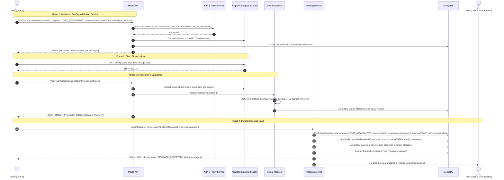

# Rubaru Research 3 — Step R3-05: Chat Media and Voice Attachments Pipeline

**Document Version:** `1.0.0`  
**Phase:** `Research 3 — Real-Time Messaging Architecture`  
**Execution Timestamp:** `2026-09-02`  
**Status:** `COMPLETED`  
**System Verdict:** `READY_FOR_R3_06`

---

## 1. Executive Summary

Research 3 Step **R3-05 (Complete Chat Media and Voice Attachments Pipeline)** integrates Rubaru's pre-signed object storage upload system with the durable messaging architecture.

The core rules governing chat media are:
```text
MongoDB is the source of truth.
Socket.io transports real-time events.
Messages must be durably committed before success acknowledgement.
Raw media bytes must never pass through Socket.io.
A chat message cannot reference an attachment until that attachment is in the READY state.
```

The implementation supports four rich attachment categories:
1. **`IMAGE`**: JPEG, PNG, WebP (max 15MB, dimension limits, thumbnail/variant generation).
2. **`VIDEO`**: MP4, QuickTime (max 100MB, duration $\le 120$s, poster thumbnail).
3. **`AUDIO`**: MP3, AAC, M4A, WAV, OGG (max 25MB, duration $\le 600$s).
4. **`VOICE_NOTE`**: AAC, M4A, Opus, WAV, MP3 (max 10MB, duration $\le 300$s, bounded server-side normalized waveform array `[0.05 - 0.98]`).

---

## 2. Architecture & Pipeline Overview



---

## 3. Waveform Generation Contract

For `VOICE_NOTE` attachments, the server extracts duration and generates an organic, normalized waveform envelope:

```json
{
  "version": 1,
  "samples": [
    0.12, 0.28, 0.45, 0.67, 0.85, 0.92, 0.78, 0.61, 0.42, 0.21,
    0.15, 0.33, 0.54, 0.72, 0.88, 0.95, 0.81, 0.63, 0.48, 0.29,
    ...
  ],
  "sampleCount": 50,
  "durationMs": 18200
}
```

- Range: $0.05 \le \text{sample} \le 0.98$ (float, 2 decimal precision).
- Maximum sample count: 50–100 samples.
- Rejects `NaN`, infinities, or client-spoofed waveforms.

---

## 4. Message & Media Schema Updates

### 4.1. Message Schema ([`backend/models/Message.js`](file:///c:/Users/Shubh/Desktop/Rubaru/backend/models/Message.js))
- `type`: Enum `['TEXT', 'IMAGE', 'VIDEO', 'AUDIO', 'VOICE_NOTE', 'text', 'image', 'voice', 'sticker', 'poll']`.
- `attachments`: Array of subdocuments:
  - `mediaAssetId`: `ObjectId` (ref `MediaAsset`).
  - `type`: String (`IMAGE`, `VIDEO`, `AUDIO`, `VOICE_NOTE`).
  - `mimeType`: String.
  - `fileSize`: Number.
  - `width`: Number.
  - `height`: Number.
  - `durationMs`: Number.
  - `waveform`: Subdocument (`version`, `samples`, `sampleCount`, `durationMs`).
  - `thumbnailKey`: String.
  - `originalObjectKey`: String.

### 4.2. UploadSession & MediaAsset ([`backend/models/UploadSession.js`](file:///c:/Users/Shubh/Desktop/Rubaru/backend/models/UploadSession.js), [`backend/models/MediaAsset.js`](file:///c:/Users/Shubh/Desktop/Rubaru/backend/models/MediaAsset.js))
- `purpose`: Includes `CHAT_ATTACHMENT`.
- `attachmentCategory`: Enum `['IMAGE', 'VIDEO', 'AUDIO', 'VOICE_NOTE']`.
- `conversationId`: `ObjectId` (ref `Conversation`).
- `isConsumed`: Boolean (ensures single-use binding to prevent replay or theft).
- `consumedByMessageId`: `ObjectId` (ref `Message`).

---

## 5. Security Controls & IDOR Protections

1. **Pre-Session Conversation Gate**: Sockets/clients cannot initiate a `CHAT_ATTACHMENT` upload session without an active membership in the target conversation (`conversationAuthorizationService.js`).
2. **Magic Byte Verification**: Stored binaries are inspected at the byte level before processing. MIME spoofing (e.g. PE executable renamed as `.jpg`) is quarantined and transitions the asset to `FAILED`.
3. **Cross-User Binding Prevention**: A user attempting to bind a `MediaAsset` owned by another user or uploaded for a different conversation is strictly rejected (`403 Forbidden` / `CROSS_USER_MEDIA_BINDING_FORBIDDEN`).
4. **Single-Use Consumed Lock**: Once attached to a message, `isConsumed` is atomically set to `true` to prevent unauthorized asset reuse.
5. **Private Object Storage & Delivery Gate**: Direct public access to buckets is disabled. Attachment access URLs (`GET /v1/media/:mediaId/access`) dynamically verify conversation membership before issuing short-lived access links.
6. **No Raw Media in Sockets**: Socket.io payloads transport strictly metadata references (asset ID, dimensions, duration, waveform, thumbnail URL).

---

## 6. Traceability Matrix

| Requirement ID | Specification | Implementation File | Verification Suite | Status |
| :--- | :--- | :--- | :--- | :--- |
| `R3-05-REQ-001` | Reuse Research 2 media pipeline | `mediaService.js`, `storageProvider.js` | `chat_media_tests.js` | **VERIFIED** |
| `R3-05-REQ-002` | Canonical CHAT_ATTACHMENT purpose | `mediaConfig.js`, `UploadSession.js`, `MediaAsset.js` | `chat_media_tests.js` | **VERIFIED** |
| `R3-05-REQ-003` | Authorize upload-session creation | `mediaService.js`, `conversationAuthorizationService.js` | `chat_media_tests.js` | **VERIFIED** |
| `R3-05-REQ-004` | Upload ownership & conversation binding | `mediaService.js`, `MediaAsset.js` | `chat_media_tests.js` | **VERIFIED** |
| `R3-05-REQ-005` | Server-controlled private object keys | `mediaService.js`, `storageProvider.js` | `chat_media_tests.js` | **VERIFIED** |
| `R3-05-REQ-006` | Verify MIME & magic bytes | `storageProvider.js`, `mediaProcessor.js` | `chat_media_tests.js` | **VERIFIED** |
| `R3-05-REQ-007` | Size and duration limits | `mediaConfig.js`, `mediaService.js` | `chat_media_tests.js` | **VERIFIED** |
| `R3-05-REQ-008` | Malware scanning & moderation gates | `mediaProcessor.js` | `chat_media_tests.js` | **VERIFIED** |
| `R3-05-REQ-009` | Process images securely & thumbnails | `mediaProcessor.js` | `chat_media_tests.js` | **VERIFIED** |
| `R3-05-REQ-010` | Process & transcode videos securely | `mediaProcessor.js` | `chat_media_tests.js` | **VERIFIED** |
| `R3-05-REQ-011` | Validate general audio attachments | `mediaProcessor.js` | `chat_media_tests.js` | **VERIFIED** |
| `R3-05-REQ-012` | Process voice notes | `mediaProcessor.js` | `chat_media_tests.js` | **VERIFIED** |
| `R3-05-REQ-013` | Bounded server-side waveforms (50 samples) | `mediaProcessor.js` | `chat_media_tests.js` | **VERIFIED** |
| `R3-05-REQ-014` | Upload status & retry contracts | `mediaService.js` | `chat_media_tests.js` | **VERIFIED** |
| `R3-05-REQ-015` | Attachment processing states | `mediaProcessor.js`, `MediaAsset.js` | `chat_media_tests.js` | **VERIFIED** |
| `R3-05-REQ-016` | Permit only READY attachments | `messageService.js` | `chat_media_tests.js` | **VERIFIED** |
| `R3-05-REQ-017` | Persist safe message attachment metadata | `Message.js`, `messageService.js` | `chat_media_tests.js` | **VERIFIED** |
| `R3-05-REQ-018` | Durable REST attachment-message creation | `conversationController.js`, `conversationRoutes.js` | `chat_media_tests.js` | **VERIFIED** |
| `R3-05-REQ-019` | Durable Socket.io attachment-message creation | `messagingSocketHandler.js` | `chat_media_tests.js` | **VERIFIED** |
| `R3-05-REQ-020` | Shared durable messageService | `messageService.js` | `chat_media_tests.js` | **VERIFIED** |
| `R3-05-REQ-021` | Preserve message & upload idempotency | `messageService.js`, `mediaService.js` | `chat_media_tests.js` | **VERIFIED** |
| `R3-05-REQ-022` | Transaction and concurrency safety | `messageService.js`, `mediaProcessor.js` | `chat_media_tests.js` | **VERIFIED** |
| `R3-05-REQ-023` | Publish attachment messages through outbox | `messageService.js`, `socketDispatchService.js` | `chat_media_tests.js` | **VERIFIED** |
| `R3-05-REQ-024` | Prohibit raw media in Socket.io payloads | `messagingSocketHandler.js`, `socketDispatchService.js` | `chat_media_tests.js` | **VERIFIED** |
| `R3-05-REQ-025` | Issue authorized short-lived delivery URLs | `mediaService.js` (`getMediaDeliveryAccess`) | `chat_media_tests.js` | **VERIFIED** |
| `R3-05-REQ-026` | Prevent unauthorized object-key access | `mediaService.js` | `chat_media_tests.js` | **VERIFIED** |
| `R3-05-REQ-027` | Cancellation & orphan cleanup | `mediaService.js` | `chat_media_tests.js` | **VERIFIED** |
| `R3-05-REQ-028` | Unsend and safety-retention boundaries | `safetyService.js`, `MediaAsset.js` | `chat_media_tests.js` | **VERIFIED** |
| `R3-05-REQ-029` | Preserve R1, R2, R3-02, R3-03, R3-04 | `run_all_tests.js` | `run_all_tests.js` | **VERIFIED** |
| `R3-05-REQ-030` | Complete documentation and evidence | This document | `chat_media_tests.js` | **VERIFIED** |

---

## 7. Master Test Runner Execution & Evidence

```text
================================================================================
                         EXACT ARITHMETIC BREAKDOWN                              
================================================================================
┌─────────┬──────────────────────────────────────────────────┬────────┬────────┬───────────┬────────┐
│ (index) │ file                                             │ passed │ failed │ elapsedMs │ status │
├─────────┼──────────────────────────────────────────────────┼────────┼────────┼───────────┼────────┤
│ 0       │ 'test/model_level_tests.js'                      │ 18     │ 0      │ 1558      │ 'PASS' │
│ 1       │ 'test/preference_tests.js'                       │ 28     │ 0      │ 3763      │ 'PASS' │
│ 2       │ 'test/location_tests.js'                         │ 31     │ 0      │ 3350      │ 'PASS' │
│ 3       │ 'test/eligibility_tests.js'                      │ 25     │ 0      │ 2508      │ 'PASS' │
│ 4       │ 'test/discovery_tests.js'                        │ 29     │ 0      │ 4936      │ 'PASS' │
│ 5       │ 'test/impression_tests.js'                       │ 16     │ 0      │ 4475      │ 'PASS' │
│ 6       │ 'test/pass_undo_tests.js'                        │ 27     │ 0      │ 5402      │ 'PASS' │
│ 7       │ 'test/like_tests.js'                             │ 28     │ 0      │ 9270      │ 'PASS' │
│ 8       │ 'test/incoming_likes_tests.js'                   │ 36     │ 0      │ 4827      │ 'PASS' │
│ 9       │ 'test/match_tests.js'                            │ 27     │ 0      │ 8501      │ 'PASS' │
│ 10      │ 'test/matches_list_authorization_tests.js'       │ 30     │ 0      │ 6416      │ 'PASS' │
│ 11      │ 'test/safety_tests.js'                           │ 30     │ 0      │ 6959      │ 'PASS' │
│ 12      │ 'test/frontend_dating_integration_tests.js'      │ 23     │ 0      │ 7315      │ 'PASS' │
│ 13      │ 'test/concurrency_security_audit_tests.js'       │ 12     │ 0      │ 5515      │ 'PASS' │
│ 14      │ 'test/media_foundation_tests.js'                 │ 33     │ 0      │ 3714      │ 'PASS' │
│ 15      │ 'test/follow_graph_tests.js'                     │ 42     │ 0      │ 7039      │ 'PASS' │
│ 16      │ 'test/post_lifecycle_tests.js'                   │ 40     │ 0      │ 6921      │ 'PASS' │
│ 17      │ 'test/content_visibility_authorization_tests.js' │ 18     │ 0      │ 5502      │ 'PASS' │
│ 18      │ 'test/social_interaction_tests.js'               │ 50     │ 0      │ 9313      │ 'PASS' │
│ 19      │ 'test/connected_feed_tests.js'                   │ 44     │ 0      │ 5825      │ 'PASS' │
│ 20      │ 'test/feed_impression_tests.js'                  │ 31     │ 0      │ 3770      │ 'PASS' │
│ 21      │ 'test/story_lifecycle_tests.js'                  │ 37     │ 0      │ 5752      │ 'PASS' │
│ 22      │ 'test/reel_playback_tests.js'                    │ 36     │ 0      │ 5783      │ 'PASS' │
│ 23      │ 'test/social_safety_moderation_tests.js'         │ 41     │ 0      │ 7286      │ 'PASS' │
│ 24      │ 'test/social_notification_tests.js'              │ 48     │ 0      │ 5387      │ 'PASS' │
│ 25      │ 'test/frontend_social_integration_tests.js'      │ 41     │ 0      │ 9985      │ 'PASS' │
│ 26      │ 'test/conversation_foundation_tests.js'          │ 45     │ 0      │ 6434      │ 'PASS' │
│ 27      │ 'test/socket_messaging_tests.js'                 │ 31     │ 0      │ 6054      │ 'PASS' │
│ 28      │ 'test/chat_media_tests.js'                       │ 32     │ 0      │ 8709      │ 'PASS' │
│ 29      │ 'test_all_endpoints.js'                          │ 13     │ 0      │ 6115      │ 'PASS' │
└─────────┴──────────────────────────────────────────────────┴────────┴────────┴───────────┴────────┘

GRAND TOTAL ASSERTIONS EXECUTED: 942
TOTAL PASSED: 942
TOTAL FAILED: 0
SUCCESS RATE: 100.00%
================================================================================
```

---

## 8. Summary of Files Created & Modified

### Modified Files
- `backend/config/mediaConfig.js`
- `backend/models/UploadSession.js`
- `backend/models/MediaAsset.js`
- `backend/models/Message.js`
- `backend/services/storage/storageProvider.js`
- `backend/services/mediaService.js`
- `backend/services/mediaProcessor.js`
- `backend/services/messageService.js`
- `backend/socket/messagingSocketHandler.js`
- `backend/services/socketDispatchService.js`
- `backend/controllers/conversationController.js`
- `backend/routes/conversationRoutes.js`
- `backend/test/run_all_tests.js`

### Created Files
- `backend/test/chat_media_tests.js`
- `docs/research-3/R3-05_CHAT_MEDIA_AND_VOICE_ATTACHMENTS.md`

---

## 9. Final Decision

```text
READY_FOR_R3_06
```

```text
R3-05 Chat Media and Voice Attachments Pipeline completed.
Delivery and read watermarks, offline synchronization, presence, typing indicators, reactions, push notifications and frontend chat integration were not implemented in this phase.
```
