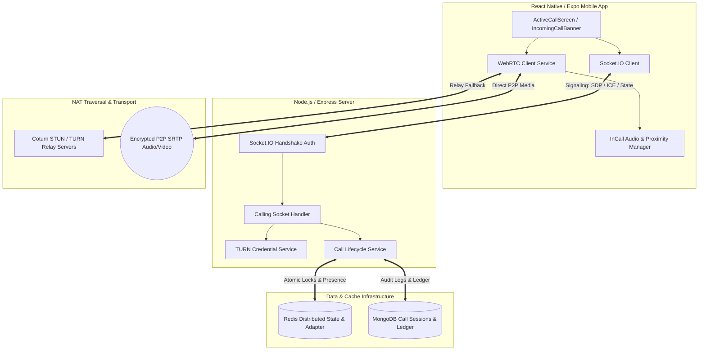
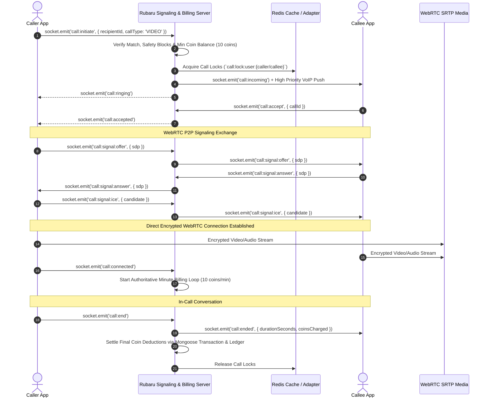
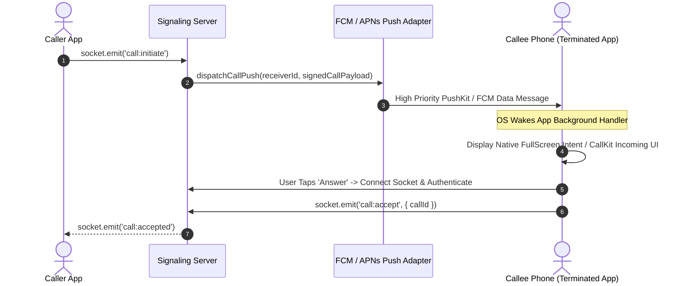

# ROOBARU CALLING — C1: EXISTING CODEBASE AUDIT & IMPLEMENTATION GUIDE

**Document Version:** 1.0.0  
**Phase:** R4-C1 Codebase Audit & Implementation Architecture  
**Audit Date:** 2026-09-08  
**Author:** Senior Real-Time Communication & WebRTC Systems Architect  
**Target Path:** `docs/research-4/R4-C1_EXISTING_CALLING_AUDIT_AND_IMPLEMENTATION_GUIDE.md`

---

## 1. Executive Summary

A comprehensive architectural audit of the Rubaru repository was conducted to assess the readiness of the application for production-grade real-time voice and video calling. 

### Key Findings:
1. **Signaling & Backend Foundation (`PARTIALLY IMPLEMENTED`):**
   - Authoritative Socket.IO handshake JWT authentication is operational (`backend/socket/socketAuth.js:34-97`).
   - Sockets join server-controlled rooms `user:${userId}` (`backend/socket/socketHandler.js:44`).
   - A preliminary calling signaling handler exists in `backend/socket/callingSocketHandler.js`, supporting `call_user`, `call_accepted`, `call_rejected`, `call_ended`, along with WebRTC payload events (`call.offer`, `call.answer`, `call.ice_candidate`).
   - Basic SDP size checking and ICE candidate rate limiting exist in `backend/services/turnService.js:64-93` and `backend/socket/callingSocketHandler.js:161-174`.

2. **WebRTC Media Transport (`MISSING / INCOMPATIBLE ON MOBILE`):**
   - The root React Native/Expo application **does not have `react-native-webrtc` installed** in `package.json`.
   - `src/services/webRTCService.js` attempts to access web-standard `navigator.mediaDevices.getUserMedia` and global `RTCPeerConnection`. This works on web browsers but completely fails on native Android and iOS devices.
   - `src/screens/ActiveCallScreen.js` renders a simulated UI with static avatar images (`<Image source={{ uri: avatarUri }}>`) rather than real video tracks (`RTCView`).
   - The Expo app runs in managed mode without native prebuilds (`android/` and `ios/` folders are absent from the repository).

3. **Paid Communication & Billing Architecture (`IMPLEMENTED & HARDENED`):**
   - The repository contains a robust, server-authoritative paid session and billing subsystem (`PaidCommunicationSession`, `PaidCommunicationConfig`, `Wallet`, `WalletLedger`, `paidBillingWorker.js`).
   - Server-enforced rate configuration: Audio calls = 5 coins/min, Video calls = 10 coins/min (`PaidCommunicationConfig.js:27-43`).
   - Immutable double-entry ledger with concurrency-safe MongoDB transactions (`WalletLedger.js:98-124`, `walletService.js:108-180`).

4. **Background & Terminated Incoming Call Delivery (`PARTIALLY IMPLEMENTED / BLOCKER`):**
   - `backend/services/pushAdapter.js` and `backend/utils/callToken.js` generate cryptographically signed VoIP/FCM payloads with action nonces.
   - However, the mobile app lacks native `CallKeep` / `ConnectionService` (Android) and `PushKit` / `CallKit` (iOS) integrations, meaning terminated-app incoming call UX cannot trigger a native full-screen incoming call dialog.

---

## 2. Current Technology Stack

| Layer | Configured Technology | Version / Reference | Status |
|---|---|---|---|
| **Mobile Runtime** | React Native | `0.86.2` (`package.json:38`) | Active |
| **Mobile Framework** | Expo SDK / Expo Router | `~57.0.14` / `~57.0.12` (`package.json:21,31`) | Active (Managed) |
| **State Management** | Zustand & TanStack Query | `^4.5.5` / `^5.51.23` (`package.json:19,46`) | Active |
| **Backend Runtime** | Node.js & Express | `^4.19.2` (`backend/package.json:16`) | Active |
| **Database** | MongoDB & Mongoose | `^8.5.1` (`backend/package.json:24`) | Active |
| **Real-Time Signaling** | Socket.IO / Socket.IO Client | `^4.7.5` / `^4.8.3` | Active |
| **Distributed Cache & State** | Redis (`ioredis`, `@socket.io/redis-adapter`) | `ioredis ^5.11.1`, adapter `^8.3.0` | Active |
| **Media Transport (WebRTC)** | Native WebRTC | **NOT INSTALLED** (`react-native-webrtc` missing) | **Critical Blocker** |
| **NAT Traversal** | STUN / TURN (RFC 5766) | `backend/services/turnService.js` | Implemented |
| **Push Notification Server** | FCM / APNs / Multi-device Adapter | `backend/services/pushAdapter.js` | Partially Implemented |
| **Billing & Wallet** | Mongoose Transactions + Ledger | `backend/services/walletService.js` | Implemented |

---

## 3. Relevant Repository Map

```
Rubaru/
├── app.json                                 # Expo configuration (Managed workflow)
├── package.json                             # Mobile dependencies (React 19, RN 0.86, Expo 57)
├── app/
│   ├── _layout.js                           # App root provider tree (IncomingCallProvider wrapper)
│   ├── active-call.js                       # Active call route entry
│   └── call-logs.js                         # Call history logs route entry
├── src/
│   ├── components/common/
│   │   ├── IncomingCallBanner.js            # Foreground in-app incoming call UI banner
│   │   ├── IncomingCallContext.js           # Incoming call listener & deep link handler
│   │   └── PaidCommunicationModal.js        # Paid call live badge & receipt modal
│   ├── screens/
│   │   ├── ActiveCallScreen.js              # Active call UI (simulated stream UI)
│   │   ├── CallLogsScreen.js                # User call history screen
│   │   └── CallInfoScreen.js                # Call contact detail & history screen
│   └── services/
│       ├── api.js                           # Axios HTTP client with JWT interceptors
│       ├── socket.js                        # Singleton Socket.IO client instance
│       ├── webRTCService.js                 # WebRTC client (browser-only fallback implementation)
│       └── paidCommunicationService.js      # Client REST wrapper for paid communication
└── backend/
    ├── index.js                             # Express HTTP & Socket.IO server initialization
    ├── package.json                         # Backend dependencies (ioredis, socket.io, mongoose)
    ├── config/
    │   ├── db.js                            # MongoDB connection
    │   └── redis.js                         # Distributed Redis pub/sub and command client
    ├── middleware/
    │   └── auth.js                          # REST JWT authorization middleware (`protect`)
    ├── models/
    │   ├── CallLog.js                       # Legacy/standard call logs schema
    │   ├── PaidCommunicationSession.js      # Server-authoritative call session schema & state machine
    │   ├── PaidCommunicationConfig.js       # Dynamic coin rate & timing configuration
    │   ├── Wallet.js                        # User coin balance model
    │   ├── WalletLedger.js                  # Immutable financial transaction ledger
    │   ├── Device.js                        # Multi-device token and platform registry
    │   └── Block.js                         # Bilateral user blocking model
    ├── routes/
    │   ├── callRoutes.js                    # REST `/api/calls/logs`
    │   ├── paidCommunicationRoutes.js       # REST `/v1/paid-communication`
    │   └── walletRoutes.js                  # REST `/v1/wallet`
    ├── socket/
    │   ├── socketAuth.js                    # Handshake JWT authentication & expiry timer
    │   ├── socketHandler.js                 # Connection lifecycle, Redis adapter & room joining
    │   ├── socketEvents.js                  # Centralized event registry
    │   ├── callingSocketHandler.js          # Call signaling & WebRTC relay handlers
    │   └── paidCommunicationSocketHandler.js# Real-time paid session state handlers
    └── services/
        ├── turnService.js                   # STUN/TURN credential generation & SDP validation
        ├── paidCommunicationService.js      # Server-authoritative session lifecycle
        ├── paidBillingWorker.js             # Background billing heartbeat worker
        ├── walletService.js                 # Atomic coin deduction & ledger writer
        └── pushAdapter.js                   # High-priority VoIP/FCM push dispatcher
```

---

## 4. Existing Calling Capability

| Capability | Status | Evidence (File & Lines) | Analysis |
|---|---|---|---|
| **Call Initiation Signaling** | `Partially implemented` | `callingSocketHandler.js:19-45` | Emits `incoming_call` to `user:${recipientId}` room. |
| **Call Acceptance Signaling** | `Partially implemented` | `callingSocketHandler.js:48-56` | Emits `call_connected` to caller socket and room. |
| **Call Rejection Signaling** | `Partially implemented` | `callingSocketHandler.js:59-67` | Emits `call_declined` to caller socket and room. |
| **Call Termination Signaling** | `Partially implemented` | `callingSocketHandler.js:70-78` | Emits `call_hungup` to recipient socket and room. |
| **WebRTC SDP Offer / Answer** | `Present but unsafe` | `callingSocketHandler.js:81-144` | Checks block status and SDP syntax, but does not verify caller authorization or session state match. |
| **ICE Candidate Exchange** | `Present but unsafe` | `callingSocketHandler.js:146-185` | In-memory candidate rate limiter (60/min), but candidates are relayed without checking if call is in active state. |
| **WebRTC PeerConnection** | `Missing on Mobile` | `src/services/webRTCService.js:72-105` | Relies on browser `window.navigator` APIs; `react-native-webrtc` is missing. |
| **Audio / Video Media Tracks** | `Missing on Mobile` | `src/screens/ActiveCallScreen.js:298-306` | Displays static image assets instead of native WebRTC media video tracks. |
| **Server State Machine** | `Implemented (Paid)` | `PaidCommunicationSession.js:4-52` | Comprehensive state transitions exist for paid sessions; missing dedicated standalone free call model. |
| **STUN/TURN Infrastructure** | `Implemented` | `backend/services/turnService.js:13-59` | Generates RFC 5766 HMAC-SHA1 short-lived credentials with production fail-closed security. |
| **Call History Persistence** | `Partially implemented` | `backend/controllers/callController.js:56-80` | Client posts unverified duration string to `/api/calls/logs` without server verification. |
| **Coin Billing Integration** | `Implemented` | `paidCommunicationService.js`, `walletService.js` | 5 coins/min audio, 10 coins/min video enforced server-side. |

---

## 5. Socket.IO Audit

### 5.1 Connection Lifecycle & Handshake Authentication
- **Authentication:** Enforced at connection handshake via `socketAuthMiddleware` (`backend/socket/socketAuth.js:7-104`).
- **Token Extraction:** Checks `socket.handshake.auth.token`, `headers.authorization`, and `query.token`.
- **Identity Context:** Decodes JWT, validates user exists in MongoDB and `accountStatus !== 'BANNED'/'SUSPENDED'/'DELETED'`, sets `socket.data.userId`.
- **Token Expiry Disconnect:** Calculates `tokenExpiresAt - Date.now()` and registers a server timeout to cleanly disconnect expired sessions (`socketAuth.js:70-95`).
- **Room Joining:** Sockets join `user:${userId}` on connection (`backend/socket/socketHandler.js:44`), enabling multi-device targeting.

### 5.2 Existing Calling Events Audit

| Event Name | Direction | Payload | Auth & Validation | Issues Identified |
|---|---|---|---|---|
| `call_user` | C $\to$ S | `{ recipientId, callType, callSessionId }` | `userId` from `socket.data`. No block or match checks. | **Unsafe**: Anyone can call any user ID without mutual match or block validation. |
| `incoming_call` | S $\to$ C | `{ callerId, callerName, callerAvatar, callType, callSessionId }` | Server generated. | Uses pravatar fallback. |
| `call_accepted` | C $\to$ S | `{ callerId, callSessionId }` | Relays to `user:${callerId}`. No session state update. | No server validation that receiver was actually called. |
| `call_connected` | S $\to$ C | `{ callSessionId }` | Server generated. | Triggers local client timer. |
| `call_rejected` | C $\to$ S | `{ callerId, callSessionId }` | Relays to `user:${callerId}`. | No persistence of decline reason. |
| `call_declined` | S $\to$ C | `{ callSessionId }` | Server generated. | None. |
| `call_ended` | C $\to$ S | `{ recipientId, callSessionId }` | Relays to `user:${recipientId}`. | No server calculation of final duration. |
| `call_hungup` | S $\to$ C | `{ callSessionId }` | Server generated. | None. |
| `call.offer` | C $\to$ S | `{ recipientId, sessionId, sdp }` | Validates SDP string & max 64KB size. Checks bilateral Block. | Does not verify that `sessionId` is currently in `RINGING` or `ACCEPTED` state. |
| `call.answer` | C $\to$ S | `{ recipientId, sessionId, sdp }` | Validates SDP string & max 64KB size. | Does not verify that receiver is authorized party. |
| `call.ice_candidate`| C $\to$ S | `{ recipientId, sessionId, candidate }`| Validates candidate structure, max 2KB, in-memory rate limit 60/min. | Rate limits are stored in in-memory Map (not Redis), breaking across multi-instance nodes. |
| `send_webrtc_signal`| C $\to$ S | `{ recipientId, signalData }` | Legacy unvalidated relay. | **Unsafe**: Bypasses SDP/ICE size and rate limit checks. |

### 5.3 Event Name Standardization Recommendations
To align calling events with Rubaru's domain-namespaced pattern (`domain.action`), the following mapping is recommended:

| Current Ad-Hoc Name | Recommended Canonical Event | Direction |
|---|---|---|
| `call_user` | `call:initiate` | Client $\to$ Server |
| `incoming_call` | `call:incoming` | Server $\to$ Client |
| *(None)* | `call:ringing` | Server $\to$ Client |
| `call_accepted` | `call:accept` | Client $\to$ Server |
| `call_connected` | `call:connected` | Server $\to$ Client |
| `call_rejected` | `call:reject` | Client $\to$ Server |
| `call_declined` | `call:declined` | Server $\to$ Client |
| *(None)* | `call:cancel` | Client $\to$ Server |
| *(None)* | `call:cancelled` | Server $\to$ Client |
| `call_ended` | `call:end` | Client $\to$ Server |
| `call_hungup` | `call:ended` | Server $\to$ Client |
| `call.offer` | `call:signal:offer` | Bidirectional |
| `call.answer` | `call:signal:answer` | Bidirectional |
| `call.ice_candidate` | `call:signal:ice` | Bidirectional |
| *(None)* | `call:mute` | Client $\to$ Server $\to$ Client |
| *(None)* | `call:camera_toggle` | Client $\to$ Server $\to$ Client |
| *(None)* | `call:reconnect` | Client $\to$ Server |
| *(None)* | `call:error` | Server $\to$ Client |

---

## 6. Authentication and Authorization Audit

### 6.1 Vulnerability Matrix

| Area | Current Implementation | Vulnerability Level | Evidence & Remediation |
|---|---|---|---|
| **Socket Identity Spoofing** | Uses `socket.data.userId` derived from verified JWT (`socketAuth.js:60`). | **SECURE** | Client cannot forge `senderId` in standard socket calls. |
| **Unmatched Calling** | `callingSocketHandler.js:19-45` does not check dating match or follow status. | **CRITICAL** | Any user can trigger call alerts on any user if they obtain the target's `userId`. Must enforce `matchAuthorizationService.assertCanCommunicate(caller, recipient)`. |
| **Bilateral Block Check** | Checked in `call.offer` (`callingSocketHandler.js:96-105`), but **NOT** in `call_user` (`callingSocketHandler.js:19-45`). | **HIGH** | Blocked users can trigger ringing notifications on the blocker until the offer phase. |
| **Acceptance Authorization** | `callingSocketHandler.js:48` accepts any `callerId` without checking if a call session was actually pending. | **HIGH** | Attacker can emit rogue `call_accepted` and disrupt ongoing calls. |
| **Unverified Duration Logging**| `backend/controllers/callController.js:57-75` trusts `duration` and `callType` sent by the client. | **HIGH** | Users can fabricate call records or duration for billing/abuse. Must compute duration server-side from `connectedAt` to `endedAt`. |
| **Multi-Node Candidate Limits**| `candidateRateLimits` stored in Node.js process `Map` (`callingSocketHandler.js:7`). | **MEDIUM** | In multi-instance deployment with Redis adapter, limits are not shared across server instances. Must use Redis token bucket / sliding window. |

---

## 7. WebRTC Readiness

### 7.1 Current Client Code Audit (`src/services/webRTCService.js`)
- **`RTCPeerConnection` instantiation (`webRTCService.js:96-105`):** Relies on `typeof RTCPeerConnection !== 'undefined'` or `global.RTCPeerConnection`. In React Native (Hermes/JSC), `RTCPeerConnection` is `undefined` unless imported from `react-native-webrtc`.
- **`getUserMedia` (`webRTCService.js:76-88`):** Relies on `navigator.mediaDevices.getUserMedia`. In React Native, `navigator.mediaDevices` does not exist by default.
- **Video Rendering (`src/screens/ActiveCallScreen.js:298-306`):** Does not import `<RTCView streamURL={...} />`. Renders static JPEG images.
- **Audio Routing:** No speakerphone / earpiece / Bluetooth management package (`react-native-incall-manager` or `@react-native-webrtc/react-native-incall-manager`) is installed.

### 7.2 Expo Compatibility Verdict
- `react-native-webrtc` includes C++ and Objective-C/Java native modules.
- **Expo Go CANNOT run `react-native-webrtc`**.
- A **custom Expo development build (`expo-dev-client`)** or **prebuild native application (`expo run:android` / `expo run:ios`)** is **MANDATORY**.

---

## 8. Mobile and Native Configuration

### 8.1 Android Audit (`app.json`)
- **Missing Permissions:** `android.permission.CAMERA`, `android.permission.RECORD_AUDIO`, `android.permission.MODIFY_AUDIO_SETTINGS`, `android.permission.BLUETOOTH`, `android.permission.FOREGROUND_SERVICE`, `android.permission.FOREGROUND_SERVICE_CAMERA`, `android.permission.FOREGROUND_SERVICE_MICROPHONE`, `android.permission.FOREGROUND_SERVICE_PHONE_CALL`.
- **Missing Config Plugins:** `react-native-webrtc` config plugin is not registered in `app.json:27-30`.

### 8.2 iOS Audit (`app.json`)
- **Missing Info.plist Keys:**
  - `NSCameraUsageDescription`: ("Rubaru requires camera access for video calls")
  - `NSMicrophoneUsageDescription`: ("Rubaru requires microphone access for audio calls")
  - `UIBackgroundModes`: `["voip", "audio", "fetch", "remote-notification"]`
- **CallKit Integration:** Not configured.

---

## 9. Existing Database and Redis Infrastructure

### 9.1 Existing Models Assessment
1. **`backend/models/CallLog.js`:**
   - Simple logging model (`caller`, `receiver`, `callType`, `callIconType`, `duration`, `startedAt`).
   - Lacks session IDs, cryptographic nonces, granular state timestamps (`ringingAt`, `answeredAt`, `connectedAt`, `endedAt`), end reasons, and coin billing linkages.
2. **`backend/models/PaidCommunicationSession.js`:**
   - Production-grade schema supporting full lifecycle, state transitions (`PENDING`, `ACCEPTED`, `CONNECTING`, `ACTIVE`, `ENDED`, `FAILED`), heartbeat timestamps, coin tracking, and lease ownership.
3. **`backend/models/Wallet.js` & `WalletLedger.js`:**
   - Hardened balance tracking with immutable ledger, compound indexes, and pre-save validation against negative balances.

### 9.2 Redis Architecture & Key Design Requirements
The distributed Redis setup (`backend/config/redis.js`) supports `@socket.io/redis-adapter`. For calling state, the following atomic Redis keys and TTLs are required:

| Redis Key Pattern | Type | TTL | Purpose |
|---|---|---|---|
| `call:lock:user:{userId}` | String | 60s (Auto-released on end) | Prevents user from engaging in two concurrent calls. |
| `call:session:{sessionId}` | Hash | 2 hours | Temporary authoritative call state, participant sockets, and timestamps. |
| `call:invitation:timeout:{sessionId}` | String | 45s | Server-authoritative ring timeout trigger. |
| `call:ratelimit:ice:{sessionId}:{userId}` | String (Counter) | 60s | Distributed rate limiter (max 60 candidates/min). |
| `call:reconnect:grace:{sessionId}:{userId}`| String | 20s | Network drop grace period before terminating call. |

---

## 10. Push Notification Readiness

### 10.1 Notification Tiers & Deliverability Matrix

| Device State | Socket Connected? | Ordinary Push Notification | High-Priority Data Push (FCM) | Apple PushKit (VoIP) + CallKit | Android FullScreenIntent / ConnectionService |
|---|---|---|---|---|---|
| **App Open (Foreground)** | Yes | Banner / In-App UI | In-App UI | Handled via Socket.IO | Handled via Socket.IO |
| **App in Background** | No / Suspended | Notification tray alert (No full-screen ring) | Notification tray alert (Ringtone optional) | **Native CallKit UI** (System dialer screen) | **Heads-Up Incoming Call Notification** with Accept/Decline actions |
| **App Terminated (Killed)**| No | Notification tray alert (User must tap) | Wakes app in background (Subject to OS battery limits) | **Guaranteed CallKit UI Launch** | **FullScreenIntent Incoming Call Activity** |
| **Device Locked** | No | Notification on lock screen | Lock screen banner | **Full Lock-Screen Incoming Call UI** | **Full Lock-Screen Incoming Call UI** |

### 10.2 Push Adapter Status (`backend/services/pushAdapter.js`)
- Contains payload signing (`utils/callToken.js`) with HMAC-SHA256 nonces and expiry dates.
- Lacks native bridge to CallKit (iOS) and ConnectionService (Android) on the client side.

---

## 11. Billing and Wallet Readiness

### 11.1 Pricing Specification
- **Audio Call:** 5 Rubaru Coins per minute.
- **Video Call:** 10 Rubaru Coins per minute.

### 11.2 Architectural Guarantees
1. **Server-Authoritative Metering:** Billed minutes are tracked exclusively by `backend/services/paidBillingWorker.js` via 60-second increments based on `connectedAt`.
2. **Pre-Call Balance Reservation Check:** `paidCommunicationService.initiatePaidSession` checks `wallet.availableBalance >= ratePerMinute * 1` before allowing the call to ring.
3. **Mid-Call Insufficient Balance Termination:** If the caller's balance is exhausted during an active call, `paidBillingWorker.js` marks the session `INSUFFICIENT_BALANCE` and emits `paid_session.ended` with code `INSUFFICIENT_FUNDS`, immediately terminating the WebRTC call.
4. **Zero Client Trust:** Client cannot send duration or coin amounts to claim discounts or alter billing.

---

## 12. Security Findings

| # | Vulnerability | Severity | Location | Recommended Fix |
|---|---|---|---|---|
| **SEC-01** | Unrestricted Call Signaling | **CRITICAL** | `callingSocketHandler.js:19` | Validate bilateral Match / Follow / Block permission before dispatching `incoming_call`. |
| **SEC-02** | In-Memory ICE Rate Limiting | **MEDIUM** | `callingSocketHandler.js:7` | Migrate rate limiting from process memory `Map` to Redis sliding window. |
| **SEC-03** | Missing SDP Integrity on Relay | **MEDIUM** | `callingSocketHandler.js:188` | Remove unvalidated `send_webrtc_signal` fallback; enforce `validateSdp`. |
| **SEC-04** | Client-Supplied Call Duration | **HIGH** | `callController.js:57` | Remove manual `duration` in `POST /api/calls/logs`; derive strictly from server session records. |
| **SEC-05** | Lack of Call ID Guessing Protection | **LOW** | `ActiveCallScreen.js:39` | Use server-generated UUIDv4 session IDs rather than client timestamp strings. |

---

## 13. Missing Components

1. **`react-native-webrtc` Native Package:** Missing in `package.json`.
2. **Audio Routing & Focus Controller:** `InCallManager` or equivalent missing.
3. **Native Incoming Call Interceptors:** Android `ConnectionService` / iOS `CallKit` wrappers missing.
4. **Server Call State Registry:** Dedicated MongoDB model for standard/free calls (or unified `CallSession` model).
5. **Redis Atomic Call Locking Lua Scripts:** Missing scripts for atomic lock acquisition/release on `call:lock:user:{id}`.
6. **WebRTC Stream UI Components:** Native `<RTCView>` components missing in `ActiveCallScreen.js`.

---

## 14. Recommended Architecture



---

## 15. Call-State Machine

```
               +-------------------------------------------------+
               |                                                 |
               v                                                 |
         [INITIATED] ------------(Ring Timeout 45s)-------------> [MISSED]
              |                                                  |
     (Callee Ringing)                                            |
              v                                                  |
          [RINGING] -------------(Caller Cancels)-------------> [CANCELLED]
          |       |                                              |
(Callee   |       +--------------(Callee Rejects)-------------> [REJECTED]
Accepts)  |                                                      |
          v                                                      |
      [ACCEPTED]                                                 |
          |                                                      |
  (SDP/ICE Start)                                                |
          v                                                      |
     [CONNECTING] -----------(Handshake Failed)----------------> [FAILED]
          |                                                      |
(Media Connected)                                                |
          v                                                      |
       [ACTIVE] <====(Network Drop/ICE Fail)===> [RECONNECTING]  |
          |                                             |        |
    (Hangup / Insufficient Coins)              (Grace Timeout)   |
          |                                             |        |
          v                                             v        |
       [ENDED] <----------------------------------------+--------+
```

### State Transition Validation Table

| From State | Trigger Action | Permitted To State | Actor | Server Action |
|---|---|---|---|---|
| `INITIATED` | Receiver online & ringing | `RINGING` | Server | Send `call:incoming` & start 45s timer |
| `INITIATED` / `RINGING` | 45s timer expires | `MISSED` | Server | Push missed call notif, emit `call:ended` |
| `INITIATED` / `RINGING` | Caller hangs up | `CANCELLED` | Caller | Cancel push, emit `call:cancelled`, release locks |
| `INITIATED` / `RINGING` | Callee presses decline | `REJECTED` | Callee | Emit `call:declined`, release locks |
| `RINGING` | Callee presses accept | `ACCEPTED` | Callee | Check wallet balance, emit `call:accepted` |
| `ACCEPTED` | SDP/ICE exchange starts | `CONNECTING`| Both | Relay SDP offer/answer |
| `CONNECTING` | WebRTC Peer connected | `ACTIVE` | Server/Both | Start billing timer, emit `call:connected` |
| `ACTIVE` | Peer connection drops | `RECONNECTING` | Both | Start 20s reconnection grace period |
| `RECONNECTING` | ICE Restart succeeds | `ACTIVE` | Both | Resume normal monitoring |
| `RECONNECTING` | 20s grace period expires | `FAILED` | Server | End call, charge elapsed minutes |
| `ACTIVE` | Either party hangs up | `ENDED` | Either | Calculate final billing, write CallLog |

---

## 16. Socket Event Contract

### 16.1 Client $\to$ Server Signaling Events

```typescript
// 1. Initiate Call
socket.emit('call:initiate', {
  recipientId: string,
  callType: 'AUDIO' | 'VIDEO',
  idempotencyKey: string,
}, (response: { ok: boolean, callId?: string, error?: string }) => void);

// 2. Accept Call
socket.emit('call:accept', {
  callId: string,
}, (response: { ok: boolean, error?: string }) => void);

// 3. Reject Call
socket.emit('call:reject', {
  callId: string,
  reason?: 'DECLINED' | 'BUSY',
}, (response: { ok: boolean }) => void);

// 4. Cancel Call
socket.emit('call:cancel', {
  callId: string,
}, (response: { ok: boolean }) => void);

// 5. SDP Offer
socket.emit('call:signal:offer', {
  callId: string,
  sdp: string,
}, (response: { ok: boolean, error?: string }) => void);

// 6. SDP Answer
socket.emit('call:signal:answer', {
  callId: string,
  sdp: string,
}, (response: { ok: boolean, error?: string }) => void);

// 7. ICE Candidate
socket.emit('call:signal:ice', {
  callId: string,
  candidate: { candidate: string, sdpMid: string, sdpMLineIndex: number },
}, (response: { ok: boolean, error?: string }) => void);

// 8. End Call
socket.emit('call:end', {
  callId: string,
}, (response: { ok: boolean }) => void);
```

### 16.2 Server $\to$ Client Push Events

```typescript
// 1. Incoming Call Invitation
socket.on('call:incoming', (data: {
  callId: string,
  caller: { id: string, displayName: string, avatarUrl: string },
  callType: 'AUDIO' | 'VIDEO',
  ratePerMinute: number,
  expiresAt: string,
}) => void);

// 2. Recipient Ringing
socket.on('call:ringing', (data: { callId: string }) => void);

// 3. Call Accepted
socket.on('call:accepted', (data: { callId: string, calleeId: string }) => void);

// 4. WebRTC Signals
socket.on('call:signal:offer', (data: { callId: string, sdp: string }) => void);
socket.on('call:signal:answer', (data: { callId: string, sdp: string }) => void);
socket.on('call:signal:ice', (data: { callId: string, candidate: object }) => void);

// 5. Call Connected
socket.on('call:connected', (data: { callId: string, connectedAt: string }) => void);

// 6. Call Ended / Terminated
socket.on('call:ended', (data: {
  callId: string,
  endReason: string,
  durationSeconds: number,
  coinsCharged: number,
}) => void);
```

---

## 17. REST API Contract

### 1. Fetch Ephemeral STUN/TURN Credentials
- **Endpoint:** `GET /v1/calls/turn-credentials`
- **Auth:** Bearer JWT (`protect`)
- **Response (200 OK):**
```json
{
  "ok": true,
  "data": {
    "iceServers": [
      { "urls": ["stun:stun.l.google.com:19302"] },
      {
        "urls": ["turn:turn.rubaru.app:3478?transport=udp", "turns:turn.rubaru.app:5349?transport=tcp"],
        "username": "1773000000:65f2a1b9c8d3e4f5a6b7c8d9",
        "credential": "generated_hmac_sha1_secret_base64"
      }
    ],
    "expiresAt": "2026-09-09T11:00:00.000Z"
  }
}
```

### 2. Get Call History (Paginated)
- **Endpoint:** `GET /v1/calls/history?limit=20&cursor=65f...`
- **Auth:** Bearer JWT (`protect`)
- **Response (200 OK):**
```json
{
  "ok": true,
  "data": [
    {
      "id": "65f3...",
      "callId": "call_uuid",
      "counterparty": {
        "id": "65f1...",
        "displayName": "Ananya Sharma",
        "avatarUrl": "https://..."
      },
      "direction": "OUTGOING",
      "callType": "VIDEO",
      "status": "ENDED",
      "durationSeconds": 142,
      "coinsCharged": 30,
      "startedAt": "2026-09-08T10:30:00.000Z"
    }
  ],
  "nextCursor": "65f2..."
}
```

---

## 18. MongoDB and Redis Design

### 18.1 Proposed Unified Call Session Schema (`CallSession.js`)
```javascript
const CallSessionSchema = new mongoose.Schema({
  callId: { type: String, required: true, unique: true, index: true },
  caller: { type: mongoose.Schema.Types.ObjectId, ref: 'User', required: true, index: true },
  receiver: { type: mongoose.Schema.Types.ObjectId, ref: 'User', required: true, index: true },
  callType: { type: String, enum: ['AUDIO', 'VIDEO'], required: true },
  status: {
    type: String,
    enum: ['INITIATED', 'RINGING', 'ACCEPTED', 'CONNECTING', 'ACTIVE', 'RECONNECTING', 'REJECTED', 'CANCELLED', 'MISSED', 'BUSY', 'FAILED', 'ENDED'],
    default: 'INITIATED',
    index: true,
  },
  ratePerMinute: { type: Number, required: true, default: 5 },
  initiatedAt: { type: Date, default: Date.now },
  ringingAt: { type: Date },
  acceptedAt: { type: Date },
  connectedAt: { type: Date },
  endedAt: { type: Date },
  durationSeconds: { type: Number, default: 0 },
  billedMinutes: { type: Number, default: 0 },
  coinsCharged: { type: Number, default: 0 },
  coinsEarned: { type: Number, default: 0 },
  endedBy: { type: mongoose.Schema.Types.ObjectId, ref: 'User' },
  endReason: { type: String, default: null },
  idempotencyKey: { type: String, unique: true, sparse: true },
}, { timestamps: true });

CallSessionSchema.index({ caller: 1, createdAt: -1 });
CallSessionSchema.index({ receiver: 1, createdAt: -1 });
CallSessionSchema.index({ status: 1, connectedAt: 1 });
```

---

## 19. Call Flow Sequence Diagrams

### 19.1 Successful Outgoing Video Call Flow


### 19.2 Terminated App Incoming Call Flow


---

## 20. File-by-File Implementation Plan

| Repository File Path | Existing or New | Purpose | Required Changes |
|---|---|---|---|
| `package.json` | Existing | Mobile dependencies | Add `react-native-webrtc`, `expo-dev-client`, `@react-native-webrtc/react-native-incall-manager`. |
| `app.json` | Existing | Expo native plugins & permissions | Add WebRTC plugin, camera/microphone permission descriptions, iOS VoIP background modes. |
| `src/services/webRTCService.js` | Existing | Client WebRTC engine | Refactor to import `RTCPeerConnection`, `RTCView`, `mediaDevices` directly from `react-native-webrtc`. |
| `src/screens/ActiveCallScreen.js` | Existing | Call UI & stream renderer | Replace `<Image>` placeholders with `<RTCView streamURL={localStream.toURL()} />` and remote track rendering. |
| `backend/socket/callingSocketHandler.js`| Existing | Real-time signaling | Upgrade to domain namespaced events (`call:initiate`, `call:accept`, `call:signal:*`), validate match authorization, integrate Redis sliding-window candidate rate limits. |
| `backend/models/CallSession.js` | **PROPOSED NEW FILE** | Server-authoritative call model | Implement complete call session model with timestamps, rates, state machine validations. |
| `backend/services/callService.js` | **PROPOSED NEW FILE** | Server call domain coordinator | Encapsulate lock acquisition, authorization checks, state machine transitions, timeout handlers. |
| `backend/routes/callRoutes.js` | Existing | REST API routes | Add `/v1/calls/turn-credentials`, `/v1/calls/history`, `/v1/calls/:id`. |

---

## 21. Testing Strategy

1. **Unit Tests:**
   - State machine transition matrix in `CallSession`.
   - SDP validation and size limits (max 64KB).
   - ICE candidate parser and rate limiter.
   - HMAC-SHA1 TURN credential generation and expiration.
2. **Integration Tests:**
   - Multi-device call invite and single-device answer race condition.
   - Caller cancel vs Callee accept concurrency drill.
   - Redis call locking: Verify user cannot initiate two simultaneous calls.
   - Mid-call insufficient balance cutoff test.
3. **End-to-End Native Validation:**
   - Real Android device to real iOS device P2P video call.
   - Wi-Fi to 4G/5G mobile network handover and ICE restart.
   - Terminated-state incoming call notification pickup.

---

## 22. Production Infrastructure Requirements

1. **STUN/TURN Relay Server:**
   - Dedicated Coturn deployment on public IP with UDP/TCP ports 3478, 5349 (TLS), and relay ports 49152–65535.
   - Secret key configured in `COTURN_SECRET`.
2. **Redis Cluster / Sentinel:**
   - Multi-node Redis instance for `@socket.io/redis-adapter` pub/sub and distributed call state locking.
3. **Apple PushKit & Firebase Cloud Messaging:**
   - Apple VoIP Push Certificate (`.p8`) and APNs Team ID.
   - Firebase Service Account Key with HTTP v1 API enabled for high-priority Android data messages.

---

## 23. Required Product Decisions

| Decision Item | Options | Default Recommendation | Rationale |
|---|---|---|---|
| **Free Call vs Paid Call** | A) All calls between matches are free.<br>B) Calls cost 5 (audio) / 10 (video) coins/min.<br>C) First 3 mins free, then paid. | **Option B** (5 / 10 coins/min as specified) | Matches existing `PaidCommunicationConfig` rates. |
| **Non-Matched Calling** | A) Strictly prohibited.<br>B) Allowed if paid.<br>C) Allowed if follower. | **Option A** (Strictly matched users) | Prevents harassment and spam on the platform. |
| **Billing Grace Period** | A) 0 seconds.<br>B) 15 seconds grace period before charging 1st minute. | **Option B** (15s grace period) | Prevents charging users if call immediately disconnects due to network failure. |
| **Camera Default** | A) Front camera enabled on connect.<br>B) Audio starts first, camera off. | **Option A** (Front camera on for video) | Expected UX in modern social video apps. |

---

## 24. Risks and Blockers

### Critical Blockers:
1. **Expo Managed Workflow Incompatibility:** Expo Go does not support `react-native-webrtc`. Must transition to `expo-dev-client` or run prebuild native builds.
2. **Missing Native Call Audio & Routing Modules:** Without native audio management (`InCallManager`), audio may route to earpiece instead of speaker during video calls or produce severe feedback echo.

---

## 25. Phased Implementation Roadmap: C2–C12

```
+-------------------------------------------------------------------------------+
| R4-C2: Call Schemas, State Machine & Server Service (Mongo + Redis State)     |
+-------------------------------------------------------------------------------+
                                      |
                                      v
+-------------------------------------------------------------------------------+
| R4-C3: Secure Socket.IO Signaling & Authorization Protocol                     |
+-------------------------------------------------------------------------------+
                                      |
                                      v
+-------------------------------------------------------------------------------+
| R4-C4: React Native WebRTC Foundation & Expo Dev Client Configuration         |
+-------------------------------------------------------------------------------+
                                      |
                                      v
+-------------------------------------------------------------------------------+
| R4-C5: Audio-Call User Interface, Audio Routing & State Lifecycle            |
+-------------------------------------------------------------------------------+
                                      |
                                      v
+-------------------------------------------------------------------------------+
| R4-C6: Video-Call User Interface, Camera Switching & RTCView Stream Binding   |
+-------------------------------------------------------------------------------+
                                      |
                                      v
+-------------------------------------------------------------------------------+
| R4-C7: STUN/TURN Infrastructure & ICE Network Reconnection Handover           |
+-------------------------------------------------------------------------------+
                                      |
                                      v
+-------------------------------------------------------------------------------+
| R4-C8: Background & Terminated-App VoIP Push Notification Integration         |
+-------------------------------------------------------------------------------+
                                      |
                                      v
+-------------------------------------------------------------------------------+
| R4-C9: Server-Authoritative Call History, Logs & Analytics                    |
+-------------------------------------------------------------------------------+
                                      |
                                      v
+-------------------------------------------------------------------------------+
| R4-C10: Rubaru Coin Reservation, Mid-Call Metering & Ledger Settlement        |
+-------------------------------------------------------------------------------+
                                      |
                                      v
+-------------------------------------------------------------------------------+
| R4-C11: Anti-Abuse, Rate Limiting & Safety Policy Enforcement                 |
+-------------------------------------------------------------------------------+
                                      |
                                      v
+-------------------------------------------------------------------------------+
| R4-C12: End-to-End Automated Testing, Load Testing & Staging Certification    |
+-------------------------------------------------------------------------------+
```

---

## 26. Final Verdict

### Assessment:
The backend possesses mature authentication, distributed Redis pub/sub capabilities, and an enterprise-grade wallet/billing engine. However, the client application is currently running simulated media on Expo Go without native WebRTC packages, native permissions, or native audio routing.

### Status: `READY_WITH_BLOCKERS_FOR_R4_C2`
*(Phase R4-C2 can proceed immediately on backend schemas, Redis state locking, and service logic while the mobile native environment is prepared for R4-C4).*
